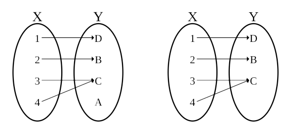



# I. Introduction
## 1. Algebra (meaning: 'reunion of broken parts')
- Algebra is the study of mathematical symbols and the rules for manipulating these symbols.
- It includes the everything from elementary equation solving to the study of abstractions such as **groups**, **rings**, and **fields**.

## 2. Why study algebra?
- Algebra is a powerful tool, its use is widely applied in many domains.
- All modern technologies relies on mathematics and algebra.
  - Numerical methods, image processing, machine learning, etc.
- Studying algebraic helps your mind to think logically and break down problems into smaller pieces to solve them.

# II. Applications with Algebra
## 1. Information
The values of the variables are the truth values true and false, usually denoted 1 and 0 respectively (or bit in computer).
The basic operations:
  - AND (conjunction, ∧)
  - OR (disjunction, ∨)
  - NOT (negation, ¬)

bit $\to$ byte

## 2. Applications
- Data transfer: bits and bytes are transmitted one at a time in serial transmission.
- Storage: bits and bytes are used to store data in digital devices.
- Bar code: barcode is a visual, machine-readable representation of data.

## 3. Cryptography
**Cryptography** is the study of sending and receiving secret messages.
  - The message to be sent is called the **plaintext**. The disguised message is called the **ciphertext**.
  - The plaintext and the cipher-text are both written in an **alphabet**, consisting of **letters** or **characters**.

A crypto-system, or cipher:
  - Encryption: the process of transforming plaintext into ciphertext message.
  - Decryption: the reverse transformation of changing ciphertext into plaintext message.

One of the first and most famous private key cryptosystems was the shift code used by Julius Caesar:
  - Digitize the alphabet by letting: $A = 00, B = 01, C = 02, \dots, Z = 25$.
  - Encoding function: $E(x) = (x + k) \mod 26$.
  - That is, $A \to D, B \to E, \dots, Z \to C$.

Suppose we receive the encoded message DOJHEUD. To decode this message, we have to digitize it:
$$3; 14; 9; 7; 4; 20; 3$$
Next we apply the inverse transformation to get
$$0; 11; 6; 4; 1; 17; 0$$
$\to$ RSA Cryptosystem.

## 4. Coding theory
- A problem is raised when sending a message over a channel that could be affected by **noise**.
- THe task is to encode and decode the information in a manner tha will allow the detection, and possibly the correction, of errors caused by noise.
---
- Suppose that the message to be encoded is a binary n-tuple ($x_1, x_2, \dots, x_n$)
- The message is encoded into a binary 3n-tuple by simply repeating the message three times: $(x_1, x_2, \dots, x_n) \to (x_1, x_2, \dots, x_n; x_1, x_2, \dots, x_n; x_1, x_2, \dots, x_n)$
---
- The original message is (0110), then the transmitted message will be (0110 0110 0110).
- If the received codeword will be (0110 1110 0110), which will be correctly decoded as (0110).

# III. Terminology
A **statement** in logic or mathematics is an assertion that is either true or false.
- $5+3-1 \times 0$
- All cats are black
- $5<0$
- $2x=6$ when $x=4$
- $f(x)=x^3+2x+10$

A **mathematical proof** is nothing more than a convincing **argument** about the accuracy of a statement.
Often a complex statement: *If p, then q* where p and q are both
statements.
- p - **hypothesis**
- q - **conclusion**

Consider the following example: if $ax^2 + bc + c = 0$ and $a \neq 0$, then:
$$ x = \frac{-b \pm \sqrt{b^2-4ac}}{2a}$$
If this entire statement is **true** and we can show that the hypothesis $ax^2 + bx+ c = 0$ with $a = 0$ is true, then the conclusion must be true.

- **Definition**: a precise and unambiguous description of the meaning of a mathematical term. It characterizes the meaning of a word by giving all the properties and only those properties that must be true.
- **Axiom**: a statement that is assumed to be true without proof. These are the basic building blocks from which all theorems are proved.
- **Theorem**: a mathematical statement that is proved using rigorous mathematical reasoning. In a mathematical paper, the term theorem is often reserved for the most important results.
- **Lemma**: a minor result whose sole purpose is to help in proving a theorem. It is a stepping stone on the path to proving a theorem.
- **Proposition**: a proved and often interesting result, but generally less important than a theorem.

# IV. Number system
Consider the traditional number systems
- $\mathbb{N} = {0; 1; 2; \dots} \to \text{the natural numbers}$
- $\mathbb{Z} = {\dots, -2, -1, 0, 1, 2, \dots} \to \text{the integers}$
- $\mathbb{Q} = \frac{\mathbb{Z}}{\mathbb{Z}} \to \text{the rational numbers}$
- $\mathbb{R} \to \text{the real numbers}$
- $\mathbb{C} \to \text{the complex numbers}$
$$\text{and}$$
$$\mathbb{N} \subset \mathbb{Z} \subset \mathbb{Q} \subset \mathbb{R} \subset \mathbb{C}$$

## 1. Properties of $\text{ }\mathbb{R}$
Addition for each pair of real numbers a and b there exists a unique real number a + b such that:
- $+$ is a commutative and associative operation.
- There exists in $\mathbb{R}$ a zero, 0, for addition: $a + 0 = 0 + a = a$ for all $a \in \mathbb{R}$.
- For each $a \in \mathbb{R}$, there exists an additive inverse $a \in \mathbb{R}$ such that $a + (a) = (a) + a = 0$.
---
Multiplication for each pair of real numbers a and b there exists a unique real number $a \times b$ such that:
- $\times$ is a commutative and associative operation.
- There exists in $\mathbb{R}$ an identity, 1, for multiplication: $a \times 1 = 1 \times a = a$ for all $a \in \mathbb{R}$.
- For each $a \in \mathbb{R}$, there exists an additive inverse $a^{-1} \in \mathbb{R}$ such that $a \times a^{-1} = a^{-1} \times a = 1$.
---
Order properties: $\mathbb{R}$ come with an order relation: for all $a, b \in \mathbb{R}$, we have exactly one of the following three possibilities:
- $a < b$
- $a = b$
- $a > b$
---
COmpleteness axiom: equivalent to statement that any infinite string of decimal digits.

## 2. Properties of $\text{ }\mathbb{C}$
$\mathbb{C}$ has arithmetic properties just the same as those for $\mathbb{R}$, except order.

Polynomials (with real or complex coefficients) always have a full complement of roots in $\mathbb{C}$ or $\mathbb{C}$ (working for quadratic polynomials function when $\Delta < 0$).

## 3. Properties of $\text{ }\mathbb{Q}$
$\mathbb{Q}$ has the same arithmetic properties and order as those for $\mathbb{R}$ except completeness order.

## 4. Properties of $\text{ }\mathbb{Z}$
In $\mathbb{Z}$, multiplication doesn't have the same properties, e.g. there is no $n \in \mathbb{Z}$ such that $2 \times n = 1$.

# V. The integers
The integers mod n also partition $\mathbb{Z}$ into n different equivalence classes; we will denote the set of these equivalence classes by $\mathbb{Z}_n$. We can have a table called a Cayley table.

$$\text{Multiplication table for }\mathbb{Z}_8$$

| $\times$ |  $0$  |  $1$  |  $2$  |  $3$  |  $4$  |  $5$  |  $6$  |  $7$  |
| :------: | :---: | :---: | :---: | :---: | :---: | :---: | :---: | :---: |
|   $0$    |  $0$  |  $0$  |  $0$  |  $0$  |  $0$  |  $0$  |  $0$  |  $0$  |
|   $1$    |  $0$  |  $1$  |  $2$  |  $3$  |  $4$  |  $5$  |  $6$  |  $7$  |
|   $2$    |  $0$  |  $2$  |  $4$  |  $6$  |  $0$  |  $2$  |  $4$  |  $6$  |
|   $3$    |  $0$  |  $3$  |  $6$  |  $1$  |  $4$  |  $7$  |  $2$  |  $5$  |
|   $4$    |  $0$  |  $4$  |  $0$  |  $4$  |  $0$  |  $4$  |  $0$  |  $4$  |
|   $5$    |  $0$  |  $5$  |  $2$  |  $7$  |  $4$  |  $1$  |  $6$  |  $3$  |
|   $6$    |  $0$  |  $6$  |  $4$  |  $2$  |  $0$  |  $6$  |  $4$  |  $2$  |
|   $7$    |  $0$  |  $7$  |  $6$  |  $5$  |  $4$  |  $3$  |  $2$  |  $1$  |

Build a Cayley table for addition in $\mathbb{Z}_5$.

$$\text{Addition table for }\mathbb{Z}_5$$

| $\times$ |  $0$  |  $1$  |  $2$  |  $3$  |  $4$  |
| :------: | :---: | :---: | :---: | :---: | :---: |
|   $0$    |  $0$  |  $1$  |  $2$  |  $3$  |  $4$  |
|   $1$    |  $1$  |  $2$  |  $3$  |  $4$  |  $0$  |
|   $2$    |  $2$  |  $3$  |  $4$  |  $0$  |  $1$  |
|   $3$    |  $3$  |  $4$  |  $0$  |  $1$  |  $2$  |
|   $4$    |  $4$  |  $0$  |  $1$  |  $2$  |  $3$  |

The following examples illustrate integer arithmetic modulo n.

$$ 7 + 1 \equiv 3 (\text{mod } 5)$$
$$ 7 + 1 \equiv 0 (\text{mod } 8)$$
$$ 7 + 1 \equiv 8 (\text{mod } 9)$$

# VI. Mathematical induction
A mathematical proof technique requires:
- The **base case** proves that the property holds for a certain number (often $n = 0$ or $1$).
- The **induction step** proves that, if the property holds for one natural number $n$, then it holds for the next natural number $n + 1$.


We wish to prove that:
$$ 1 + 2 + \dots + n = \frac{n(n + 1)}{2}$$
This formula is true for $n = 1$ since:
$$ 1 = \frac{1(1 + 1)}{2}$$
We suppose that it is true for the first $n$ cases,
$$ 1 + 2 + \dots + n = \frac{n(n + 1)}{2}$$
then we have to prove that it is true for $(n+1)$th case
$$ 1 + 2 + \dots + (n + 1) = \frac{n(n + 1) + 1}{2} + n + 1$$
$$ = frac{n^2 + 3n + 2}{2}$$
$$ = \frac{(n+1)((n+1)+1)}{2}$$



Intuitively, a function is a process that associates to each element of a set X a single element of a set Y.


$$\text{Domain } X = \text{\\{}1, 2, 3\text{\\}} \text{ and codomain } y = \text{\\{} A, B, C, D \text{\\}}$$
$$\text{the function } f: X \to Y \text{is defined by the set of pairs} \text{\\{} (1, D), (2, C), (3, C) \text{\\}}$$


Intuitively, an injective (or one-to-one) function never maps distinct elements of its domain to the same element of its co-domain.


$$\text{Which one is injection?}$$


A surjective (or onto) function is defined if for every element y in the co-domain Y, there is at least one element X in the domain X such that $f(x) = y$.


$$\text{Which one is surjection?}$$
