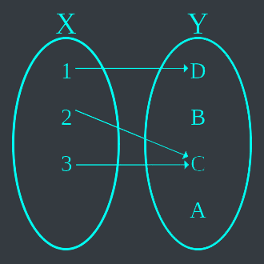
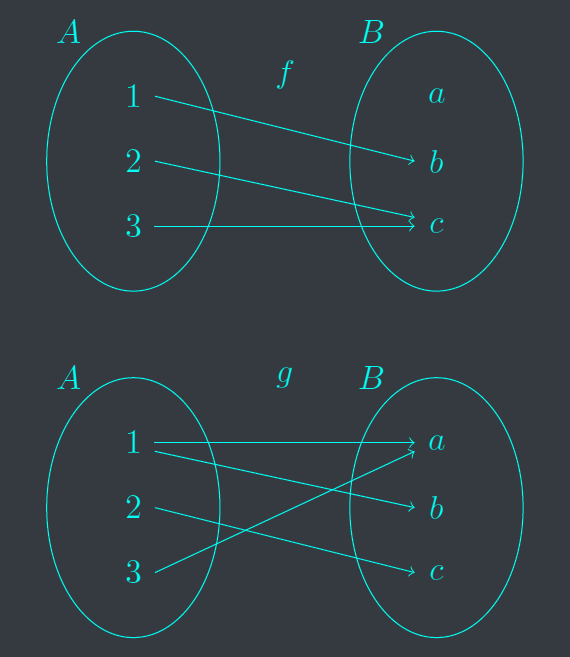
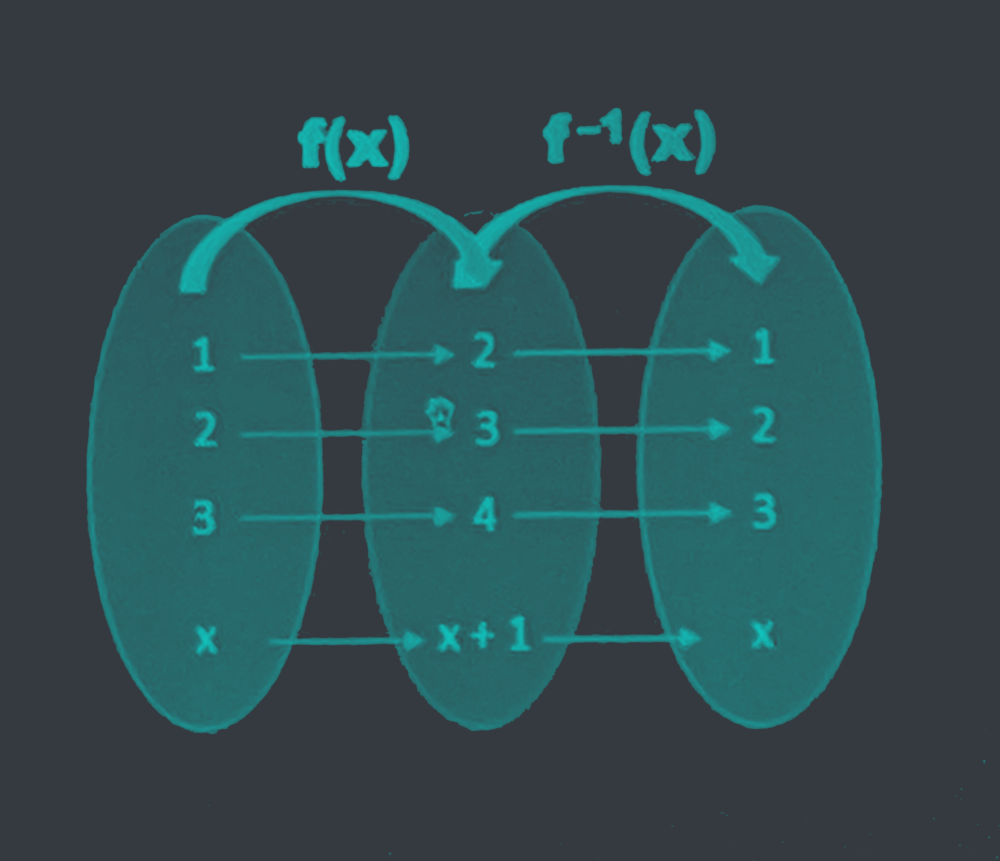



# Cartesian products

Given sets A and B, we can define a new set $A \times B$, called the Cartesian product of A and B, as a set of ordered pairs. That is,

$$A \times B = \text{\\{} (a, b): a \in A \text{ and } b \in B \text{\\}}$$



Let $A = \text{\\{} 1, 2, 3 \text{\\}}, B = \text{\\{} x, y \text{\\}}$, and $C = \emptyset$. Then

$$A \times B = \text{\\{} (1, x), (1, y), (2, x), (2, y), (3, x), (3, y) \text{\\}}$$

$$A \times C = \emptyset$$


We define the Cartesian product of n sets to be

$$A_1 \times A_2 \times \cdots \times A_n = \text{\\{} (a_1, a_2, \cdots, a_n): a_i \in A_i \text{ for } i = 1, 2, \cdots, n \text{\\}}$$


$\mathbb{R}^3$ consists of all of 3-tuples of real numbers.


Subsets of $A \times B$ are called relations. A mapping or a function $f \subset A \times B$ from a set $A$ to a set $B$ to be the special type of relation such that.

$$a \in A, \text{ there exists a unique} b \in B, (a, b) \in f$$

---
We often write $f(a) = b$ instead of $(a, b) \in A \times B$.

# Mapping
- Definition: each element of a set X (domain) is associated with one and only one element of another set Y (range/co-domain).

A map is often used as a synonym for a function. Only a one-to-one and many-to-one mapping can be called a function.

The function $f: X \to Y$ is defined by the set of pairs $f = \text{\\{} (1, A), (2, B), (3, C) \text{\\}}$.

# Function

A function is a mapping from a set X to a set Y such that each element of X is associated with one and only one element of Y.


For a function to exist, the domain and the co-domain must be non-empty.

Consider another function:

$$y = \sqrt{x+1}$$

Interval notation: If $x \in \mathbb{R}$
- $(a, b) = ]a, b[ \to a < b x < b$
- $(a, b] = ]a, b] \to a < b x \leq b$
- $[a, b) = [a, b[ \to a \leq b x < b$
- $[a, b] = [a, b] \to a \leq b x \leq b$

Operations on functions

$$(f+g)(x) = f(x) + g(x)$$

$$(fg)(x) = f(x)g(x)$$

$$(f-g)(x) = f(x) - g(x)$$

$$(\frac{f}{g})(x) = \frac{f(x)}{g(x)}$$

Suppose $D_f$ is the domain of $f$ and $D_g$ is the domain of $g$. Then the domain of $f + g$, $f - g$, $f \cdot g$ are the same and equal to the $D_f \cap D_g$. While the domain of $\frac{f}{g}$ is $x \in D_f \cap D_g$ such that $g(x) \neq 0$.

How to find the inverse function $f^{-1}(x)$ of the function $f(x)$?
- Domain $f(x)$ is equal to Range $f^{-1}$
- Range $f(x)$ is equal to Domain $f^{-1}$

According to the definition, the inverse function does not always exist.
- Check the mapping,
- Define the domain and range.

$$f(x) = 2x+1; f^{-1}(x) = \frac{x-1}{2}$$

$$f(x) = x^2; f^{-1}(x) = \sqrt{x}$$

Do the inverse function exist?

$$(f \circ f^{-1})(x) = f(f^{-1} \circ f)(x) = x$$

Note: functions composition $f(g(x)) = (f \circ g)(x)$\
The domain of $f \circ g$ is $\text{\\{} x \in D_g: g(x) \in D_f \text{\\}}$, all values $x$ in the domain of $g$ such that $g(x)$ is in the domain of $f$.


Let $f(x) = x^2$ and $g(x) = 2x+5$ then calculate $(f \circ g)(x) and (g \circ f)(x)$. Conclude?



Let $f(x) = x^3+1$ and $g(x) = \sqrt{x}-2$ then find the domain of $(f \circ g)(x)$ and $(g \circ f)(x)$. Conclude?


# Applications
For encoding and decoding
- Encode a message using a bijective function so that the receiver can decode the encoded message.
- If there is no inverse function, the encoded message can be decoded with another meaning.

This principle is used for data conversion, transformation, projection, etc.
- Conversion between Fahrenheit and Celsius.
- Fourier transform/inverse Fourier transform (analog and digital signal processing).