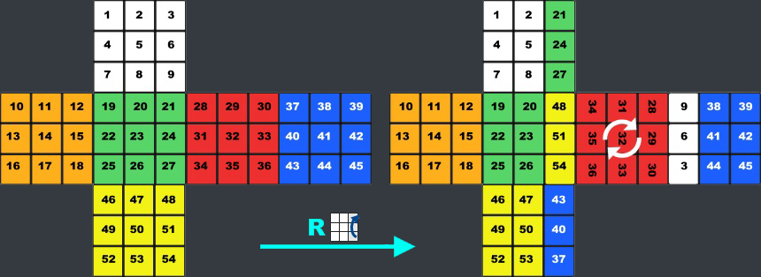



}
In mathematics, algebraic structure consists of a non-empty set A, a collection of operations on A (typically binary operations such as addition and multiplication), and a finite set of identities, known as axioms, that these operations must satisfy.
- Groups, Rings, Fields
- Lattice, Module


{}
[Group Permutation](https://ruwix.com/the-rubiks-cube/mathematics-of-the-rubiks-cube-permutation-group/)
{}

# I. Binary Operations
## Binary operations
$$ *: S \times S \to S, (a, b) \to a * b$$

A map is called a binary operation on S. So $*$ takes 2 inputs $a, b$ from $S$ and produces a single output $a * b \in S$

## Properties
Let $*$ be a binary operation on a set $S$. There exists several properties:
- $*$ is commutative if, $\forall a, b \in S$
$$a * b = b * a$$
- $*$ is associative if, $\forall a, b, c \in S$
$$a * (b * c) = (a * b) * c$$




Addition, $+$, is a commutative and associative binary operation in $\mathbb{N, Z, Q, R, C}, M_{m,n} \in R^2$



Is addition, $+$, a commutative and associative binary operation in $S = \text{\\{}0, 1\text{\\}}$?



Is subtraction, $-$, is a commutative and associative binary operation in $\mathbb{N, Z, Q, R, C}$?



Multiplication, $.$, is a commutative and associative binary operation in $\mathbb{N, Z, Q, R, C}$ but not $M_{m,n} \in \mathbb{R}^2$



Scalar product on $\mathbb{R}^2$ is given by $(a_1, a_2) . (b_1, b_2)$ = $a_1b_1 + a_2b_2$. Is it binary operation and commutative or associative?



Vector product on $\mathbb{R}^2$ is given by $(a_1, a_2) . (b_1, b_2)$ = $(a_1b_1, a_2b_2)$. Is it binary operation and commutative or associative?




# II. Groups
## Definition 1
Let G be a non-empty set and let $*$ be a binary operation on G:
$$ *: G \times G \to G, (a, b) \to a * b$$
Then $(G; *)$ is called a group if: the following axioms are satisfied:
- $G_1$ - associative: $\forall a, b, c \in G, a * (b * c) = (a * b) * c$
- $G_2$ - identity element: $\exists e \in G, \forall a \in G, e * a = a * e = a$
- $G_3$ - inverse element: $\forall a \in G, \exists a^{-1} \in G, a * a^{-1} = a^{-1} * a = e$

$(G; *)$ is called an abelian group, or simply a commutative group, if $\forall a, b \in G, a * b = b * a$




$(\mathbb{Z}, +)$
  - G1 - + is associativeL $\forall a, b, c \in \mathbb{Z}, a + (b + c) = (a + b) + c$
  - G2 - 0 is identity element: $a + 0 = 0 + a = a, \forall a \in \mathbb{Z}$
  - G3 - inverse element: for any $a \in \mathbb{Z}$, there exists $-a$ such that $a+(-a) = (-a)+a = 0$
  - G4 - $+$ is commutative: $\forall a, b \in \mathbb{Z}, a + b = b + a$



Same for $(\mathbb{Z}, +)$, all $(\mathbb{R}, +)$, $(\mathbb{Q}, +)$ and $(\mathbb{C}, +)$.



$(\mathbb{Z},.), (\mathbb{R},.), (\mathbb{Q},.) \text{ and } (\mathbb{C},.)$ are abelian groups?



We use $\mathbb{M}_2(\mathbb{R})$ to denote the set of all $2 \times 2$ matrices.
- $(\mathbb{M}_2(\mathbb{R}), +)$ is an abelian group?
- $(\mathbb{M}_2(\mathbb{R}), .)$ is an abelian group?




### Proposition 1
The **identity element** in a group $G$ is unique. That is, there exists only one element $e \in G$ such that $e * g = g * e = g, \forall g \in G$.


If $e$ is not unique, we suppose to have another identity element $e\'$ then we have both:
$$ e * g = g * e = g \text{ and } e\' * g = g * e\' = g$$
so
- if $e$ is identity element then $e * e\' = e\'$
- if $e\'$ is identity element then $e\' * e = e$
- $G$ is a group then $e * e\' = e\' * e = e\'$ (Q.E.D.)


### Proposition 2
If $g$ is any element in group $G$, then the inverse of $g$, $g\'$, is unique.


if the inverse of $g$ is not unique, we suppose to have $g\'$ and $g\'\'$ are inverse of $g$:
$$g * g\' = g\' * g = e \text{ and } g * g\'\' = g\'\' * g = e$$
but we have associative property in $G$, thus
$$g\' = g\' * e = g\' * (g * g\'\') = (g\' * g) * g\'\' = e * g\'\' = g\'\'$$


### Proposition 3
Let $G$ be a group. If $a, b \in G$ then $(a * b)^{-1} = a^{-1} * b^{-1}$


We have
$$a * b * b^{-1} * a^{-1} = a * e * a^{-1} = a * a^{-1} = e$$
Similarly, we have
$$(a * b) * (a * b)^{-1} = e$$
Due to Proposition 2, inverse is unique
$$(a * b)^{-1} = b^{-1} * a^{-1}$$


### Proposition 4
Let $x$ be an element of a group $G$, then $x^{m+n} = x^m * x^n$ for all integers $m, n$. We also define $x^0 = e$.
We denote here $x^n = x * x * \dots * x$ ($n$ times)


Hint: use induction on $n$.


## Definition 2
The order of an algebraic structure $(G, *)$ is the cardinality of its underlying set, and is denoted by $|G|$.
- For a finite set $G$, the order of $(G, *)$ is the \# of elements in $G$.
- For a finite set $G$, the order of $(G, *)$ is the smallest integer such that $a^m = e, \forall a \in G$.

# III. Subgroups
## Definition 1
Let $G$ be a group, a subset $H$ of $G$ is called a **subgroup** of $G$ if:
- The identity element of $G$ is also the identity element of $H$.
- If $h_1, h_2 \in H$, then $h_1 * h_2 \in H$.
- If $h \in H$, then $h^{-1} \in H$.
- A subgroup $H$ of $G$ is said to be *proper* if $H \neq G$.
- The subgroup $H = \text{\\{}e\text{\\}}$ of a group G is called the trivial subgroup.

### Proposition 1
Let $H$ and $K$ e subgroups of a group $G$, then $H \in K$ is also subgroup of $G$


- $H$ and $K$ must have the same identity from $G$, then the identity element belong to $H \in K$
- If $x and y$ are elements of $H \in K$ then $x * y$ is an element of $H$ since $x$ and $y$ are elements of $H$. Same goes for $x * y \in K$. Thus $x * y \in H \in K$.
- Same proof for the inverse $x^{-1}$ of an element as required.




The group of integers is a subgroup of the groups of rational numbers, real numbers and complex numbers under addtion.



Consider the set of non-zero real numbers, $\mathbb{R}^{\*}$, with the group operation of multiplication. The identity of this group is 1 and the inverse of any element $a \in \mathbb{R}^{\*}$ is just $\frac{1}{a}$.\
$\mathbb{Q}^{\*}$ is a subgroup of $\mathbb{R}^{\*}$.
- the identity of $\mathbb{Q}^{\*}$ is $\frac{1}{1} = 1 \in \mathbb{R}^{\*}$.
- let 2 numbers $\frac{q}{r}$ and $\frac{s}{t} \in \mathbb{Q}^{\*}$, then $\frac{q}{r}.\frac{s}{t} \in \mathbb{Q}^{\*}$
- the inverse of $\frac{q}{r}$ is $(\frac{q}{r})^{-1} = \frac{r}{q} \in \mathbb{Q}^{\*}$



The group of all $2 \times 2$ matrices of real numbers with determinant equal to 1 is a subgroup of the group of all $2 \times 2$ matrices of real numbers with non-zero determinant under the operation of matrix multiplication.



Let $H = \text{\\{} -1;1;i;-i \text{\\}} is a subgroup of $C$.




# IV. Cyclic Groups
## Definition 1
$|G|$ (the order of $G$) is the cardinality of $G$ a.k.a. the \# of elements in $G$.

## Definition 2
If every element of G is of the form
$$g^n = g * g * \dots * g$$
for some integer $n$, then $G$ is called a cyclic group with generator $g$.

Denote: $G = \langle g \rangle$ or $(g)$




The group $\mathbb{Z}_n$ is cyclic with generator 1.



The set $\mathbb{Z}_n$ of integers modulo $n$ is a cyclic group of order $n$ with respect to the operation of addition.
$$\mathbb{Z}_n = \text{\\\{}0, 1, 2, \dots, n-1\text{\\\}}$$
For example, $\mathbb{Z}_4 = \text{\\\{}0, 1, 2, 3\text{\\\}}$ is a cyclic group with generator 1.



Let a subgroup $U_9 \in \mathbb{Z}_9$ with $U_9 = \text{\\\{}1, 2, 4, 5, 7, 8\text{\\\}}$ is a cyclic group. Every member of this set is generated by 2.

$$ 2^1 = 2 (\text{mod}) 9, 2^2 = 4 (\text{mod}) 9$$

$$ 2^3 = 8 (\text{mod}) 9, 2^4 = 7 (\text{mod}) 9$$

$$ 2^5 = 5 (\text{mod}) 9, 2^6 = 1 (\text{mod}) 9$$




## Proposition 1
Every cyclic group is abelian.


Let G be a cyclic group and $a \in G$ be a generator for G. If $g, h \in G$, then they can written as powers of $a$, denoted bt $g = a^m$ and $h = a^n$. If $G$ is abelian, $g \times h = h \times g$. We have:
$$g * h = a^m * a^n = a^{m+n} = a^{n+m} = a^n * a^m = h * g$$


# V. Cosets
## 1. Definition 1
Let $H$ be a subgroup of $G$. A left coset of $H$ in $G$ is a set of the form $x * H$, where $x \in G$

$$ x * H = \text{\\\{}y \in G: y = x * h, \text{ for some } h \in H\text{\\\}}$$

## 2. Definition 2
Similarly, a **right coset** of $H$ in $G$ is a set of the form $H \times x$, where $x \in G$

$$ H * x = \text{\\\{}y \in G: y = h * x, \text{for some } h \in H\text{\\\}}$$


$H = \text{\\\{}0, 3\text{\\\}}$ is a subgroup of $\mathbb{Z}_6$. The cosets are:

$$0 + H = 3 + H = \text{\\\{} 0, 3 \text{\\\}}$$
$$1 + H = 4 + H = \text{\\\{} 1, 4 \text{\\\}}$$
$$2 + H = 5 + H = \text{\\\{} 2, 5 \text{\\\}}$$


## 3. Definition 3
The index of a subgroup $H$ in $G$ is the number of right (left) cosets. It is a positive number of $\infty$ and is denoted by $\[G:H\]$.


Let $H$ be a subgroup $\mathbb{Z}_6$ consisting of elements $0$ and $3$ or $H \in \text{\\{} 0, 3 \text{\\}}$, the cosets are

$$0 + H = 3 + H = \text{\\\{} 0, 3 \text{\\\}}$$
$$1 + H = 4 + H = \text{\\\{} 1, 4 \text{\\\}}$$
$$2 + H = 5 + H = \text{\\\{} 2, 5 \text{\\\}}$$

The index of $H$ is $3$.


### Proposition 1
Let $H$ be a subgroup of a group $G$. Then each left coset of $H$ in $G$ has the same number of elements as $H$.


Let $H = \text{\\{} h_1, h_2, \dots, h_m \text{\\}}$ where $h_1, h_2, \dots, h_m$ are distinct. Let $x$ be elements in $G$, then the left coset if $x * H$. We suppose to have $x * h_i = x * h_j \in x * H$ where $i, j$ are integers from $1$ to $m$, and we expect that $h_i \neq h_j$. But

$$ h_i = x^{-1} * x * h_i = x^{-1} * x * h_j = h_j$$

Thus $i = j$ so $x * H$ have distinct elements.


### Proposition 2
Let $H$ be a subgroup of a group $G$. The number of left cosets of $H$ in $G$ is the same as the number of right cosets of $H$ in $G$.


Let $r$ be exactly different leftt cosets of $H$ in $G$, thus we have the left cosets:

$g_1 * h, g_2 * H, \dots, g_r * H : g_1, g_2, \dots, g_r \in G$
- $x \in H * g_i^{-1}\text{ (Proposition 1)}$
- $\Leftrightarrow x * (g_j^{-1})^{-1} \in H * g_j^{-1} * (g_j^{-1})^{-1}$
- $\Leftrightarrow x * g_j \in H * e$
- $\Leftrightarrow (x^{-1})^{-1} * g_i \in H$
- $\Leftrightarrow x^{-1} \in g_i * H \text{ (Proposition 1)}$


### Proposition 3
Let $H$ be subgroups of a group G, then the left cosets of $H$ in $G$ have the following properties:
- $x \in x * H, for all x \in G$
- if $x$ and $y$ are elements of $G$, and if $y = x * g$ for some $g \in H$ then $x * H = y * H$


- Let $x \in G$, then $x = x * e$ where $e$ is the identity element of $G$ and $e \in H$, thus $x \in x * H$ (according to subgroups definition).
- Let $x$ and $y$ be elements of $G$
  - where $y = x * g$ for some $g \in H$
  - then $y * h = x * g * h$ and $x * h = y * (g^{-1}) * h \forall h \in H$
  - moreover $g * h \in H$, thus $y * H \subseteq x * H$ and $g^{-1} * h \in H$
  - thus $x * H \subseteq y * H$
  - $\Leftrightarrow x * H = y * H$


# VI. Lagrange's Theorem
- Theorem:\
Let $G$ be a finite group and $H$ be a subgroup of $G$, then $|H|$ divides $|G|$ where $|H|$ and $|G|$ are order of $H$ and $G$ respectively. Or $[G:H] = \frac{G}{H}$ where $[G:H]$ is the index of $H$ in $G$.


- Each element of $G$ belongs to at least one left coset of $H$ in $G$, and no element can belong to two distinct left cosets of $H$ in $G$. (Lemma 1)
- Therefore every element of $G$ belongs to exactly one left coset of $H$ in $G$. Moreover each left coset of $H$ contains exactly $|H|$ elements. (Lemma 2)
- Therefore $|G| = n|H|$ where $n$ is the number of left cosets of $H$ in $G$. The result follows.


# VII. Normal Subgroups
## 1. Definition
A subgroup $H$ of a group $G$ is normal in $G$ if $g * H = H * g$ for all $g \in G$.
- A normal subgroup of a group $G$ is one in which the right and left cosets are percisely the same.


Let $G$ be an abelian group. Every subgroup $H$ of $G$ is a normal subgroup. Since $g * h = h * g \forall g \in G$ and $h \in H$, it will always be the case that $g * H = H * g$.
