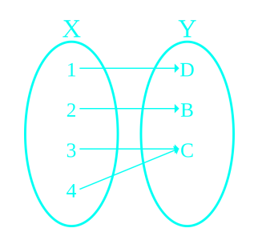



# Mapping
## Definition
Intuitively, a mapping is a process that associates to each element of a set $X$ a single element of a set $Y$.

, (2, B), (3, C)\}$")

## Injective
or one-to-one function never maps distinct elements of its domain to the same element of its co-domain.

## Surjective
or onto function is defined if for every element $y$ in the co-domain $Y$, there is at least one element x in the domain $X$ such that $f(x) = y$.

## Bijective
- A bijection is a function between the elements of two sets, where each element of one set is paired with exactly one element of the other set, and each element of the other set is paired with exactly one element of the first set. <c-red>THERE ARE NO UNPAIRED ELEMENTS</c-red>

- A bijective function $f: X \to Y$ is a one-to-one (injective) and onto (surjective) mapping of a set $X$ to a set $Y$.

# Homomorphism
- A group **homomorphism** (Greek: same structure) is a map $f: G \to H$ between two algebraic groups $(G, *)$ and $(H, \circ)$ that preserves the operations of the structures.

$$f(g_1 * g_2) = f(g_1) \circ f(g_2)$$

## Examples

### Example 1
We can define an homomorphism $\phi$ from $(\mathbb{Z}, +)$ to $(G, \cdot) = \<g\>$;

$$\phi(x+y) = \phi(x) \cdot \phi(y)$$
$$g^{x+y} = g^x \cdot g^y$$

for all $x, y \in \mathbb{Z}$.

### Example 2
A mapping $f(x) = |x|$ from $\mathbb{R} \to \mathbb{R}^+$ is a homomorphism under addition and multiplication?

### Example 3
A mapping $f(x) = \sqrt{x}$ from $\mathbb{R} \to \mathbb{R}^+$ is a homomorphism under addition and multiplication?

### Example 4
Do we have homomorphism from $f : \mathbb{R} \to \mathbb{R}$ where $f(x) = \sin(x)$?

---

The kernel of a group homomorphism $f : G \to H$ is the set of elements in $G$ sent to the identity:

$$\text{kernelf} = \{x: f(x) = e_H\}$$

## Proposition 1
A group homomorphism maps the identity element in $G$ to the identity element in $H: \phi(e_G) = e_H$.


$$\phi(x) = \phi(x * e_G) = \phi(x) \circ \phi(e_G)$$

where $x \in G$ and $\phi(x) \in H$ and

$$\phi(x) = \phi(x) \circ e_H$$

thus $\phi(e_G) = e_H$


## Proposition 2
A homomophism must preserve the map of inverse elements:

$$f(g)^{-1} = f(g^{-1})$$


$$f(g) \circ f(g^{-1}) = f(g * g^{-1}) = f(e_G) = e_H$$

and,

$$f(g) \circ f(g^{-1}) = e_H$$

thus $f(g)^{-1} = f(g^{-1})$


## Exercise
Let $\phi$ be a group homomorphism from a group $(G, *)$ to a group $(H, \circ)$. Let $K$ be a subgroup of $H$, prove that

$$\phi^{-1}(K) = \{x \in G : \phi(x) \in K\}$$ is a subgroup of $G$.

# Isomorphism

Two groups $(G, *)$ and $(H, \circ)$ are **isomorphic** (Greek: equal structure) if there exists one-to-one and onto map (bijection) $\phi: G \to H$ such that

$$\phi(a * b) = \phi(a) \circ \phi(b)$$

for all $a, b \in G$. If $G$ is **isomorphic** to $H$, we write $G \cong H$. The map $\phi$ is called an **isomorphism**.

---

An isomorphism $\phi: G \to G$ is called an **automorphism**, that is an isomorphism of a group to itself.

## Examples

### Example 1
We can define an isomorphism $\phi$ from $(\mathbb{R}, +)$ to $(\mathbb{R}, *)$ with the exponential map:

$$\phi(x+y) = \phi(x) * \phi(y)$$
$$e^{x+y} = e^x * e^y$$

### Example 2
Any infinite cyclic group is isomorphic to $\mathbb{Z}$. Let $G = \<a\>$ where $|G| = \infty$, then $G = \{a^k, k \in \mathbb{Z}\}$ and a mapping $\phi(a^k) = k$ from $G$ to $\mathbb{Z}$.

### Example 3
Consider a mapping $\phi : \mathbb{R} \to \mathbb{R}$ where $\phi(x) = x^3$. Is it $\phi$ bijective and an isomorphism?

### Example 4
Consider the group $(\mathbb{C}, +)$ and define $\phi : \mathbb{C} \to C$ by $\phi(a + bi) = a - bi$. $\phi$ is an automorphism.

## Theorems

### Theorem 1
Let $\phi: (G, *) \to (H, \circ)$ be an isomorphism of two groups. Then the following statements are true:
- $\phi^{-1}: H \to G$ is an isomorphism
- $|G| = |H|$
- If $G$ is abelian then $H$ is abelian.
- If $G$ is cyclic then $H$ is cyclic.


Let $\phi: (G, *) \to (H, \circ)$ be an isomorphism of two groups. Then the following statements are true:
- For (1) and (2), $\phi$ is bijection so Q.E.D.
- (3) Suppose that $h_1, h_2 \in H$, since $\phi$ is onto, so there exists $g_1, g_2 \in G$ such that $\phi(g_1) = h_1$ and $\phi(g_2) = h_2$, therefore

$$\begin{aligned}
h_1 \circ h_2 &= \phi(g_1) \circ \phi(g_2) \\\
&= \phi(g_1 * g_2) \\\
&= \phi(g_2 * g_1) \\\
&= \phi(g_2) \circ \phi(g_1) \\\
&= h_2 \circ h_1
\end{aligned}$$

- (4) If $G$ is cyclic then we denote $a$ the generator of $G$.
$$\forall h \in H = \phi(a^k) = \phi(a)^k$$
where $k$ is certain integers. Then $\phi(a)$ is the generator of $H$.


### Theorem 2
All cyclic groups of infinite order are isomorphic to $\mathbb{Z}$.


Let $G = \<a\>$ where $|G| = \infty$, then $G = \{a^k, k \in \mathbb{Z}\}$ and a mapping $\phi(a^k) = k$ from $G$ to $\mathbb{Z}$. <c-red>(Need check)</c-red>
