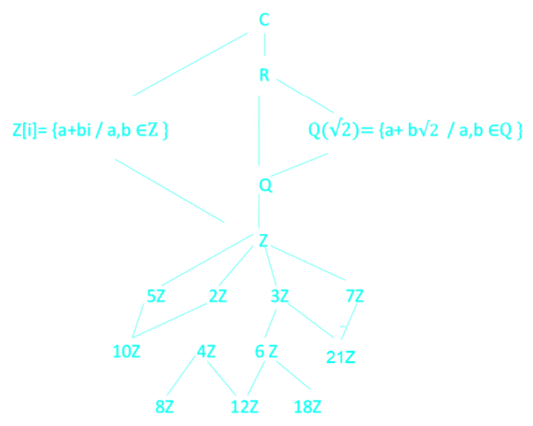
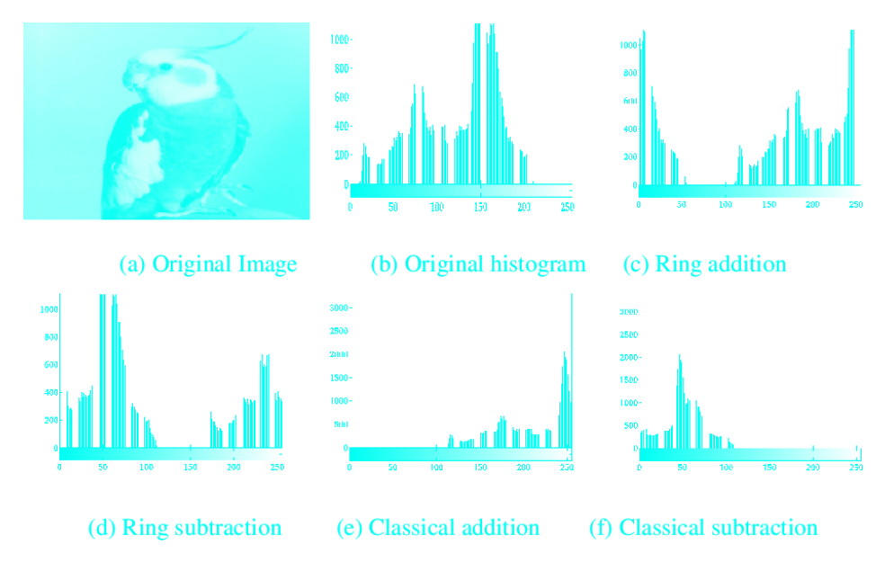



# Introduction
- We have studied sets with a single binary operation satisfying certain axioms.
- <c-red>What about two or more operations?</c-red>
  - $\to$ Define Rings and Fields.

# Rings
## Definition


A non-empty set with two binary operations $(R, +, \cdot)$ such that

$$f : R \times R \to R, f (a, b) = a + b$$
$$g : R \times R \to R, g(a, b) = a \cdot b$$

- $(R, +)$ is an abelian group under addition.
- Multiplication is associative $(ab)c = a(bc)$ for $a, b, c \in R$.
- Multiplication is distributive with respect to addition for $a, b, c \in R$.

$$(a + b)c = ac + bc$$
$$(a + b)c = ac + bc$$

- If a multiplication is also commutative, then the ring can be called a commutative ring.
- In a ring, multiplicative inverses are not required to exist.
- The unit elements in a ring have an inverse under multiplication.



- Substraction: we write $-b$ as shorthand for $a + (-b)$.
- Division: we write $a/b$ as shorthand for $a \cdot (1/b)$ when $1/b$ exists.


## Examples
### Example 1
Are $\mathbb{Z}$, $\mathbb{Q}$, $\mathbb{R}$, $\mathbb{C}$ rings under addition and multiplication?

### Example 2
Is $\mathbb{N}$ a ring under addition and multiplication?

### Example 3
Why $\mathbb{Z}_{12}$ is a ring?

### Example 4
Any polynomial function is a ring.

### Example 5
Is $(\mathbb{Z}, +, \min)$ a ring?

### Example 6
The 2 × 2 matrices with entries in $R$ form a ring under the usual operations of matrix addition and multiplication. But is it commutative?

## Proposition
Let $R$ be a ring with $a, b \in R$ then
- $a0 = 0a = 0$
- $a(-b) = (-a)b = -ab$
- $(-a)(-b) = ab$

# Ring homomorphisms
If $R$ and $S$ are rings, then a ring homomorphism is a map $\phi : R \to S$ satisfying
- $\phi(a + b) = \phi(a) + \phi(b)$
- $\phi(ab) = \phi(a)\phi(b)$
- $\phi(1_R) = 1_S$

---

For all $a, b \in R$, if $\phi : R \to S$ is a one-to-one and onto homomorphism, then $\phi$ is called an isomorphism of rings.

## Example
For any integer $n$, we can define a ring homomorphism $\phi : \mathbb{Z} \to \mathbb{Z}_n$ by $\phi(a) = a \mod n$.

## Sub-rings
### Definition


Let $R$ be a ring and $S$ is a subset of $R$, then $S$ is a sub-ring of $R$ if and only if
- $S \neq \emptyset$
- $ab \in S$ for all $a, b \in S$
- $a - b \in S$ for all $a, b \in S$


### Examples

#### Example 1
$\mathbb{Z}$ and $\mathbb{Q}$ are sub-rings of $\mathbb{R}$.

#### Example 2
$n\mathbb{Z} = \{nk|k \in \mathbb{Z}\}$ is a sub-ring of $\mathbb{Z}$ for any $n \in \mathbb{N}$.

---

## Applications
- Ring properties are used to define Integral domains and Fields.
- Ring theory applications in Cryptography
- Ring theory in image segmentation: "Application of the Ring Theory in the Segmentation of Digital Images" the equivalence between two images $A$ and $B \in G_{k \times m}(Z_n)(+, \cdot)$ is $A = S + B$ (where $S$ is a scalar image)

# Zero-divisors
## Definitions


If $R$ is a ring and $r$ is a nonzero element in $R$, then $r$ is said to be a **zero divisor** if there is some nonzero element $s \in R$ such that $rs = 0$.



If $a, b$ are two ring elements with $a, b \neq 0$ but $ab = 0$ then $a$ and $b$ are called **zero-divisors/divisor of zero**.


## Examples

### Example 1
In $\mathbb{Z}_6$, we have $2 \cdot 3 = 0$ so $2$ and $3$ are zero-divisors.

### Example 2
In $\mathbb{Z}_{2}0$, we have $4 \cdot 5 = 2 \cdot 10 = 0$ so $2, 4, 5, 10$ are zero-divisors.

## Proposition
- For $x$ be a ring element, $x$ cannot be both invertible and a zero-divisor.
- Proof: If $x$ is both invertible and a zero-divisor, then $x^{-1}x = 1$ and $xx^{-1} = 1$. But $1$ is not a zero-divisor. <c-red>(Need check)</c-red>

# Integral domains
## Definition


An integral domain is a commutative ring with an identity $(1 \neq 0)$ with no zero-divisors.
That is $ab = 0 \to a = 0$ or $b = 0$.



If an element $a$ in a ring $R$ with identity has multiplicative inverse, we say that $a$ is a **unit**.



**Characteristic of a ring $R$** to be the least positive integer $n$ such that $nr = 0$ for all $r \in R$. If no such integer exists, then the characteristic of $R$ is defined to be $0$.


## Examples

### Example 1
$\mathbb{Z}$, $\mathbb{R}$, $\mathbb{Q}$ are integral domains under addition and multiplication.

### Example 2
$\mathbb{Z}_{13}$ is an integral domain.

### Example 3
Is $(2\mathbb{Z}, +, \cdot)$ is an integral domain?

### Example 4
In the ring, $\mathbb{Z}_{20}$, the unit elements are $\{1, 3, 7, 11, 13, 17, 19\}$, the others are zero divisors.

### Example 5
$R = \mathbb{Z} \times \mathbb{Z}$ is a ring such that $x = (a, b)$, $y = (c, d) \in R$ then
- $x + y = (a + c, b + d)$
- $x \cdot y = (a \cdot b, c \cdot d)$
Is $R$ a ring? an integral domain?

### Example 6
$\mathbb{Z}$ has the characteristic $0$.

### Example 7
$\mathbb{Z}_6$ has the characteristic $6$ (because $6.5 = 0$).

## Applications
- Divisor definition: Given elements $a$ and $b$ of $R$, one says that $a$ divides $b$, or that $a$ is a divisor of $b$, or that $b$ is a multiple of $a$, if there exists an element $x$ in $R$ such that $ax = b$.
- Euclidean algorithm to find the greatest common divisor between two integers.
- The Fundamental Theorem of Algebra: A polynomial function of degree $n$ has at most $n$ solutions
- etc.

## Theorems
- **Cancellation**: Let $D$ be an integral domain with $a, b, c \in D$. If $a \neq 0$ and $ab = ac$ then $b = c$.
- Prove: If $ab = ac$, then $a^{-1}ab = a^{-1}ac$. But $a^{-1}a = 1$ so $b = c$. <c-red>(Need check)</c-red>

# Fields
## Definitions


A nonempty set $R$ is a **field** if it has two closed binary operations: **addition** and **multiplication**:
- both of which operations are **commutative**, **associative**,
- contain **identity elements**: $0$ for addition, $1$ for multiplication,
- contain **inverse elements**: $-a$ for addition with $a \in R$, $1/a$ for multiplication with $a \in R$
- multiplication distributes over addition: for $a, b, c \in R$

$$(a + b)c = ac + bc$$
$$a(b + c) = ab + ac$$



If every nonzero element in a ring $R$ is a unit, then $R$ is called a **division ring**. A **commutative division ring** is called a **field**.



A **subfield** $E$ of a field $F$ is a subset of $F$ that is a field with respect to the field operations of $F$.


## Proposition
Let F be a field
- the additive identity is unique
- the additive inverse is unique
- the multiplicative identity is unique
- the multiplicative inverse is unique

## Examples

### Example 1
Are $\mathbb{N}$, $\mathbb{Z}$, $\mathbb{Q}$, $\mathbb{R}$, $\mathbb{C}$ fields?

### Example 2
The $2 \times 2$ matrices with entries in $R$ form a field under the usual operations of matrix addition and multiplication?

## Applications
- Define vector space over a field $F$.