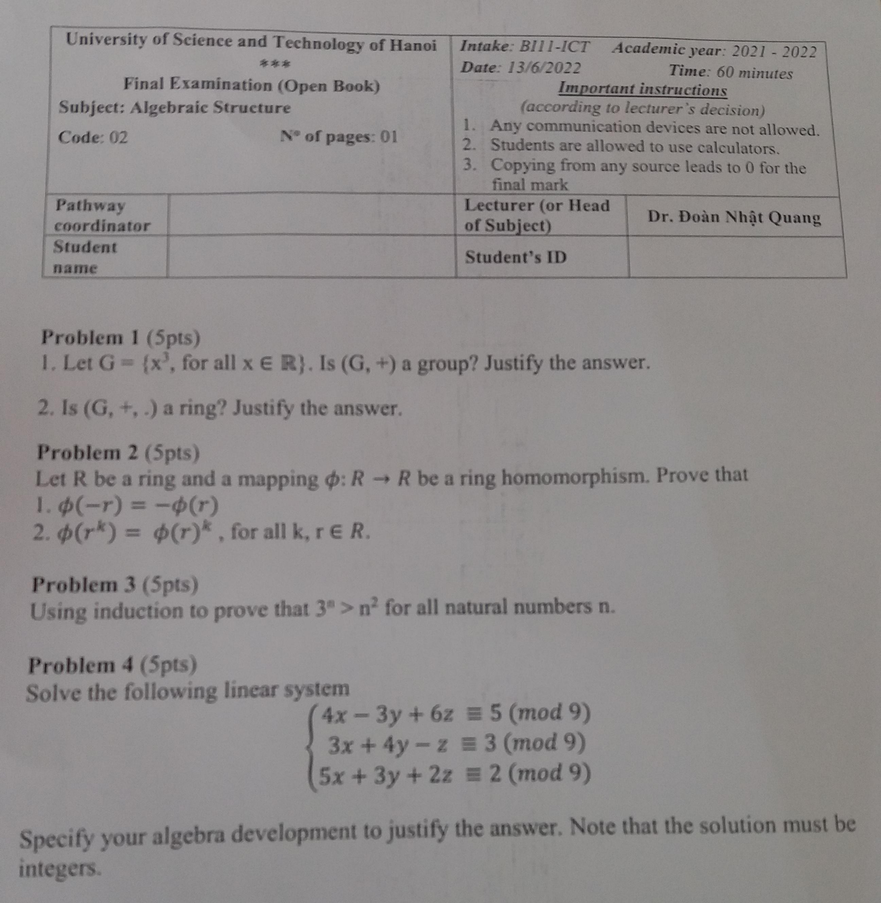

# Code 2

{}

{}
# Problem 1
- Let $G = \{ x^3, \text{ for all } x \in \mathbb{R} \}$. Is $(G, +)$ a group? Justify your answer.
- Is $(G, +, \cdot)$ a ring? Justify your answer.

# Problem 2
Let $R$ be a ring and a mapping $\phi: R \to R$ be a ring homomorphism. Prove that:
- $\phi(-r) = -\phi(r)$
- $\phi(r^k) = \phi(r)^k$, for all $k, r \in R$.

# Problem 3
Using induction to prove that $3^n > n^2$ for all natural numbers $n$.

# Problem 4
Solve the following linear system:

$$\begin{cases}
4x-3y+6z \equiv 5 (mod 9) \\\
3x+4y-z \equiv 3 (mod 9) \\\
5x+3y+2z \equiv 2 (mod 9)
\end{cases}$$

Specify your algebra development to justify your answer. <c-red>Note that the solution must be integers.</c-red>

# Code 3

## Problem 1
Define a binary operation $\triangle$ in $\mathbb{R}$ such that $a \triangle b = a^2 \cdot b$. Is the binary operation $\triangle$ associative, commutative, and distributive under addition? Justify your answer.



A binary operation $\triangle$ is defined on the set of real numbers $\mathbb{R}$ such that $a \triangle b = a^2 \cdot b$ for all $a,b \in \mathbb{R}$.

Let's check if the operation is associative. For any $a,b,c \in \mathbb{R}$, we have $(a \triangle b) \triangle c = (a^2 \cdot b) \triangle c = (a^2 \cdot b)^2 \cdot c = a^4 \cdot b^2 \cdot c$. On the other hand, $a \triangle (b \triangle c) = a \triangle (b^2 \cdot c) = a^2 \cdot (b^2 \cdot c) = a^2 \cdot b^2 \cdot c$. Since $a^4 \cdot b^2 \cdot c$ is not equal to $a^2 \cdot b^2 \cdot c$ in general, the operation $\triangle$ is **not associative**.

Let's check if the operation is commutative. For any $a,b\in\mathbb{R}$, we have $a\triangle b=a^2\cdot b$ and $b\triangle a=b^2\cdot a$. Since $a^2\cdot b$ is not equal to $b^2\cdot a$ in general, the operation $\triangle$ is **not commutative**.

Let's check if the operation is distributive under addition. For any $a,b,c\in\mathbb{R}$, we have $(a+b)\triangle c=(a+b)^2\cdot c=a^2\cdot c+2ab\cdot c+b^2\cdot c$. On the other hand, $a\triangle c+b\triangle c=a^2\cdot c+b^2\cdot c$. Since $(a+b)^2\cdot c=a^2\cdot c+2ab\cdot c+b^2\cdot c$ is not equal to $a^2\cdot c+b^2\cdot c$ in general, the operation $\triangle$ is **not distributive** under addition.

In summary, the binary operation $\triangle$ defined by $a \triangle b = a^2 \cdot b$ for all $a,b \in \mathbb{R}$ is **neither associative nor commutative nor distributive** under addition.





## Problem 2
Let $R, S$ be rings and a mapping $\phi: R \to S$ be a ring homomorphism. Prove that:
- If $r \in R$ is a unit (r is invertible) if and only if $\phi(r) \in S$ is a unit of $S$.
- If $r$ is zero divisor of $R$ if and only if $\phi(r)$ is zero divisor of $S$.

## Problem 3
Using induction to prove that $a^4 - 1$ is divisible by $16$ for all odd numbers $a$.



**Base case:** Let $a = 1$. Then $a^4 - 1 = 0$, which is divisible by $16$.

**Inductive step:** Assume that for some odd number $k$, $k^4 - 1$ is divisible by $16$. We want to show that $(k+2)^4 - 1$ is also divisible by $16$. Expanding $(k+2)^4$, we get:

$(k+2)^4 = k^4 + 8k^3 + 24k^2 + 32k + 16$

Subtracting $1$ from both sides, we get:

$(k+2)^4 - 1 = k^4 + 8k^3 + 24k^2 + 32k + 15$

Since $k^4 - 1$ is divisible by $16$, we can write it as $16n$ for some integer $n$. Substituting this into the above equation, we get:

$(k+2)^4 - 1 = 16n + 8k^3 + 24k^2 + 32k + 15$

Factoring out a $16$, we get:

$(k+2)^4 - 1 = 16(n + k^3/2 + 3k^2/2 + k) + 15$

Since all the terms inside the parentheses are integers, $(n + k^3/2 + 3k^2/2 + k)$ is an integer. Therefore, $(k+2)^4 - 1$ is divisible by $16$. This completes the inductive step.

By the principle of mathematical induction, we have shown that $a^4 - 1$ is divisible by $16$ for all odd numbers $a$.




## Problem 4
Solve the following linear system:

$$\begin{cases}
4x-3y+6z \equiv 5 (mod 9) \\\
3x+4y-z \equiv 3 (mod 9) \\\
5x+3y+2z \equiv 2 (mod 9)
\end{cases}$$

Specify your algebra development to justify your answer. <c-red>Note that the solution must be integers.</c-red>