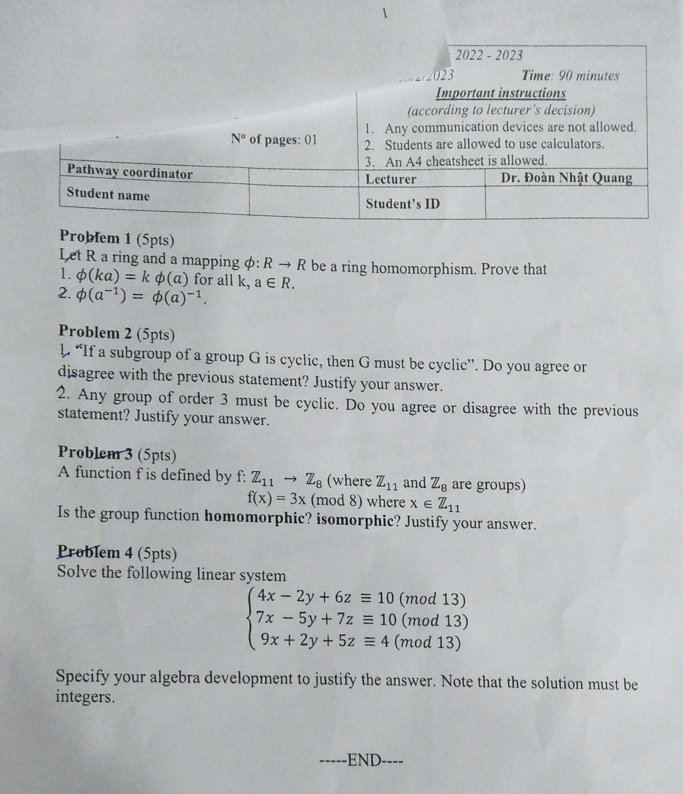

# Code 1

{}

{}

## Problem 1
1. An element $x$ in a ring $R$ is called idempotent if $x^2 = x$. Prove that the only idempotent in an integral domain are $0$ and $1$.
2. Give an example of a ring but not a field.

## Problem 2
Let $a$ be an integer. Define a map $f: \mathbb{Z} \to \mathbb{Z} _{13}$ by $f(x) = a.n$ for $n \in \mathbb{Z}$. Show that $f$ is a ring homomorphism if and only if $a^2 \equiv a \pmod{13}$.

## Problem 3
1. Given a mapping $f: \mathbb{R} \to \mathbb{R}$, $f(x) = (-3).5^x+6$. Find the inverse function $f^{-1}$ of $f$. Determine the domain and range for both $f$ and $f^{-1}$.
2. Let $\circ$ be a binary operation on $\mathbb{Z}$, with $a, b$ from $\mathbb{Z}$ such that $a \circ b = ab + a - b$. Is $(\mathbb{Z}, \circ)$ a group?

## Problem 4
Solve the following linear system

{}
$\begin{aligned}
4x-2y+6z \equiv 3 \pmod{11} \\\
7x-5y+7z \equiv 3 \pmod{11} \\\
9x+2y+z \equiv 10 \pmod{11}
\end{aligned}$
{}

Specify your algebra development to justify your answer. Note that the solution must be integers.

---
# Code 2

{}

{}

## Problem 1
1. Let $G$ be a group under a binary operation $"."$ (note: . is not multiplication). Suppose a natural number $n$ such that $(a.b)^n = a^n.b^n$ for all $a,b \in G$. Define $K = {x \in G | x^n = e}$. Prove that $K$ is a subgroup of $G$.

2. Give an example of a ring but not a field.

## Problem 2
1. Prove that $\mathbb{Z}_m$ is an integral domain if $m$ is a prime number.
2. Let $(G,.)$ be a group. Show that $G$ is abelian if and only if $a.b.a^{-1}.b^{-1} = e$.

## Problem 3
Given a group mapping from $(\mathbb{R}, +)$ to $(\mathbb{R}, .)$ defined by: $f(x) = e^x + 1$. Is the mapping homomorphic? or isomorphism? Justify your answer.

## Problem 4
Solve the following linear system

{}
$\begin{aligned}
4x-2y+6z \equiv 10 \pmod{13} \\\
7x-5y+7z \equiv 10 \pmod{13} \\\
9x+2y+5z \equiv 10 \pmod{13}
\end{aligned}$
{}

Specify your algebra development to justify your answer. Note that the solution must be integers.

---
# Code 03

{}

{}

## Problem 1
Let $R$ a ring and a mapping $\phi \to R$ be a ring homomorphism. Prove that
1. $\phi(ka) = k\phi(a)$ for all $k \in R$ and $a \in R$.
2. $\phi(a^{-1}) = \phi(a)^{-1}$.

## Problem 2
1. "If a subgroup of a group $G$ is cyclic, then $G$ must be cyclic." Do you agree or disagree with the previous statement? Justify your answer.
2. Any group of order 3 must be cyclic. Do you agree or disagree with the previous statement? Justify your answer.

## Problem 3
A function $f$ is defined by $f: \mathbb{Z} _{11} \to \mathbb{Z} _{8}$ (where $\mathbb{Z} _{11}$ and $\mathbb{Z} _{8}$ are groups). $f(x) = 3x \pmod{11}$ where $x \in \mathbb{Z} _{11}$.

Is the group function homomorphic? isomorphism? Justify your answer.

## Problem 4
Solove the following linear system

{}
$\begin{aligned}
4x-2y+6z \equiv 10 \pmod{13} \\\
7x-5y+7z \equiv 10 \pmod{13} \\\
9x+2y+5z \equiv 4 \pmod{13}
\end{aligned}$
{}

Specify your algebra development to justify your answer. Note that the solution must be integers.