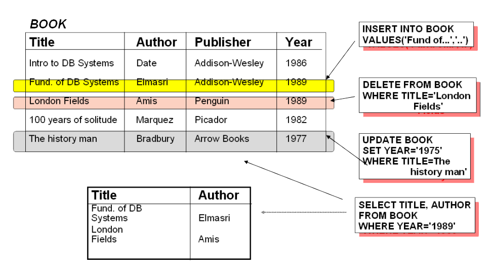
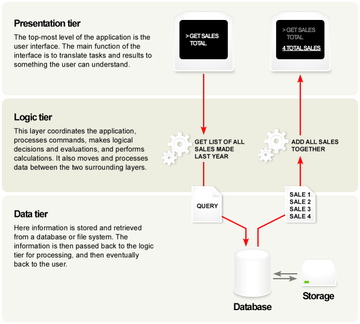
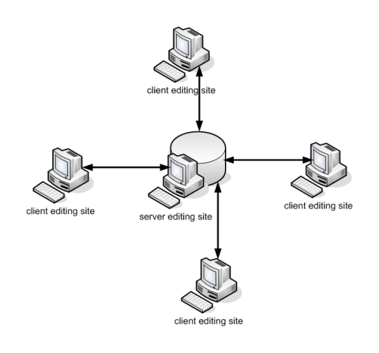
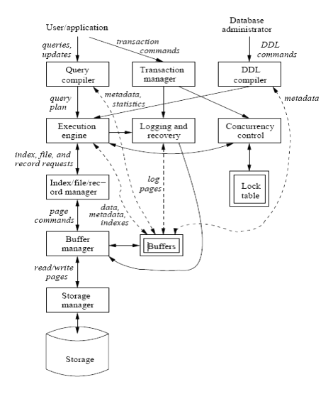



# I. Introduction, basic definitions
## 1. Why study databases?
- Beside *computation* we need to store and exploit data to get desired *information*.
- Databases relate to most of domains in Computer
Science: Information system, OS, languages, data-mining, multimedia, ...
- Datasets increasing in diversity and volume.
  - Airline Reservation, Banking, Medicine, Corporate
  - Digital libraries, interactive video, Human Genome project, EOS project
  - ...

## 2. Database application examples
  - Contact list
  - Items on e-commerce sites

## 3. Databases are everywhere
- Applications:
  - Online retailers: e-commerce, order tracking, customized recommendations
  - Banking: transaction
  - Airlines: reservation, schedules
  - Universities: registration, grades
  - Sales: customers, products, purchases
  - Manufacturing: inventory, production, orders, supply chain
  - Human resources: employees records, salaries, tax deductions
  - Social networks platforms

## 4. Basic definitions
- Data:
  - Known facts that can be recorded and have an implicit meaning
  - Anything in a form suitable for use with a computer
  - Distinguished from program (Wikipedia)
- Database:
  - Nothing more than a collection of data existing over a long period of time
  - Purposes
    - To store data
    - To provide an organizational structure for data
    - To provide a mechanism for creating, modifying, deleting, and querying data
- Database Management System (DBMS)
  - A software package/ system to facilitate the creation and maintenance of a computerized database.
- Database System
  - The DBMS software together with the data itself. Sometimes, the applications are also included.

## 5. A sample database


## 6. Main Characteristics of a Database Approach
- *Self-describing* nature of a database system: A DBMS **catalog** stores the description of the database. (The description of the database is called metadata.)
- *Isolation* between *programs* and data: **program-data** independence. Allows changing data storage structures and operations without having to change the DBMS access programs.
- *Data Abstraction*: A data model is used to hide storage details and present the users with a *conceptual view* of the database.
- Support of *multiple view* of the data: Each user may see a different view of the database, which describes only the data of interest to that user.

# II. History of databases
## 1. History of DB Technology
- The first DBMS evolved from file systems.
- Late 60s:
  - 199: Charles Bachman network data model.
  - IBM IMS hierarchical data model.
- 70s:
  - Edgar Codd relational data model.
  - SQL was developed by IBM.
  - 1979: Oracle Version 2, the first commercial RDBMS product using SQL.
- 80s: SQL IBM R was introduced in 1981 (based on Codd's research)
- Late 80s-90s:
  - DB2, Oracle, Informix, Sybase.
  - OODBMS: Object-oriented DBMS was introduced.
- 90s: SQL was standardized by ANSI and ISO in 1992.
- From 2000:
  - [XML](https://www.w3.org/XML/).
  - [db4o](https://dbdb.io/db/db4o).
  - NoSQL: [ScyllaDB](https://www.scylladb.com/), [MongoDB](https://www.mongodb.com/), [CouchDB](https://couchdb.apache.org/), [Redis](https://redis.io/), [Cassandra](https://cassandra.apache.org/_/index.html), [HBase](https://hbase.apache.org/), [Neo4j](https://neo4j.com/), [Riak](https://riak.com/), ...

# III. Trends in database technology
## 1. DB Technology's Trends
- Smaller and Smaller Systems
  - Past: DBMSs were large, complex, costly and can only run on large computers.
  - Today: DBMSs are small, simple, cheap and can run anywhere, even on mobile devices.
- Bigger and Bigger Systems
  - Parallelism: DBMSs can now run on large clusters of computers.
  - Distributed DBMSs: DBMSs can now run on multiple computers.
- Client-server and multi-tier architectures
  - DBMSs are servers, clients are applications.
  - 2-tier: client and server are on the same machine.
  - 3-tier: client and server are on different machines.
- Multimedia data:
  - Common form: images, audio, video, ...
  - Large file sizes.
- Information integration:
  - Data warehouse: a large database that stores data from multiple sources.
  - Data mining: extracting useful information from large databases.

### 3-Tier Architecture


### Client-Server Model


- Data on the Web and E-commerce applications
  - XML: eXtensible Markup Language

```xml
<?xml version="1.0" encoding="UTF-8"?>
<BARS>
  <BAR>
    <NAME>Joe's Bar</NAME>
    <BEER>
      <NAME>Bud</NAME>
      <PRICE>2.5</PRICE>
    </BEER>
    <BEER>
      <NAME>Miller</NAME>
      <PRICE>3.0</PRICE>
    </BEER>
  </BAR>
  <BAR>...</BAR>
</BARS>
```
- New demand, new functionality
  - Scientific applications.
  - Image storage and management.
  - Audio and video data management.
  - Data mining.
  - Time series and historical data management.
  - $\to$ Need more research and development DB systems.

# IV. Database management systems
## 1. What is DBMS?
- A DBMS is a software package designed to maintain and utilize databases.
  - A very large, integrated collection of data.
  - Models real-world enterprises.
    - Entities (people, places, things)
    - Relationships (how students are related to courses)
- Software that enables users to define, maintain the database and provide controlled access to the database.

## 2. Relational database
- Base on Codd's theory.
- Is database that conforms to the relational model.
- The most commom DB model today.

## 3. Typical DMBS functionalities
- Define a database: in terms of data types, structures and constraints.
- Construct or load the database on a secondary storage medium.
- Manipulating the database: querying, generating, reports, insertions, deletions and modifications to its content.
- Concurrent processing and sharing by a set of users and programs - yet, keeping all data valid and consistent.

## 4. Database users
- Actors on the scene:
  - Database administrators (DBA): responsible for authorizing access to the database, for co-ordinating and monitoring its use, acquiring software, and hardware resources, controlling its use and monitoring efficiency of operations.
  - Database Designers: responsible to define the content, the structure, the constraints, and functions or transactions against the database. They must communicate with the end-users and understand their needs.
  - End-users: they use the data for queries, reports and some of them actually update the database content.
- Workers behind the scene:
  - DBMS system designers and implementers: design and implement the DBMS modules and interfaces as a software package.
  - Tool developers: design and implement tool - the software packages that facilitate database system design and use, and help improve performance.
  - Operators and maintenance personnel: system administration personnel who are responsible for the actual running and maintenance of the hardware and software environment for the database system.
## 5. Database languages
- DDL (Data Definition Language):
  - Is computer language for defining the database structure.
  - Initial: a subset of SQL: CREATE, ALTER, DROP, TRUNCATE, COMMENT, RENAME, ...
  - Generic sense: any formal language for describing data or information structures, like XML, JSON, ...
- DML (Data Manipulation Language):
  - Computer language used by computer programs or database users to retrieve, insert, delete and update data.
  - Most Popular is SQL: SELECT, INSERT, UPDATE, DELETE
  - Other: [IMS](http://en.wikipedia.org/wiki/Information_Management_System)/DLI, [CODASYL](http://en.wikipedia.org/wiki/CODASYL) databases (such as [IDMS](http://en.wikipedia.org/wiki/IDMS))

## 6. DBMS structure

- Single box: system components.
- Double box: memory data structures.
- Solid line: control & data flow.
- Dash line: data flow.



## 7. RDBMS products dominate the DBMS industry
- Relational databases are organized in tables.
- IBM bas [DB2](https://www.ibm.com/products/db2).
- Oracle has [9i](https://www.oracle.com/database/technologies/oracle9i.html).
- Microsoft has [SQL Server](https://www.microsoft.com/en-us/sql-server/sql-server-downloads).
- Sybase has [SQLAnywhere](https://www.sap.com/products/technology-platform/sql-anywhere.html),...
- Teradata has V2R5.0
  - Teradata is also one of the industry leaders in data warehouse/store software and data mining.

## 8. Advantages of using the database approach:
- Providing backup and recovery services.
- Providing multiple interfaces to different classes of users.
- Representing complex relationships among data.
- Enforcing integrity constraints on the database.
- Drawing Inferences and Actions using rules

## 9. When not to use a DBMS
- Main inhibitors (costs) of using a DBMS:
  - High initial investment and possible need for additional hardware.
  - Overhead for providing generality, security, concurrency control, recovery, and integrity functions.
- When a DBMS may be unnecessary:
  - If the database and applications are simple, well defined, and not expected to change.
  - If there are stringent real-time requirements that may not be met because of DBMS overhead.
  - If access to data by multiple users is not required.
- When no DBMS may suffice:
  - If the database system is not able to handle the complexity of data because of modeling limitations.
  - If the database users need special operations not supported by the DBMS.