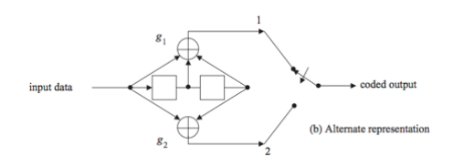

# I. Block Coding
## Problem 1.1
(7, 4) block code has the generator matrix G:
$$
G = \begin{bmatrix}
1 & 0 & 0 & 0 & 1 & 0 & 1 \\
0 & 1 & 0 & 0 & 1 & 1 & 1 \\
0 & 0 & 1 & 0 & 1 & 1 & 0 \\
0 & 0 & 0 & 1 & 0 & 1 & 1
\end{bmatrix}
$$
1. Find the parity-check matrix H and its transpose $H^T$
2. Given a data code $d = [1101]$, find the corresponding code-word c
3. Given that a code-word $c^∗ = [1101101]$ is received, verify if the code-word is receipt correctly.

# II. CONVOLUTIONAL CODING
## Problem 2.1.
Consider a convolutional coder $K=3, rate= 1/2$:

1. Initialize the encoder so that 0s only appear at its output. Trace the output bit sequence for the following input bit sequence after initialization: $11001011$
2. Determine the state diagram representing this encoder. Trace through the various states through which this encoder moves for the input sequence of (a), starting at the $00$ state. Show the output sequence obtained agrees with that found above.