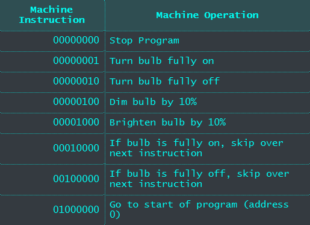
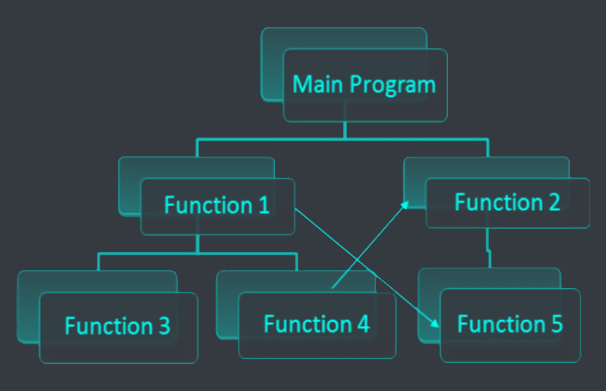
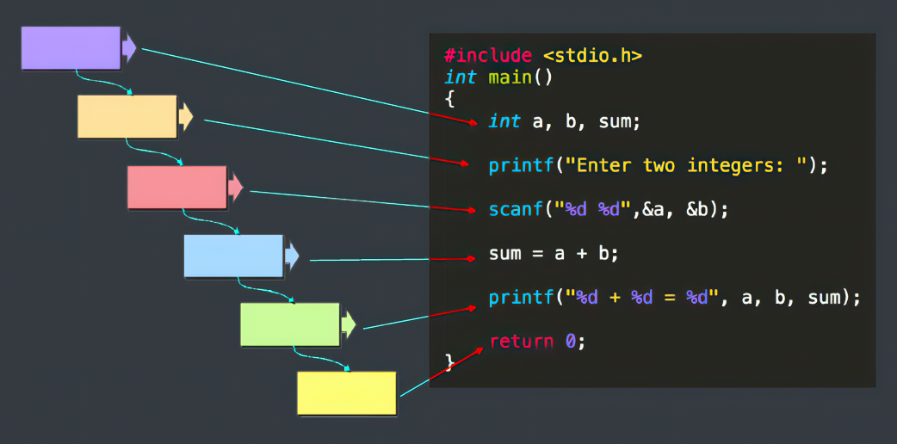
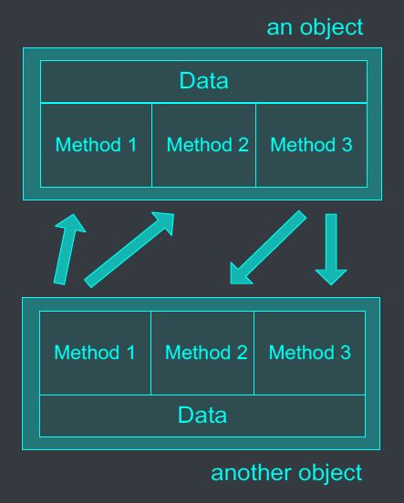
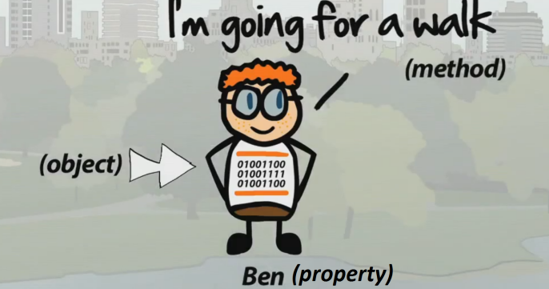
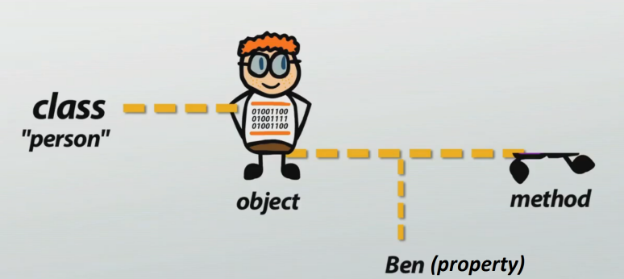



# 1. Contents
- Brief history of computer programming.
- Procedure programming.
- Object oriented programming.

# 2. Computer Programming
- A computer program is a list of *instructions* that tell the computer what to do.
- Example of a simple Python program:

```python
print("Hello World!")
```

# 3. Programming languages
- 3 main categories of programming languages:

## 3.1. Machine language
- Composed of binary digits (0s and 1s).
- IS the "native" language of the computer, but is very difficult to write and understand.



## 3.2 Assembly language
- Computer instructions are represented in symbolic codes.
- Needs to be translated into machine codes before processing.
- Example of assembly codes:

```assembly
MOV dx,msg2      ; Move the address of msg2 into dx
mov cx,msg2len   ; Move the length of msg2 into cx
call PrintString ; Call the PrintString procedure
```

- Assembly language is a step towards easier programming.

## 3.3 High-level languages
- Syntax is similar to human languages.
- Need to be compiled into machine codes for executing.
- Example of high-level languages:

```c
#include <stdio.h>
int main()
{
  printf("Hello World!");
  return 0;
}
```

- High-level language is a big step towards easier programming.

### 3.3.1. Classifying high-level languages
- Historically, high-level languages are divided into 2 categories:
  - Procedure programming languages.
  - Object oriented programming languages.

#### 3.3.1.1 Procedure programming languages
- Procedural programming is a programming paradigm, based on the concept of the procedure call, consists of a sequential execution of a series of instructions to be performed by the computer.

```c
#include <stdio.h>
int main()
{
  int a, b, sum;
  printf("Enter two numbers: ");
  scanf("%d %d", &a, &b);
  sum = a + b;
  printf("Sum = %d", sum);
  return 0;
}
```

- In procedural programming, computer programs divide into small parts called *procedures* or *functions*.





- Some procedure programming languages:
  - C
  - C++
  - Python
  - JavaScript
  - PHP
  - Ruby
  - ...

#### 3.3.1.2 Object oriented programming languages
- Object-oriented programming (OOP) is a programming paradigm based on the concept of "objects", which can contain data, in the form of fields, often known as properties; and code, in the form of procedures, often known as methods.
- Key idea: "The real world can be described as a collection of objects that interact."



- In OOP, object is a "thing" that includes both data (properties) and code (methods).



- In OOP languages, programmers create programs using "blueprints" of data models called *classes*.



- Some OOP languages:
  - Java
  - C#
  - Python
  - JavaScript
  - Perl
  - ...