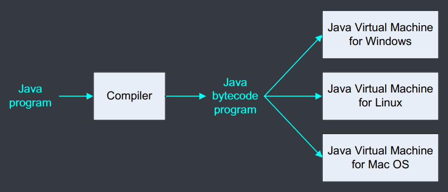
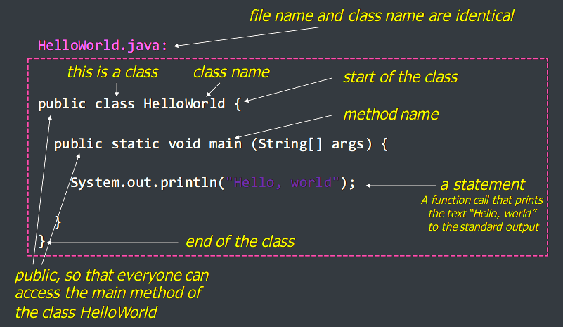
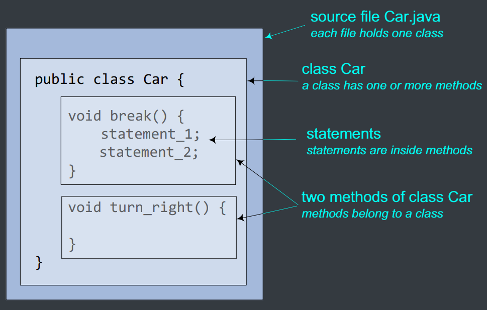
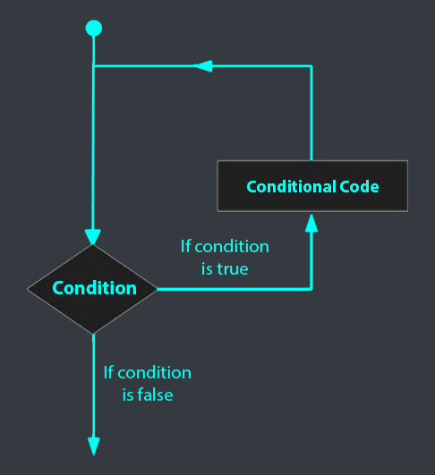
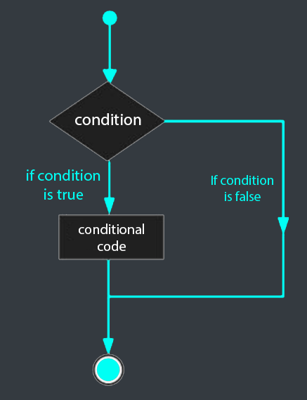



# 1. Brief history of Java
- 1991: developed by Sun Microsystems as a small programming language for embedded household devices.
  - Initially called Oak.
- Java 1.0.2 (1996), Java 1.1 (1997)
  - "Write once, ~~debug~~ run anywhere"
  - very slow
  - became popular with Web pages running Applets
- Java 2 (version 1.2 - 1.4 from 1988 - 2002)
  - much faster, powerful
  - 3 platforms: J2SE (desktop), J2EE (enterprise), J2ME (mobile)
- Java 5, 6, 7, 8 (version 1.5 - 1.8 in 2004, 2006, 2011, 2014)
  - more powerful

# 2. Java platforms and applications
- Desktop Applications - Java Standard Edition (J2SE)
  - Java Application: normal Java application running on desktops; console or GUI
  - Java Applet: embedded application running within Web browsers
- Server Applications - Java Enterprise Edition (J2EE)
  - Web Services, JavaServer Pages (JSP), Servlet
- Mobile Applications - Java Micro Edition (J2ME)

{}
Why Java?
{}

")

# 3. Writing your first Java program
## Installing Java
- Download and install Java Development Kit (JDK) from [Oracle](https://www.oracle.com/java/technologies/downloads/).
- Java Development Kit (JDK):
  - javac: compiler, convert Java source code into Java bytecode
  - java: interpreter, convert Java bytecode into machine code
  - javadoc: documentation generator
  - jdb: debugger

## Editor/IDE:
  - [VS Code](https://code.visualstudio.com/)
  - [JetBrains IntelliJ IDEA](https://www.jetbrains.com/idea/)
  - [Neovim](https://neovim.io/)

## Running Java Codes
- Java source code is compiled into byte-code
- Byte-code is executed in an interpreter environment, called Java Virtual Machine (JVM)



## Java Virtual Machine (JVM)
- Provide Java programs with a runtime environment.
- Normally, provided as a software: Java Runtime Environment (JRE)
- Depend on specific hardware and OS.
- Java platform: JVM + APIs (Application Programming Interfaces)

## Writing your first Java program
- In Java, everything goes in a **class**.
- When you run a program, you run a class:
  - load the class then start executing the class's main() method.
  - each Java program MUST have a main() method.



# 4. Compile and run your first Java program
```java
public class HelloWorld {
    public static void main(String[] args) {
        System.out.println("Hello World!");
    }
}
```
To compile `HelloWorld.java`:
```bash
javac HelloWorld.java
```
To run `HelloWorld.class`:
```bash
java HelloWorld
```

# 5. Code structure



## Application with more than one class
Two classes are stored in two separated files:
- `TestGreeting.java`
```java
public class TestGreeting {
    public static void main(String[] args) {
        Greeting greeting = new Greeting();
        greeting.sayHello();
    }
}
```
- `Greeting.java`
```java
public class Greeting {
    public void sayHello() {
        System.out.println("Hello World!");
    }
}
```

## Compile and run
- Compile:
```bash
javac TestGreeting.java
```
- Run:
```bash
java TestGreeting
```

# 6. Basic data types and operators

## Data types

| Data Type | Default Value | Default size |                      Range                      |
| :-------: | :-----------: | :----------: | :---------------------------------------------: |
|  boolean  |     false     |    1 bit     |                  true or false                  |
|   char    |   '\u0000'    |   2 bytes    |                   0 to 65,535                   |
|   byte    |       0       |    1 byte    |                   -128 to 127                   |
|   short   |       0       |   2 bytes    |     $-\frac{2^16}{2}$ to $\frac{2^16}{2}-1$     |
|    int    |       0       |   4 bytes    |     $-\frac{2^32}{2}$ to $\frac{2^32}{2}-1$     |
|   long    |      0L       |   8 bytes    |     $-\frac{2^64}{2}$ to $\frac{2^64}{2}-1$     |
|   float   |     0.0f      |   4 bytes    |  $1.4 \times 10^{-45}$ to $3.4 \times 10^{38}$  |
|  double   |     0.0d      |   8 bytes    | $4.9 \times 10^{-324}$ to $1.8 \times 10^{308}$ |

## Operators

### Unary operators
- `++` and `--` are used to increment and decrement a variable by 1.

### Binary operators
- Arithmetic operators: `+`, `-`, `*`, `/`, `%`
- Relational operators: `==`, `!=`, `>`, `<`, `>=`, `<=`
- Logical operators: `&&`, `||`, `!`
- Bitwise operators: `&`, `|`, `^`, `~`, `<<`, `>>`, `>>>`
- Assignment operators: `=`, `+=`, `-=`, `*=`, `/=`, `%=`, `<<=`, `>>=`, `&=`, `^=`, `|=`

### Ternary operators
- `condition ? expression1 : expression2`

# 7. Loop control and decision making

## Loop control statements
- `while` loop
- `do...while` loop
- `for` loop



### Example of `while` loop

```java
class WhileLoopExample {
  public static void main(String[] args) {
    int i = 10;
    while (i > 0) {
      System.out.println(i);
      i--;
    }
  }
}
```

### Example of `do...while` loop

```java
class DoWhileLoopExample {
  public static void main(String[] args) {
    int i = 10;
    do {
      System.out.println(i);
      i--;
    } while (i > 0);
  }
}
```

### Example of `for` loop

```java
class ForLoopExample {
  public static void main(String[] args) {
    for (int i = 10; i > 0; i--) {
      System.out.println(i);
    }
  }
}
```

## Decision making statements
- `if` statement
- `if...else` statement
- `switch` statement



### Example of `if` statement

```java
public class IfStatementExample {
  public static void main(String[] args) {
    int i = 10;
    if (i > 0) {
      System.out.println("i is positive");
    } else if (i < 0) {
      System.out.println("i is negative");
    } else {
      System.out.println("i is zero");
    }
  }
}
```

## What else we can do?
- `do-while`?
- `switch`?
- `int, long, float, double, boolean,...`?
- other Java basics?

$\to$ [Java Tutorial - w3schools.com](https://www.w3schools.com/java/default.asp)