

# I. Classes vs. Objects
## 1. Important OO concepts



- Object and Class
  - Object state and behavior
  - Object identity
  - Messages
- Encapsulation
- Inheritance
- Polymorphism
- Abstraction

<--->

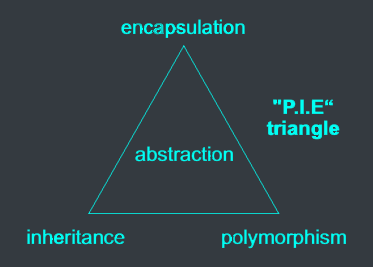



## 2. Java program



- `Greeting.java`

<--->

```java
public class Greeting {
    public static void main(String[] args) {
        System.out.println("Hi there!");
    }
}
```





- `TestGreeting.java`

<--->

```java
public class TestGreeting {
    public static void main(String[] args) {
        Greeting greeting = new Greeting();
        greeting.();
    }
}
```



- A Java program, <c-blue>when we write it</c-blue>, is a collection of classes.
- A Java program, <c-blue>when we run it</c-blue>, is a collection of objects. They do things (their methods) and ask other objects to do things (calling methods of others).
- A Java library contains predefined classes that we can use in our programs.

## 3. Objects
- Object is a <c-blue>"thing"</c-blue> that includes both *data* (<c-blue>*properties/attributes*</c-blue>) and functions (<c-blue>*methods/behaviors*</c-blue>). In OOP, objects can either do something or have something done to them.

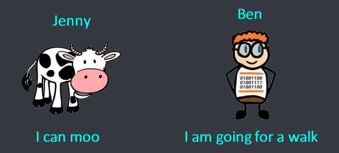

- Objects in OOP have 3 essential features:
  - State: what object jave.
  - Behavior: what object do in response to messages.
  - Identity: what make object unique.

### 3.1. State
- Defined by the <c-blue>attributes</c-blue> of the object and by the <c-blue>values</c-blue> of these attributes.
- Changes over time
  - "Name" attribute does not change over time.
  - "Age" attribute changes over time.


### 3.2. Behavior
- Behavior is <c-blue>what the object do</c-blue> in responding to a message

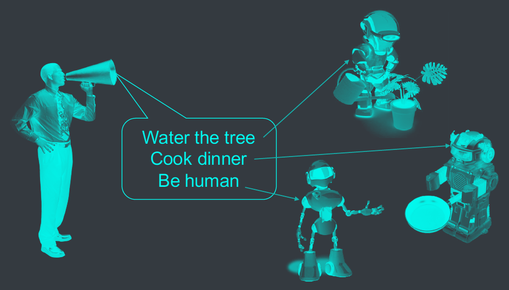

### 3.3. Identity
- Identity is what make object <c-blue>unique</c-blue>.
  - Defined by object address or object ID
- Used to distinguish between objects

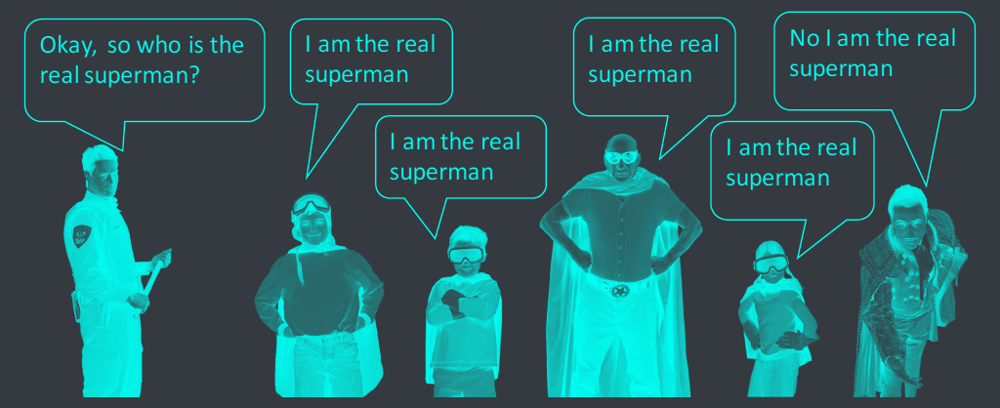

## 4. Classes
- A class is a <c-blue>blueprint/template</c-blue> that is used to construct objects.

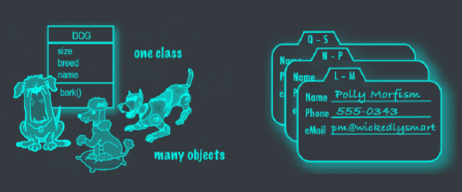

## 5. Class vs. Object
- Each object has the same <c-blue>structure</c-blue> and <c-blue>behavior</c-blue> as the class from which it was created.

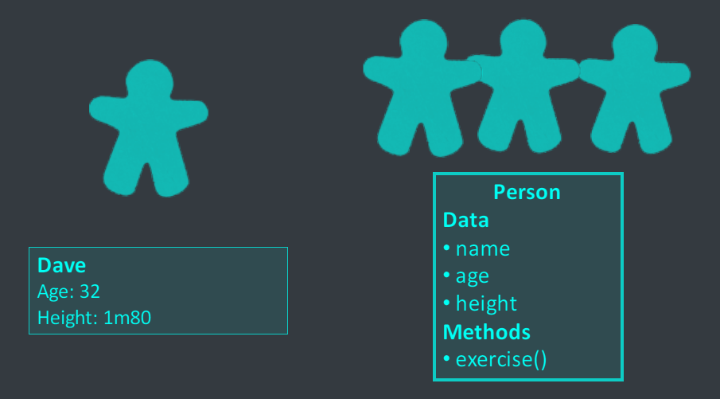

- Each object is <c-blue>instantiated</c-blue> from a class. That object is called an <c-blue>instance</c-blue> of the class.

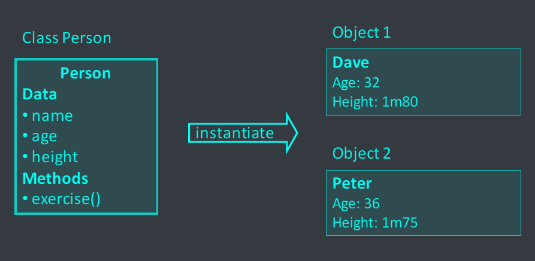

- In programming, relation between "<c-blue>Class and Object</c-blue>" is similar to relation between "<c-blue>Data type and variable</c-blue>"



- `Dog.java`

<--->

```java
class Dog {
  int size;
  String breed;
  String name;
  void bark() {
    System.out.println("Ruff! Ruff!");
  }
}
```





- `Person.java`

<--->

```java
class Person {
  String name;
  Date birthday;
  String address;

  Dog petDog;
}
```



# II. Designing a Class
## 1. Designing a class



- When you design a class, think about the object that will be created from that class.
  - things the object <c-blue>knows</c-blue> about itself
  - actions the object <c-blue>does</c-blue>

<--->

|       | ShoppingCart                                  | Button                                               |
| ----- | --------------------------------------------- | ---------------------------------------------------- |
| knows | cartContents                                  | label<br>color                                       |
| does  | addToCart()<br>removeFromCart()<br>checkOut() | setColor()<br>setLabel()<br>dePress()<br>unDepress() |





- Things the object knows about itself
  - $\to$ **instance variables**
  - $\to$ represent object <c-blue>*state*</c-blue>
- Action the object does
  - $\to$ **methods**
  - $\to$ represent object <c-blue>*behavior*</c-blue>

<--->

|                            | Song                                                 |      |
| -------------------------- | ---------------------------------------------------- | ---- |
| instance variables (state) | title<br>artist<br>duration                          | know |
| methods (behavior)         | setTitle()<br>setArtist()<br>setDuration()<br>play() | does |



## 2. Writing a class

### Write the class



```java
class Dog {
  int size;       //}
  String breed;   //} instance variables
  String name;    //}

  void bark() {                         //}
    System.out.println("Ruff! Ruff!");  //} a methods
  }                                     //}
}
```

<--->

| DOG                   |
| --------------------- |
| size<br>breed<br>name |
| bark()                |



### Write a tester class

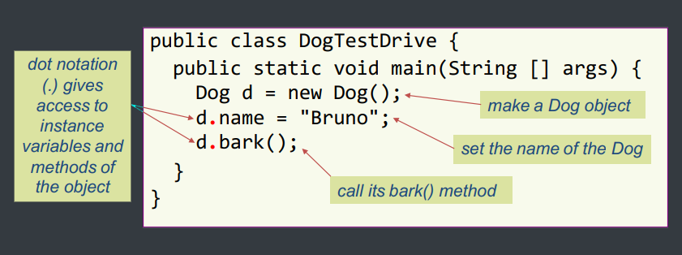

- Instance variable/methods belong to an object. Thus, when accessing them, you MUST specify <c-blue>which object</c-blue> they belong to.

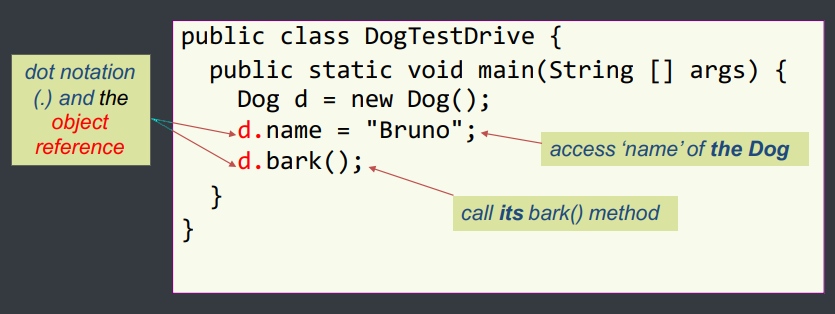

## 3. Object Reference




- 3 steps to declare, create & assign an object:
  1. Declare a reference variable of the object type.\
    <c-red>`Dog myDog`</c-red>`= new Dog();`
  2. Create an object of the object type.\
    `Dog mydog =`<c-red>`new Dog();`</c-red>
  3. Link the object and the reference\
    `Dog myDog`<c-red>`=`</c-red>`new Dog();`

<--->

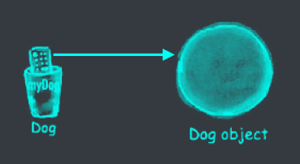




Dog&nbsp;<c-red>myDog</c-red>&nbsp;= new Dog();




Note:&nbsp;<c-red>Refernece</c-red>&nbsp;is not object!


## 4. Messaging beween objects
- Sending a message to and object is actually <c-blue>calling a method of the object</c-blue>.


d.bark();


- Syntax:

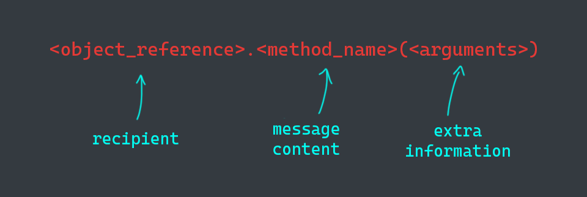

# III. Methods and Instance Variables
## 1. Methods - how objects behave



- Object have
  - <c-blue>state (instance variables)</c-blue>
  - <c-blue>behavior (methods)</c-blue>
- A method can use/change value of instance variable\
  $\to$ state of the object can be changed

<--->

|                                  | Song                                                 |       |
| -------------------------------- | ---------------------------------------------------- | ----- |
| instance<br>variables<br>(state) | title<br>artist<br>duration                          | knows |
| methods<br>(behavior)            | setTitle()<br>setArtist()<br>setDuration()<br>play() | does  |



## 2. State affects behavior and vice versa



```java
class Dog {
  int size;
  String breed;
  String name;

  void bark() {
    if (size > 14) { // state affects behavior: dogs of different sizes behave differently
      System.out.println("Ruff! Ruff!");
    } else {
      System.out.println("Yip! Yip!");
    }
  }

  void getBigger() {
    size = size + 5; // method changes state
  }
}
```

<--->

| DOG                   |
| --------------------- |
| size<br>breed<br>name |
| bark()<br>getBigger() |



```java
class DogTestDrive {
  public static void main(String[] args) {
    Dog one = new Dog(); // name: null, breed: null, size: 0
    one.size = 7;        // name: null, breed: null, size: 7
    Dog two = new Dog();
    two.size = 13;       // name: null, breed: null, size: 13

    two.bark();          // Yip! Yip!
    two.getBigger();     // name: null, breed: null, size: 18
    two.bark();          // Ruff! Ruff!

    one.bark();          // Yip! Yip!
  }
}
```

## 3. Instant variables vs. Local variables



<c-blue>Instance variables</c-blue>
- belongs to an&nbsp;<c-red>object</c-red>
- declared inside a class but NOT within a method
- have default values (0, 0.0, false, null,...)

```java
class Dog {
  int size;
  String name;
  // ...
  void getBigger() {
    size = size + 5;
  }
}
```

<--->

<c-blue>Local variables</c-blue>
- belong to an&nbsp;<c-red>method</c-red>
- declared within a method
- MUST be initialized before use

```java
public class DogTestDrive {
  public static void main(String[] args) {
    Dog d = new Dog();
    d.name = "Bruno";
    //...
    int size = d.size;
  }
}
```



# IV. Encapsulation and Information Hiding
## 1. Encapsulation
Group related things together
- Functions encapsulated instructions.
- Objects encapsulate data and functions.



- [x] Bad

```java
class Person {
  String name;
  Date birthday;
  String address;

  // about his/her dog
  String dogName;
  String dogBreed;
  int dogSize;
}
```

<--->

- [x] Better

```java
class Dog {
  int size;
  String breed;
  String name;
  //...
}

class Person {
  String name;
  Date birthday;
  String address;

  Dog petDog;
}
```



## 2. Information hiding
- Encapsulated to&nbsp;<c-blue>hide internal implementation details</c-blue>&nbsp;from outsiders:
  - Outsiders see only interfaces.
  - Programmers implement details of the system.




- What's wrong with this code?
  - It's allow for a supernatural dog.
    - $\to$&nbsp;<c-blue>no verification of size</c-blue>
- Object's data is exposed
  - $\to$&nbsp;<c-blue>size is accessed directly from outsider</c-blue>

<--->

```java
class Dog {
  int size;
  String breed;
  String name;
  //...
}

Dog d = new Dog();
d.size = -1;
```



- Exposed instance variables can lead to invalid states of object.
- What to do about it?
  - Write set methods (<c-blue>*setters*</c-blue>) for instance variables.
  - Force other codes to&nbsp;<c-blue>use the set methods instead of accessing them directly</c-blue>.

## 3. Rule of thumb
- Mark instance variables&nbsp;<c-blue>private</c-blue>.
- Make getters and setters and mark them&nbsp;<c-blue>public</c-blue>.


- Don't forget to check data&nbsp;<c-blue>validity</c-blue> in setters.

<--->

```java
class Dog {
  private int size;
  public int getSize() {
    return size;
  }
  public void setSize(int s) {
    if (s > 0) {
      size = s;
    }
  }
}
```



- Example of encapsulation

```java
public class Person {
  private String name;   // mark instance variables private
  private int age;
  public int getAge() {  // mark getters and make them public
    return age;
  }
  public String getName() {
    return name;
  }
  public void setAge(int newAge) {    // mark setters and make them public
    if (newAge > 0) {
      age = newAge;
    }
  }
  public void setName(String newName) {
    name = newName;
  }
}

public class PersonTest {
  public static void main(String[] args) {
    Person p = new Person();

    p.setName("John");   // Set attribute values from outsider
    p.setAge(20);

    System.out.println("Name" + p.getName());   // Retrieve attribute values from outsider
    System.out.println("Age" + p.getAge());
  }
}
```

## 4. Class Access Control
- Access modifiers:
  - <c-blue>public</c-blue>: accessible anywhere by anyone
  - <c-blue>private</c-blue>: only accessible within the current class
  - <c-blue>protected</c-blue>: accessible only to the class itself and to its subclasses or other classes in the same package
  - <c-blue>default</c-blue> (no keyword): accessible within the current package

## 4. Implementation vs. Interface
- DogTestDrive: a "<c-blue>client</c-blue>" of Dog class
- <c-blue>Implementation</c-blue>:
  - Data structures and code that implement object features.
  - Usually have complex inner workings,
  - Clients don't need to know.
- <c-blue>Interface</c-blue>:
  - The controls exposed to the "client".
- "Don't expose <c-blue>internal data structure</c-blue> to end users or client modules"