

# I. Data types
## 1. Variables and Types
- 2 kinds of variables: *primitive* and *object reference*.


- <c-red>primitive</c-red> variables hold fundamental data types (int, double, boolean, char, etc.)
<--->
```java
int x = 5;
double y = 3.14;
boolean z = true;
char c = 'a';
```


- <c-red>object reference</c-red> variables hold references to objects (similar to pointers)
<--->
```java
Dog d = new Dog();
d.name = "Fido";
d.bark();
```


## 2. Primitive Data Types
- 3 basic categories:
  - Numerical: `byte`, `short`, `int`, `long`, `float`, `double`
  - Logical: `boolean` (true or false)
  - Character: `char`

$\to$ Primitive data are&nbsp;<c-red>NOT</c-red>&nbsp;objects.

- <c-red>wrapper type</c-red>&nbsp;in order to treat primitive values as objects
  - `Byte`, `Short`, `Integer`, `Long`, `Float`, `Double`, `Boolean`, `Character`
    - Integer count = new Integer(5);
  - Provide utility functions: `parseInt()`, `toString()`, `valueOf()`, etc.

| Primitive Type |  Size   |       Min Value        |       Max Value       | Wrapper Type |
| :------------: | :-----: | :--------------------: | :-------------------: | :----------: |
|     `char`     | 16 bits |       `'\u0000'`       |      `'\uffff'`       | `Character`  |
|     `byte`     | 8 bits  |         $-128$         |         $127$         |    `Byte`    |
|    `short`     | 16 bits |        $-32768$        |        $32767$        |   `Short`    |
|     `int`      | 32 bits |       $-2^{31}$        |      $2^{31}-1$       |  `Integer`   |
|     `long`     | 64 bits |       $-2^{63}$        |      $2^{63}-1$       |    `Long`    |
|    `float`     | 32 bits | $1.4 \times 10^{-45}$  | $3.4 \times 10^{38}$  |   `Float`    |
|    `double`    | 64 bits | $4.9 \times 10^{-324}$ | $1.8 \times 10^{308}$ |   `Double`   |
|   `boolean`    |  1 bit  |        `false`         |        `true`         |  `Boolean`   |

# II. Objects
## 1. Object References - Controlling Objects

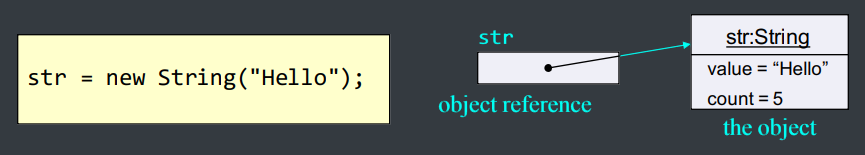

- There is actually no such thing as an *<c-red>object</c-red> variable*
- There's only ***object&nbsp;<c-red>reference</c-red>&nbsp;variables***
- An object reference variable represents a way to access an object, something like a pointer.
- Think of an object reference as a&nbsp;<c-red>remote control</c-red>.

## 2. Object References

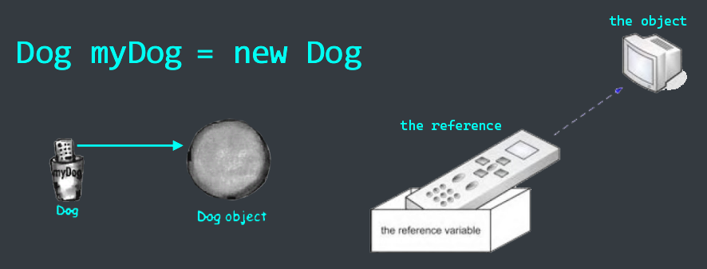

{}
<c-red>Remind: **References are not objects!**</c-red>
{}

## 3. Object Equality
- "<c-red>==</c-red>" and "<c-red>!=</c-red>" compares references (not objects) to see if they are referring to the same object.


```java
Integer b = new Integer(10);
Integer c = new Integer(10);
Integer a = b;
```
<--->
$\to$ `a == b` is `true` and `a == c` is `false`


- Use the&nbsp;<c-red>equals()</c-red> method to see if two objects are equal.
```java
Integer b = new Integer(10);
Integer c = new Integer(10);
if (b.equals(c)) {
    System.out.println("b and c are equal");
}
```

Method equals()

- <c-red>Pre-defined classes</c-red>: ready to use
<--->
```java
Integer m1 = new Integer(10);
Integer m2 = new Integer(10);
System.out.println(m1.equals(m2)); // true
```



- <c-red>User-defined classes</c-red>: need to be defined by the programmer, otherwise it will always return `false`
<--->
```java
class MyInteger {
  private int value;
  public boolean equals (Object other) {
    if (!(other instanceof MyInteger)) return false;
    return (value == ((MyInteger)other).value);
  }
}
```


## 4. Object's life on memory
- Objects are created in the&nbsp;<c-red>heap memory</c-red>
  - a constructor is automatically called to initialize it
  - the set of parameters determine which constructor to call and the initial value of the object


```java
Book b = new Book()
Book c = new Book("Harry Potter");
```
<--->





- When an object is no longer used, i.e. there's no more reference to it, it will be collected and freed&nbsp;<c-red>automatically by Java garbage collector</c-red>
```java
Book b = new Book();
Book c = new Book();
b = c;
```
<--->

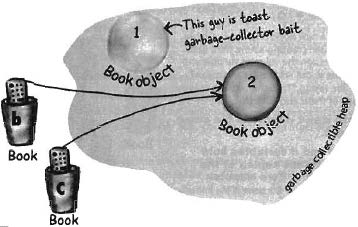




```java
Book b = new Book();
Book c = new Book();
b = c;
c = null;
```
<--->

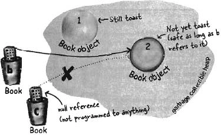



- In Java, un-used objects are&nbsp;<c-red>automatically freed</c-red>&nbsp;by the Java Virtual Machine (JVM), not manually by programmers.

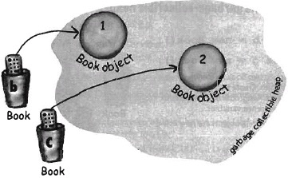

# III. Instance variables vs local variables

Instance variables
- belong to an&nbsp;<c-red>object</c-red>
- located inside the object in the heap memory
- has the same lifetime as the object
<--->
Local variables
- belong to a&nbsp;<c-red>method</c-red>
- located inside the method's frame in the stack memory
- has the same lifetime as the method call


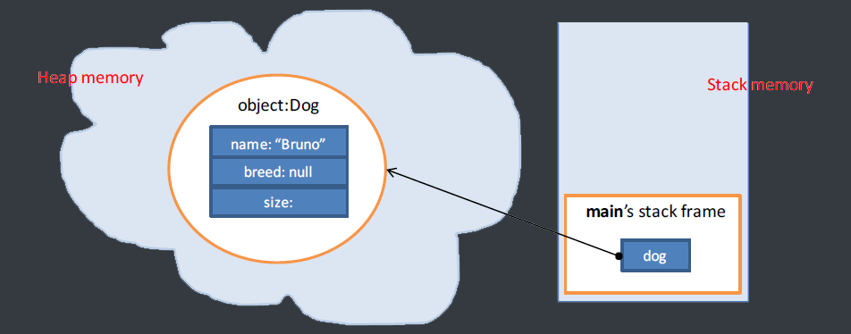


```java
class Dog {
  int size;
  String breed;
  String name;
}
```
<--->
```java
public class DogTestDrive {
  public static void main(String[] args) {
    Dog dog = new Dog();
    dog.name = "Bart";
    dog.bark();
  }])
}
```


# IV. Parameters
## 1. Parameter passing & return value
- Parameter: used in method definition of declaration
- Argument: used in method call


```java
class Dog {
  // ...
  void bark(int numOfBarks) { // numOfBarks is a parameter
    while (numOfBarks > 0) {
      System.out.println("Ruff!");
      numOfBarks--;
    }
}
```
<--->
```java
Dog d = new Dog();
d.bark(3); // 3 is an argument
```


- The return value is copied to the stack, then to the variable that get assigned (<c-red>dogSize</c-red>&nbsp;in the example below)

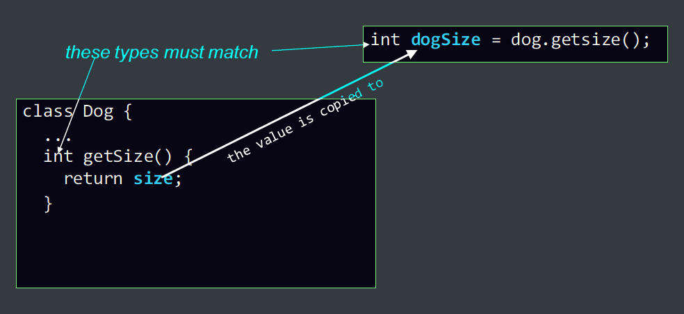

- 2 kinds of parameters:
  - Primitive type:
    - parameter's&nbsp;<c-red>value is copied</c-red>
    - parameters can be constant, e.g. 10, "abc", ...
  - Object references:
    - the reference's value is copied,&nbsp;<c-red>NOT</c-red>&nbsp;the referred object

## 2. Parameter passing of primitive types

- <c-red>pass-by-copy</c-red>
  - Argument's content is copied to the parameter

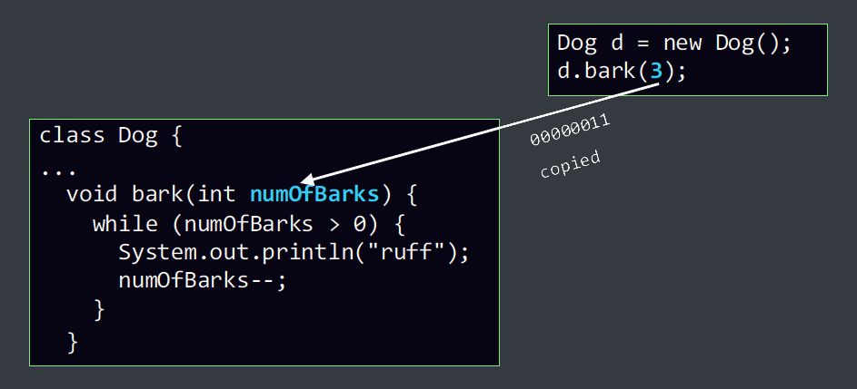


- A parameter is effectively a&nbsp;<c-red>local variable</c-red>&nbsp;that is initialized with the value of the corresponding argument

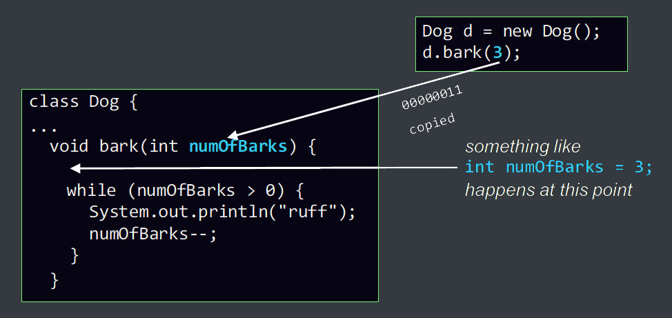

## 3. Parameter passing of object references

- Object reference's value is copied,&nbsp;<c-red>NOT</c-red>&nbsp;the referred object

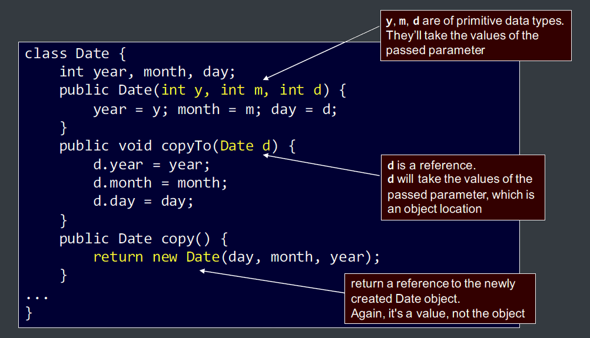

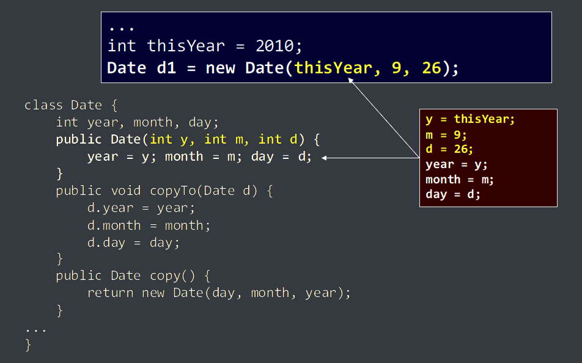

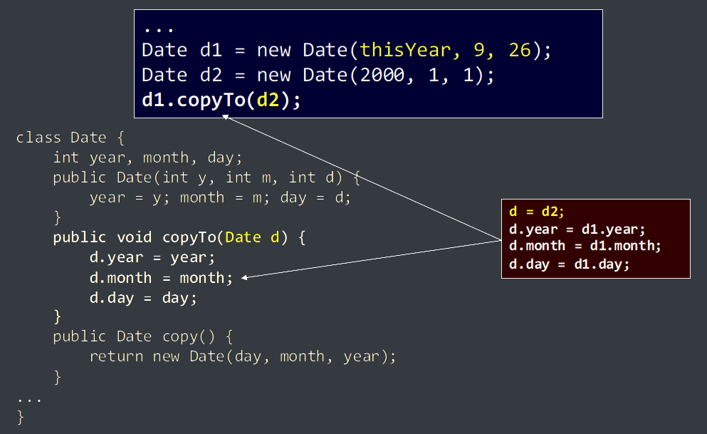

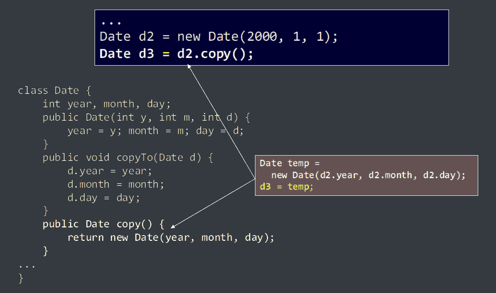

# IV. Methods
## 1. Method overloading
- Methods of the same class can have the *same name* but *different parameters list*

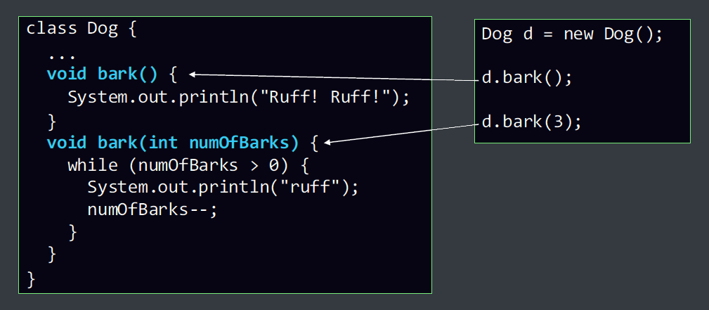

## 2. Remind
Instance variables/methods belong to an object. Thus, when accessing them, you MUST specify&nbsp;<c-red>which object</c-red>&nbsp;they belong to.

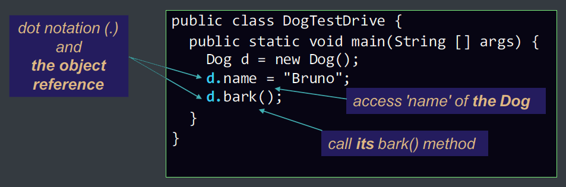

## 3. How about this case?
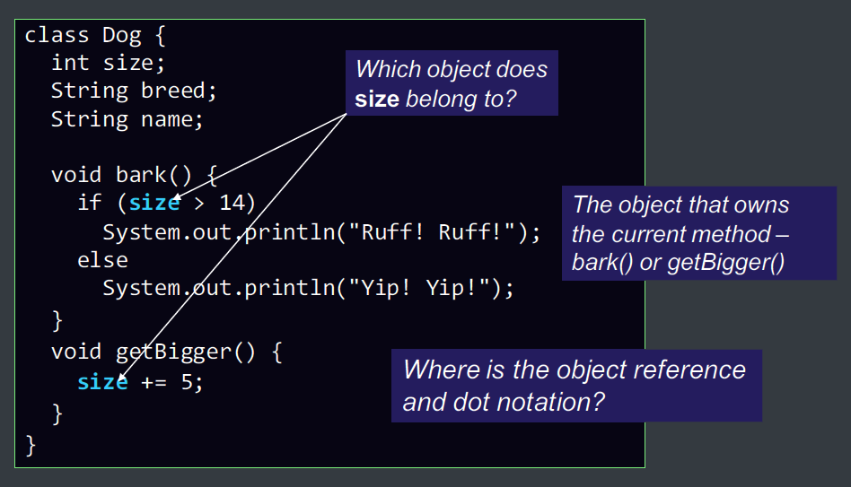

# V. The "this" reference

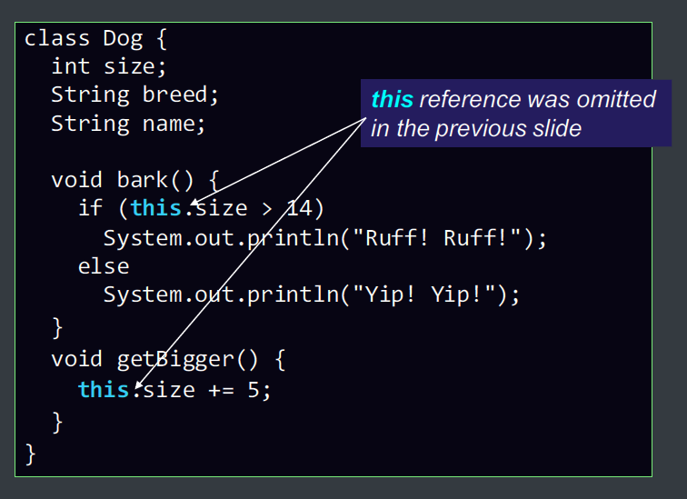

- <c-red>this<c-red>: the object reference referring to the&nbsp;<c-red>current</c-red>&nbsp;object - the owner of the&nbsp;<c-red>current</c-red>&nbsp;method.
- usage of&nbsp;<c-red>this</c-red>:
  - explicit reference to object's attributes and methods.
    - often omitted
  - parameter passing and return value.
  - calling constructor from inside another constructor.

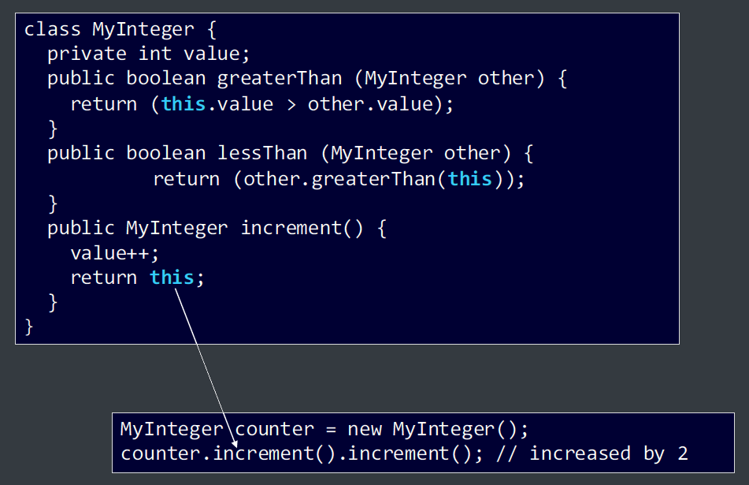

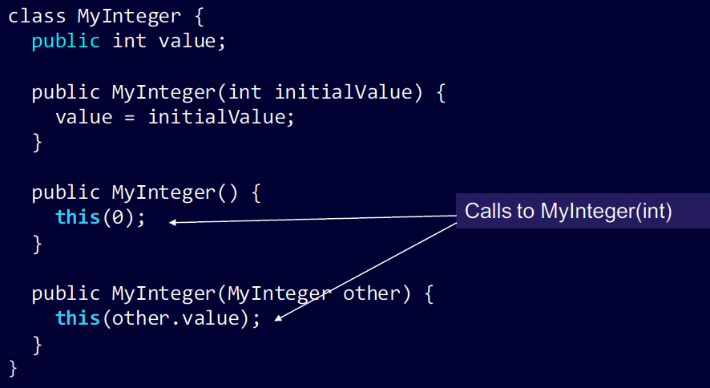

# VI. Input/Output
- In Java, input and output are often performed on&nbsp;<c-red>data streams</c-red>.
- A stream is a sequence of data. There are 2 kinds of streams:
  - <c-red>InputStream</c-red>: to read data from a source.
  - <c-red>OuputStream</c-red>: to write data to a destination.
- Most I/O classes are supported in&nbsp;</c-red>java.io</c-red>&nbsp;package.

## 1. Standard I/O
- 3 stream objects are&nbsp;<c-red>automatically</c-red>&nbsp;created when a Java program begins executing:
  - <c-red>System.out</c-red>: standard output stream object
    - enables a program to output data to the console
  - <c-red>System.err</c-red>: standard error stream object
    - enables a program to output error messages to the console
  - <c-red>System.in</c-red>: standard input stream object
    - enables a program to read data from the keyboard

## 2. Standard output and error streams
- <c-red>System.out</c-red> and <c-red>System.err</c-red> can be used&nbsp;<c-red>directly</c-red>
  - System.out.println("Hello world!");
  - System.err.println("Error message");

### Standard input
- <c-red>System.in</c-red>
  - An InputStream object
  - must be wrapped before use
- <c-red>Scanner</c-red>: wrapper that supports input of primitive types and character strings
  - `next()`: get the next word separated by white spaces
  - `nextInt(), nextDouble(), ...`: get the next data item
  - `hasNext(), hasNextInt(), hasNextDouble(), ...`: check if there are data left to be read

### Example

```java
// import the wrapper class
import java.util.Scanner;
// ...
// create Scanner to get input from keyboard
Scanner scanner = new Scanner(System.in);
// read a word
String word = scanner.next();
// read an integer
int number = scanner.nextInt();
// read a series of big integers
while (scanner.hasNextLong()) {
  long bigNumber = scanner.nextLong();
  // ...
}
```

### Input from a text file
```java
import java.util.Scanner;
import java.io.FileInputStrem;
import java.io.IOException;
// ...
public static void main(String[] args) {
  try {
    // create Scanner to get input from a text file
    Scanner scanner = new Scanner(new FileInputStream("input.txt")); // open the file
    String word = scanner.next(); // read a word
    int number = scanner.nextInt(); // read an integer
    while (scanner.hasNextLong()) { // read a series of big integers
      long bigNumber = scanner.nextLong();
      // ...
    scanner.close(); // close the file
    }
  } catch (IOException e) { // to deal with exceptions such as file not found
    System.err.println("Error: " + e.getMessage());
  }
}
```

### Writing to a text file
```java
import java.io.PrintWriter;
import java.io.FileWrite;
import java.io.IOException;
// ...
public static void main(String[] args) {
  int i = 1; long l = 10;
  try {
    // create a PrintWriter to write output to a file stream
    PrintWriter writer = new PrintWriter(new FileWriter("output.txt"));
    writer.println("Hello world!"); // write a line of text
    writer.close(); // close the file
  }
  catch (IOException e) { // to deal with exceptions such as file not found
    System.err.println("Error: " + e.getMessage());
  }
}
```

### Command-line parameters
```java
// CmdLineParas.java: read all command-line parameters
public static void main(String[] args) {
  for (int i = 0; i < args.length; i++) {
    System.out.println(args[i]);
  }
}
```

# VII. Package
- A package is a grouping of related types (classes, interfaces,...) to protect access or manage namespaces.
- 2 popular packages:
  - <c-red>java.lang</c-red>: contains the fundamental classes of the Java language
  - <c-red>java.io</c-red>: contains classes for input/output operations

## Create a package
- Task: create a package named "<c-red>messagePkg</c-red>" containing 2 following classes:

```java
public class HelloMessage {
  public void sayHello() {
    System.out.println("Hello world!");
  }
}
```
<--->
```java
public class WelcomeMessage {
  public void sayWelcome() {
    System.out.println("Welcome to Java!");
  }
}
```


- Step 1:&nbsp;<c-red>declare</c-red>&nbsp;the package which the class belongs to

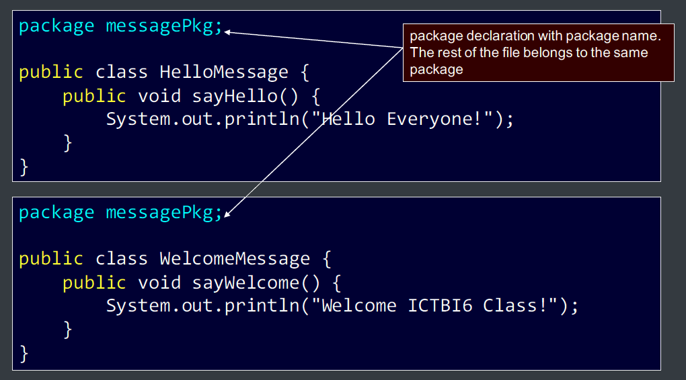

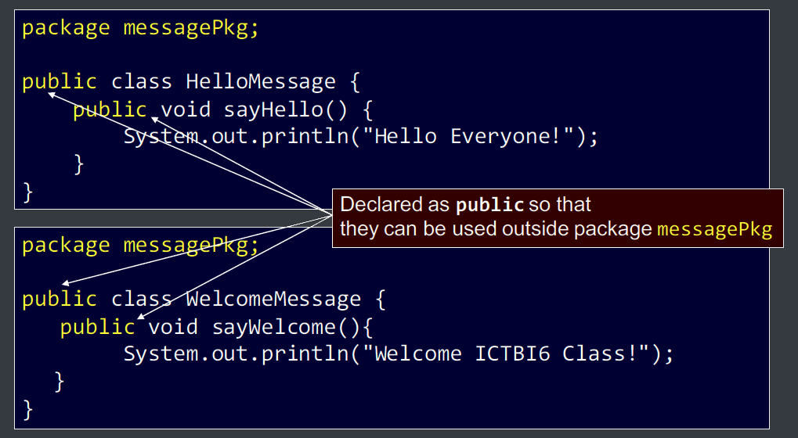

- Step 2:&nbsp;<c-red>compile</c-red>&nbsp;
```bash
javac -d <destination_folder> file_name.java
```
- Example:
```bash
javac -d . HelloMessage.java
javac -d . WelcomeMessage.java
```
or
```bash
javac -d . HelloMessage.java WelcomeMessage.java
```

## Use a package
- 2 ways:


Use the **import** statement to make the name(s) in the package available, once for all
```java
import messagePkg.HelloMessage;
public class Hello {
  public static void main(String[] args) {
    HelloMessage hello = new HelloMessage();
    hello.sayHello();
  }
}
```
<--->
Use the **fully qualified name** to refer to the class
```java
public class Hello {
  public static void main(String[] args) {
    messagePkg.HelloMessage hello = new messagePkg.HelloMessage();
    hello.sayHello();
  }
}
```


- Compile:
```
javac Hello.java
```
- Run:
```
java Hello
```