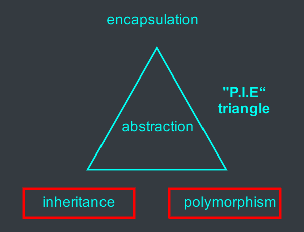



# Important OO concepts



# What is inheritance?
- Inheritance is a relationship where a child class&nbsp;<c-red>inherits</c-red>&nbsp;members, i.e. instance variables and methods, from a parent class.
  - The child class is called a&nbsp;<c-red>subclass</c-red>&nbsp;or&nbsp;<c-red>derived class</c-red>.
  - The parent class is called a&nbsp;<c-red>superclass</c-red>&nbsp;or&nbsp;<c-red>base class</c-red>.


- In inheritance:
  - The superclass is more&nbsp;<c-red>abstract</c-red>.
  - The subclass is more&nbsp;<c-red>specific</c-red>.


- In inheritance, the subclass&nbsp;<c-red>specializes</c-red>&nbsp;the superclass:
  - It can add new variables and methods.
  - It can override inherited methods.


# Inheritance declaration
- In Java,&nbsp;<c-red>extends</c-red>&nbsp;keyword is used to express inheritance relationship between two classes.
- Syntax:
  ```java
  class Parent {
    // ...
  }
  class Child extends Parent {
    // ...
  }
  ```

## Example



```java
class Animal {
  String name;
  void makeNoise() {
    System.out.println("Hmm");
  }
}

class Cow extends Animal {
  boolean givesMilk; // newly added attribute
  void makeNoise() { // overridden method
    System.out.println("Moo");
  }
}

class Dog extends Animal {
  void chaseCats() { // newly added method
    System.out.println("I'm coming, cat!");
  }
}
```

<--->




# Overriding - which method is called?


# Rules for overriding
- The principle:&nbsp;<c-red>the subclass must be able to do anything the superclass declares</c-red>.
- Overriding rules:
  - Parameter types must be the same.
    - whatever the superclass takes as an argument, the subclass overriding the method must be able to take that same argument.
  - Return types must be compatible.
    - whatever the superclass declares as return type, the subclass must return the same type of a subclass type.
  - The method can't be less accessible.
    - a public method cannot be overridden by a private version.

# Wrong overriding




<--->




# IS-A & HAS-A relationships


- Triangle IS-A Shape.
- Cow IS-An Animal.
- Dog IS-An Animal.

$\to$ Inheritance


<--->

- House HAS-A Kitchen.
- Kitchen HAS-A Sink.
- Kitchen HAS-A Stove.

$\to$ Composition




- Composition - "HAS-A" relationship
  - the new class is composed of objects of existing classes.
  - reuse the functionality of the existing class, but&nbsp;<c-red>not its form</c-red>
- Inheritance - "IS-A" relationship
  - create a new class as a&nbsp;<c-red>*type of* an existing class</c-red>.
  - new class absorbs the existing class's members and extends them with new of modified capabilities.

# Protected access level

| Modifier          | same class | same package | subclass | other package |
| ----------------- | :--------: | :----------: | :------: | :-----------: |
| private           |     Y      |              |          |               |
| package (default) |     Y      |      Y       |          |               |
| protected         |     Y      |      Y       |    Y     |               |
| public            |     Y      |      Y       |    Y     |       Y       |

<c-red>Protected attributes/methods</c-red>&nbsp;of a superclass are directly accessible from inside its subclasses.

```java
public class Person {
  protected String name;
  protected String birthday;

  protected String getName() {
    // ...
  }
}
```
---
```java
public class Employee extends Person {
  protected int salary;
  public String toString() {
    String s;
    s = name + "," + birthday; // subclass can directly access superclass's protected attribute
    s = s + "," + salary;
    return s;
  }
  public String toString2() {
    String s;
    s = getName() + "," + birthday; // subclass can directly access superclass's protected method
    s = s + "," + salary;
    return s;
  }
}
```
# Design an inheritance structure



<--->



- Which one should be subclass/superclass?
- Or, should they both be subclasses to some *other* class?
- How should you design an inheritance structure?

## Case study
- Having a number of animals of different species: tigers, lions, wolves, dogs, hippos, cats,...

$\to$ how to design the corresponding inheritance structure?

- <c-red>Step 1<c-red>: figure out the&nbsp;<c-red>common</c-red>&nbsp; abstract characteristic that all animals have:


- instance variables
  - food
  - hunger
  - location
<--->
- methods
  - makeNoise()
  - eat()
  - sleep()
  - roam()


- <c-red>Step 2<c-red>: design a class that represents all common states and behaviors.


- <c-red>Step 3<c-red>: decide if a subclass needs any behaviors that are specific to that particular subclass.


- <c-red>Step 4<c-red>: look for more inheritance levels: more common behaviors in subclasses.


# Types of inheritance structure


# Important OO concepts


# What is polymorphism?
- Polymorphism means&nbsp;<c-red>"exist in many forms"</c-red>.
- Object polymorphism: objects of subclasses can be treated as if they are all objects of the superclass.
- Example


```java
Dog dog = new Dog();
Animal dog = new Dog();
```
<--->



$\to$ A Dog object can be seen as an Animal object as well.

# Polymorphism example

- Normally,\
  Dog dog = new Dog();
<--->




- With polymorphism:\
  Animal dog = new Dog();
<--->



$\to$ The reference type can be a superclass of the actual object type.

- An array is declared of type animal. It can hold objects of&nbsp;<c-red>Animal's subclasses</c-red>.


Animal[] animals = new Animal[5];

// We put objects of any subclasses of Animal in the Animal array
animals[0] = new Dog();
animals[1] = new Cat();
animals[2] = new Hippo();
animals[3] = new Wolf();
animals[4] = new Lion();

// We can loop through the array and call Animal-class methods
for (int i = 0; i < animals.length; i++) {
  // the cat runs Cat's version of makeNoise(), the dog runs Dog's version,...
  animals[i].makeNoise();
}


# Polymorphic arguments and return types

- Parameters of type Animal can take arguments of any subclasses of Animal

```java
class Pet {
  public void giveVaccine(Animal a) { // it takes arguments of types Dog and Cat
    a.makeNoise();
  }
}
```
---
```java
Pet p = new Pet();
Dog d = new Dog();
Cat c = new Cat();
p.giveVaccine(d); // the Dog's MakeNoise() is called
p.giveVaccine(c); // the Cat's MakeNoise() is called
```
---

class Animal {
  String name;
  //...
  public void makeNoise() {
    System.out.println("Hmm.");
  }
  public void introduce() {
    makeNoise(); // polymorphism: the same message "makeNoise" is interpreted differently, depending on the type of the owner object.
    System.out.println("I'm " + name);
  }
}
class Cat extends Animal {
  // ...
  public void makeNoise() {
    System.out.println("Meow...");
  }
}
class Cow extends Animal {
  // ...
  public void makeNoise() {
    System.out.println("Moo...");
  }
}



```java
Animal pet1 = new Cat("Tom Cat");
Animal pet2 = new Cow("Mini Cow");
pet1.introduce();
pet2.introduce();
```
<--->
```bash
Meow...I'm Tom Cat
Moo...I'm Mini Cow
```


# Why care about polymorphism?
- With polymorphism, you can write code that doesn't have to change when you introduce new subclass types into the program.


```java
class Animal {
  //...
  public void makeNoise() {
    System.out.println("Hmm.");
  }
  public void introduce() {
    makeNoise();
    System.out.println("I'm " + name);
  }
}
```
<--->
```java
class Pig extends Animal {
  public void makeNoise() {
    System.out.println("Oink...");
  }
}
```
---
```java
class Duck extends Animal {
  public void makeNoise() {
    System.out.println("Quack...");
  }
}
```


 method.

# Object class
- All classes are&nbsp;<c-red>subclasses</c-red>&nbsp;to the class Object.



- Inherited methods:
  - Class getClass()
  - int hashCode()
  - boolean equals() // equals() and toString() should be overridden to work properly
  - String toString()

```java
Car c1 = new Car();
Car c2 = new Car();
System.out.println(c1.equals(c2)); // false
System.out.println(c1.getClass() + c1.hashCode()); // class Car 123456
System.out.println(c1.toString()); // Car@123456
```

<--->


