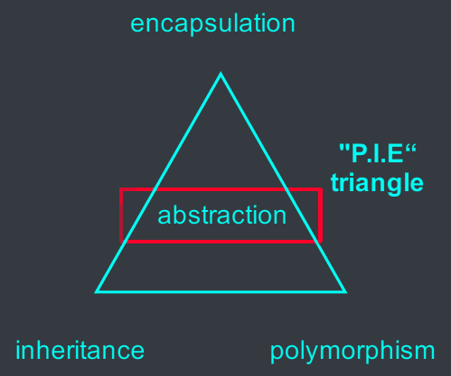
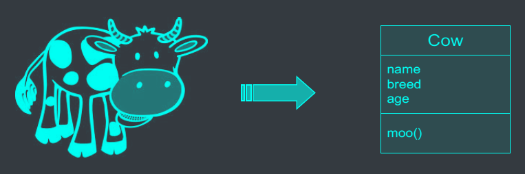
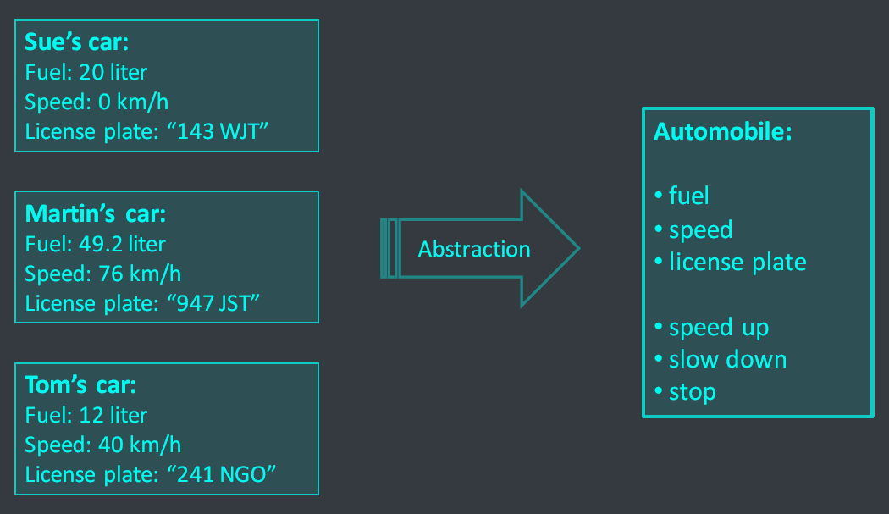
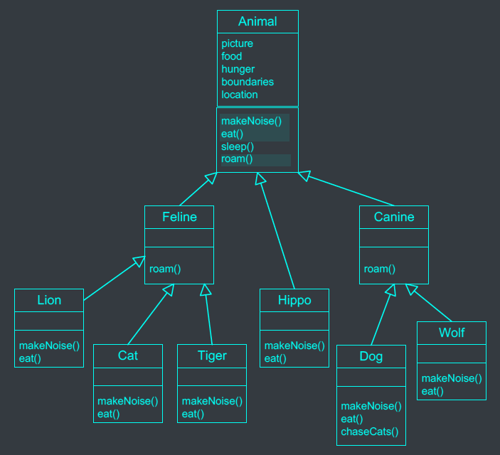
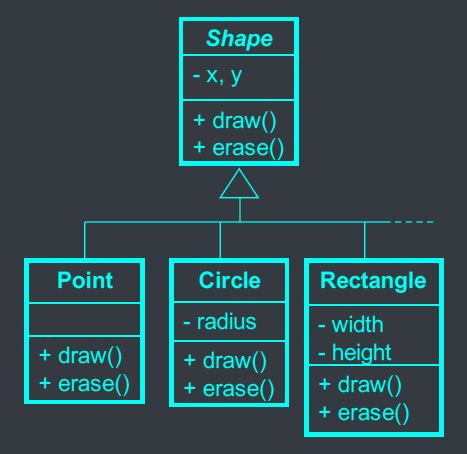
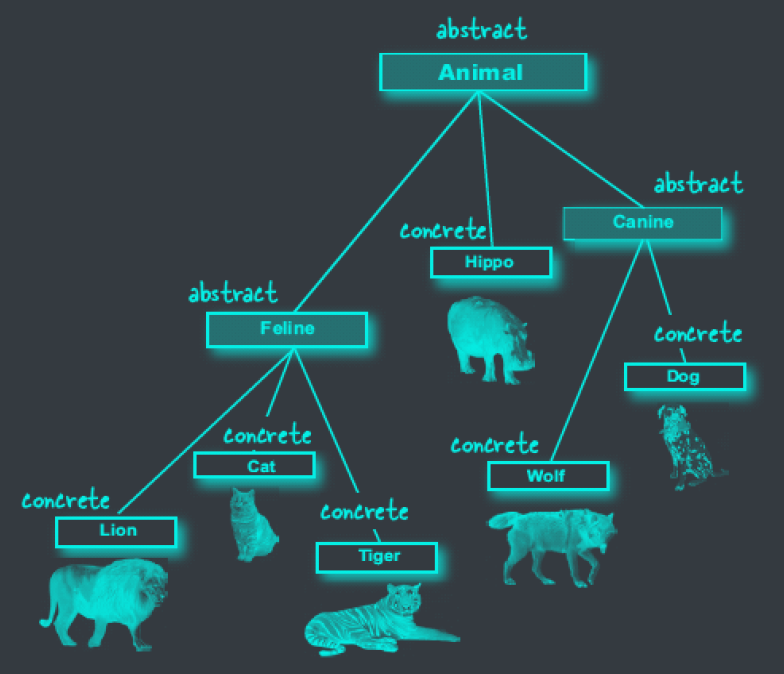



# Important OO Concepts



# What is Abstraction?



- Abstraction: simplify a complex system by breaking down into smaller, fundamental parts:
  - naming the parts
  - explaining their functionality



# Abstraction vs Inheritance design


```java
Dog d = new Dog();
Cat c = new Cat();
```
$\to$ We can imagine how Dog object and Cat object look like.
```java
Animal anim = new Animal();
```
$\to$ But, what does a&nbsp;<c-red>generic Animal object</c-red> look like?\
$\to$&nbsp;<c-red>Do we ever need an Animal object?</c-red>
<--->




- What does a&nbsp;<c-red>generic Shape object</c-red> look like?
- How to *draw()* it?
- <c-red>Do we ever need a Shape object?</c-red>
<--->



# Abstract classes
- Abstract classes present generic classes. Abstract classes are&nbsp;<c-red>**not**</c-red>&nbsp;instantiated.
- Why care about abstract classes?
  - We want Circle and Triangle objects, but&nbsp;<c-red>no Shape object</c-red>.
  - We want Dogs and Cats, but&nbsp;<c-red>no Animal objects</c-red>.
- Declare abstract classes with the keyword "<c-red>abstract</c-red>".

```java
public abstract class Animal {
  public void eat() {
    //...
  }
}
```

- In an abstract class:
  - The compiler will guarantee that&nbsp;<c-red>no instances</c-red>&nbsp;are created.
  - But&nbsp;<c-red>object references</c-red>&nbsp;of abstract class types are&nbsp;<c-red>allowed</c-red>.


```java
public abstract class Animal {
}
public class Dog extends Animal {
}
```
<--->
```java
Animal anim = new Animal(); // Error
Animal anim = new Dog(); // no error
```


# Abstract vs Concrete


- A class that is not abstract is called a&nbsp;<c-red>**concrete class**</c-red>.

How do we know when a class should be abstract?
  - mobile phone - abstract
  - smart phone - concrete
  - iPhone - abstract
  - iPhone 4 - concrete
<--->




# Abstract methods
- If Animal is an abstract class, how do we implement?
  - Animal.makeNoise() or Animal.eat()?
    ```java
    public void makeNoise() {
      System.out.println("Hmm");
    }
    ```
  - If there any&nbsp;<c-red>generic implementation</c-red>&nbsp;that is *useful*?
- For this, wew mark those&nbsp;<c-red>generic</c-red>&nbsp;methods as "<c-red>**abstract methods**</c-red>" with no body.
  ```java
  public abstract class Animal {
    public abstract void makeNoise(); // No method body! End it with a semicolon.
  }
  ```
- Abstraction rules:
  - An&nbsp;<c-red>abstract method</c-red>&nbsp;mut belong to an&nbsp;<c-red>abstract class</c-red>. A concrete class cannot contains an abstract method.
  - An abstract class means that it must be&nbsp;<c-red>extended</c-red>.
  - An abstract method means that it must be&nbsp;<c-red>overridden</c-red>.
  - A concrete subclass must have all the&nbsp;<c-red>inherited abstract methods</c-red>&nbsp;implemented.

```java
public abstract class Shape {
  protected int x, y;
  Shape (int _x, int -y) {
    x = _x;
    y = _y;
  }
  public abstract void draw();
  public abstract void erase();
  public void moveTo(int _x, int _y) {
    erase();
    x = _x;
    y = _y;
    draw();
  }
}
```
---
```java
public class Circle extends Shape {
  private int radius;
  public Circle(int _x, int _y, int _radius) {
    super(_x, _y);
    radius = _radius;
  }
  public void draw() {
    System.out.println("Drawing a circle at (" + x + ", " + y + ")");
  }
  public void erase() {
    System.out.println("Erasing a circle at (" + x + ", " + y + ")");
  }
}