

# What is an Operating System?
- A program that acts as an intermediary between a
user of a computer and the computer hardware.
- Operating system goals:
  - Execute user programs and make solving user problems easier.
  - Make the computer system convenient to use.
  - Use the computer hardware in an efficient manner.

# Abstract view of Components of Computer
{}
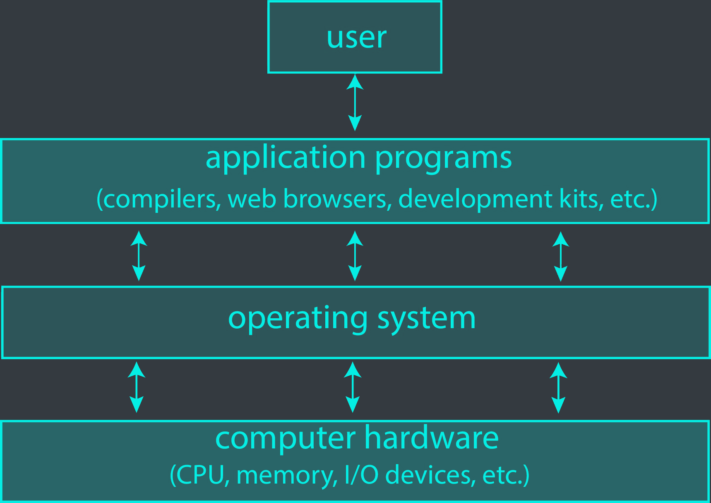
{}

# Computer system structure
- Computer system can be divided into 4 components:
  - Hardware: provides basic computing resources: CPU, memory, I/O devices, etc.
  - Operating system: controls and coordinates use of hardware among various application and users.
  - Application programs: solve the computing problems of the users: Word processors, compilers, web browsers, database systems, video games,...
  - Users: people, machines, other computers.

# Computer system organization
- Computer-system operation
  - One or more CPUs, device controllers connect through common bus providing access to shared memory.
  - Concurrent execution of CPUs and devices competing for memory cycles.

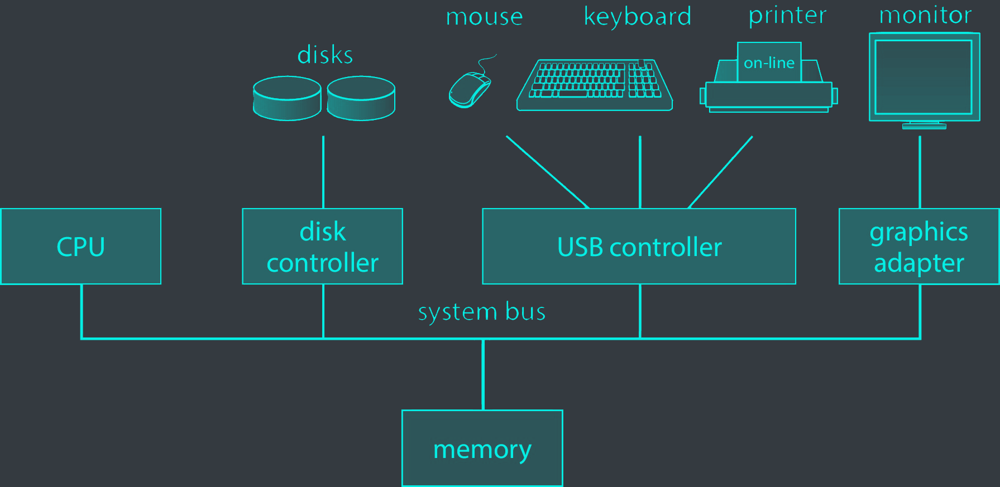

# Computer-System operation
- <c-blue>I/O devices</c-blue> and the CPU can execute concurrently.
- Each device has a controller that manages it, with a local buffer and a <c-blue>device driver</c-blue> to provide APIs.
- The device driver moves data between main memory and the local buffer, which is generally mapped in memory.
- I/O occurs between the device and the local buffer of the controller.
- The device controller signals the completion of its operation to the CPU through an <c-blue>interrupt</c-blue>.

# Common functions of interrupt
- Interrupts transfer control to the interrupt service routine, typically through the <c-blue>interrupt vector</c-blue>, which holds the addresses of all the service routines.
- The interrupt architecture must save the address of the interrupted instruction so that execution can return to it after the interrupt is handled.
- An <c-blue>interrupt-driven</c-blue> OS relies on interrupts to perform its functions.

# Interrupt:
## Timeline

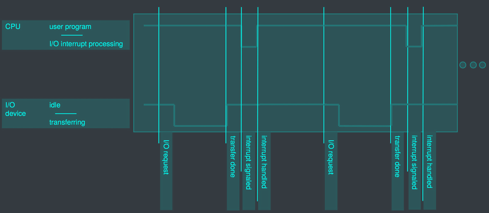

## I/O cycle

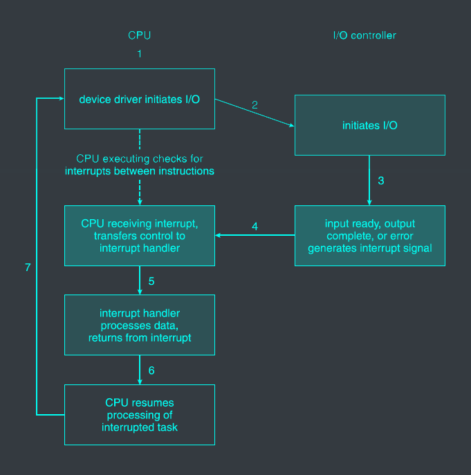

# 2 methods for handling I/O
- Non-blocking: after I/O starts, control returns to user program without waiting for I/O to complete.
- Blocking: after I/O starts, control does not return to user program until I/O completes.
- Process blocking is implemented by the OS.

# Memory
- Main memory: storage media that the CPU can access directly.
  - Typically volatile (contents lost when power is off).
  - Typically random-access memory in the form of DRAM (Dynamic Random Access Memory).
- Secondary storage: extension of main memory that provides large amounts of non-volatile storage, but is slower than main memory.

# Secondary storage
- HDD (Hard Disk Drive): rigid metal or glass platters covered with magnetic recording material.
  - Disk surface is logically divided into tracks and subdivide into sectors.
  - The disk controller determines the logical interaction between the disk and the computer.
- NVM (Non-Volatile Memory) devices: faster than HDD, non-volatile:
  - Various technologies: NAND flash, 3D XPoint, etc.
  - Becoming more popular due to price drop and performance increase.

# Memory hierarchy
- Caching: copying data from a slower storage device to a faster one (main memory can be viewed as a cache for secondary storage).

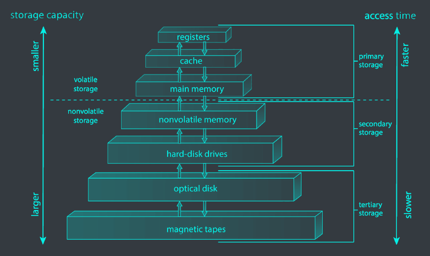

- Register are managed by the programmer or compilers.
- Processor caches are managed by the hardware.
- Main memory and secondary storage are managed by the OS.

# Multi-programming (batch systems)
- Several jobs may be launched at the same time.
- Multiprogramming organize jobs (code and data) so CPU always has a job to execute.
- A subset of total jobs in system is kept in memory.
- One job selected and run via <c-blue> job scheduling</c-blue>.
- When job has to wait for I/O, it is swapped out for another job.

# Multi-tasking (time-sharing)
- Interactive computing is achieved through frequent switching between jobs, requiring short job execution times.
- Multiple programs running in memory are called processes.
- CPU time-sharing occurs when multiple processes are ready to run at the same time.
- Swapping is used to manage processes in and out of memory.
- Virtual memory enables execution of processes larger than physical memory.

# Memory layout for multiprogramming systems

{}
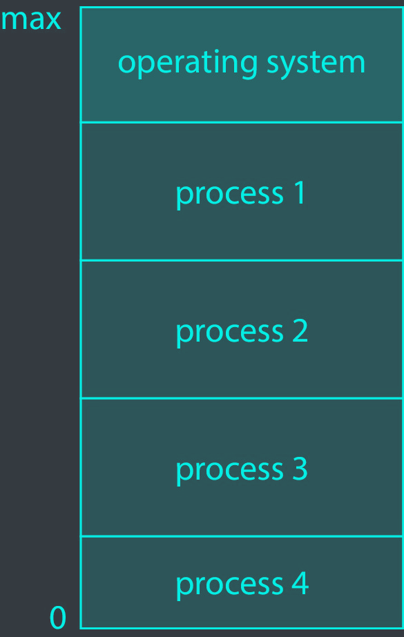
{}

# OS protection: dual-mode operation
- <c-blue>Dual-mode </c-blue> operation allows the OS to protect itself and user programs through <c-blue> user mode </c-blue> and <c-blue> kernel mode </c-blue>.
- The mode bit, provided by hardware, indicates the current mode and distinguishes between user and kernel code.
- How do we guarantee that the user doesn't change the mode bit? System calls change the mode to kernel, and returning from a system call changes it back to user mode.
- <c-blue>Privileged instructions </c-blue> can only be executed in kernel mode.

## Transition from user mode to kernel mode
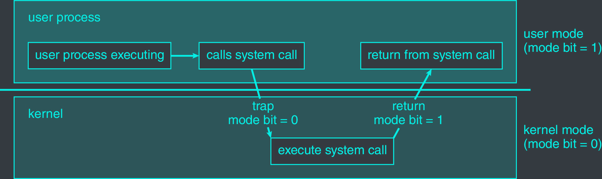

# Process management
- A process is an active program in execution that requires resources to accomplish its task
- Resources needed by a process may include CPU, memory, I/O, files, and initialization data
- Processes must release any reusable resources upon termination
- Each process has a program counter that determines the location of the next instruction to execute
- The system can run multiple processes concurrently on one or more CPUs, with concurrency achieved through CPU multiplexing

# Process management activities
The operating system is responsible for the following activities in connection with process management
  - Process creation and deletion
  - Process suspension and resume
  - Process synchronization
  - Process communication
  - Deadlock handling

# Memory management
- Program execution requires certain instructions and data to be in memory
- Memory management optimizes CPU utilization and computer response by tracking and managing memory usage
- Memory management activities include:
  - Tracking memory usage and allocation
  - Deciding which processes and data to move in and out of memory
  - Allocating and de-allocating memory space as needed

# File-system management
- The OS provides a uniform, logical view of information storage through the use of files and directories
- Different storage media, such as disk drives and tape drives, have varying properties including access speed, capacity, data transfer rate, and access method
  - File system management activities include:
  - Creating and deleting files and directories
  - Providing tools to manipulate files and directories
  - Mapping files onto secondary storage
  - Backing up files onto stable storage media
- Access control is often implemented to determine who can access which files and directories.

# Caching
- Caching is a technique used to improve access to data by temporarily copying it from slower to faster storage
- The faster storage, known as a cache, is checked first to see if the requested data is available
- If the data is in the cache, it is accessed directly from there, otherwise it is copied to the cache and accessed from there
- Caches are typically smaller than the storage they are caching, so cache management is an important design problem that involves deciding the cache size and replacement policy.

# Characteristics of various types of storage

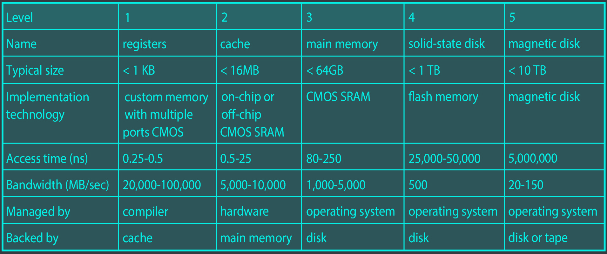

# Migration of data "A" from disk to register
- In multitasking environments, it is important to ensure that the most recent value is used, regardless of where it is stored in the storage hierarchy.

- In a multiprocessor environment, cache coherency must be provided in hardware to ensure that all CPUs have the most recent value in their cache.
- In a distributed environment, the situation is even more complex, as several copies of a datum can exist.

# Protection and security
- <c-blue>Protection </c-blue>refers to mechanisms that control access to resources defined by the operating system.
- <c-blue>Security </c-blue>involves defending the system against internal and external attacks, such as denial-of-service, worms, viruses, identity theft, and theft of service.
- Users are typically distinguished by their user IDs and security IDs, which include a name and a number.
- User IDs are associated with all files and processes belonging to that user to determine access control.
- Group identifiers allow a set of users to be defined and their access controlled, and are also associated with each process and file.
- Privilege escalation allows a user to change to an effective ID with more rights.

# Computer-system architecture
- Most systems use a single general-purpose processor, which can be<c-blue> multi-core</c-blue>.
- Some systems also have special-purpose processors.
- Multiprocessor systems, also known as parallel systems or tightly-coupled systems, are growing in use and importance.
- They offer increased throughput, economy of scale, and increased reliability through graceful degradation or fault tolerance.
- There are two types of multiprocessor systems:<c-blue> asymmetric multiprocessing</c-blue>, in which each processor is assigned a specific task, and<c-blue> symmetric multiprocessing</c-blue>, in which each processor performs all tasks.

# Symmetric multiprocessing architecture
{}
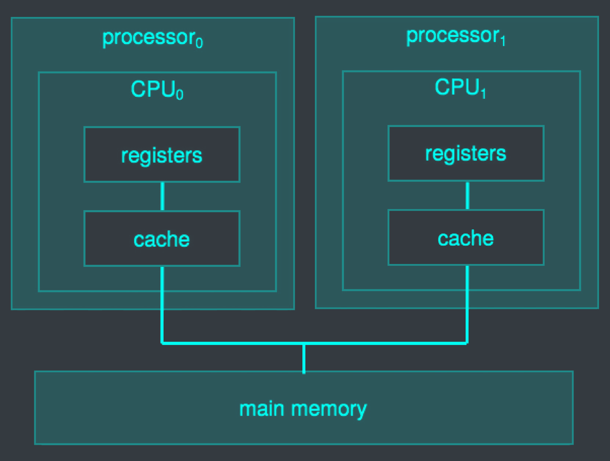
{}

# Dual-core design
{}
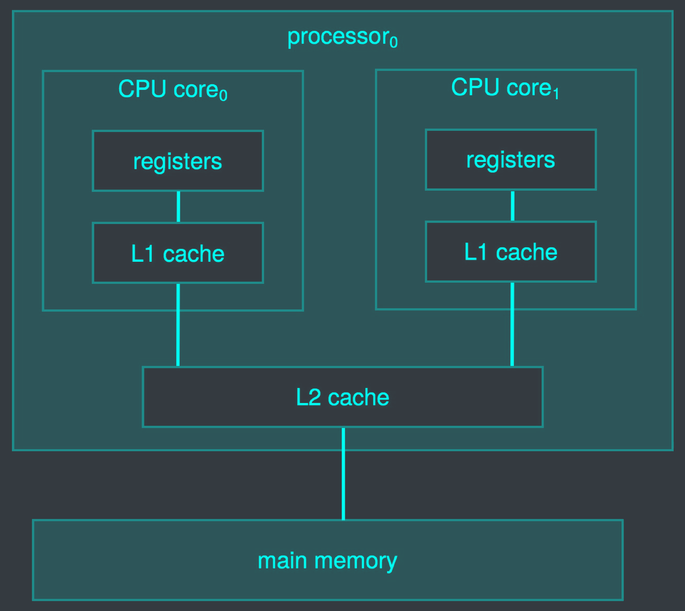
{}

# Non-uniform memory access (NUMA) systems
{}

{}

# Clustered system
- Clustered systems are groups of multiple systems working together, typically sharing storage through a storage-area network (SAN).
- They provide a high-availability service that can survive failures.
- There are two main types of clustering: asymmetric clustering, in which one machine is in hot standby mode, and symmetric clustering, in which multiple nodes are running applications and monitoring each other.
- Clustered systems are used for a variety of purposes, including high-performance computing and big data computing.

# System interfaces
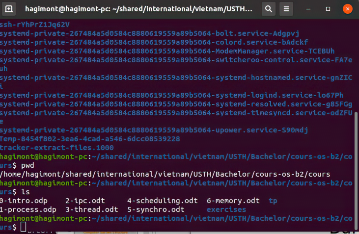
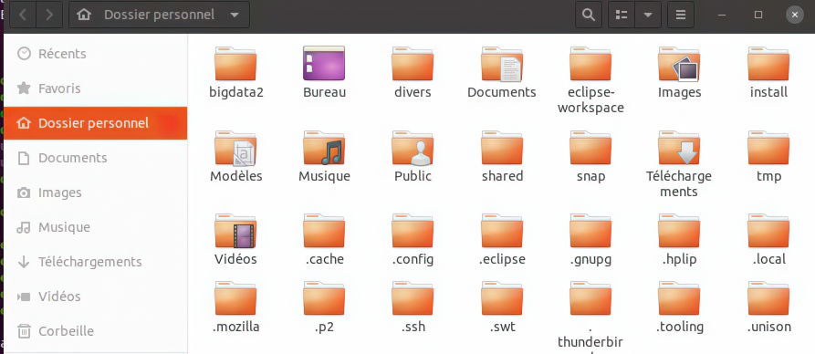

# Basic shell commands
| Command                                    | Description                                                                 |
| ------------------------------------------ | --------------------------------------------------------------------------- |
| man \[command\]                            | Display the <u>man</u>ual page for the specified command                    |
| cd /path/to/directory                      | <u>C</u>hange <u>d</u>irectory to the specified path                        |
| ls \[options\] \[path\]                    | <u>L</u>i<u>s</u>t the contents of the specified path                       |
| cat \[options\] \[file\]                   | Con<u>cat</u>enate the specified file to standard output                    |
| mkdir \[options\] \[directory\]            | <u>M</u>a<u>k</u>e a new <u>dir</u>ectory                                   |
| cp \[options\] \[source\] \[destination\]  | <u>C</u>o<u>p</u>y the specified source file to the specified destination   |
| mv \[options\] \[source\] \[destination\]  | <u>M</u>o<u>v</u>e the specified source file to the specified destination   |
| rm \[options\] \[file\]                    | <u>R</u>e<u>m</u>ove the specified file                                     |
| chmod \[options\] \[permissions\] \[file\] | <u>Ch</u>ange <u>mod</u>e of the specified file                             |
| chown \[options\] \[user\] \[file\]        | <u>Ch</u>ange <u>own</u>er of the specified file                            |
| df \[options\]                             | Display the <u>d</u>isk <u>f</u>ree space                                   |
| du \[options\] \[file\]                    | Display the <u>d</u>isk <u>u</u>sage of the specified file                  |
| find \[options\] \[path\] \[expression\]   | <u>Find</u> files in the specified path that match the specified expression |
| grep \[options\] \[pattern\] \[file\]      | <u>Grep</u> for the specified pattern in the specified file                 |
| nano \[options\] \[file\]                  | <u>Nano</u> text editor                                                     |
| kill \[options\] \[process\]               | <u>Kill</u> the specified process                                           |
| less \[options\] \[file\]                  | <u>Less</u> text viewer                                                     |
| ln \[options\] \[source\] \[destination\]  | <u>L</u>i<u>n</u>k the specified source file to the specified destination   |
| passwd \[options\] \[user\]                | Set/change the <u>passw<u>or<u>d</u> of the specified user                  |
| ps \[options\]                             | <u>P</u>ro<u>c</u>ess <u>S</u>tatus                                         |
| pwd                                        | <u>P</u>rint <u>w</u>orking <u>d</u>irectory                                |
| ssh \[options\] \[user\]@host              | Remote login to another machine with <u>s</u>ecure <u>sh</u>ell             |
| su \[options\] \[user\]                    | <u>S</u>witch to another <u>u</u>ser                                        |
| head \[options\] \[file\]                  | Display the first n <u>head</u>ing lines of the specified file              |
| tail \[options\] \[file\]                  | Display the last n <u>tail</u>ing lines of the specified file               |
| tar \[options\] \[file\]                   | <u>T</u>ape <u>a</u>rchive (compress) the specified file                    |
| top                                        | <u>Top</u> process viewer (like task manager)                               |
| touch \[options\] \[file\]                 | Create an empty file                                                        |
| who \[options\]                            | <u>Who</u> is logged in                                                     |
| wget \[options\] \[url\]                   | <u>W</u>eb <u>get</u> the specified URL                                     |

# Exercise (cmds)
- `find`
  - Find all the core files in a directory (recursive)
  - Remove them
- `chmod`
  - Make a file executable
  - Make a directory accessible
- `grep`
  - Find the occurrence of a string in a file
- `ps`/`kill`
  - Create a process and kill it
- `ln`
  - Create a symbolic link
  - Create a hard link
- `apt get install`
  - Install a ssh server
- `ssh`
  - Connect to the ssh server
- `wget`
  - Download a file from the internet
- `tar`
  - Compress a file
  - Decompress a file
- `pipe`
  - Count the number of firefox processes running