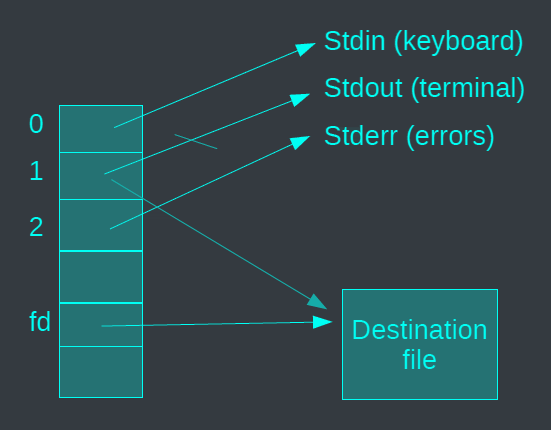
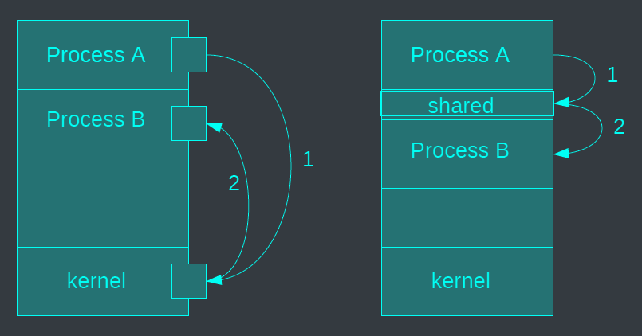
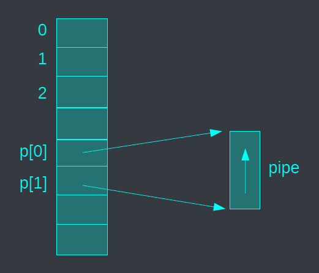
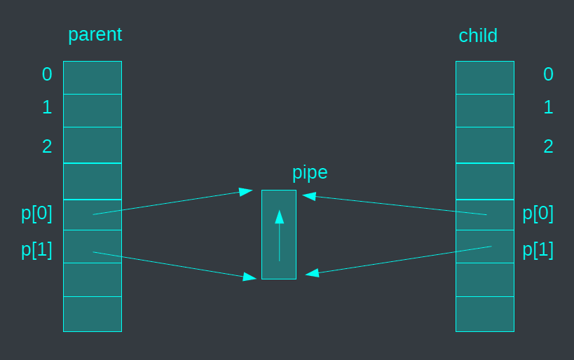
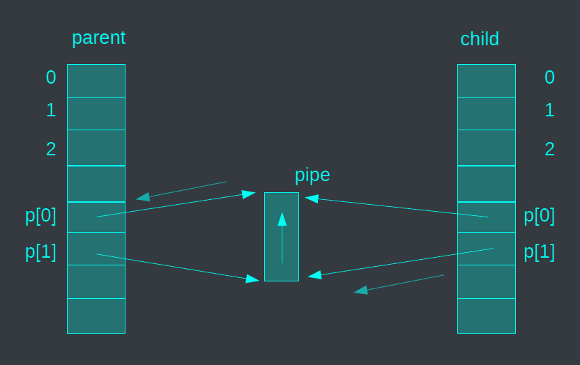
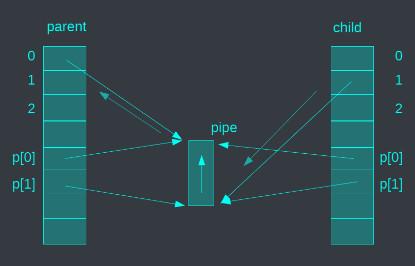
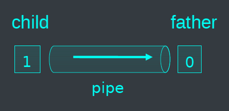
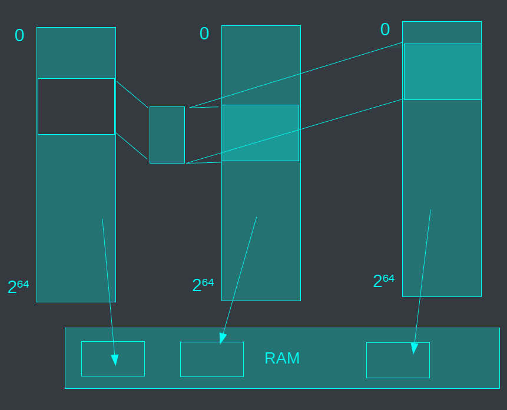
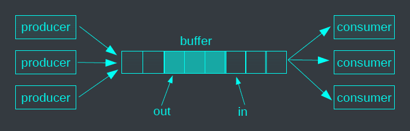



# I/O redirection
- A file is addressed through a descriptor
  - Descriptors 0, 1, and 2 correspond to standard input, output, and error
  - File descriptor number is returned by open system call
- Basic operations:
  - `int open(const char *pathname, int flags)`
    `O_RDONLY, O_WRONLY, O_RDWR`
  - `int creat(const char *pathname, mode_t mode)`
  - `int close(int fd)`
  - `ssize_t read(int fd, void *buf, size_t count)`
  - `ssize_t write(int fd, void *buf, size_t count)`
- Descriptor duplication
  - `dup(int oldfd); dup2(int oldfd, int newfd)`
  - Used to redirect standard IO

```c
#include <stdio.h>
#include <unistd.h>
int f;
/* redirect std input */
...
close(0); // close std input
dup(f) ; // dupliquate f on the first free descriptor (i.e. 0)
close(f); // free f
...
dup2(f, 0); // dupliquate f on descriptor 0
close(f); // free f
```





<--->

- In shell
```bash
ls > foo
```
- In C
```c
fd = open ("foo", ...)
dup2(fd,1)
exec("ls"...)
```
Redirection of `stdout` to a file



## Exercise (IPC)
Copy with `cat`
```c
int main (int argc, char *argv[]) {
  char *src, *dest;
  int fd;
  if (argc != 3) {
    printf("usage: copy <src> <dest>\n");
    return 0;
  }
  src = argv[1];
  dest = argv[2];
  fd = open(dest, O_CREAT | O_WRONLY | O_TRUNC, S_IRUSR | S_IWUSR | S_IRGRP | S_IROTH);
  if (fd == -1) {perror("error open"); exit(0); }
  if (dup2(fd,1) == -1) {perror("error dup2"); exit(0); }
  if (execlp("cat","cat", src, NULL) == -1) {perror("error execl"); exit(0); }
}
```

# Cooperation between processes
- Cooperation between processes allows for:
  - Information sharing
  - Computation speed-up
  - Modularity
  - Convenience
- Independent processes cannot affect or be affected by execution of another process.
- Cooperating processes can affect or be affected by execution of another process.

# Process interaction
- Processes can interact in real time through:
  - Files, although this is not considered "real time"
  - Asynchronous signals or alerts
  - Sharing a region of physical memory
  - Passing messages through the kernel or network.



# Pipe


FIFO structure
- Limited capacity
- Producer/consumer synchronization
`int pipe (int fds[2]);`
- Returns two file descriptors in `fds[0]` and `fds[1]`
- Writes to `fds[1]` will be read on `fds[0]`
- Returns `0` on success, `-1` on error
Operations on pipes
- read/write/close – as with files
- When `fds[1]` closed, `read(fds[0])` returns `0` bytes (`EOF`)
- When `fds[0]` closed, `write(fds[1])`: kill process with `SIGPIPE`





<--->

```c
In C
int p[2];
pipe(p);
write(p[1] ...);
read(p[0],...);
```







<--->

```c
In C
int p[2];
pipe(p);
If (fork() == 0) {
  // I am the child
} else {
  // I am the parent
}
```







<--->

```c
In C
Int p[2];
pipe(p);
if (fork() == 0) {
  // I am the child
  close(p[0];
  write(p[1] ….);
} else {
  // I am the parent
  close(p[1];
  read(p[0], ….);
}
```







Left side

```c
dup2(p[0], 0);
close(p[0]; close(p[1]);
exec("grep" ….);
```

<--->

Right side
```c
dup2(p[1], 1);
close(p[0]; close(p[1]);
exec(’ps" ….);
```



```c
In C
int p[2];
pipe(p);
if (fork() == 0) {
  // I am the child
  close(p[0];
  write(p[1] ….);
} else {
  // I am the parent
  close(p[1];
  read(p[0], ….);
}
```

## Exercise (IPC)



```c
int main (int argc, char *argv[]) {
  int p[2];
  pipe (p);
  if (fork () == 0) {
    // child
    dup2 (p[1], 1);
    close (p[0]); close (p[1]);
    execlp("ps", "ps", "-ef", NULL);
  else {
    // father
    dup2 (p[0], 0);
    close (p[0]); close (p[1]);
    execlp("grep", "grep", "firefox", NULL);
  }
}
```

<--->



```bash
In Shell
ps -ef | grep firefox
```



# Asynchronous notification (Signal)
A process may send a `SIGSTOP`, `SIGTERM`, `SIGKILL` signal to suspend (CTRL-Z), terminate or kill a process using the kill function:
- `int kill (int pid, int sig)`;
- A lot of signals ... see man pages
- Some signals cannot be blocked (`SIGSTOP` and `SIGKILL`)
Upon reception of a signal, a given handler is called. This handler can be obtained and modified using the signal function:
- `typedef void (*sighandler_t)(int)`; // handler
- `sighandler_t signal(int signum, sighandler_t handler)`; // set a handler

# Signal example



```c
#include <stdio.h>
#include <stdlib.h>
#include <signal.h>
#include <unistd.h>
void handler(int signal_num) {
  printf("Signal %d => ", signal_num);
  switch (signal_num) {
    case SIGTSTP:
    printf("pause\n");
    break;
    case SIGINT:
    case SIGTERM:
    printf("End of the program\n");
    exit(0);
    break;
  }
}
```

<--->

```c
int main(void) {
  signal(SIGTSTP, handler);
  /* if control-Z */
  signal(SIGINT, handler);
  /* if control-C */
  signal(SIGTERM, handler);
  /* if kill process */
  while (1) {
  sleep(1);
  printf(".\n");
  }
  printf("end");
  exit(0);
}
```



- Handling signals is prone to race conditions, as a different signal (even of the same type) may be sent to the process while the signal handling routine is being executed.
- The `sigprocmask()` function can be utilized to temporarily prevent or allow the delivery of signals.

## Exercise (IPC)



Without signals
- Try control-C, control-Z
With signals
- Try control-C, control-Z

<--->

```c
int main(void) {
  while (1) {
    sleep(1);
    printf(".\n");
  }
}
```



# Message queue
- Creation/fi- nding of a message queue: `int msgget(key_t key, int msgflg);`
- Control of the message queue: `int msgctl(int msqid, int cmd, struct msqid_ds *buf);`
- Emission of a message: `int msgsnd(int msqid, const void *msgp, size_t msgsz, int msgflg);`
- Reception of a message: `int msgrcv(int msqid, void *msgp, size_t msgsz, long msgtyp, int msgflg);`

## Exercise (IPC)

Creator
```c
int main() {
int msgid;
key_t key = 1234;
/* Create the queue */
if ((msgid = msgget(key,
IPC_CREAT | 0666)) < 0) {
perror("msgget failedt");
exit(1);
}
}
```



Sender
```c
struct message {
  long mtype;
  char mtext[20];
};
int main() {
  int msgid;
  key_t key = 1234;
  struct message msg;
  /* get the queue */
  if ((msgid = msgget(key, 0666)) < 0) {
    perror("msgget failedt");
    exit(1);
  }
  /* send a message */
  msg.mtype=1;
  strcpy(msg.mtext, "hello vietnam");
  if ((msgsnd(msgid, (void *)&msg, sizeof(struct message), 0)) == -1) {
    perror("msgsnd failed");
    exit(1);
  }
}
```

<--->

Receiver
```c
struct message {
  long mtype;
  char mtext[20];
};
int main() {
  int msgid;
  key_t key = 1234;
  struct message msg;
  /* get the queue */
  if ((msgid = msgget(key, 0666)) < 0) {
    perror("msgget failedt");
    exit(1);
  }
  /* receive a message */
  if ((msgrcv(msgid, (void *)&msg, sizeof(struct message), 0,0)) == -1) {
    perror("msgsnd failed");
    exit(1);
  }
  printf("received : %s\n", msg.mtext);
}
```



# Shared memory

{}

{}

## Shared memory segment
- A process can create/use a shared memory segment using:
  - `int shmget(key_t key, size_t size, int shmflg);`
  - The returned value identifies the segment and is called the `shmid`
  - The key is used so that process indeed get the same segment.
- The owner of a shared memory segment can control access rights with shmctl()
- Once created, a shared segment should be attached to a process address space using
  - `void *shmat(int shmid, const void *shmaddr, int shmflg);`
  - It can be detached using `int shmdt(const void *shmaddr);`
  - Can also be done with the `mmap` function

# Mmap
Another interface for sharing memory

```c
void * mmap (void * addr, size_t len, int prot, int flags, int fd, off_t offset);
```
- `void`: return address of shared segment
- `void * addr`: address of shared segment
- `size_t len`: size of shared segment
- `int prot`: protection
  - `PROT_READ`: read access
  - `PROT_WRITE`: write access
  - `PROT_EXEC`: execute access
  - `PROT_NONE`: no access (`SIGSEGV`)
- `int flags`: flags
  - `MAP_SHARED`: shared memory
  - `MAP_PRIVATE`: private memory
  - `MAP_FIXED`: fixed address
  - `MAP_ANONYMOUS`: anonymous mapping
- `int fd`: file descriptor
- `off_t offset`: offset in file

## Example
```c
long pagesize = sysconf(_SC_PAGESIZE);
int cf = open("content",O_RDWR);
char* base = mmap(0,pagesize, PROT_WRITE|PROT_READ,MAP_SHARED,cf,0);
```
adresses `[base,base+pagesize[` accessible in read/write mode - can be shared between indepedent processes
```c
char* b = mmap(0,pagesize,PROT_WRITE|PROT_READ,
MAP_SHARED|MAP_ANON,-1,0);
```
adresses `[base,base+pagesize[` accessible in read/write mode - has to be shared with fork

# Use-case: producer-consumer
{}

{}

```c
#define BUFFER_SIZE 10
typedef struct {
char product;
int price;
} item;
item buffer [BUFFER_SIZE];
int in = 0; // where to produce
int out = 0; // where to consume
int nb = 0; // number of items
```



```c
void produce(item *i) {
  while (nb == BUFFER_SIZE) {
    // do nothing – no free place in buffer
  }
  memcopy(&buffer[in], i, sizeof(item));
  in = (in+1) % BUFFER_SIZE;
  nb++;
}
```

<--->

```c
item *consume() {
  item *i = malloc(sizeof(item));
  while (nb == 0) {
    // do nothing – nothing to consume
  }
  memcopy(i, &buffer[out], sizeof(item));
  out = (out+1) % BUFFER_SIZE;
  nb--;
  return i;
}
```


# Socket
- A socket is defined as an endpoint for communication.
- Used for remote communication.
- Basic message passing API.
- Identified by an IP address and port.
- The socket 10.10.10.1:1625 refers to port 1625 on host 10.10.10.1.
- Communication between a pair of sockets and bidirectionnal.
- Another Teaching Unit (networking).

