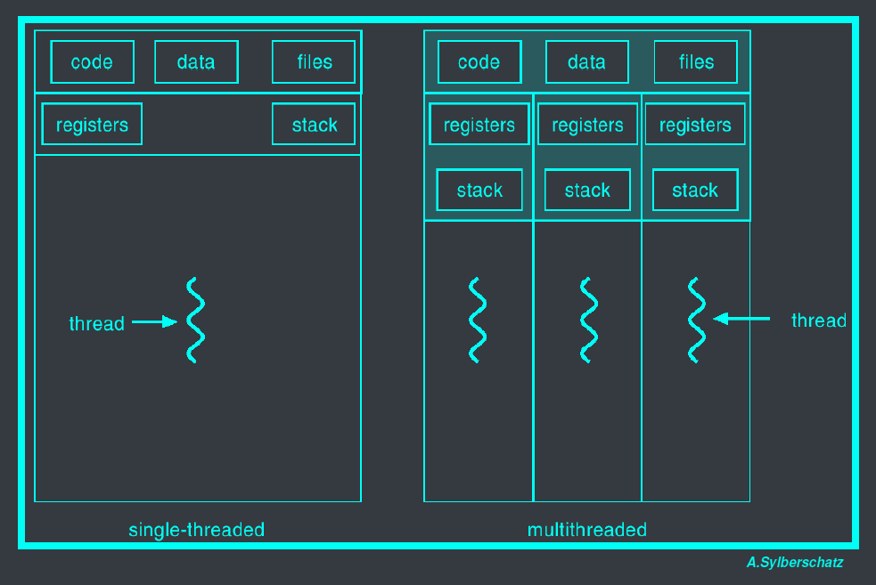
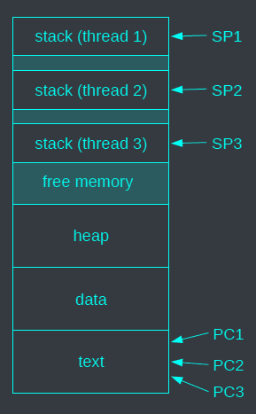
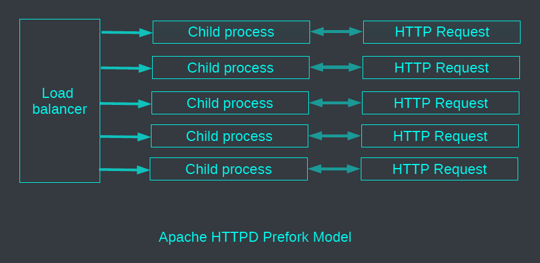
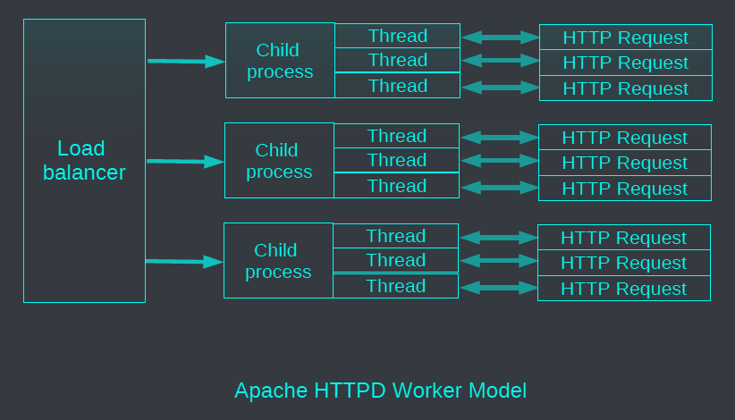
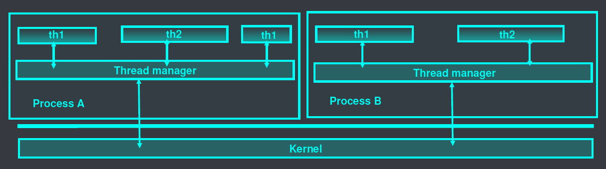
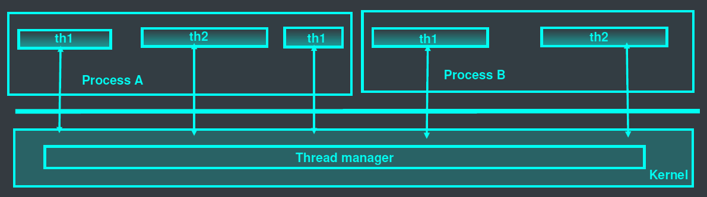



# Process

- Unix process is heavy due to large data structure including protected address space
- Address space is not accessible from other processes
- Communication between processes can be achieved through:
  - Creation time (fork)
  - Shared memory segments
  - Messages (queues, sockets)
- Communication is costly

# Thread
- Light weight process:
  - Light weight context
  - Shared context (address space, open files, etc.) and private context (stack, registers, etc.)
- Faster communication within the same address space through message exchange, shared memory, and synchronization
- Useful for concurrent/parallel applications due to its ease and efficiency, especially on multi-core processors.

# Single-threaded vs Multi-threaded process


# Multi-threaded process


Each thread has:

- Each thread has:
  - Private stack
  - Private stack pointer
  - Private program counter and register values
- Shared resources among threads:
  - Common text section (code)
  - Common data section (global data)
  - Common heap (dynamic allocations)
  - File descriptors (opened files)
  - Signals
- Threads have the same goal as processes:
  - Doing multiple tasks at the same time
  - Increasing CPU utilization
  - Improving responsiveness
- Difference between multi-process with fork() and multi-thread process:
  - Multi-process with fork(): resource cloning
  - Multi-thread process: resource sharing

<--->





# Some multi-process architectures



## Exercise (thread)
Show the numbers of threads for process `firefox` or `google-chrome`
- `ps` with `NLWP` (number of light weight processes) option: `ps -o nlwp -p <pid>`
- Count number of subdirectories in `/proc/<pid>/task/`: `ls -l /proc/<pid>/task/ | wc -l`

# User-level threads
- Threads are implemented in a user-level library
- No modification to the Kernel
- Threads and thread scheduler run within the same user process



## Advantages and disadvantages
- Efficiency (+): Quick context switch
- Parallelism (-): No real parallelism between the threads within a process
- Blocking system call (-): The process is blocked in the kernel, all threads are blocked until the system call (I/O) is completed.

# Kernel-level threads
- Threads are managed by the kernel
- Thread creation is performed as a system call
- When a thread is blocked, the processor is allocated to another thread by the kernel



## Advantages and disadvantages
- Blocking system call (+): When a thread is blocked due to a system call, other threads in the same process are not blocked
- Real parallelism (+): N threads in the same process can run on K processors (multi-core)
- Efficiency (-): More expensive context switch and more memory required for user-level threads management, every management operation goes through the kernel

# POSIX Threads : `pthreads` API
- `int pthread_create (pthread_t *thread, const pthread_attr_t *attr,
void * (*start_routine)(void *), void *arg);` - Creates a thread
- `pthread_t pthread_self (void);` - Returns id of the current thread
- `int pthread_equal (pthread_t thr1, pthread_t thr2);` - Compare 2 thread ids
- `void pthread_exit (void *status);` - Terminates the current thread
- `int pthread_join (pthread_t thr, void **status);` - Waits for completion of a thread
- `int pthread_yield(void);` - Relinquish the processor
- Plus lots of support for synchronization [next lecture]

## Exercise (thread)

```c
#include <pthread.h>
void * ALL_IS_OK = (void *)123456789L;
char *mess[2] = { "thread1", "thread2" };
void * writer(void * arg) {
  int i, j;
  for(i=0; i<10; i++) {
    printf("Hi %s! (I'm %lx)\n", (char *) arg, pthread_self());
    j = 800000; while(j!=0) j--;
  }
  return ALL_IS_OK;
}
```
<--->
```c
int main(void) {
  void * status;
  pthread_t writer1_pid, writer2_pid;
  pthread_create(&writer1_pid, NULL, writer, (void *)mess[1]);
  pthread_create(&writer2_pid, NULL, writer, (void *)mess[0]);
  pthread_join(writer1_pid, &status);
  if(status == ALL_IS_OK)
    printf("Thread %lx completed ok.\n", writer1_pid);
  pthread_join(writer2_pid, &status);
  if(status == ALL_IS_OK)
    printf("Thread %lx completed ok.\n", writer2_pid);
  return 0;
}
```


## Fork(), exec()
What happens if one thread of a program calls `fork()`?
- Does the new process duplicate all threads ? Or is the new process single-threaded?
- Some UNIX systems have chosen to have two versions of `fork()`
- What happens if one thread of a program calls `exec()`?
- Generally, the new program replace the entire process, including all threads.