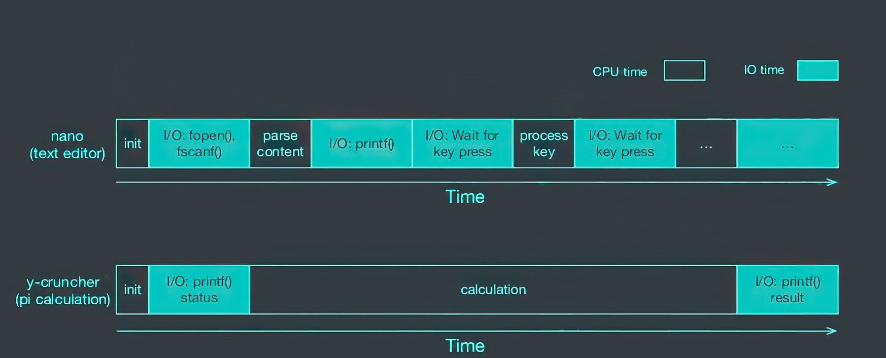
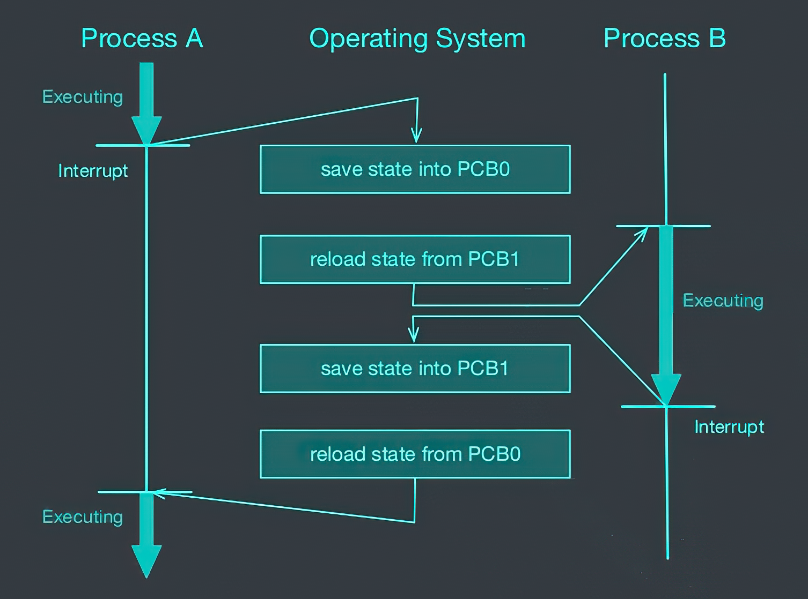
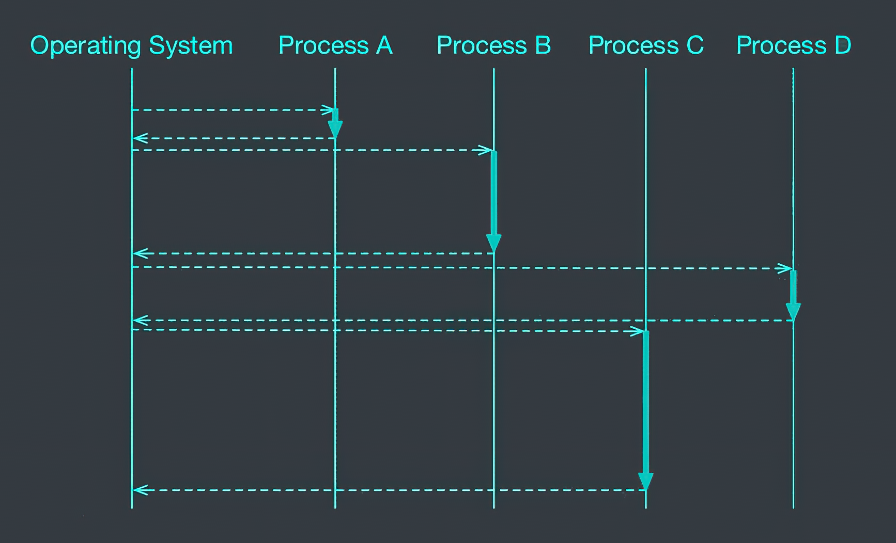
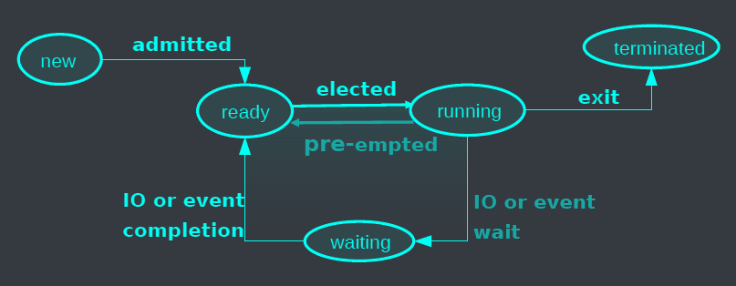
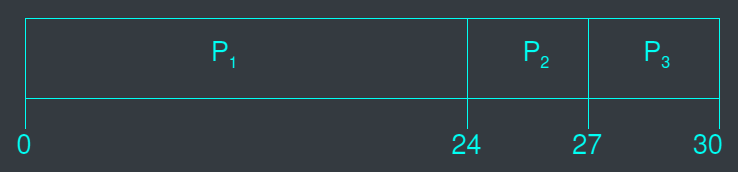
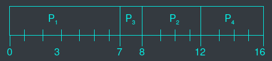
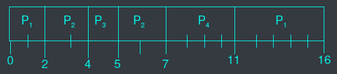
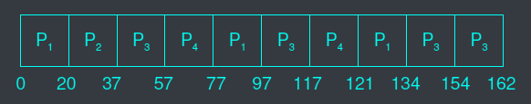
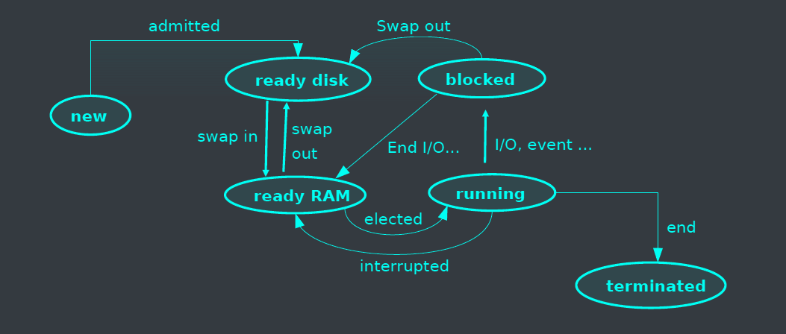

# Scheduler
- The kernel component selects which process will run on a CPU to make the most use of it.
- It does this for a group of processes that can use one or more CPUs.
- Different processes have different characteristics, such as:
  - CPU bound: these spend more time on computation.
  - I/O bound: these spend more time on I/O devices, such as reading or writing on a disk.
- The execution of a process involves:
  - CPU execution.
  - Waiting for I/O operations.

# Task scheduling


# Characteristics of schedulers
- The OS has the ability to pause running processes, either through:
  - Preemption: where the OS forcibly pauses the running process.
  - Non-preemption: where the process can only be paused at the end of its task, or if the process is willing to pause itself.
- The duration between each switch varies based on the scheduler used:
  - Short term scheduler: which operates in milliseconds for fast and responsive scheduling.
  - Long term scheduler: which operates in seconds or minutes for scheduling batch jobs.
- The switch between processes involves:
  - Saving the data of the old process.
  - Loading the previously saved data of the new process.
  - The process of switching between contexts is known as overhead.

# Context switches

{}



{}

A context switch is performed in the following cases:
- When a process switches from running to waiting for I/O operations (non-preemptive).
- When a process terminates (non-preemptive).
- When a process switches from running to ready (preemptive).
- When a process switches from waiting to ready (preemptive).

# CPU allocation to processes
- The scheduler is the part of the OS that manages the allocation of CPU time.
- It uses certain criteria or scheduling algorithms, such as:
  - Fairness, to ensure that no process is starved of CPU time.
  - Minimizing the waiting time for processes.
  - Maximizing efficiency by maximizing the number of jobs completed in a certain unit of time.

# Simple scheduling algorithms
- Non-preemptive Scheduler: FCFS (First Come First Served): fair, and efficient but not optimized for response time.
- Preemptive Scheduler:
  - SJF (Shortest Job First):
    - Prioritizes the shortest task.
    - Requires knowledge of the execution time, which can be estimated from previous executions.
    - Optimal in terms of response time but can be unfair.
  - Round Robin (fixed quantum):
    - Each process is given a CPU quantum (10-100ms) before being preempted.
    - Efficient (unless the quantum is too small) and fair in terms of response time (unless the quantum is too long).

# First-Come, First-Served (FCFS)
## Non preemptive
| Process'es | Execution time |
|------------|----------------|
| P1         | 24             |
| P2         | 3              |
| P3         | 3              |
- Arrange the processes in this order: P1, P2, P3.

{}

{}

- Response time:
  - P1: 24.
  - P2: 24 + 3 = 27.
  - P3: 24 + 3 + 3 = 30.
- Mean response time: (24 + 27 + 30) / 3 = 27.

## Preemptive
- Arrange the processes in this order: P2, P3, P1.

{}

{}

- Response time:
  - P1: 30.
  - P2: 3.
  - P3: 3 + 3 = 6.
- Mean response time: (30 + 3 + 6) / 3 = 13.
- Better than non-preemptive.
- The scheduler sorts the processes before execution.

# Shortest Job First (SJF)
- The scheduler associates an execution time with each process.
- There are two possibilities for scheduling:
  - Non-preemptive: once a CPU is allocated to a process, it cannot be preempted.
  - Preemptive: if a new process arrives with a shorter execution time than the running one, the running process will be preempted (Shortest-Remaining-Time-First - SRTF).
- SJF is considered optimal in terms of mean response time.

| Process | Come in | Execution time |
|---------|---------|----------------|
| P1      | 0.0     | 7              |
| P2      | 2.0     | 4              |
| P3      | 4.0     | 1              |
| P4      | 5.0     | 4              |

## Non preemptive SJF

{}

{}

- Mean response time: (7 + 10 + 4 + 11) / 4 = 8

## Preemptive SJF (SRTF)

{}

{}

- Mean response time: (16 + 5 + 1 + 6) / 4 = 7

# Round Robin (Quantum = 20ms)
| Process | Execution time |
|---------|----------------|
| P1      | 53           |
| P2      | 17           |
| P3      | 68           |
| P4      | 24           |

- Efficiency and mean response worse than SJF.
- Doesn't need to estimate execution time.



# Multiple level scheduling
- When the set of ready processes is too large to fit in memory, some of the processes are swapped out to disk, which increases their activation time.
- The selected process is always chosen from those that are in memory.
- A separate scheduling algorithm is used to manage the migration of ready processes between disk and memory.

# 2 level scheduling


# A scheduler implementation

```c
void thread0() {
  int i,k;
  for (i=0; i<10; i++) {
    printf("thread 0\n");
    sleep(1);
  }
}
void thread1() {
  int i,k;
  for (i=0; i<10; i++) {
    printf("thread 1\n");
    sleep(1);
  }
}
void thread2() {
  int i,k;
  for (i=0; i<10; i++) {
    printf("thread 2\n");
    sleep(1);
  }
}
```
<--->
```c
#include <stdio.h>
#include <setjmp.h>
#include <signal.h>
#include <stdlib.h>
#include <ucontext.h>
#include <sys/types.h>
#include <sys/wait.h>
#include <unistd.h>

#define MAX_THREAD 3
#define STACK_SIZE 16000
#define TIME_SLICE 4

void thread0();
void thread1();
void thread2();
void schedule(int sig);
ucontext_t uctx_main;
void (*thread_routine[MAX_THREAD])() = {thread0, thread1, thread2};

ucontext_t thread_save[MAX_THREAD];

char thread_stack[MAX_THREAD][STACK_SIZE];
int thread_state[MAX_THREAD];
int current;
```



```c
int main() {
  int i;
  for (i=0; i<MAX_THREAD; i++) {
    if (getcontext(&thread_save[i]) == -1) {
      perror("getcontext"); exit(0);
    }
    thread_save[i].uc_stack.ss_sp = thread_stack[i];
    thread_save[i].uc_stack.ss_size = sizeof(thread_stack[i]);
    thread_save[i].uc_link = &uctx_main;
    makecontext(&thread_save[i], thread_routine[i], 0);
    thread_state[i] = 1;
    printf("main: thread %d created\n",i);
  }
  signal(SIGALRM, schedule);
  alarm(TIME_SLICE);
  printf("main: swapcontext thread 0\n");
  current = 0;
  if (swapcontext(&uctx_main, &thread_save[0]) == -1) {
    perror("swapcontext"); exit(0);
    }
  while (1) {
    printf("thread %d completed\n", current);
    thread_state[current] = 0;
    schedule(0);
  }
}
```
<--->
```c
void schedule(int sig) {
  int k, old;
  alarm(TIME_SLICE);
  old = current;
  for (k=0; k<MAX_THREAD; k++) {
    current = (current + 1) % MAX_THREAD;
    if (thread_state[current] == 1) break;
  }
  if (k==MAX_THREAD) {
    printf("last thread completed: exiting\n");
    exit(0);
  }
  printf("schedule: save(%d) restore (%d)\n",old, current);
  if (swapcontext(&thread_save[old], &thread_save[current]) == -1) {
    perror("swapcontext"); exit(0);
  }
}
```


# Exercises
```bash
$ gcc sched-ctx.c -o sched
$ ./sched
```
---
```bash
$ ./sched
main: thread 0 created
main: thread 1 created
main: thread 2 created
main: swapcontext thread 0
thread 0
thread 0
thread 0
thread 0
schedule: save(0) restore (1)
thread 1
thread 1
thread 1
thread 1
schedule: save(1) restore (2)
thread 2
thread 2
thread 2
thread 2
schedule: save(2) restore (0)
thread 0
thread 0
thread 0
thread 0
schedule: save(0) restore (1)
thread 1
thread 1
thread 1
^C
$
```