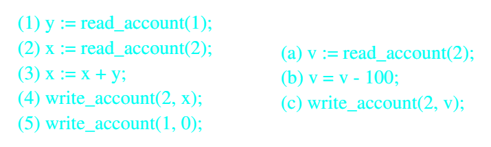
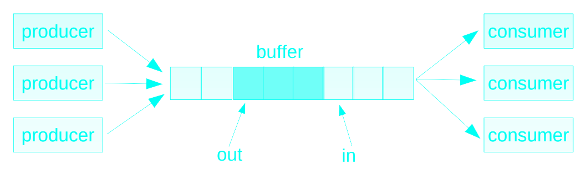
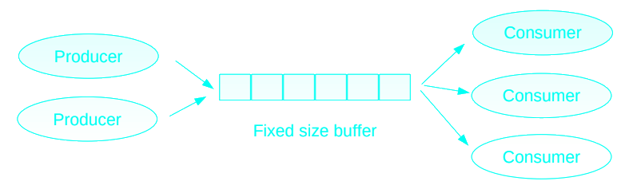
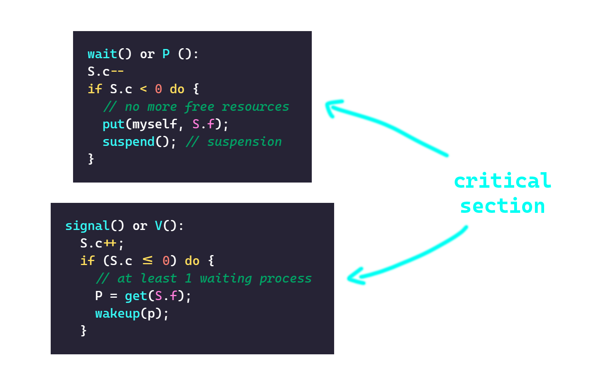
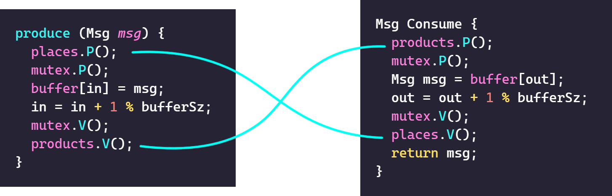
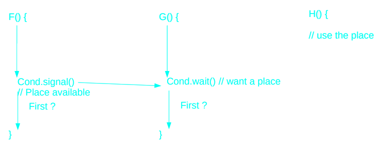



# Problem statement


- Account 2 is shared between both executions
- Variables x, y, v are local
- Executions are performed in parallel and instructions can be intertwined
- (1) (2) (3) (4) (5) (a) (b) (c) is consistent (200/200)(0,300)
- (1) (a) (b) (c) (2) (3) (4) (5) is consistent (200/200)(0,300)
- (1) (2) (a) (3) (b) (4) (c) (5) is not consistent (200/200)(0,100)

{}

{}


```c
#define BUFFER_SIZE 10
typedef struct {
    char product;
    int amount;
} item;
item buffer [BUFFER_SIZE];
int in = 0; // where to produce
int out = 0; // where to consume
int nb = 0; // number of items
```
<--->
```c
void produce(item *i) {
    while (nb == BUFFER_SIZE) {
        // do nothing – no free place in buffer
    }
    memcopy(&buffer[in], i, sizeof(item));
    in = (in+1) % BUFFER_SIZE;
    nb++;
}
item *consume() {
    item *i = malloc(sizeof(item));
    while (nb == 0) {
        // do nothing – nothing to consume
    }
    memcopy(i, &buffer[out], sizeof(item));
    out = (out+1) % BUFFER_SIZE;
    nb--;
    return i;
}
```


N processes all competing to use some shared data
- A critical section is a code fragment, in which the shared data is accessed

Problem:
- Ensure shared data consistency

Ensure mutual exclusion
- When one process is executing in one critical section, no other process is allowed to execute in this critical section

# Desired properties
- Mutual Exclusion
  - Only one thread can be in a given critical section at a time
- Progress
  - If no process currently in a given critical section, one of the processes trying to enter will eventually get in
- Fairness
- No starvation

# Critical section
- `n` processes: `P0`, `P1`, .., `Pn`
- `P0`, `P1`, .., `Pn` use a set of shared variables `a`, `b`, `c`, …
- Structure of a process `Pi` :
  - …
  - `<enter section>` // enter mutex
  - `<access a,b,c,..>` // critical section
  - `<exit section>` // leave mutex
  - …

# Software implementation (1)
- Shared data :
  - `boolean busy = false;`
- Pi :
  - `while (busy) ; (1) // busy waiting`
  - `busy = true;`
  - `<critical section>`
  - `busy = false;`
- No mutual exclusion if context switch at (1)
- Test and set are not atomic

## It seems to work
```c
while (busy);
busy = true;
// <critical section>
busy = false;
```


P1
- Busy ? No
- Busy = true
- In critical section
- Busy = false // Goes to line 3 of P2
<--->
P2
- Busy ? Yes … looping
- Busy ? Yes … looping
- Busy ? No .. stop looping
- Busy = true
- In critical section
- Busy = false


## It doesn’t work

P1
- Busy ? No
- Busy = true
- In critical section
- Busy = false
<--->
P2
- Busy ? No
- Busy = true
- In critical section
- Busy = false


# Software implementation (2)
- Shared data :
  - `int turn = 0; // turn = i : Pi's turn to enter`
- Pi (0 or 1):
  - `while (turn != i); // busy waiting`
  - `<critical section>`
  - `turn =1-i`
- Mutual exclusion
- Can be generalized to N processes
- Progress issue

# Software implementation (3)
- Shared data :
  - `boolean demand[2] = {false, false}; // Pi ask to enter`
- Pi (0 or 1):
  - `demand[i] = true;`
  - `while (demand[1-i]); // busy waiting`
  - `<critical section>`
  - `demand[i] = false`
- Mutual exclusion
- Difficult to generalize to N processes
- Can block (deadlock)

## It seems to work
```c
demand[0] = true;
while (demand[1]);
// <critical section>
demand[0] = false;
```


P0
- Demand[0] = true
- Demand[1] ? no
- In critical section
- Demand[0] = false // Goes to line 4 of P1
<--->
P1
- Demand[1] = true
- Demand[0] ? Yes ... loop
- Demand[0] ? Yes ... loop
- Demand[0] ? No
- In critical section


## It doesn’t work

P0
- Demand[0] = true
- Demand[1] ? Yes ... loop
- Deadlock
<--->
P1
- Demand[1] = true
- Demand[0] ? Yes ... loop
- Deadlock


# Software implementation (4) (Peterson algorithm)
- Peterson algorithm
- Shared data :
  - `int turn = 0; // Pi's turn`
  - `boolean demand[2] = {false, false}; // Pi ask to enter`
- Pi (0 or 1):
  - `demand[i] = true;`
  - `turn = 1-i;`
  - `while (demand[1-i] && (turn = 1-i)) ; // busy waiting`
  - `<critical section>`
  - `demand[i] = false;`
- Difficult to generalize to N processes

## It work
```c
demand[i] = true;
turn = 1-i;
while (demand[1-i] && (turn = 1-i));
// <critical section>
demand[i] = false;
```


P0
- Demand[0] = true
- Turn = 1
- Loop
<--->
P1
- Demand[1] = true
- Turn = 0
- Enter critical section


# Software implementation (5) (Lamport algorithm)
- Shared data :
  - `boolean choice[N] = {false, … false};`
  - `int num[N] = {0, … 0};`
- Pi:
```c
choice[i] = true;
int turn = 0;
for (int k=0;k<N;k++) turn = max(turn, num[k]) {
  num[i] = turn + 1;
  choice[i] = false;
    for (int k=0;k<N;k++) {
      while (choice[k]);
      while ((num[k] != 0) && ((num[k],k) < (num[i],i)));
    }
}
<critical section>
num[i] = 0
```

# Synthesis
- Software solutions
  - Complex
  - Not very efficient
- Hardware solutions
  - Masking interrupts
  - Test&Set

# Masking interrupts
- Entry section : mask the IT
- Exit section : unmask the IT

- Cannot control the time spent in critical section
- Acceptable if the critical section exec time is short
- Cannot be used with multiprocessors

# Test&Set instruction
- Most CPUs support atomic read-\[modify-\]write
- Example: `int test_and_set (int *lockp);`
  - Atomically sets `*lockp = 1` and returns old value

```c
int Test&Set (int *b) {
  // set b to 1, and return initial value of b
  int res = *b;
  *b = 1;
  return res;
}
```

# Test&Set critical section
- Shared data :
  - `int busy = 0; // false`
- Pi:
  ```c
  while (Test&Set (&busy));
  <critical section>
  busy = 0;
  ```
- Busy waiting
- Starvation issue (not FIFO)

# Sleep and wake up solutions
- Previous solution disadvantage:
  - CPU wasting (polling)
- Sleep and wake up solutions:
  - Block a process when it cannot enter a critical section
  - Wake up when the critical section is free
- Different abstractions
  - Lock
  - Semaphore
  - Monitor

# Lock
Simple synchronization primitives
- Lock/unlock function
- Only one process can go through a lock at the same time
- Based on sleep/wakeup

Different interfaces, implementations, properties (fifo ...)
- e.g. Thread packages :
  - `void mutex_init (mutex_t *m, ...);`
  - `void mutex_lock (mutex_t *m);`
  - `int mutex_trylock (mutex_t *m);`
  - `void mutex_unlock (mutex_t *m)`

# Producer Consumer example



- Fixed size buffer.
- Variable number of producers and consumers.

Shared data
```c
nt bufferSz = N;
int in = 0, out = 0, nb = 0;
Msg buffer[] = new Msg[bufferSz];
```


```c
produce (Msg msg) {
  buffer[in] = msg;
  in = in + 1 % bufferSz;
  nb++;
}
```
<--->
```c
Msg Consume {
  Msg msg = buffer[out];
  out = out + 1 % bufferSz;
  nb--;
  return msg;
}
```


# Producer Consumer with locks (locks are not sufficient)
Shared data
```c
int bufferSz = N;
int in = 0, out = 0, nb = 0;
Msg buffer[] = new Msg[bufferSz];
Lock mutex = new Lock();
```


```c
produce (Msg msg) {
  mutex.lock();
  while (nb == bufferSz) {
    mutex.unlock();
    yield(); // back to ready queue
    mutex.lock();
  }
  buffer[in] = msg;
  in = in + 1 % bufferSz;
  nb++;
  mutex.unlock();
}
```
<--->
```c
Msg Consume {
  mutex.lock();
  while (nb == 0) {
    mutex.unlock();                // }
    yield(); // ready queue        // } <- busy waiting
    mutex.lock();                  // }
  }
  Msg msg = buffer[out];
  out = out + 1 % bufferSz;
  nb--;
  mutex.unlock();
  return msg;
}
```


# Higher synchronization abstractions
Principles
- Use application's semantic to suspend/wake up a process that wait for a condition to happen

Examples
- Semaphore
- Monitor

# Semaphores (Dijkstra, 1965)
Semaphore S:
- `counter S.c;` Model a ressource number or a condition
- `waiting queue S.f;` Waiting processes

Think of a semaphore as a purse with a certain number of tokens
- Suspend when no more token
- Wake up when token released

A Semaphore is initialized with an integer N

Accessed through `P()` and `V()` operations



# Semaphores
Counter `S.c == S.c initial + NV - NP`
- `NV` is the number of `V` operations executed on the semaphore
- `NP` is the number of `P` operations executed on the semaphore

Counter `S.c < 0`
- Correspond to the number of blocked processes

Counter `S.c > 0`
- Correspond to the number of available resources
- Correspond also to the number of processes that can call a `P` operation without beeing blocked

Counter `S.c == 0`
- No more resources available and no blocked process
- The next process that call `P()` will be blocked

Can use semaphores to implement mutual exclusion (`init = 1`)

# Producer Consumer


Condition to produce/consume
- Produce: the buffer is not full
- Consume: the buffer is not empty

---
- Can write producer/consumer with three semaphores
- Semaphore mutex initialized to 1
  - Used as mutex, protects buffer, in, out. . .
- Semaphore products initialized to 0 (≈ number of items)
  - To block consumer when buffer is empty
- Semaphore places initialized to N (≈ number of free locations)
  - To block producer when buffer is full

---
Shared data
```c
int bufferSz = N;
int in = 0, out = 0;
int nb = 0;
Msg buffer[] = new Msg[bufferSz];
Semaphore places = new Semaphore(bufferSz);
Semaphore products = new Semaphore(0);
Semaphore mutex = new Semaphore(1);
```



## Improve parallelism
Shared data
```c
int bufferSz = N;
int in = 0, out = 0;
Msg buffer[] = new Msg[bufferSz];
Semaphore places = new Semaphore(bufferSz);
Semaphore products = new Semaphore(0);
Semaphore mutexIn = new Semaphore(1);
Semaphore mutexOut = new Semaphore(1);
```


```c
produce (Msg msg) {
  places.P();
  mutexIn.P();              // New  
  buffer[in] = msg;
  in = in + 1 % bufferSz;
  mutexIn.V();              // New  
  products.V();
}
```
<--->
```c
Msg Consume {
  products.P();
  mutexOut.P();             // New  
  Msg msg = buffer[out];
  out = out + 1 % bufferSz;
  mutexOut.V();             // New  
  places.V();
  return msg;
}
```


# Thread and Semaphore
Thread packages typically provide semaphores.
- `int sem_init(sem_t *sem, int pshared, unsigned int value);`
- `int sem_post(sem_t *sem);`
- `int sem_wait(sem_t *sem);`
- `int sem_trywait(sem_t *sem);`
- `int sem_timedwait(sem_t *sem, const struct timespec *abs_timeout);`
- `int sem_getvalue(sem_t *sem, int *sval);`

# Semaphores conclusion
They are quite error prone
- If you call P instead of V, you’ll have a deadlock
- If you forget to protect parts of your code, you end up with a mutual exclusion violation
- If you have “tokens” of different types, it may be hard to reason about
- If by mistake you interchange the order of the P and V, you may violate mutual exclusion or end up with a deadlock.

That is why people have proposed higher-level language constructs

# Deadlock?
A correct solution is not always ensured by the semaphore:
```c
P(mutex);
if ... {
  P(S);    // Possible deadlock  
  ...
} else {
  ...
  V(S);
}
V(mutex);
```
<c-red>RULE: never block in a critical section without releasing the section</c-red>

# Monitor
- Programming language construct
- A Monitor contains
  - Data
  - Function (f1,..,fn)
  - Init function
  - Conditions
- Functions are executed in mutual exclusion
- A "condition variable" is a synchronization structure (a queue) associated to a "logical condition"
  - `wait()` suspends the caller
  - `signal()` wakes up a waiting process if any, else the signal is LOST
- In general, condition queues are FIFO

```c
monitor <monitor-name> {
  <shared variables + conditions declarations>
  procedure init { initialization code }
  procedure f1 (…) {
    ...
  }
  procedure f2 (…) {
    ...
  }
  procedure Pn (…) {
    ...
  }
}
```

- Only one process is running inside the monitor at a time
- On a signal
  - Either the signal sender keep the monitor (signal sender priority) = Signal and continue
  - Or the signal receiver acquires the monitor (signal receiver priority) = Signal and wait
- Monitor release
  - When the current procedure completes
  - When calling a wait operation



# Producer Consumer with monitors
```c
Monitor ProdConsMonitor {
  int bufferSz, nb, in, out;
  Msg buffer[];
  Condition places, products;
}
procedure init() {
  bufferSz = N;
  nb = in = out = 0;
  buffer = new Msg[buffersz];
}
```
- Signal <u>receiver</u> priority

```c
procedure produce(Msg msg) {
  if (nb==bufferSz)
    places.wait();
  buffer[in] = msg;
  in = in + 1 % bufferSz;
  nb++;
  products.signal();
}
```
<--->
```c
procedure consume() : Msg {
  if (nb==0)
    products.wait();
  Msg msg = buffer[out];
  out = out + 1 % bufferSz;
  nb--;
  places.signal();
}
```

- Signal <u>sender</u> priority

```c
procedure produce(Msg msg) {
  while (nb==bufferSz)
    places.wait();
  buffer[in] = msg;
  in = in + 1 % bufferSz;
  nb++;
  products.signal();
}
```
<--->
```c
procedure consume() : Msg {
  while (nb==0)
    products.wait();
  Msg msg = buffer[out];
  out = out + 1 % bufferSz;
  nb--;
  places.signal();
}
```


# pthread synchronization
- `pthread_mutex_t m = PTHREAD_MUTEX_INITIALIZER;`
- `int pthread_mutex_init (pthread_mutex_t *mutex, const pthread_mutex_attr *attr);`
- `int pthread_mutex_destroy (pthread_mutex_t *m);`
- `int pthread_mutex_lock (pthread_mutex_t *m);`
- `int pthread_mutex_trylock (pthread_mutex_t *m);`
- `int pthread_mutex_unlock (pthread_mutex_t *m);`
- `pthread_cond_t vc = PTHREAD_COND_INITIALIZER;`
- `int pthread_cond_init (pthread_cond_t *vc, const pthread_cond_attr *attr);`
- `int pthread_cond_destroy (pthread_cond_t *vc);`
- `int pthread_cond_wait (pthread_cond_t *vc, pthread_mutex_t *m);`
- `int pthread_cond_timedwait (pthread_cond_t *vc, pthread_mutex_t *m, const struct timespec *abstime);`
- `int pthread_cond_signal (pthread_cond_t *vc);`
- `int pthread_cond_broadcast (pthread_cond_t *vc);`

# Java synchronization

For each
- one lock
- one condition

Monitor principles
- Synchronized methods = executed in mutual exclusion
- wait and notify/notifyAll to manage the condition
<--->
```java
class Example {
  int cpt; // shared data
  public void synchronized get() {
    if (cpt <= 0) wait();
    cpt--;
  }
  public void synchronized put() {
    cpt++;
    notify();
  }
}
```


- Synchonized a chunk of code
```java
synchronized (this) {
  // critical section
}
```
- Also one lock per class
```java
class Example {
  static synchronized T foo() { ... }
}
```

# Exercise
## Reader/writer with semaphores
- A shared document
- Users can read/write the document

```c
beginRead()
< reading >
endRead()
```
<--->
```c
beginWrite()
< writing >
endWrite()
```

- Multiple readers / single writer

---
Shared data
```c
int nbReaders = 0;
Semaphore mutex = new Semaphore(1);
Semaphore exclusive = new Semaphore(1);
```

Potential starvation of writers

```c
beginRead () {
  mutex.P();
  if (nbReaders == 0)
    exclusive.P();
  nbReaders ++;
  mutex.V();
}
beginWrite () {
  exclusive.P();
}
```
<--->
```c
endRead () {
  mutex.P();
  nbReaders --;
  if (nbReaders == 0)
    exclusive.V();
  mutex.V();
}
endWrite () {
  exclusive.V();
}
```


---

```c
Priority to signal receiver
monitor ReaderWriter () {
  int nbReaders;
  boolean writer;
  Condition canRead, canWrite;
}
procedure init() {
  nbReaders = 0;
  writer = false;
}
procedure beginRead() {
  if (writer) canRead.wait();
  nbReader++;
  canRead.signal();
}
```
<--->
Priority to readers
```c
procedure endRead() {
  nbReader--;
  if (nbReaders == 0) canWrite.signal();
}
procedure beginWrite() {
  if ((nbReaders > 0) || (writer))
  canWrite.wait();
  writer = true;
}
procedure endWrite() {
  writer = false;
  if (!canRead.empty())
  canRead.signal();
  else canWrite.signal();
}
```


## Semaphore with monitor
```c
monitor Semaphore () {
  int count;
  Condition positive;
}
procedure init(int v0) {
  count = v0;
}
procedure P() {
  count--;
  if (count < 0) positive.wait();
}
procedure V() {
  count++;
  positive.signal();
}
```