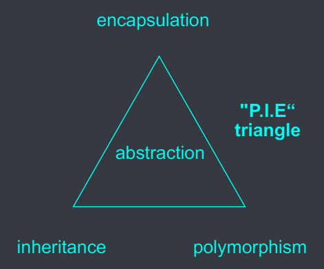
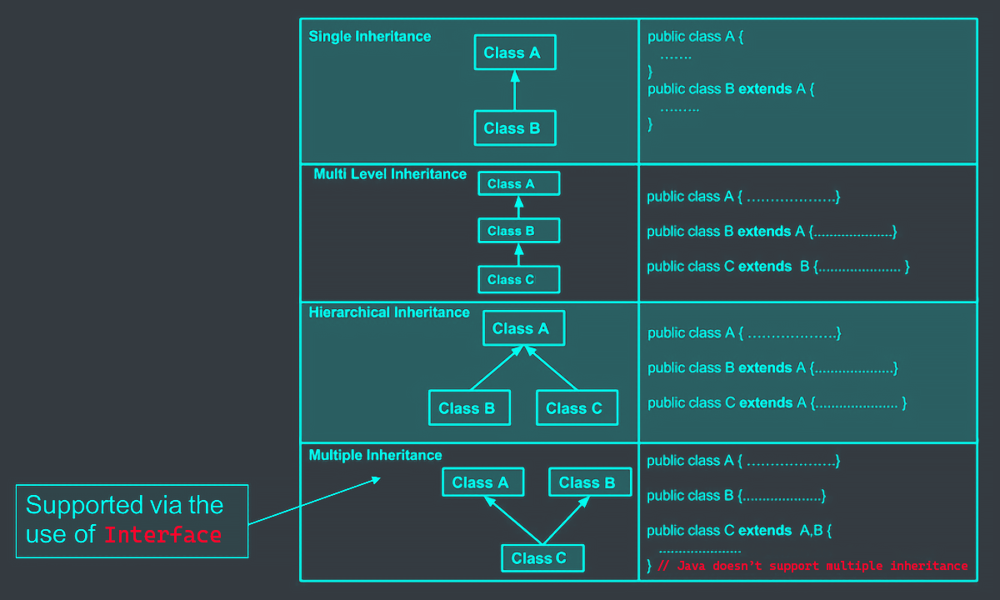
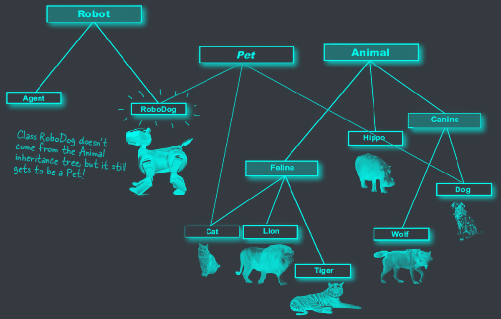
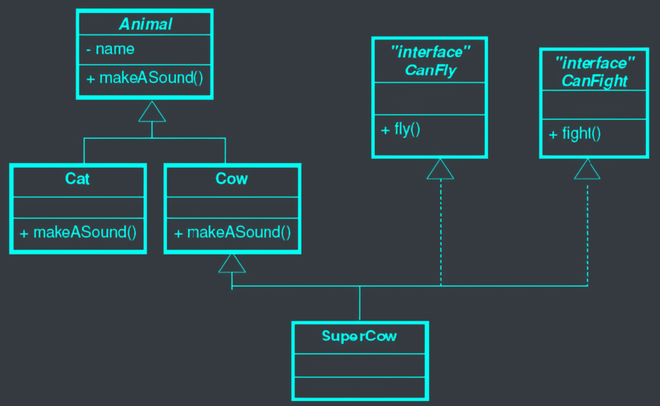
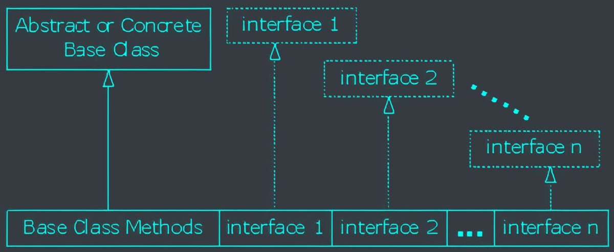
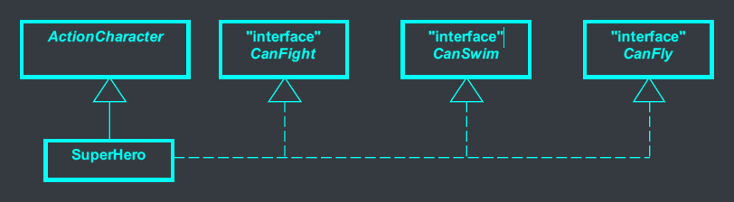



# Important OO Concepts



# Why care about interfaces?



# What is Interface?
- In Java, interface is a special type of class which:
  - Define a set of&nbsp;<c-red>method prototypes</c-red>.
  - Does&nbsp;<c-red>not</c-red>&nbsp;provide the&nbsp;<c-red>implementation</c-red>&nbsp;for the prototypes.
  - Can also define final constant.
    ```java
    public interface Animal {
      public abstract void eat();
      public abstract void travel();
    }
    ```

# Creating Interface
- To&nbsp;<c-red>**define**</c-red>&nbsp;an interface:
  ```java
  public interface Animal { // user keyword "interface" instead of "class"
    public abstract void eat(); // the methods are ALL abstract
    public abstract void travel();
  }
  ```
- To&nbsp;<c-red>**implement**</c-red>&nbsp;an interface:
  ```java
  public class Mammal implements Animal { // keyword "implements"
    public void eat() {
      System.out.println("Mammal eats meat");
    }
    // implement ALL methods in the interface
    public void travel() {
      System.out.println("Mammal travels around"); // normal overriding methods
    }
    public int noOfLegs() {
      return 0;
    }
  }
  ```

# Multiple inheritance with interface
- Classes from difference inheritance trees can implement the same interface



- A class can implement multiple interfaces



# Extends vs Implements keyword
- A class
  - Can "<c-red>extend</c-red>" only one class, i.e. ONE superclass
  - Can "<c-red>implement</c-red>" MULTIPLE interfaces



# Implement multiple interfaces



- Class "SuperHero"
  - "<c-red>Extends</c-red>" class "ActionCharacter".
  - "<c-red>Implements</c-red>" three interfaces "CanFight", "CanSwim", "CanFly".


```java
interface CanFight {
  void fight();
}
interface CanSwim {
  void swim();
}
interface CanFly {
  void fly();
}
class ActionCharacter {
  public void fight() {
    System.out.println("Fight well");
  }
}
```
<--->
```java
class SuperHero extends ActionCharacter implements CanFight, CanSwim, CanFly {
  public void swim() {
    System.out.println("Swim well");
  }
  public void fly() {
    System.out.println("Fly well");
  }
}
```


# Extend an interface with inheritance

```java
interface Monster {
  void menace();
}
interface Lethal {
  void kill();
}
interface Vampire extends Monster, Lethal {
  void drinkBlood();
}
```
<--->
```java
class VeryBadVampire implements Vampire {
  public void menace() {
    System.out.println("menace");
  }
  public void kill() {
    System.out.println("kill");
  }
  public void drinkBlood() {
    System.out.println("drinkBlood");
  }
}
```
