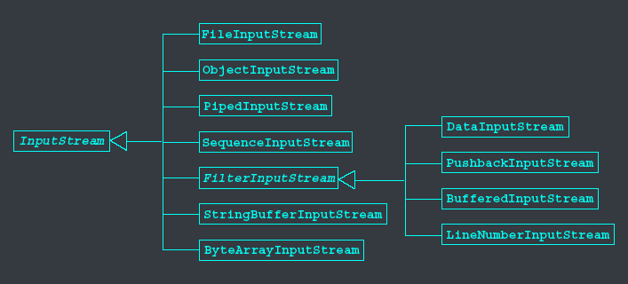
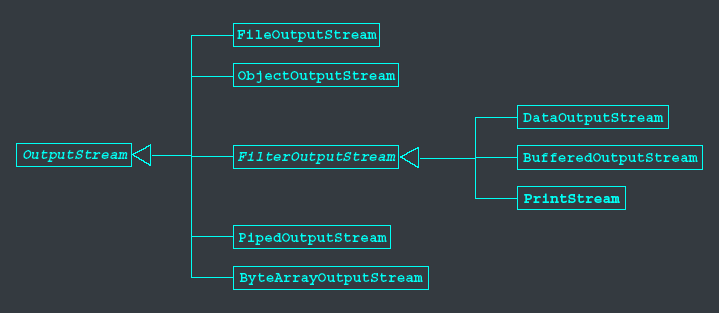
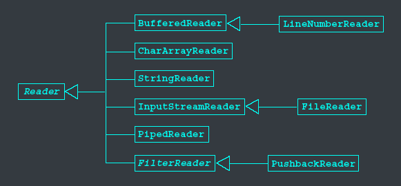
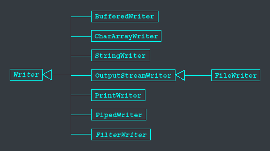



# Data streams
- Data are stored as a&nbsp;<c-red>sequence of bytes</c-red>:
  - But, we can cosnider data as having some higher-level structure as being a&nbsp;<c-red>sequence of characters or objects</c-red>.
- Streams: a&nbsp;<c-red>sequence of data</c-red>&nbsp;that is read from a source or written to a destination.
  - Source: file, memory, keyboard,...
  - Destination: file, memory, screen,...
- Java programs send and receive data via objecs of some datat stream types.
- Streams: may be connected to a file on a floppy, a file on a hard disk, a network connection or may even just be in memory.
- We abstract away what the stream is connected to, and just focus on&nbsp;<c-red>performing I/O operations</c-red>&nbsp;on the stream.

# Types of streams
- Byte streams: manipulate data in&nbsp;<c-red>bytes</c-red>. 2 abstract classes are provided:
  - `InputStream`
  - `OutputStream`
- Character streams: manipulate data as&nbsp;<c-red>Unicode text streams<c-red>. 2 abstract classes are provided:
  - `Reader`
  - `Writer`

# InputStream hierarchy



# Methods of InputStream

| Method                                 | Description                                                                             |
| -------------------------------------- | --------------------------------------------------------------------------------------- |
| `int read()`                           | reads next byte of data from input stream                                               |
| `int read(byte[] b)`                   | reads "b.length" bytes from input stream to array "b"                                   |
| `int read(byte[] b, int off, int len)` | reads "length" bytes from input stream to array "b", starting from the "offset" address |
| `void close()`                         | closes input stream                                                                     |

# OutputStream hierarchy



# Methods of OutputStream

| Method                                  | Description                                                                              |
| --------------------------------------- | ---------------------------------------------------------------------------------------- |
| `void write(int b)`                     | writes the single byte "c" to output stream                                              |
| `int write(byte[] b)`                   | write "b.length" bytes from array "b" to output stream                                   |
| `int write(byte[] b, int off, int len)` | writes "length" bytes of array "b", starting from the "offsett" address to output stream |
| `void close()`                          | closes output stream                                                                     |
| `void flush()`                          | flushes the data stream from buffer to output stream                                     |

# Reader hierarchy



# Methods of Reader

| Method                                 | Description                                                                                  |
| -------------------------------------- | -------------------------------------------------------------------------------------------- |
| `int read()`                           | reads next character of data from input stream                                               |
| `int read(char[] c)`                   | reads "c.length" characters from input stream to array "c"                                   |
| `int read(char[] c, int off, int len)` | reads "length" characters from input stream to array "c", starting from the "offset" address |
| `void close()`                         | closes input stream                                                                          |

# Writer hierarchy



# Methods of Writer

| Method                                  | Description                                                                                   |
| --------------------------------------- | --------------------------------------------------------------------------------------------- |
| `void write(int c)`                     | writes the single character "c" to output stream                                              |
| `int write(char[] c)`                   | write "c.length" characters from array "c" to output stream                                   |
| `int write(char[] c, int off, int len)` | writes "length" characters of array "c", starting from the "offsett" address to output stream |
| `void close()`                          | closes output stream                                                                          |
| `void flush()`                          | flushes the data stream from buffer to output stream                                          |

# Important types of streams
- InputStream/OuputStream:
  - Base class streams with few features.
- FileInputSteam/FileOutputStream:
  - Specifically for connecting to files.
- BufferedInputStream/BufferedOutputStream:
  - Improve I/O performance by adding buffers.
- <c-red>BufferedReader/BufferedWriter</c-red>:
  - Convert bytes to Unicode Char and String data.

# Input/output stream object
- To read or write data, we need a strweam object.
- The I/O stream objecet needs to be attached to a data source of a destination.

```java
BufferedReader in = new BufferedReader(new FileReader(<file_name>));
```

# Use of buffered streams:
- <c-red>Buffering</c-red>&nbsp;is a technique for&nbsp;<c-red>improving I/O performance</c-red>.
  - Read and write data in blocks.
  - Reduce number of accesses to I/O devices.
- The program&nbsp;<c-red>writes data to the buffer</c-red>&nbsp;instead of output devices.
  - When the buffer is full, data in buffer is pushed to the device in blocks.
  - We can force data to be pushed by calling `flush()` method.
- The program&nbsp;<c-red>reads data from the buffer</c-red>&nbsp;instead of input devices.
  - When the buffer is empty, data is retrieved from the input device in blocks.

# Standard I/O streams
- In `java.lang` package.
- `System.out` and `System.err` are **PrintStream** objects.
  - Can be used directly:
    ```java
    System.out.println("Hello");
    System.err.println("Invalid day of month!");
    ```
- `System.in` is an InputStream object.
  - Used with `InputStreamReader` (character stream) and `BufferedReader` (stream with buffer)
  ```java
  BufferedReader br = new BufferedReader(new InputStreamReader(System.in));
  ```

# The file class
- In `java.io` package.
- Provides basic&nbsp;<c-red>operations on files</c-red>&nbsp;and&nbsp;<c-red>directories</c-red>.
  - Create files, open files, query directories information.
- Files are not streams.

# Create a File object
```java
File myFile;
myFile = new File(<file_name>);
myFile = new File(<directory_name>, <file_name>);
```
- Directories are treated the same as files.
```java
File myDir = new File(<directory_name>);
File myFile = new File(myDir, <file_name>);
```

# File's methods
- File/directory name
  - `String getName()`
  - `String getPath()`
  - `String getAbsolutePath()`
  - `String getParent()`
  - `boolean renameTo(File f)`
- File/directory status
  - `boolean exists()`
  - `boolean canWrite()`
  - `boolean canRead()`
  - `boolean isFile()`
  - `boolean isDirectory()`
  - `long lastModified()`
  - `long length()`
  - `boolean delete()`
- Directory:
  - `boolean mkdir()`
  - `String[] list()`

# Manipulate text file
- Read from files:
  - `FileReader`: read characters from text files.
  - `BufferedReader`: buffered, read in lines.
- Write to files:
  - `FileWriter`: write characters to text files.
  - `BufferedWriter`: buffered, write in lines.

# Read from a text file
```java
public static void main(String[] args) {
  try {
    BufferedReader in = new BufferedReader(new FileReader(<file_name>));
    String line;
    while ((line = in.readLine()) != null) {
      System.out.println(line);
    }
    in.close();
  } catch (IOException e) {
    e.printStackTrace();
  }
}
```

# Write to a text file
```java
public static void main(String[] args) {
  try {
    BufferedWriter out = new BufferedWriter(new FileWriter(<file_name>));
    out.write("Hello");
    out.newLine();
    out.write("World");
    out.close();
  } catch (IOException e) {
    e.printStackTrace();
  }
}
```

# Manipulate binary file
- Read:
  - `FileInputStream`: read data from files.
  - `DataInputStream`: read primitive data.
  - `ObjectInputStream`: read objects.
- Write:
  - `FileOutputStream`: write data to files.
  - `DataOutputStream`: write primitive data.
  - `ObjectOutputStream`: write objects.

# DataInputStream/DataOutputStream
- `DataInputStream`: read primitive data.
  - readBoolean, readByte, readChar, readDouble, readFloat, readInt, readLong, readShort, readUTF
- `DataOutputStream`: write primitive data.
  - writeBoolean, writeByte, writeChar, writeDouble, writeFloat, writeInt, writeLong, writeShort, writeUTF

# Write primitive data

import java.io.*;
public class WriteData {
  public static void main(String[] args) {
    int a[] = {1, 2, 3, 4, 5};
    try {
      DataOutputStream out = new DataOutputStream(new FileOutputStream(<file_name>));
      for (int i = 0; i < a.length; i++) {
        out.writeInt(a[i]);
      }
      out.close();
    } catch (IOException e) {
      e.printStackTrace();
    }
  }
}


# Read primitive data

import java.io.*;
public class ReadData {
  public static void main(String[] args) {
    int a[] = new int[5];
    try {
      DataInputStream in = new DataInputStream(new FileInputStream(<file_name>));
      for (int i = 0; i < a.length; i++) {
        a[i] = in.readInt();
      }
      in.close();
    } catch (IOException e) {
      e.printStackTrace();
    }
    for (int i = 0; i < a.length; i++) {
      System.out.println(a[i]);
    }
  }
}


# File of objects
- Objects can be stored.
- Data classes must implement `Serializable` interface.


import java.io.Serializable;
public class Record implements Serializable {
  private String name;
  private int age;
  public Record(String name, int age) {
    this.name = name;
    this.age = age;
  }
  public String getName() {
    return name;
  }
  public int getAge() {
    return age;
  }
  public String toString() {
    return name + " " + age;
  }
}



import java.io.*;
public class TestObjectOutputStream {
  public static void main(String[] args) {
    Record r[] = {new Record("John", 20), new Record("Mary", 21)};
    try {
      ObjectOutputStream out = new ObjectOutputStream(new FileOutputStream(<file_name>));
      for (int i = 0; i < r.length; i++) {
        out.writeObject(r[i]);
      }
      out.close();
    } catch (IOException e) {
      e.printStackTrace();
    }
  }
}



import java.io.*;
public class TestObjectInputStream {
  public static void main(String[] args) {
    Record r[] = new Record[2];
    try {
      ObjectInputStream in = new ObjectInputStream(new FileInputStream(<file_name>));
      for (int i = 0; i < r.length; i++) {
        r[i] = (Record) in.readObject();
      }
      in.close();
    } catch (IOException e) {
      e.printStackTrace();
    } catch (ClassNotFoundException e) {
      e.printStackTrace();
    }
    for (int i = 0; i < r.length; i++) {
      System.out.println(r[i]);
    }
  }
}


# The class RandomAccessFile
- Implement&nbsp;<c-blue>DataInput</c-blue>&nbsp;interface to read data randomly.
- Implement&nbsp;<c-blue>DataOutput</c-blue>&nbsp;interface to write data randomly.


import java.io.*;
public class WriteRandomFile {
  public static void main(String[] args) {
    try {
      RandomAccessFile out = new RandomAccessFile(<file_name>, "rw");
      out.writeInt(1);
      out.writeDouble(1.1);
      out.writeUTF("John");
      out.writeInt(2);
      out.writeDouble(2.2);
      out.writeUTF("Mary");
      out.close();
    } catch (IOException e) {
      e.printStackTrace();
    }
  }
}



import java.io.*;
public class ReadRandomFile {
  public static void main(String[] args) {
    try {
      RandomAccessFile in = new RandomAccessFile(<file_name>, "r");
      for (int i = 0; i < 2; i++) {
        System.out.println(in.readInt());
        System.out.println(in.readDouble());
        System.out.println(in.readUTF());
      }
      in.close();
    } catch (IOException e) {
      e.printStackTrace();
    }
  }
}
