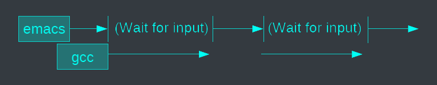
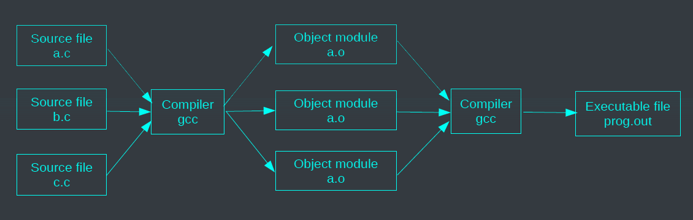
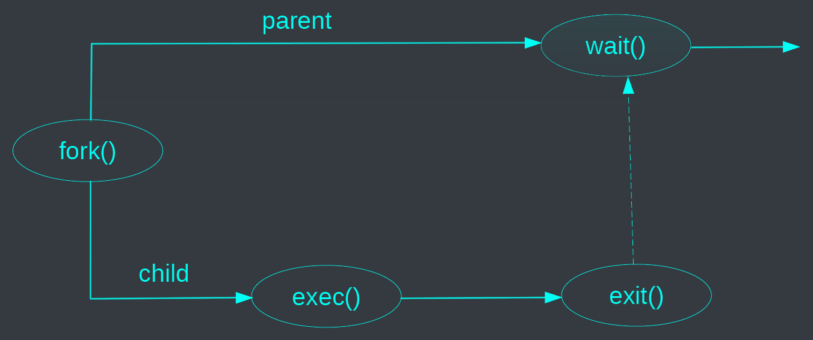
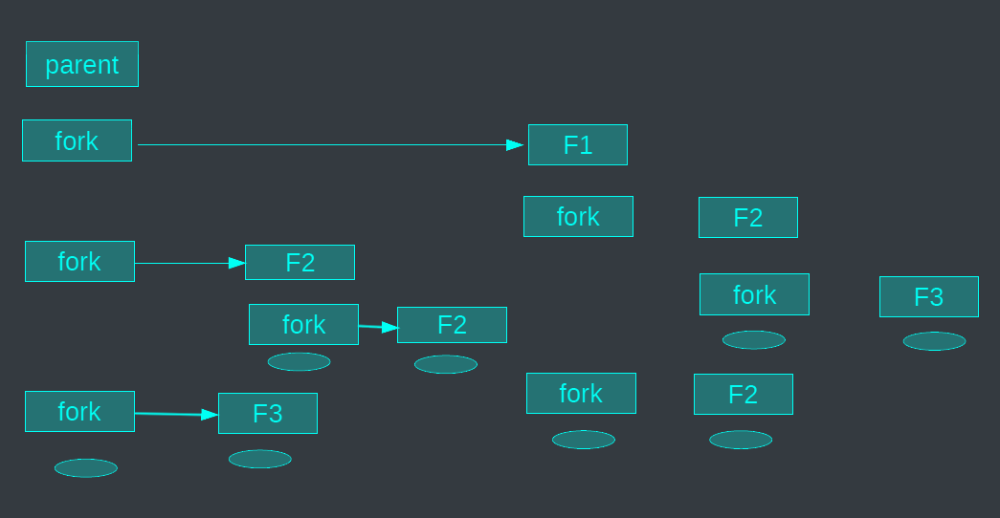



# Process
What's the difference between a process and a program?
- A program is active: stored on disk as an executable file.
- A process is passive: executed on a processor.

---
- A process is a running program that is uniquely identified by a PID.
- A process is created by a parent process or the system.
- A process consists of two units: an execution unit and an addressing unit.
- The execution unit executes a flow of instructions, while the addressing unit has its own unique address space.
- Processes are isolated from each other, meaning that the resources and memory of one process are not accessible to other processes.

---
- Processes can run on one or multiple processors.
- When multiple processes run on a single processor, it is called concurrency.
- When multiple processes run on multiple processors, it is called parallelism.

## Concurrent processes
- Multiple processes can increase CPU utilization.

{}

{}

- Multiple processes can reduce latency

{}

{}

{}
 improves the average response time")
{}

# Execution context
- A process is characterized by its context
- Process' current state
  - Memory image
    - Code of the running program
    - Static and dynamic data
  - Register's state
    - Program counter (PC), Stack pointer (SP) ...
  - List of open files
  - Environment Variables
  - ...
- To be saved/restored when the process is switched off/on

# Process control structure



- Hold a process execution context
- Process control block (PCB): data required by the OS to manage process.
- Process tables: `PCB [MAX-PROCESSES]`

<--->

| Process state (ready,...) |
|---------------------------|
| Process ID                |
| User ID                   |
| Registers                 |
| Address space             |
| Open files                |
| ...                       |



# Running mode
- User mode: access restricted to process' own address space and has limited instruction set.
- Supervisor mode: full memory/instruction set access.
- Interrupts/trap: async event, illegal instruction, system call request, ...

# Process memory layout



| stack       |
|-------------|
| free memory |
| heap        |
| data        |
| text        |

<--->

- Process execution state:
  - Processor state
  - File descriptors
  - Memory allocation



# Compiling


- Source files are compiled to object modules.
- Object modules are liked into a single executable file.

# Execute a process
{}
Executable file ▶️ Program loader ▶️ Process image in memory
{}

- Create a new process (paused)
- Load executable file into process memory
- Load dynamic libraries
- Relocated APIs
- Set the program counter and stack pointer
- Resume the process

# Process life cycle

- Which process should the kernel run?
  - If 0 runnable, run a watchdog, if 1 runnable, run it
  - Iƒ n runnable, make scheduling decision

# Exercise (process)
- List all the running processes (with `ps` – see man)
- Start a new process (e.g. `gnome-calculator`)
- Find the id of this new process
- Show its status (see content of `/proc/<id>/status`)
- Pause it (kill with signal `STOP`)
- Resume it (kill with signal `CONT`)
- Terminate it (kill with signal `KILL`)
- Look at the tree of processes (`pstree -a`)

# Process SVC overview
- `int fork ()`;
  - Creates a new process that is an exact copy of the current one
  - Returns the process ID of the new process in the “parent”
  - Returns 0 in “child”
- `int waitpid` (`int pid`, ...);
  - `pid` – the process to wait for, or -1 for any
  - Returns pid of resuming process or -1 on error
  - Hierarchy of processes
  - run the `pstree -p` command
- `void exit` (`int status`);
  - Current process stops
  - status: returned to `waitpid` (shifted)
  - By convention, status of 0 is success
  - `int kill` (`int pid`, `int sig`);
  - Sends signal sig to process pid
  - `SIGTERM` most common value, kills process by default (but application can catch it for “cleanup”)
  - `SIGKILL` stronger, kills process always
- When a parent process terminates before its child, 2 options:
  - Cascading termination (VMS)
  - Re-parent the orphan (UNIX)
- `int execve` (`const char *prog`, `const char **argv`, `char **envp`;)
  - prog – full pathname of program to run
  - argv – argument vector that gets passed to main
  - envp – environment variables, e.g., PATH, HOME
- Many other versions
  - `int execl(const char *path, const char *arg, ... /* (char *) NULL */);`
  - `int execlp(const char *file, const char *arg, … /* (char *) NULL */);`
  - `int execle(const char *path, const char *arg, … /*, (char *) NULL, char *const envp[] */);`
  - `int execv(const char *path, char *const argv[]);`
  - `int execvp(const char *file, char *const argv[]);`
  - `int execvpe(const char *file, char *const argv[], char *const envp[]);`

# Process creation


# Fork and Exec
- Fork system call creates a copy of the PCB
  - Opened files and memory mapped files are similar
  - Both father and child have access to open files, should close them
  - Many memory segments are shared (text, r/o data)
  - Others are lazily copied (copy on write)
- Exec system call replaces address space, registers, program counter
- Opened files are inherited.

# Why fork
- Most calls to fork are followed by `execvp`
- Simplicity of interface is the main advantage
- Fork allows for many actions to be taken with the child process
- Requires no arguments, unlike other options
- Example: Windows CreateProcess system call requires many different options.

```c
Bool CreateProcess(
LPCTSTR IpApplicationName, //pointer to a name to executable module
LPTSTR IpCommandLine, // pointer to a command line string
LPSECURITYATTRIBUTES lpProcessAttributes, //process security attr
LPSECURITYATTRIBUTES lpThreadAttributes, // thread security attr
BOOL bInheritHandles, //creation flag
DWORD dwCreationFlags, // creation flags
LPVOID IpEnvironnement, // pointer to new environment block
LPCTSTR lpCurrentDirectory, // pointer to crrent directory name
LPSTARTUPINFO lpStartupInfo, //pointer to STARTUPINFO
LPPROCESSINFORMATION lpProcessInformaton // pointer to PROCESSINFORMATION );
```

# Fork example
- Process creation
  - Done by cloning an existing process
    - Duplicate the process
  - `Fork()` system call
    - Return `0` to the child
    - Return the child’s PID to the father
    - Return `-1` on error



```c
#include <stdio.h>
pid_t fork(void);
```

<--->

```c
r = fork();
if (r == -1)... /* error */
else if (r == 0)... /* child code */
else... /* parent code */
```



# Exercise (process)
- How many process are created?


```c
fork();
fork();
fork();
```

<--->

```c
for (i = 0; i < 3; i++) {
  fork();
}
```



- What are the possible different traces?
```c
int i = 0;
switch (j=fork()) {
  case -1: perror("fork"); break;
  case 0: i++; printf("child %d\n", i); break;
  default: i--; printf("father %d\n", i); break;
}
```

# 3 forks


# Exec example
- Reminder: main function definition: `int main(int argc, char *argv[])`
- `execvp` call:
  - Replaces the process's memory image
  - `int execvp(const char *file, const char *argv[]);`
    - `file`: file name of the program to execute
    - `argv`: array of arguments to pass to the program
  - `execvp` calls `main(argc, argv)` in the new program

# Exercise (process)
```c
char * argv[3];
argv[0] = “ls “;
argv[1] = “-ef “;
argv[2] = NULL;
execvp(“ls“, argv);
```
or
```c
execlp(“ls“, “ls”, “-ef”, NULL);
```

# Father/child synchronization
The father process waits for the completion of one of
its children
- `pid_t wait(int *status)`
  - The father waits for the completion of one of its child
  - `pid_t`: dead child's pid or -1 if no child
  - `status`: information on the child's death
- `pid_t waitpid(pid_t pid, int *status, int option)`
  - Wait for a specific child's death
  - Option: non blocking … see man

# Wait example
```c
#include <stdio.h>
#include <stdlib.h>
#include <unistd.h>
#include <sys/wait.h>
int main(){
  int spid, status;
  switch(spid = fork()){
    case -1 : perror("..."); exit(-1);
    case 0 : // child's code
    break;
    default : // the father wait for this child's terminaison
    if (waitpid(spid,&status,0)==-1) {perror("...");exit(-1);}
    ...
  }
}
```

# Exercise (process)



```c
#include <stdio.h>
#include <stdlib.h>
#include <sys/wait.h>
#include <unistd.h>
pid_t pid;
char *av[2];
char cmd[20];
void doexec() {
if (execvp(av[0],av)==-1)
  perror ("execvp failed");
  exit(0);
}
```

<--->

```c
int main() {
  for (;;) {
    printf(">");
    scanf("%s",cmd);
    av[0] = cmd;
    av[1] = NULL;
    switch (pid = fork()) {
      case -1: perror("fork"); break;
      case 0:
      doexec();
      default:
      if (waitpid(pid, NULL, 0) == -1)
      perror ("waitpid failed");
    }
  }
}
```

