

# Introduction
Memory is a ressource required by all processes. Every program needs to be loaded in memory to be running. Problems are:
- Address translation
  - Symbol → Logical address → physical address
- Memory allocation and exhaustion
- Memory sharing
- Memory protection

# Life cycle of a single program
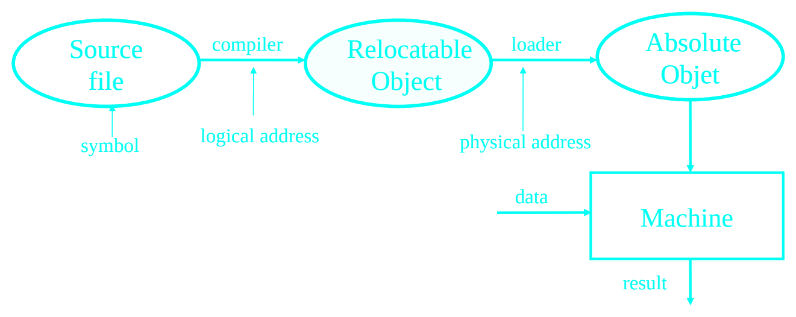

- Logical address (e.g. offset in code)
- Physical address: decided at load-time

# Lifecycle of a program assembled from multiple parts
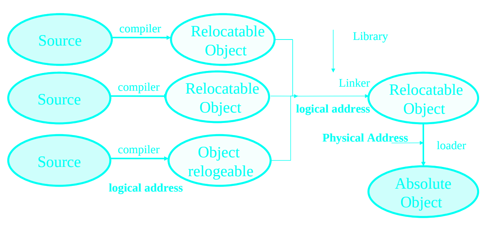

# Load-time translation
Translation between logical and physical adresses
- Determine where process will reside in memory
- Translate all references within program
- Established once for all

Monoprogramming
- One program in memory
- Easy (could even be done before load-time)

Multiprogramming
- N programs in memory
- Compiler and linker do not know the implantation of processes in memory
- Need to track op-codes that must be updated at load-time

# Simple program binary structure
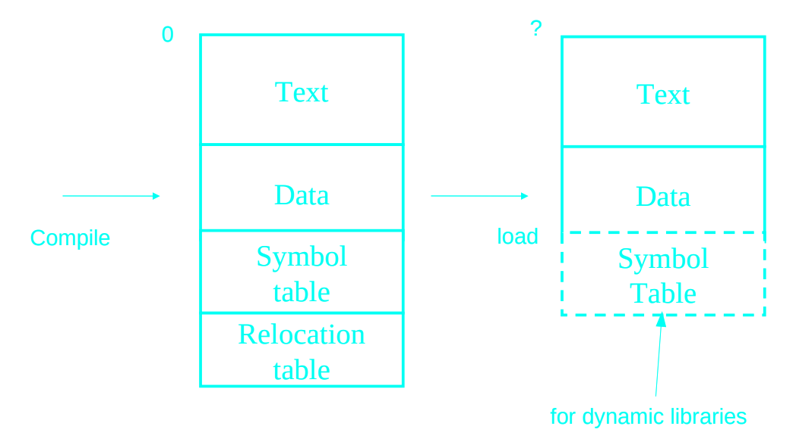

# Complex program binary structure
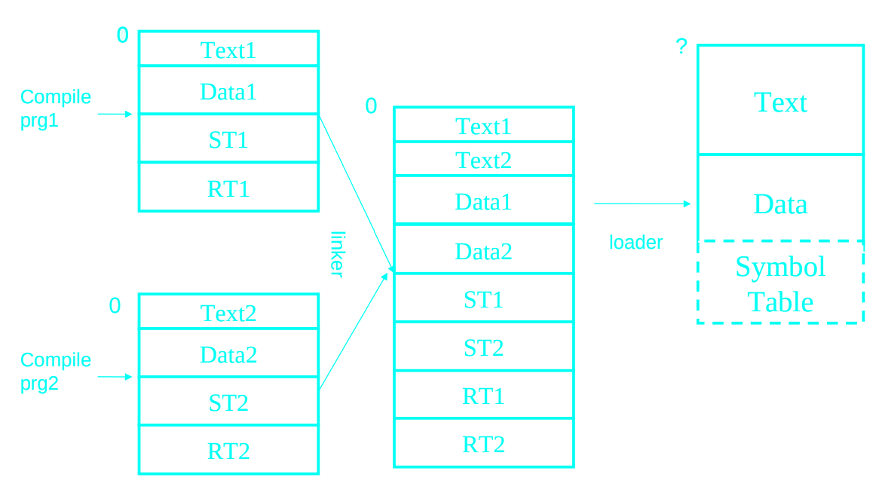

# Load-time translation summary
- How to enforce protection ?
  - Use different memory regions
- How to move program once in memory ?
  - Use relocation table
- What if no contiguous free region fits program size ?
  - Use paging
- Can we separate linking from memory management problems ?
  - Yes, use dynamic linking

# Virtual memory
Seperate linking problem from memory management

Give each program its own virtual address space
- Linker works on virtual addresses
- Virtual address translation done at runtime
- Relocate each load/store to its physical address
- Require specific hardware (MMU)

# Virtual memory
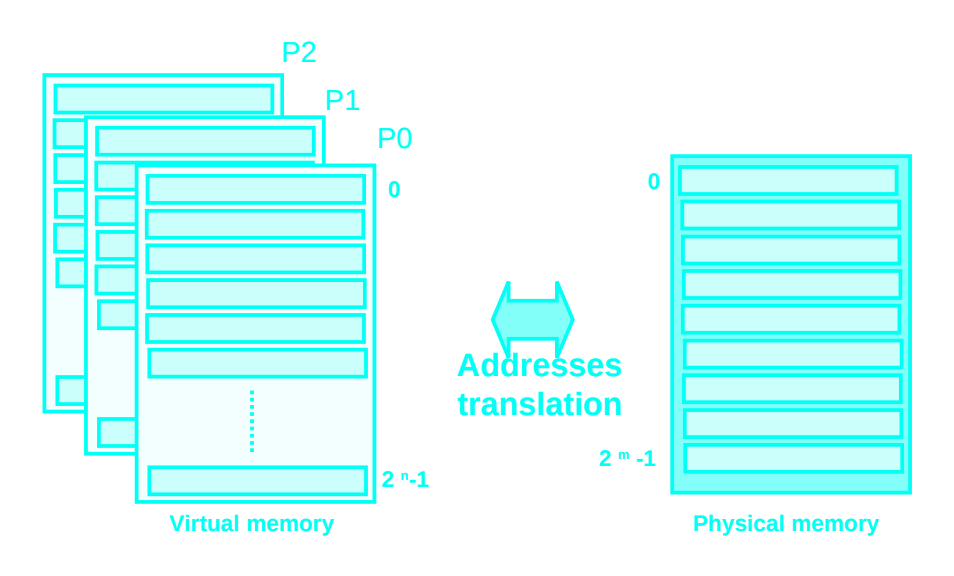
Ideally we want to enable n > m and non contiguous allocation

# Virtual memory expected benefits
- Programs can be relocated while running
  - Ease swap in/swap out
- Enforce protection
  - Prevent one app from messing with another's memory
- Programs can see more memory than exists
  - Most of a process's memory will be idle
  - Write idle part to disk until needed (swap)

# 1st idea : Base + bound registers
- Contiguous allocation of variable size
- Two special privileged registers: base and bound
- On each load/store:
  - Check 0 <= virtual address < bound, else trap to kernel
  - Physical address = virtual address (plus) base

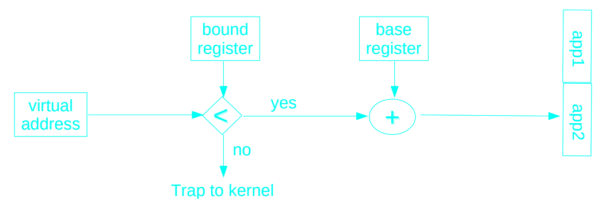

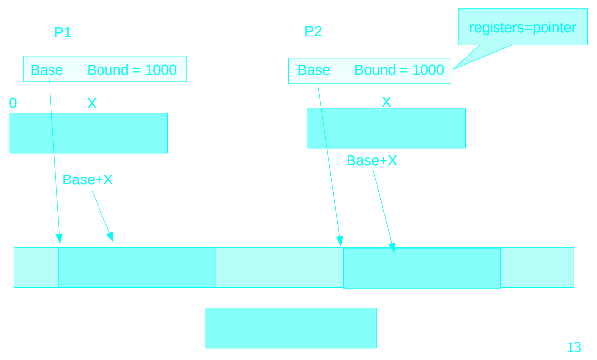

# Base + bounds register
Moving a process in memory
- Change base register

Context switch
- OS must re-load base and bound register

Advantages
- Cheap in terms of hardware: only two registers
- Cheap in terms of cycles: do add and compare in parallel

Disadvantages
- Still contiguous allocation
- Growing a process is expensive or impossible
- Hard to share code or data

# Segmentation
Non contiguous allocation
- Split a program in different non contiguous segments of variable size

Let processes have many base/bound registers
- Address space built from many segments
- Can share/protect memory at segment granularity

Must specify segment as part of virtual address

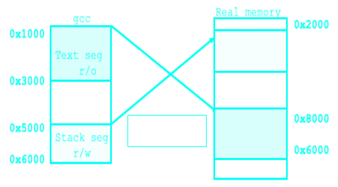

## Mechanism
- Each process has a segment table
  - Each virtual address indicates a segment and offset:
    - Top bits of addr select segment, low bits select offset
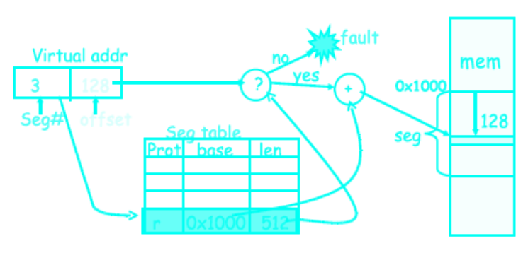

## Example
- 4-bit segment number (1st digit), 12 bit offset (last 3)
- Where is 0x0240? 0x1108? 0x265c? 0x3002? 0x1600?
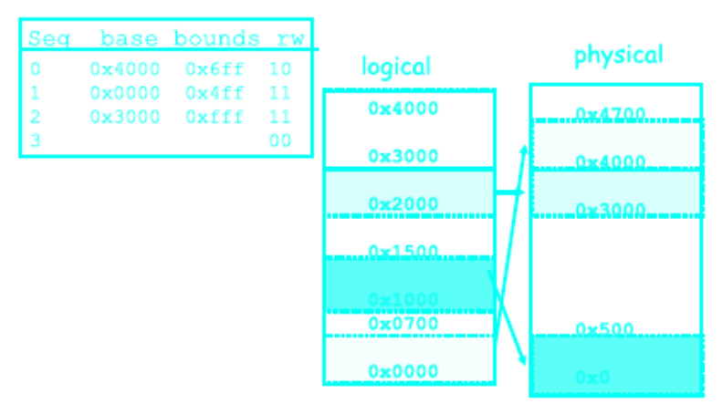

## Tradeoffs
Advantages
- Multiple segments per process
- Allows sharing

Disadvantages
- N byte segment needs N contiguous bytes of physical memory
- Fragmentation (need moving segments)

# Remember fragmentation problem
- Fragmentation => inability to use free memory
- Overtime:
  - Variable-size pieces = many small holes (external fragmentation)
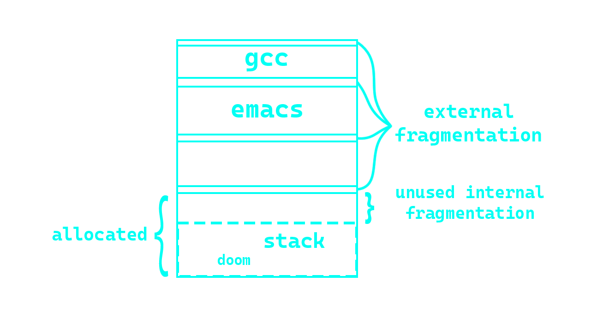

# Paging
Virtual memory is divided into small pages
- Pages are fixed size
- A page is contiguous

Map virtual pages to physical block
- Non contiguous allocation of blocks
- Each process has a separate mapping but can share the same physical block
- MMU

OS gains control on certain operations
- Non allocated pages trap to OS on access
- Read only pages trap to OS on write
- OS can change the mapping

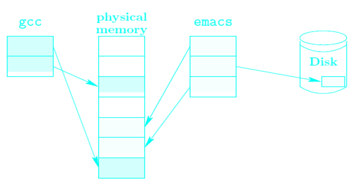

# Virtual address translation
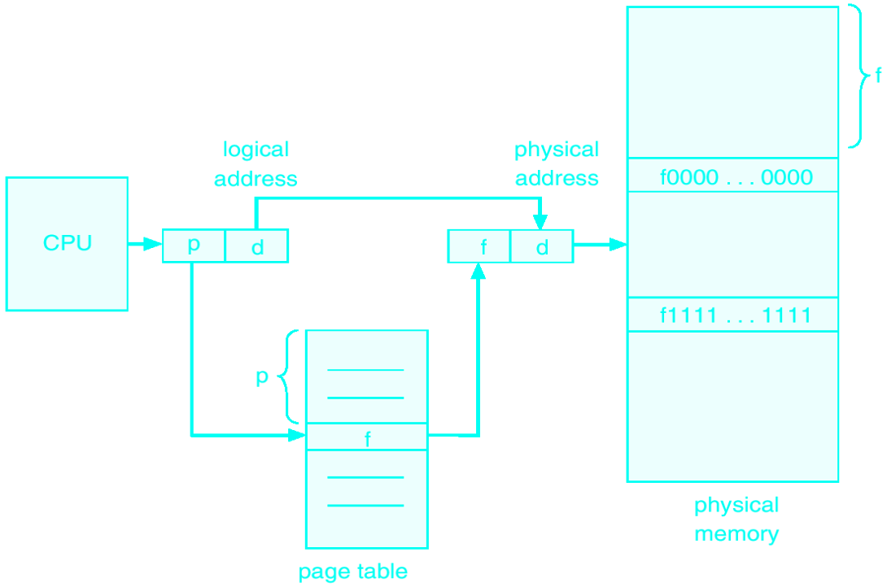
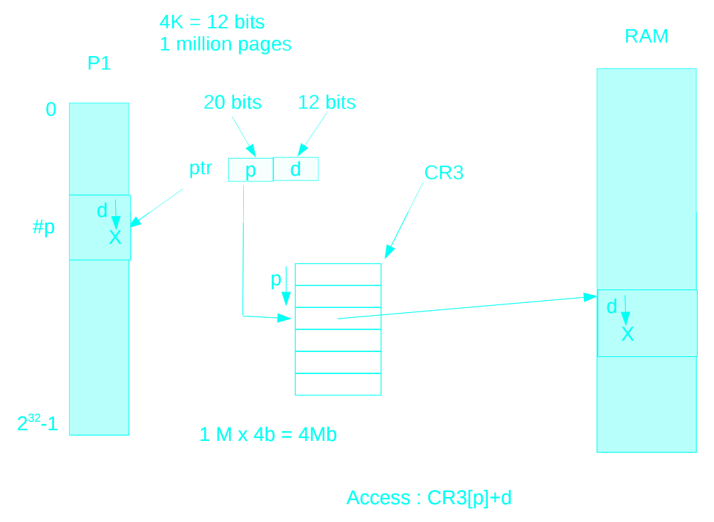

# Problems
## Translation speed
Require extra memory references on each load/store
- Cache recently used translations
- Locality principle: high probability that the next required address is close

Translation Lookaside Buffer (TLB)
- Fast (small) associative memory which can perform a parallel search
- Typical TLB
  - Hit time: 1 clock cycle
  - Miss rate: 1%
- TLB management: hardware or software

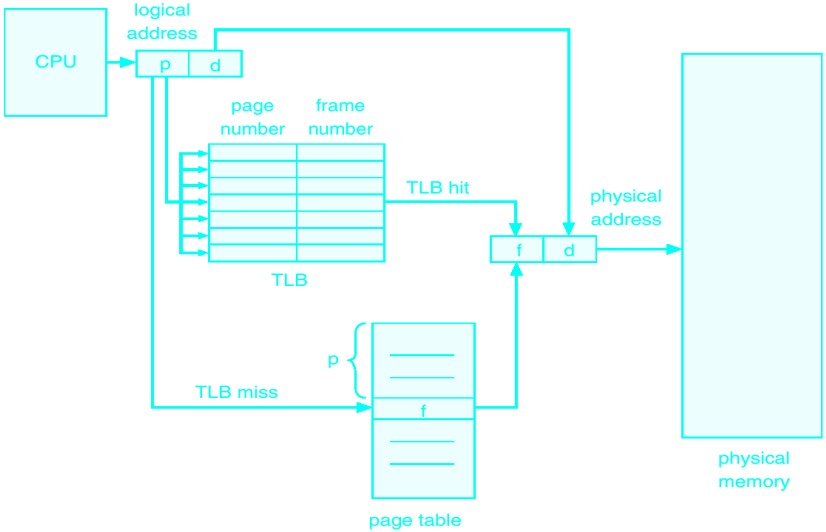

- What to do when switch address space ?
  - Flush the TLB
  - Tag each entry with the process's id
- Update TLB on page fault (add/remove TLB entries)

## Page table size
Flat page tables are huge:
- $32: 10 (1k) 10 (1K) 10 (1k) 2 (4)$
- $4Gb = 2^{32}$

Example
- 4GB of virtual memory (32 bits address)
- 4KB pages
- 20 bits page number, 12 bits offset
- 4MB page table size
  - 1 million entries : $2^{10} x 2^{10}$
  - PT size: $1K \times 1K \times 4 = 10^{3} \times 10^{3} \times 4 = 4 10^{6}$

64 bit address space?
- Page table size?
  - 52 bits for page number : 4.000 millions of millions
  - PT size: $1K \times 1K \times 1K \times 1K \times 1K \times 4 \times 8 = 32 10^{15}$
# Multi-level page tables
- Reduce the size of page tables in memory
- Structured page tables in 2 or more levels
  - All the page tables are not present in memory all the time
  - Some page tables are stored on disk and fetched if necessary
- Based on a on-demand paging mechanism

# Example: two level pages
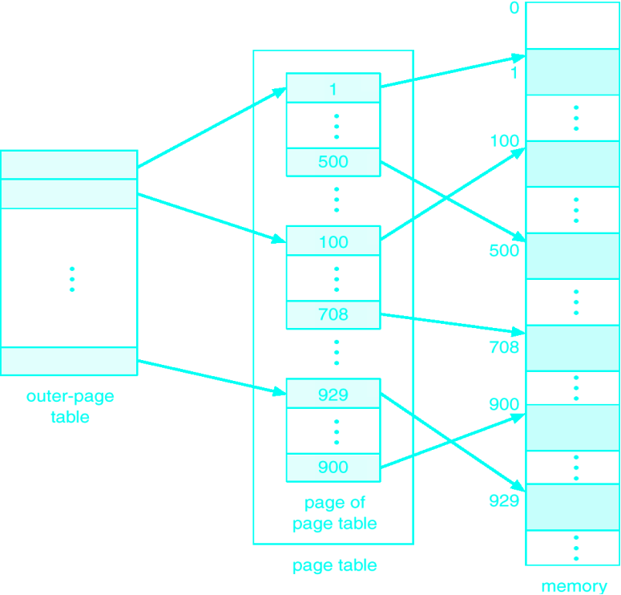
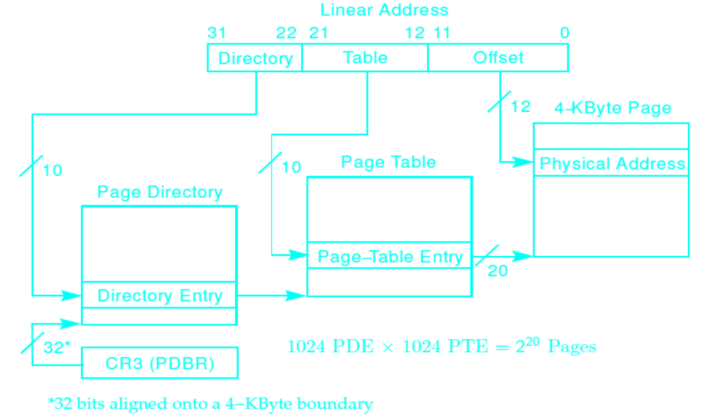

# On demand paging
- Virtual memory > physical memory
- Some pages are not present in memory (X)
- Stored on disk
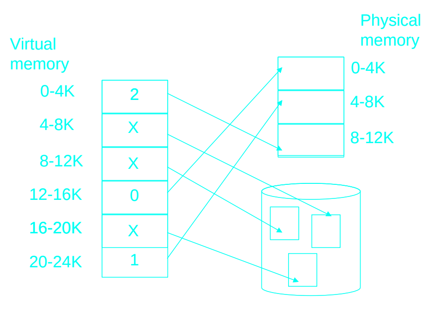

---
## Page fault
Access to an absent page
- Presence bit
- Page fault (Trap to OS)

Page fault management
- Find a free physical frame
  - If there is a free frame; use it
  - Else, select a page to replace (to free a frame)
  - Save the replaced page on disk if necessary (dirty page)
- Load the page from disk in the physical frame
- Update page table
- Restart instruction

Require a presence bit, a dirty bit, a disk @ in the page table

Different page replacement algorithms

---

# Page replacement algorithms
- Working set model
- Algorithms
  - Optimal
  - FIFO
  - Second chance
  - LRU

# Working set model
- Disk much much slower than memory (RAM)
  - Goal: run at memory (not disk) speed
- 90/10 rule: 10% of memory gets 90% of memory refs
  - So, keep that 10% in real memory, the other 90% on disk
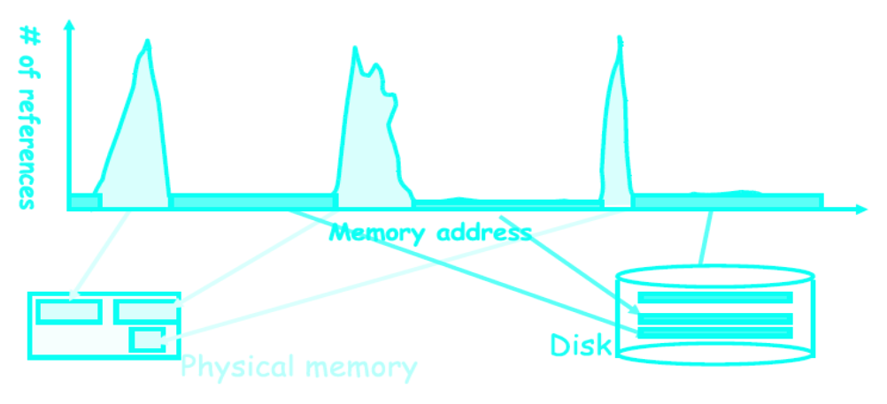

# Optimal page replacement
- What is optimal (if you knew the future)?
  - Replace pages that will not be used for longest period of time
- Example
  - Reference string : 0,1,2,3,0,1,4,0,1,2,3,4,1,2
  - 4 physicals frames
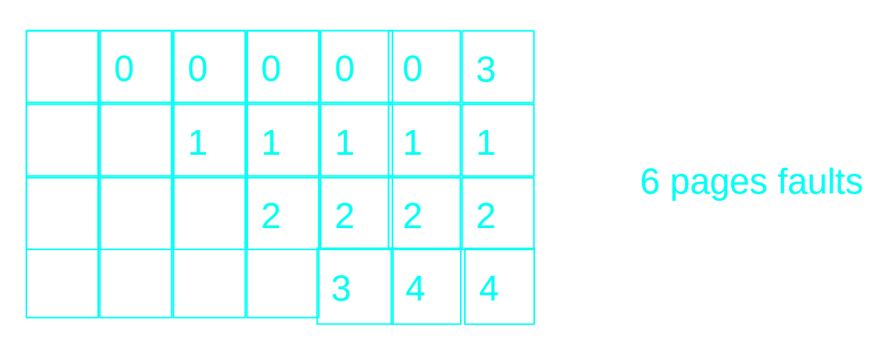

# FiFo
- Evict oldest page in system
- Example
  - Reference string : 0,1,2,3,0,1,4,0,1,2,3,4,1,2
  - 4 physicals frames:

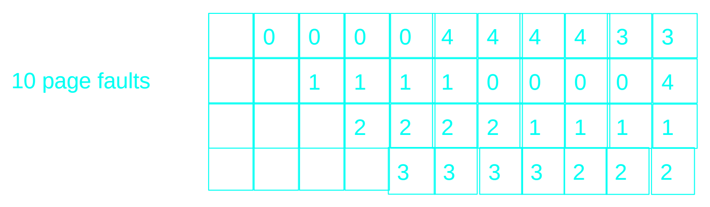

- Implementation: just a list (updated on page fault)

# LRU page replacement
- Approximate optimal with least recently used because past often predicts the future
- Example
  - Reference string : 0,1,2,3,0,1,4,0,1,2,3,4,1,2
  - 4 physicals frames:

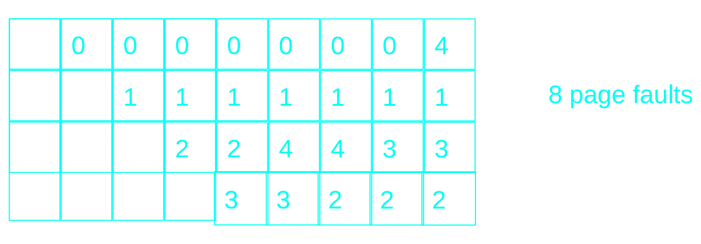

# LRU implementation
Expensive
- Need specific hardware
  - Track access without page fault

Approximate LRU
- The aging algorithm
  - Add a counter for each page (the date)
  - On a page access, all page counters are shifted right, inject 1 for the accessed page, else 0
  - On a page replacement, remove the page with the lowest counter

# Aging: example
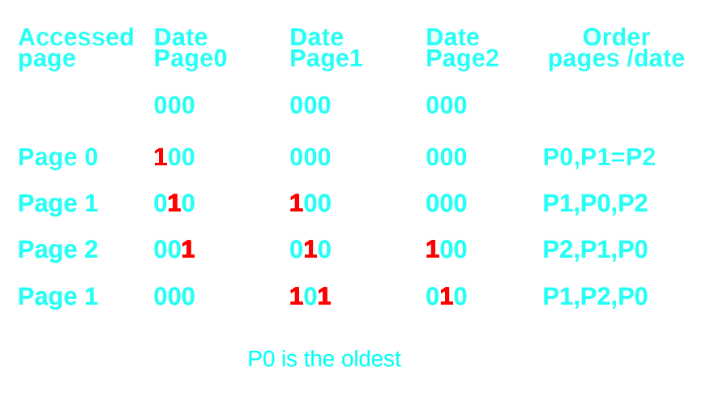

# Second chance
Simple FIFO modification
- Use an access bit R for each page
  - Set to 1 when page is referenced
  - Periodically reset by hardware
- Inspect the R bit of the oldest page (of the FIFO list)
  - If 0: replace the page
  - If 1: clear the bit, put the page at the end of the list, and repeat

Appromixation of LRU
- don’t have to parse all pages

# Page buffering
- Naïve paging
  - Page replacement : 2 disk IO per page fault
- Reduce the IO on the critical path
  - Keep a pool of free frames
    - Fetch the page in an already free page
    - Swap out a page in background

# Paging
- Separate linking from memory concern
- Simplifies allocation, free and swap
- Eliminate external fragmentation
- May leverage internal fragmentation
