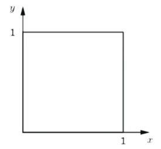
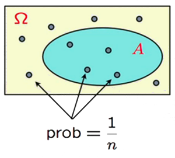



# I. Probability Theorem Overview
## 1. What is probability?
Provides rules for ***systematically*** thinking about uncertain situations. Definitions of probabilities:
- Physical tendencies.
- Long-term frequency (repeatable).
- Degree of belief.
The definitions complete each other. In this course, probabilities are viewed as a measure that satisfies the Kolmogorov axioms.
- Probability can be used to make predictions: data from real world $\to$ inference/statistics $\to$ good models for probability theory (aka analysis) $\to$ prediction/decision to real world.

## 2. A probabilistic model

A probabilistic model is a quantitative description of an experiment whose outcome is uncertain.
- Tossing a coin: $\Omega = \{H, T\}$.
- Rolling a die: $\Omega = \{1, 2, 3, 4, 5, 6\}$.
- Take in an exam: $\Omega = \{A, B, C, D, F\}$.



Putting together a probabilistic model:
- Step 1: define the possible outcomes (a.k.a sample space) $\Omega$.
- Step 2: specify a probability law, which describe the likelihood of each outcome.

# II. Sample Space
## 1. Definition


A sett of all possible outcomes $\Omega$.



All elements must be
- mutually exclusive.
- collectively exhaustive.


## 2. Conditions
- All elements must be
    - Mutually exclusive (no overlap).
    - Collectively exhaustive (cover all possible outcomes).

$\Omega$ could be discrete, continuous, finite, infinite,...


- Discrete/finite: two rolls of a 4-side dice:

|   4   |   x   |   x   |   x   |   x   |
| :---: | :---: | :---: | :---: | :---: |
|   3   |   x   |   x   |   x   |   x   |
|   2   |   x   |   x   |   x   |   x   |
|   1   |   x   |   x   |   x   |   x   |
|       |   1   |   2   |   3   |   4   |




- Throw a dart at a rectangular board: $\Omega = ((x, y) | 0 < x, y < 1| x, y \in \mathbb{R})$.



## 3. Set theorem
### Mathematical background: sets
- Empty set: $\emptyset$, Universal set: $\Omega$.
- Considering 5 sets:
  - $\Omega = {1, 2, ..., 10}$.
  - $A = \{1, 3, 5, 7, 9\}$.
  - $B = \{2, 4, 6, 8, 10\}$.
  - $C = \{1, 2, 3, 4, 5\}$.
  - $D = \{4, 8\}$.
- Notation:
  - Intersection: $A \cap C = \{1, 3, 5, 7, 9\} \cap \{1, 2, 3, 4, 5\} = \{1, 3, 5\}$.
  - Union: $A \cup C = \{1, 3, 5, 7, 9\} \cup \{1, 2, 3, 4, 5\} = \{1, 2, 3, 4, 5, 7, 9\}$.
  - Compliment: $A^c = \Omega \setminus A = \{2, 4, 6, 8, 10\}$.
  - Disjoint: $A \cap B = \emptyset$.
  - Subset: $A \subset \Omega$.
- De Morgan's laws:
  - $(A \cup B)^c = A^c \cap B^c$.
  - $(A \cap B)^c = A^c \cup B^c$.
### Probabilistic model


Is a mathematical description of a random phenomenon.
- Roll a die: $\Omega = \{1, 2, 3, 4, 5, 6\}$.
- Splitting a deck of cards into two piles: $\Omega = \{1, 2, ..., 52\}$.



Putting together such a model involves 2 key steps
- Define the sample space $\Omega$.
- Define the probability distribution $P$.


# III. Probability laws
## 1. Definition
### Probability Axiom

Event is a subset of the sample space. Probability is assigned to an ~~outcome~~ event.


- Example when rolling a dice:
  - $\Omega = \{1, 2, 3, 4, 5, 6\}$.
  - An outcome: one of the six numbers.
  - An event: "when the outcomes are even", "when the outcomes are odd", "when the outcomes are 1 or 2", "when the outcomes are 1 or 2 or 3",...


Probabilities must satisfy the following properties:
- Normalization: $P(\Omega) = 1$.
- Non-negative: $P(A) \geq 0$.
- Additivity: $P(A \cup B) = P(A) + P(B)$ if $A \cap B = \emptyset$.



1. $P(A) \leq 1$.
2. $P(\emptyset) = 0$.
3. $P(A^c) = 1 - P(A)$.
4. If $A \cap B \cap C$ then $A \cup B \cup C = P(A) + P(B) + P(C)$.
5. If $A \subset B$ then $P(A) \leq P(B)$.
6. $P(A \cup B) = P(A) + P(B) - P(A \cap B)$.


## 2. Uniform law
### Discrete uniform law

- $\Omega$ consists of $n$ equally likely elements.
- $A$ consists of $k$ elements.
- $\to$ Then $P(A) = \frac{\text{number of elements in A}}{\text{number of elements in }\Omega} = \frac{k}{n}$.
### Example
Two rolls of a fair 4-sided dice:

|   4   |   x   |   x   |   x   |   x   |
| :---: | :---: | :---: | :---: | :---: |
|   3   |   x   |   x   |   x   |   x   |
|   2   |   x   |   x   |   x   |   x   |
|   1   |   x   |   x   |   x   |   x   |
|       |   1   |   2   |   3   |   4   |

X: First roll\
Y: Second roll\
Every possible outcome has probability $\frac{1}{16}$.
- $P(X = 1) = P(Y = 1) = \frac{1}{16}$.
- $Z = min(X, Y) = \text{\\{}1, 2, 3, 4\text{\\}}$
- $P(Z = 1) = P(X = 1 \cap Y = 1) = P(X = 1)P(Y = 1) = \frac{1}{16} \times \frac{1}{16} = \frac{1}{256}$.
- $P(Z = 2) = P(X = 2 \cap Y = 2) = P(X = 2)P(Y = 2) = \frac{1}{16} \times \frac{1}{16} = \frac{1}{256}$.

### A Continuous uniform law
$(x, y)$ such that $0 < x, y < 1$ and $x, y \in \mathbb{R}$.\

Uniform law: Probability = Aree. Let's calculate:
- $P((x, y) | x+y \leq \frac{1}{2}) = \frac{1}{2} \times \frac{1}{2} = \frac{1}{4}$.
- $P({0.3, 0.7}) = \frac{0.3}{1} \times \frac{0.7}{1} = \frac{21}{100}$.
### Probability calculation steps
1. Specify the sample space $\Omega$.
2. Specify the probability law $P$.
3. Identify an event of interest $A$.
4. Calculate the desired probability $P(A)$.

Given $|a| < 1$
$$\sum_{i=0}^{\infty} \alpha^i = \frac{1}{1-\alpha}$$