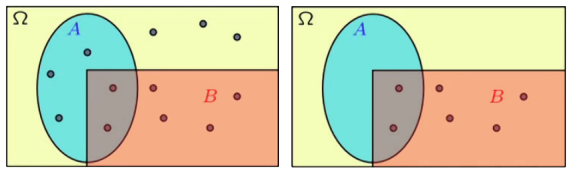



# I. Conditional probability
## 1. Definition
Consider 2 experiments:
- Roll a fair 6-sided dice:
  - $\Omega = \{1, 2, 3, 4, 5, 6\}$.
  - Prob $P(1) = \frac{1}{6}$, $P(2) = \frac{1}{6}$
- Roll a fair 6-sided dice, knowing the outcome is even
  - Event $A = \{2, 4, 6\}$.
  - Prob $P(1|A) = 0$, $P(2|A) = \frac{1}{3}$, $P(3|A) = 0$, $P(4|A) = \frac{1}{3}$, $P(5|A) = 0$, $P(6|A) = \frac{1}{3}$.

- Another example

  
  - $P(A) = \frac{1}{12}$ on left.
  - $P(A|B) = \frac{1}{6}$ on right.

### Conditional probability

 
$$ P(A|B) = \frac{P(A \cap B)}{P(B)} $$
 


### Multiplication rule


 
$$ P(A \cap B) = P(A|B)P(B) = P(B|A)P(A) $$
 


## 2. Total probability theorem

- Partition into $A_1, A_2, A_3,...
- $A_1 \cup A_2 \cup A_3 = \Omega$
- Have $P(A_i) > 0$ for all $i$.
- Have $P(B|A_i) > 0$ for all $i$.

### Definition


 
$$P(B) = \sum_{i=1}^n P(A_i)P(B|A_i)$$
 


## 3. Bayes' rule
- Have $P(A_i)$ for every $i$ *initial belief*.
- Revised *belief* after observing $B$.

$$P(A_i|B) = \frac{\text{multiplication rule}}{\text{total probability theorem}}$$


 
$$ P(A_i|B) = \frac{P(A_i)P(B|A_i)}{\sum_{j=1}^n P(A_j)P(B|A_j)} $$
 


### Bayesian Inference - A flash introduction


- Initial beliefs $P(A_i)$ on possible causes of an observed event $B$.
- Model of the world under each $A_i$
$$ A_i\ + \text{model } P(B|A_i) \to B $$
- Draw inference about causes
$$ B + \text{inference } P(A_i|B) \to A_i $$

# II. Independence
## 1. Definition
### Intuition explanation
  $$P(\text{roll a fair dice and get 6 | it is raining}) = ...$$
### Intuition "definition"
  $$P(A|B) = P(A)$$
### Definition of independence
  $$P(A|B) = P(A)$$
  $$\to P(A \cap B) = P(A)P(B)$$
- Quick check: two disjoint events, independent?
  $$A = \{1, 2, 3\}$$
  $$B = \{4, 5, 6\}$$
  $$P(A \cap B) = 0 \to \text{yes}$$
- $A$ and $B$ are independent, what about $A$ and $B^c$
  $$P(A \cap B^c) = P(A)P(B^c) = P(A)$$
  $$P(A|B^c) = P(A)$$
  $$P(A|B^c) = P(A) \neq P(A|B)$$
  $$A \text{ and } B^c \text{ are not independent}$$

## 2. Conditional independence

$$P(A \cap B) = P(A)P(B)$$


**Conditional independence, given C**

$$P(A \cap B|C) = P(A|C)P(B|C)$$
 


Quiz: Does independence imply conditional independence?
- No, consider $A = \{1, 2, 3\}$, $B = \{4, 5, 6\}$, $C = \{1, 2, 3, 4, 5, 6\}$.
- $P(A \cap B) = 0$, $P(A \cap B|C) = \frac{1}{6}$.

# III. Counting
## 1. Counting principle
### Discrete Uniform Law

- $\Omega$ consists of $n$ equally likely elements.
- $A$ consists of $k$ elements.

**Then**

$$P(A) = \frac{k}{n}$$

### Counting principle


- 4 shirts
- 3 ties
- 2 jackets

In how many ways can you dress up?



- Consider a sequence of $r$ stages, each stage has $n_i$ options. Then the number of possible choice is $n_1 \times n_2 \times \cdots \times n_r$.


### Examples


Consider license plates that consist of 2 letters followed by 3 digits. How many license plates are there?
- If there's no repetition, then $26 \times 26 \times 10 \times 10 \times 10 = 676,000$.



Number of ways ordering $n$ elements: $n!$



Number of subsets of $\text{\\{}1, 2, \cdots, n\text{\\}}$: $2^n$


## 2. Combinations


Given a set of $n$ elements. We want to construct a subset with exactly $k$ elements. How many ways can this be done?
- $k$ elements are chosen from $n$ elements.
- $k$ elements are chosen from $n-1$ elements.
- $k$ elements are chosen from $n-2$ elements.
- $\cdots$
- $k$ elements are chosen from $n-k+1$ elements.
- $k$ elements are chosen from $0$ elements.

$\to C_n^k = \frac{n!}{k!(n-k)!}$

