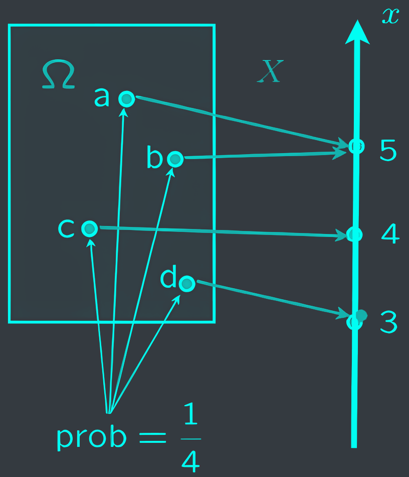
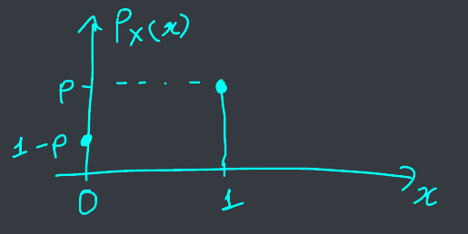
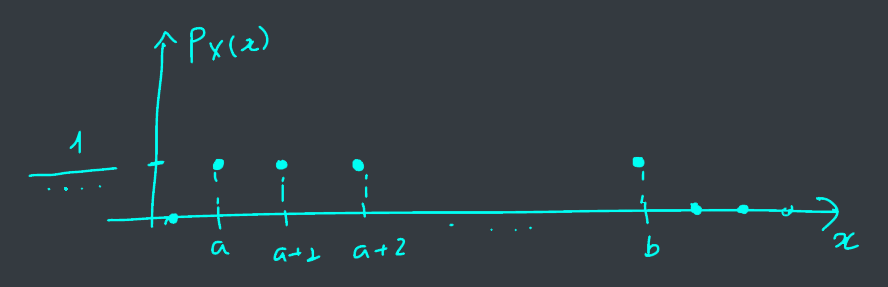
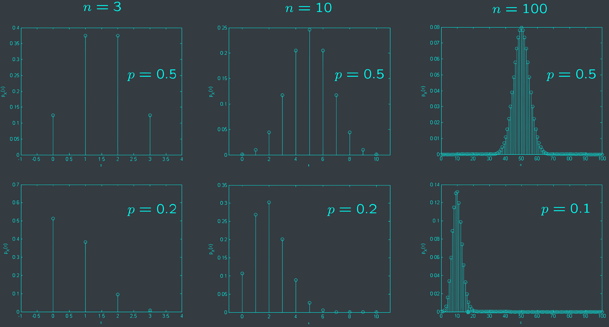



# I. Discrete Random Variables
## 1. Definition
### Discrete random variables
- An example:
  - A fair coin is tossed 3 times.
  - The random variable $X$ is the number of heads.
  - $X$ is a discrete random variable.
- Formal definition
  - $X$: sample space $\Omega \to \mathbb{R}$.
    outcome $\omega \mapsto x$.
- <c-red>Notation</c-red>: random variable $X$, numerical value $x$.

---
Some notes:
- One sample space could have multiple random variables.
- A function of random variable(s) is also a random variable.

## 2. Probability Mass Function



- PMF = probability law = probability distribution


$$p_{X}(x) = P(X = x)$$



- $p_{X}(x) \geq 0$.
- $\sum_{x \in \mathbb{R}} p_{X}(x) = 1$.


<--->



# II. Common random variables
## 1. Bernoulli

Bernoulli with parameter&nbsp;<c-red>$p \in [0, 1]$</c-red>:

$$X = \begin{cases}
1 & \text{with probability } p \\\
0 & \text{with probability } 1 - p
\end{cases}$$



- Plot the PMF?
- Indicator of an event A.

<--->



## 2. Uniform
Uniform with parameters&nbsp;<c-red>$a, b$</c-red>
- **Experiment**: pick one of $a, a + 1, \dots, b$ at random equally likely.
- **Sample space**: $\text{\\{} a, a + 1, \dots, b \\{}}$.
- **Random variable** $X$: $X(\omega) = \omega$.

## 3. Binomial
Binomial with parameters&nbsp;<c-red>positive integers $n, p \in [0, 1]$</c-red>
- **Experiment**: $n$ independent tosses of a coin with $P(\text{head}) = p$.
- **Sample space**: sequence of H and T, of length $n$.
- **Random variable** $X$: number of heads.


$$p_X(k) = \binom{n}{k} p^k (1 - p)^{n - k}$$
- $\binom{n}{k} = C_n^k = \frac{n!}{k! (n - k)!}$: from $n$ objects, choose $k$.


## 4. Geometric
Geometric with parameter&nbsp;<c-red>$0 < p < 1$</c-red>
- **Experiment**: infinite independent tosses of a coin with $P(\text{head}) = p$.
- **Sample space**: infinite sequence of H and T.
- **Random variable** $X$: number of tosses until the first head.


$$p_X(k) = (1 - p)^{k - 1} p$$


# III. Expectation
## 1. The Mean

The&nbsp;<c-red>expected value</c-red> (also called the expectation or the mean) of a random variable $X$, with $PMF$ $p_X(x)$, is defined as:
$$\mathbb{E}[X] = \sum_{x \in \mathbb{R}} x p_X(x)$$


### Bernoulli random variable
With parameter $p \in [0, 1]$:

$$X = \begin{cases}
1 & \text{with probability } p \\\
0 & \text{with probability } 1 - p
\end{cases}$$

### Linearity of expectation:

Given a random variable $X$:
$$\mathbb{E}[aX + b] = a \mathbb{E}[X] + b$$


## 2. Expected Value Rule
Let $X$ be a random variable, and $Y = g(X)$ be a function of $X$. By definition:
$$\mathbb{E}[g(X)] = \mathbb{E}[Y] = \sum_{y} y p_Y(y)$$


$$\mathbb{E}[g(X)] = \sum_{x} g(x) p_X(x)$$


## 3. The Variance
Average distance from the mean?

Variance is the expected value of the random variable $g(X) = (X - \mathbb{E}[X])^2$:
$$\text{var}(X) = \mathbb{E}[(X - \mathbb{E}[X])^2] = \mathbb{E}[X^2] - \mathbb{E}[X]^2$$



$$\sigma_X = \sqrt{\text{var}(X)}$$


### Bernoulli random variable

Bernoulli with parameter&nbsp;<c-red>$p \in [0, 1]$</c-red>:
$$X = \begin{cases}
1 & \text{with probability } p \\\
0 & \text{with probability } 1 - p
\end{cases}$$


### Properties of variance

Given a random variable $X$:
- $\text{var}[aX + b] = a^2 \text{var}\[X\]$.
- $\text{var}\[X\] = \mathbb{E}[X^2] - \mathbb{E}\[X\]^2$.

