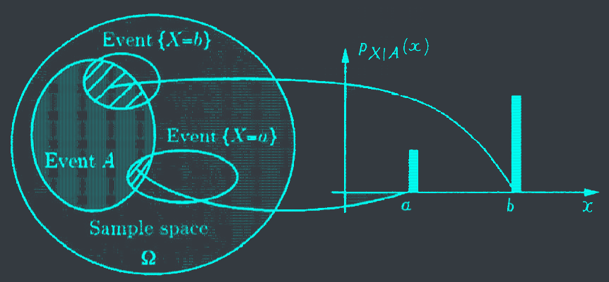
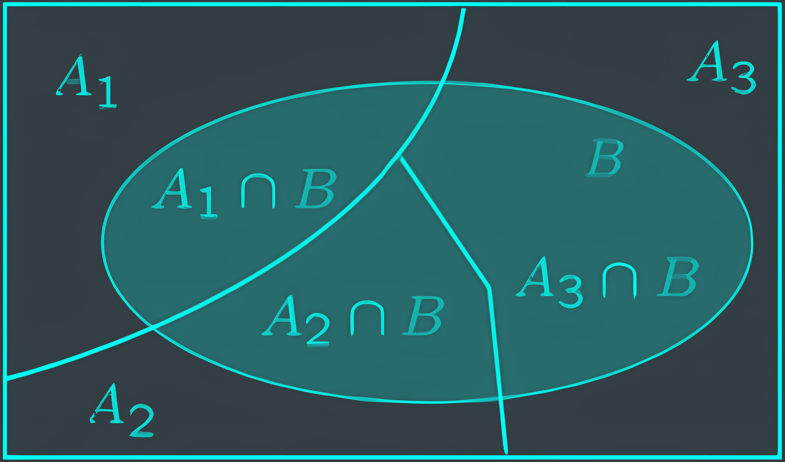
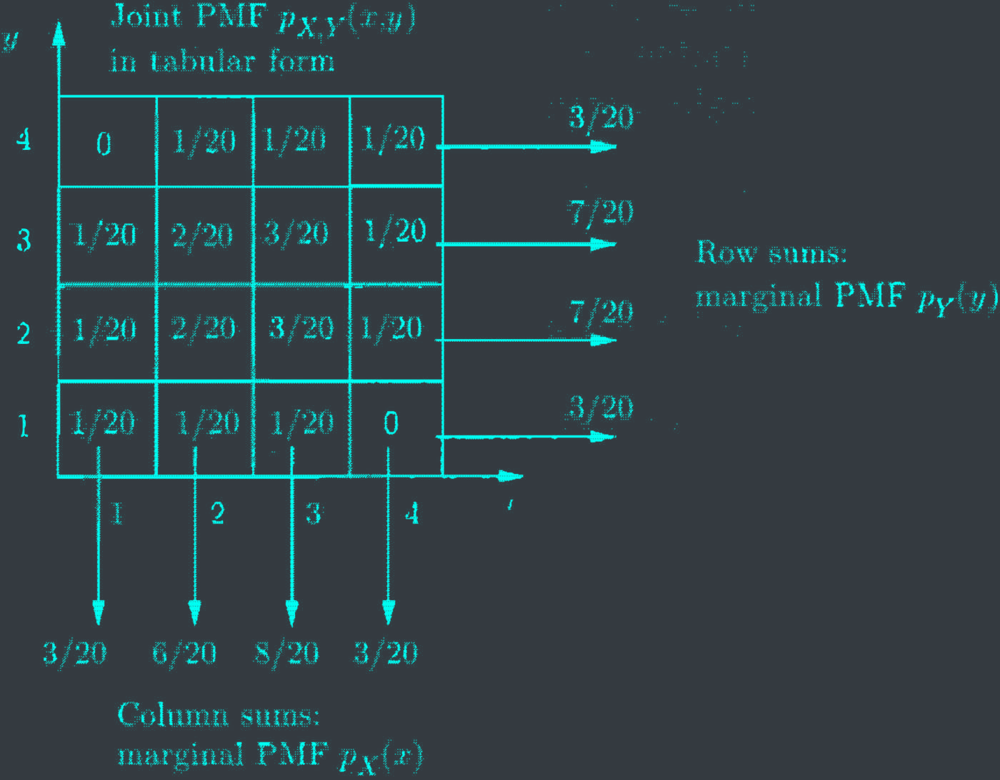
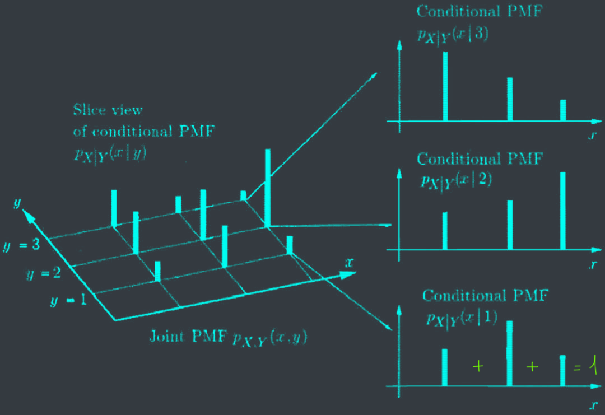



# The course so far

- Fundamental probability.
- Discrete random variables, probability mass function (PMF).
- Expectation: mean, variance, standard deviation.


# I. Conditional PMF on an event
## 1. Conditional PMF

The&nbsp;<c-red>conditional PMF</c-red>&nbsp; of $X$, given an&nbsp;<c-red>event $A$</c-red>&nbsp;with $P(A) > 0$ is defined as:
$$p_{X|A}(x) = P(X = x | A) = \frac{P(\text{\\{} X = x \text{\\}} \cap A)}{P(A)}$$

Sanity check: verify that
$$\sum_{x} p_{X|A}(x) = 1$$


Let
- $X$ be the roll of a fair 6-sided dice.
- $A$ be the event that the roll is even.
Calculate $p_{X|A}(x)$.



- $P_{X|A}(1) = \frac{P(X=1 \cap \text{even})}{P(\text{even})} = \frac{0}{\frac{1}{2}} = 0$
- $P_{X|A}(2) = \frac{P(X=2 \cap \text{even})}{P(\text{even})} = \frac{X=2}{\text{even}} = \frac{1/6}{1/2} = \frac{1}{3}$


## 2. Conditional expectation

The<c-red> conditional expectation </c-red>of $X$ given an event $A$ with $P(A) > 0$ is defined as:
$$\mathbb{E}[X|A] = \sum_{x} x p_{X|A}(x)$$



For a function $g(X)$
$$\mathbb{E}[g(X)|A] = \sum_{x} g(x) p_{X|A}(x)$$



Let
- $X$ be the roll of a fair 6-sided dice.
- $A$ be the event that the roll is even.
Calculate $\mathbb{E}[X|A]$.



$$\mathbb{E}[X|A] = \sum_{x} x p_{X|A}(x) = \sum_{x} x \frac{P(X=x \cap A)}{P(A)} = \sum_{x} x \frac{P(X=x \cap A)}{P(X=x)} = \sum_{x} x \frac{P(X=x \cap A)}{P(X=x \cap \text{even}) + P(X=x \cap \text{odd})} = \sum_{x} x \frac{P(X=x \cap A)}{P(X=x \cap \text{even})} = \sum_{x} x \frac{P(X=x \cap \text{even})}{P(X=x \cap \text{even})} = \sum_{x} x \frac{1}{2} = \frac{1}{2} \sum_{x} x = \frac{1}{2} \cdot \frac{1+2+3+4+5+6}{6} = \frac{7}{2}$$


## 3. Total expectation theorem
### Review


<--->

- Partition into $A_1, A_2, A_3$.
- Have $P(A_i) > 0$ for every $i$.
- Have $P(B|A_i) > 0$ for every $i$.
- $P(B) = ?$




<!-- P(B) = sum i = 1 to n: P(Ai)P(B|Ai) -->
$$P(B) = \sum_{i=1}^n P(A_i) P(B|A_i)$$

Consider event B: $X = x$:
$$p_X(x) = \sum_{i=1}^n P(A_i)p_{X|A_I}(x)$$


### Conditioned on an event

If $A_1, \ldots, A_n$ be<c-red> disjoint events </c-red>that form a partition of the sample space, with $P(A_i) > 0$ for all $i$, then
$$\mathbb{E}\[X\] = \sum_{i=1}^n P(A_i) \mathbb{E}\[X|A_i\]$$


### Mean an variance of the geometric

Geometric with parameter $0 < p \leq 1$:
$$p_X(k) = (1-p)^{k-1}p$$


# II. Multiple discrete random variables
## 1. Joint PMF

Consider 2 discrete random variables X and Y associated with the same experiment. The <c-red> joint PMF </c-red> of $X$ and $Y$ is defined as:
$$\begin{aligned}
p_{X,Y}(x,y) &= P(\text{\\{} X = x \text{\\}} \cap \text{\\{} Y = y \text{\\}}) \\\
&= P(X = x, Y = y)
\end{aligned}$$


## 2. Marginal PMF
We can calculate the PMFs of $X$ and $Y$ by using the following formula:

$$p_X(x) = \sum_{y} p_{X,Y}(x,y)$$

$$p_Y(y) = \sum_{x} p_{X,Y}(x,y)$$

Proof:

$$\begin{aligned}
p_X(x) &= P(X = x) \\\
&= \sum_{y} P(X = x, Y = y) \\\
&= \sum_{y} p_{X,Y}(x,y)
\end{aligned}$$

## 3. Expectation

A function $g(X,Y)$ of $X$ and $Y$ defines another random variable, and
$$\mathbb{E}\[g(X,Y)\] = \sum_x \sum_y g(x,y) p_{X,Y}(x,y)$$



$$\mathbb{E}\[aX_1 + bX_2 + c\] = a \mathbb{E}\[X_1\] + b \mathbb{E}\[X_2\] + c$$


# III. Conditional PMF on a random variable
## 1. Conditional PMF
### Conditional PMF on a random variable


The <c-red> conditional PMF $P(X = x|Y = y)$ </c-red> of $X$ given $Y$, is defined as:
$$p_{X|Y}(x|y) = \frac{P(\text{\\{} X = x, Y = y \text{\\}})}{P(Y = y)} = \frac{p_{X,Y}(x,y)}{p_Y(y)}$$


Sanity check: verify that
$$\sum_{x} p_{X|Y}(x|y) = 1$$

### Joint, marginal, conditional PMF
The conditional PMF of $X$ given $Y$ is related to the joint PMF by
$$p_{X,Y}(x,y) = p_Y(y) p_{X|Y}(x|y)$$

## 2. Conditional expectation
### Conditional expectations on a random variable


The <c-red> conditional expectation </c-red> of a random variable $X$ given a value <c-red> $y$ </c-red> of $Y$ is defined as:
$$\mathbb{E}\[X|Y = y\] = \sum_x x p_{X|Y}(x|y)$$


### Total expectation theorem


Given 2 random variable $X$ and $Y$
$$\mathbb{E}\[X\] = \sum_y p_Y(y) \mathbb{E}\[X|Y = y\]$$

By word: the unconditional average can be obtained by averaging the conditional averages.

## 3. Independence

- Between events
- Random variables from an event
- Between random variables



Two random variables $X$ and $Y$ are <c-red> independent </c-red> if and only if
$$p_{X,Y}(x,y) = p_X(x) p_Y(y)$$



If $X$ and $Y$ are independent random variables, prove that
$$\mathbb{E}\[XY\] = \mathbb{E}\[X\] \mathbb{E}\[Y\]$$
$$var(XY) = var(X) + var(Y)$$

