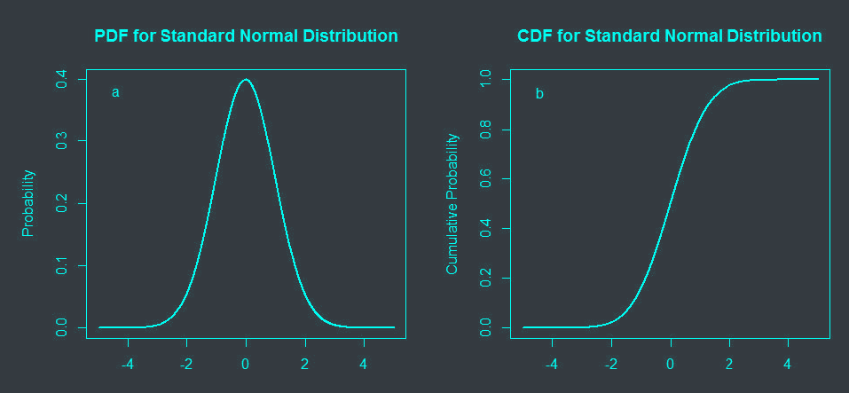
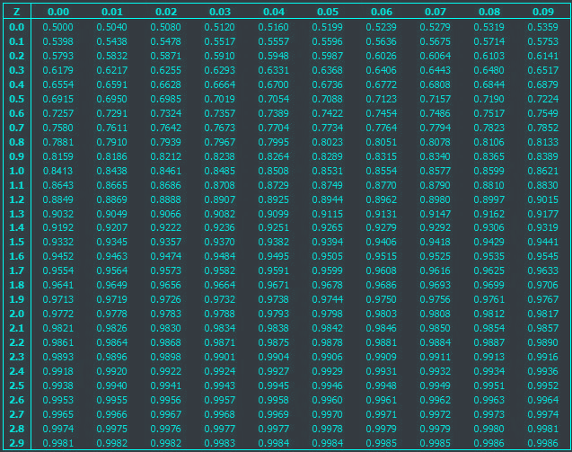
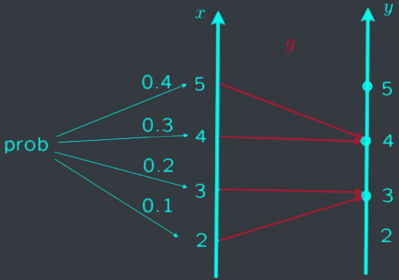
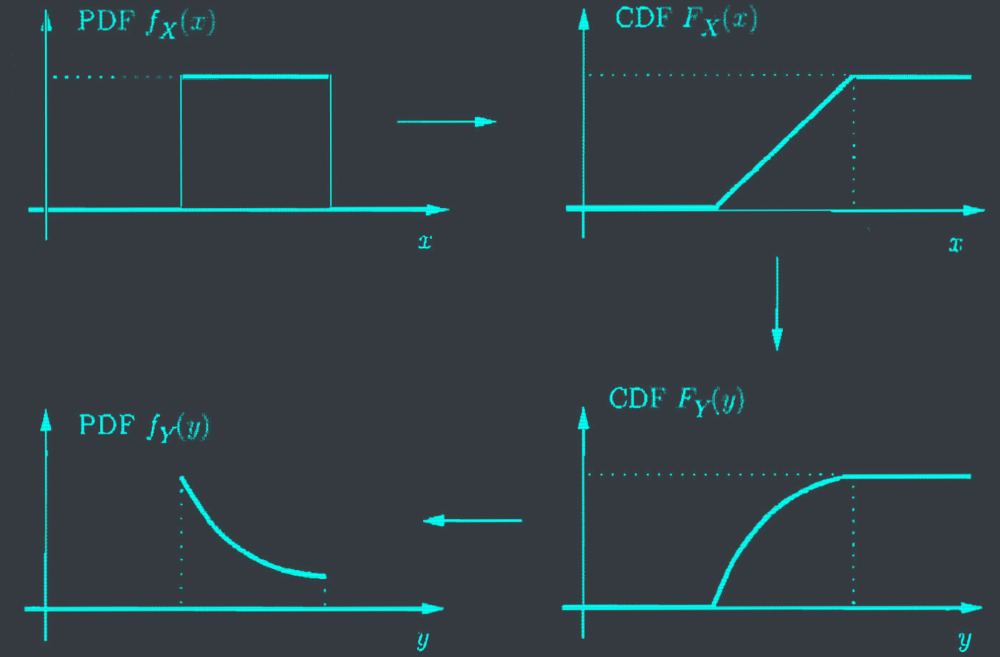



# The course so far

- Fundamental probability.
- Discrete random variables, probability mass function (PMF).
- Continuous random variables, probability density function (PDF).


# I. Calculation of normal probability
## 1. Standard normal distribution
### Standard gaussian random variable

A continuous random variable $X$ is said to be <c-red> standard normal $N(0, 1)$ </c-red> if its PDF is given by:
$$f(x) = \frac{1}{\sqrt{2 \pi}} e^{-\frac{x^2}{2}}$$


### Standard normal table

Example, we need to find $P(X \leq 1.76)$.
- $P(X \leq 1.76) = \phi(1.76) = \phi(1.7) + \phi(0.06)$
- $\to$ look up the intersection of the row for $1.7$ and the column for $0.06$.
- $\to$ the value is $0.9608$.

### Examples

Let $X \sim N(0, 1)$. Calculate the following probabilities:
- $P(X \leq 2.5) = \phi(2.5) = 0.9938$
- $\phi(1.76) = 0.9632$
- $\phi(-2) = 0.0228$
- $P(1 \leq X \leq 2.93)$\
$\begin{aligned}
&= P(X \leq 2.93) - P(X \leq 1) \\\
&= \phi(2.93) - \phi(1) \\\
&= 0.9987 - 0.8413 \\\
&= 0.1574
\end{aligned}$



## 2. Normal distribution
### Standardizing a random variable

Let
- $X \sim N(\mu, \sigma^2)$
- $Y = \frac{X - \mu}{\sigma}$

Then $Y \sim N(0, 1)$.


### Example

Let $X \sim N(6, 4)$. Calculate
- $P(2 \leq X \leq 10)$

$\begin{aligned}
&= P(2 \leq X \leq 8) \\\
&= P(X \leq 8) - P(X \leq 2) \\\
&= P(\frac{X - 6}{2} \leq \frac{8 - 6}{2}) - P(\frac{X - 6}{2} \leq \frac{2 - 6}{2}) \\\
&= \phi(\frac{8 - 6}{2}) - \phi(\frac{2 - 6}{2}) \\\
&= \phi(1) - \phi(-2) \\\
&= 0.8413 - 0.0228 \\\
&= 0.8185
\end{aligned}$





{}
[Normal Distribution & Probability Problems
](https://www.youtube.com/watch?v=gHBL5Zau3NE)
{}

# II. Derived distributions
- Derived distributions: given the PDF of $X$, calculate the PDF of $Y = g(X)$.

## 1. Discrete random variables
### A simple example

$$p_Y(y) = P(g(X) = y) = \sum_{x:g(x)=y} p_X(x)$$

### A linear function of a discrete random variable

Given $Y = aX + b$:
$$p_Y(y) = p_X(\frac{y - b}{a})$$


## 2. Continuous random variables
### A linear function of a continuous random variable

Given $Y = aX + b$:
$$f_Y(y) = \frac{1}{|a|} f_X(\frac{y - b}{a})$$


### A linear function of a normal random variable

Given $X \sim N(\mu, \sigma^2)$, $Y = aX + b$:
$$ f_X(x) = \frac{1}{\sqrt{2 \pi \sigma^2}} e^{-\frac{(x - \mu)^2}{2 \sigma^2}}$$
Find $f_Y(y)$.

$$\begin{aligned}
f_Y(y) &= \frac{1}{|a|} f_X(\frac{y - b}{a}) \\\
&= \frac{1}{|a|} \frac{1}{\sqrt{2 \pi \sigma^2}} e^{-\frac{(\frac{y - b}{a} - \mu)^2}{2 \sigma^2}} \\\
&= \frac{1}{\sqrt{2 \pi \sigma^2}} e^{-\frac{(y - a\mu - b)^2}{2 \sigma^2}}
\end{aligned}$$


## 3. The PDF of a general function

2-step process:
- Find the CDF of $Y$: $F_Y(y) = P(Y \leq y)$
- Differentiate $f_Y(y) = \frac{dF_Y(y)}{dy}$



$X$ uniform on $[0, 2]$. $Y = X^3$. Find $f_Y(y)$.

$$\begin{aligned}
f_Y(y) &= P(Y \leq y) \\\
&= P(X^3 \leq y) \\\
&= P(X \leq \sqrt[3]{y}) \\\
&= \frac{1}{2} \sqrt[3]{y} \\\
&= \frac{1}{2} y^{1/3}
\end{aligned}$$


# III. Covariance and correlation
## 1. Covariance

The<c-red> covariance </c-red> of 2 random variables $X$ and $Y$ is defined as:
$$cov(X, Y) = E[(X - E[X])(Y - E[Y])]$$

- When $cov(X, Y) > 0$, $X$ and $Y$ are <c-red> positively correlated </c-red>.
- When $cov(X, Y) < 0$, $X$ and $Y$ are <c-red> negatively correlated </c-red>.
- When $cov(X, Y) = 0$, $X$ and $Y$ are <c-red> uncorrelated </c-red>.

---
Properties:
- $cov(X, Y) = \mathbb{E}[XY] - \mathbb{E}\[X\]\mathbb{E}[Y]$
- $cov(X, X) = var(X)$
- $cov(X, aY + b) = a cov(X, Y)$
- $cov(X, Y + Z) = cov(X, Y) + cov(X, Z)$

## 2. Correlation

The <c-red> correlation coefficient </c-red> $\rho_{X, Y}$ is defined as:
$$\rho_{X, Y} = \frac{cov(X, Y)}{\sqrt{var(X)var(Y)}}$$
and satisfies
$$-1 \leq \rho_{X, Y} \leq 1$$
