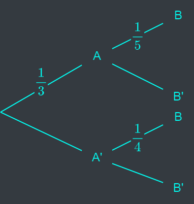

# Question 1
a. Consider event $A$ and $B$. Prove that $P(A) = P(A \cap B) + P(A \cap B^c)$

b. The tree diagram shows a complete picture of the various probabilities associated with event $A$ and $B$. Find $P(A|B)$. It is noted that $A' = A^c$ and $B' = B^c$.

# Question 2
Lisa goes to school by bicycle $60%$ of the time and by bus $40%$ of the time. If she uses her bicycle she arrives on time $95%$ of the time but if she catches the bus she comes late $2%$ of the time.
1. Draw fully labelled tree diagram and then find the probability that Lisa arrives on time on any particular day.
2. In any day by using bicycle, Lisa passes through three traffic lights on her way to school, and each light is equally likely to be green or red, independent of the others. What is the PMF, the mean, and the variance of the number of red lights that Lisa encounters?

# Question 3
The masses of honeydews are normally distributed with mean 1.0 kg and standard deviation 2 kg. The masses of rock melons are normally distributed with mean 1.5 kg and standard deviation 3 kg.
1. Honeydews are sold at 2$ per kg and rock melons at 3S per kg. Find the probability that 2 honeydews and a rock melon cost more than 10$.
2. Find the probability that the difference in masses of a honeydew and a rock melon is less than 0.5 kg.

# Question 4
If n people are present in a room, what is the probability that no two of them celebrate their birthday on the same day of the year? How large need n be so that this probability is less than 0.5?