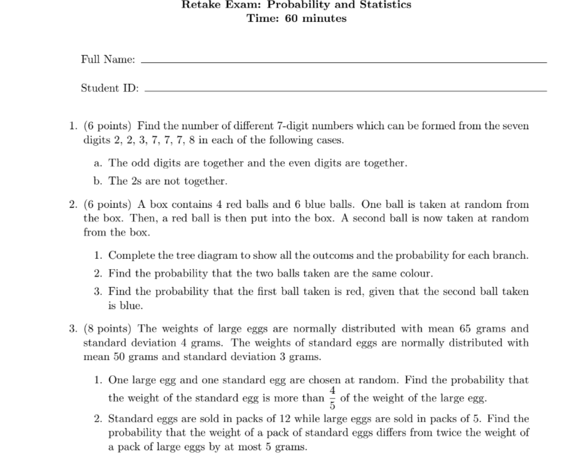

{}

{}

# Question 1
Find the number of different 7-digit numbers which can be formed from the seven digits 2, 2, 3, 7, 7, 7, 8 in each of the following cases:
    a. The odd digits are together and the even digits are together.
    b. The 2s are not together.

# Question 2
A box contains 4 red balls and 6 blue balls. One ball is taken at random from the box. Then, a red ball is then put into the box. A second ball os now taken at random from the box.
1. Complete the tree diagram to show all the outcomes and the probability for each branch.

2. Find the probability that the 2 balls taken are the same color.

3. Find the probabolity that the first ball taken is red, given that the second ball taken is blue.

# Question 3
The weights of large eggs are normally distributed with mean 65 grams and standard deviation 4 grams. The weights of standard eggs are normally distributed with mean 50 grams and standard deviation 3 grams.
1. One large egg and one standard egg are chosen at random. Find the probability that the weight of the standard egg is more than $\frac{4}{5}$ of the weight of the large egg.

2. Standard eggs are sold in packs of 12 while large eggs are sold in packs of 5. Find the probability that the total weight of a pack of standard eggs differs from twice the weight of a pack of large eggs by at most 5 grams.