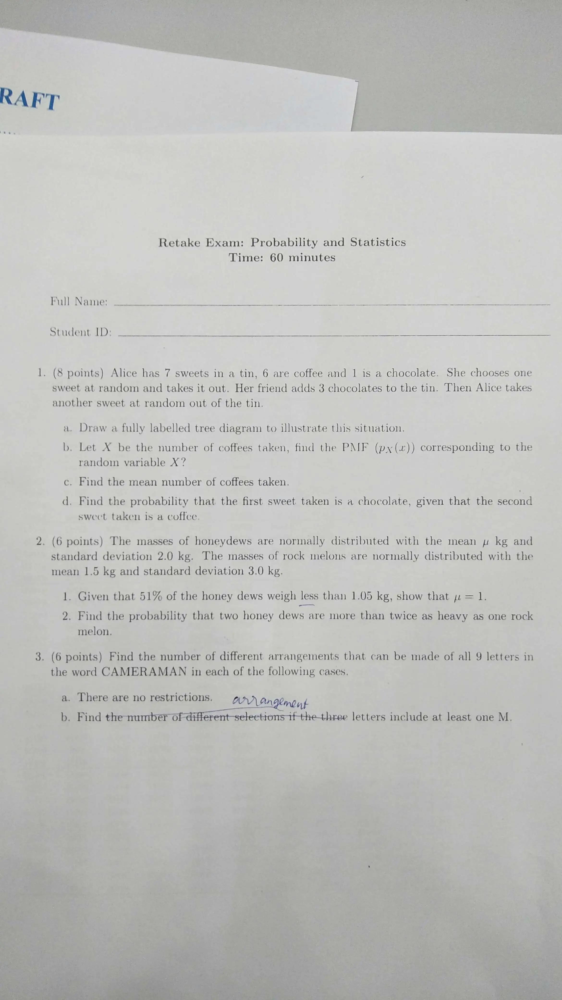

{}

{}

# Question 1
(8 points) Alice has 7 sweets in a tin, 6 are coffee and 1 is a chocolate. She chooses one sweet at random and takes it out. Her friend adds 3 chocolates to the tin. Then Alice takes another sweet at random out of the tin.
&emsp; a. Draw a fully labelled tree diagram to illustrate this situation.
&emsp; b. Let $X$ be the number of coffees taken, find the PMF $\mathbb{p}_{X}(x)$ corresponding to the random variable $X$?
&emsp; c. Find the mean number of coffees taken.
&emsp; d. Find the probability that the first sweet taken is a chocolate, given that the second sweet taken is a coffee.

# Question 2
(6 points) The masses of honey dews are normally distributed with the mean $\mu$ kg and standard deviation 2.0 kg. The masses of rock melons are normally distributed with the mean 1.5 kg and standard deviation 3.0 kg.
&emsp; 1. Given that 51% of the honey dews weigh less than 1.05 kg, show that $\mu = 1$.
&emsp; 2. Find the probability that two honey dews are more than twice as heavy as one rock melon.

# Question 3
(6 points) Find the number of different arrangements that can be made of all 9 letters in the word **CAMERAMAN** in each of the following cases.
&emsp; a. There are no restrictions.
&emsp; b. Find the number of arrangements in which at leat one M is included.
