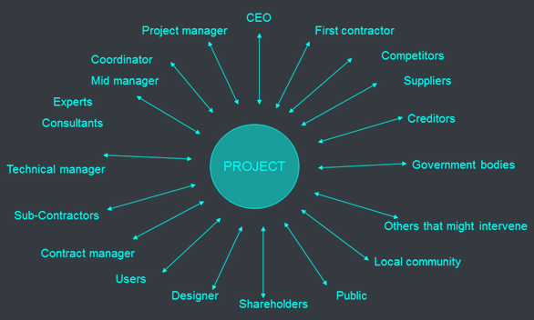



# 1. Concept, overview of project - historical projects

- The tower was built in 1812 during the Nguyen dynasty as an observation post to the Hanoi Citadel.

- The bridge was built in 1899—1902 by the architects Daydé & Pillé of Paris, and opened in 1903. Before North Vietnam's independence in 1954, it was called Paul-Doumer Bridge, named after Paul Doumer - The Governor-General of French Indochina and then French president. At 1.68km (1.04mi) in length, it was, at that time, one of the longest bridges in Asia.

The bridge was built in 1983 - 1985, is a major river road bridge in Hanoi. At 1.23km in length.

The bridge was built in 1899 - 1990, is a bridge in Hue, Vietnam. Spanning over the Perfume River.

# 2. Origin and etymology of the word "project"
- The word *project* comes from the Latin word *projectum* from the Latin verb *proicere*, "before an action" which in turn comes from *pro-*, which denotes precedence, something that comes before something else in time (paralleling the Greek πρό) and *iacere*, "to do". The word "project" thus originally meant "before an action".
- When the English language initially adopted the word, it referred to a plan of something, not to the act of actually carrying this plan out. Something performed in accordance with a project became known as an "object". Every project has certain phases of development.

# 3. Project synonyms
## Synonyms
- Arrangement, blueprint, design, game, game plan, ground plan, master plan, program, plan, road map, scheme, strategy, system.
## Related words
- Collusion, conspiracy, plot; contrivance, device, gambit, maneuver, ruse, stratagem, subterfuge,trick; counter-plan, counter-strategy; means, tactic, technique, way; procedure, protocol; conception, idea , proposal, specific (s), specification(s); aim, intent, intention, purpose; diagram, formula, layout, map, pattern, platform, policy, recipe, setup.

# 4. Definition of project
- "A project is a temporary endeavor undertaken to create a unique product, service, or result."
  - *Project Management Institute (PMI) - A Guide To The Project Management Body Of Knowledge (PMBOK Guide)* Fourth Edition 3.
- "A project is a temporary organization that is created for the purpose of delivering one or more business products according to an agreed Business Case."
  - *Office of Government Commerce (OGC) - Managing Successful Projects with PRINCE Fifth* Edition 4.
- "A project is a time and cost constrained operation to realize a set of defined deliverables (the scope to fulfil the projects objectives) up to quality standards and requirements." International Project Management Association (IPMA)
  - *IPMA Competence Baseline* (ICB) Version 3.05.
- "Project is a unique, transient endeavour undertaken to achieve a desired outcome." Association for Project Management (APM)
  - *APM Body of Knowledge* Fifth Edition 6.
- "A project refers to a value creation undertaking based on a specific, which is completed in a given or agreed time frame and under constraints, including resources and external circumstances."
  - *Project Management Association of Japan (PMAJ) - A Guidebook of Project & Program Management for Enterprise Innovations (P2M)* 2005 Edition 7.
- "Project is a unique process consisting of aset of coordinated and controlled activities with start and finish dates, undertaken to achieve an objective conforming to specific requirements including constraintsof time, cost and resources."
  - ISO 10006:2003 - *Quality Management Systems - Guidelines for Quality Management* in Projects 8.
- "Project is a unique set of coordinated Activities, with defined starting and finishing points, undertaken by an individual or organization to meet specific objectives with defined schedule, cost and performance parameters."
  - *British Standards Institute: BS 6079-1: Guide to Project Management 9*.
- "A project is a temporary endeavour undertaken to create a unique product, service or result in order to achieve an outcome."
  - *Australian Institute of Project Management (AIPM): AIPM Professional Competency Standards for Project Management* 2008 Edition 10.
- "A project is a managed set of interrelated resources that delivers one or more products to a customer or end user. The set of resources has a definite beginning and end and operates according to a plan."
  - *Software Engineering Institute (SEI): Capability Maturity Model Integration (CMMI)* 12.
- "A project is a managed set of interrelated resources that delivers one or more products to a customer or end user. The set of resources has a definite beginning and end and operates according to a plan."
  - *Software Engineering Institute (SEI): Capability Maturity Model Integration (CMMI)* 13.
- "A project can be considered to be any series of activities and tasks that:
  - Have a specific objective to be completed within certain specifications
  - Have defined start and end dates
  - Have funding limits (if applicable)
  - Consume human and nonhuman resources (ie, money, people, equipment)
  - Are multifunctional (ie, cut across several functional lines)"
  - *Harold Kerzner: Project Management: A Systems Approach to Planning, Scheduling and Control Tenth* Edition 14.
- "A project is a temporary organization to which resources are assigned to do work todeliver beneficial changes."
  - *J. Rodney Turner: A Handbook of Project-Based Management – Leading Strategic Change in Organizations* Third Edition 15.
- "Projects are the building blocks in the designand execution of strategies for an organization. Projects provide an organizational focus for conceptualizing, designing, and creating new or improved products, services, and organizational processes." 
  - David I. Cleland: *Field Guide to Project Management* Second Edition 16.
- "A project is a problem scheduled for solution.", "All improvement takes place Project-by-Project and in no other way.", "All Projects follow the "Universal Sequence for Breakthrough."
  - Joseph M. Juran (1904 – 2008) 17.
---
From these definitions, the following definition is more appropriate for us:
- A project is a temporary endeavour undertaken to create a unique product, service or result in order to achieve an outcome.
  - *Australian Institute of Project Management (AIPM): AIPM Professional Competency Standards for Project Management* 2008 Edition 10.

# 5. Characteristics of projects
- Specific deliverable.
- A specific time-frame.
- A budget.
- Working across organizational boundaries.
- Unique specifications.

# 6. Other common characteristics of projects
- Multi-disciplinary.
- Complex.
- Conflict.
- Part of a larger program.

# 7. This is not a project
- Work/activity are repetitive.
- Too small-scaled. Some companies specify a minimum budget with which an activity cannot be seen as "a project", e.g., US$50,000 or US$250,000; but some others do not have such constraints.

# 8. Project stakeholders
- Project stakeholders are individuals and organizations who are actively involved in the project, or whose interests may be positively or negatively affected as a result of project execution or successful project completion.

# 9. Reasons for success or failure of projects
## Reasons for failure
- Failure to align projects with organizational strategy.
- Poor scope definition.
- Unrealistic expectations.
- Lack of executive sponsorship.
- Lack of project management skills.
- Inability to resolve conflicts.
- Political issues.
## Reasons for success
- Project sponsorship at executive level.
- Good project charter.
- Strong project management skills.
- The right people on the project team.
- Good decision making.
- Good communication.
- Team members towards the same goal.

# 10. How to prepare a project:
- Step 1: the project scope:
  - Project mission and goal.
  - Goal and terms of reference.
- Step 2: project planning:
  - Project milestones.
  - Project organization.
- Step 3: project execution:
  - Taking decisions.
  - Doing activities.
- Step 4: project control:
  - Quantitative control.
  - Qualitative control.
- Step 5: project communication:
  - Internally.
  - Externally.