

A signal is a function of one or more variables.
  - 1-dimensional signal: a speech signal.
  - 2-dimensional signal: an image.
  - 3-dimensional signal: a video.

# I. Objectives
At the end of this lesson, you should be able to
- Distinguish different kinds of signals: continuous, discrete, analog, digital,...
- Apply signals' transformation: time shift, time reversal, scaling

# II. Classifying signals
There are many ways in which signals can be classified.
- Continuous-time and discrete-time signals.
- Alanog and digital signals.
- Periodic and aperiodic signals.
- Even and odd signals.
- Energy and power signals.

## 1. Continuous-time and discrete-time signals

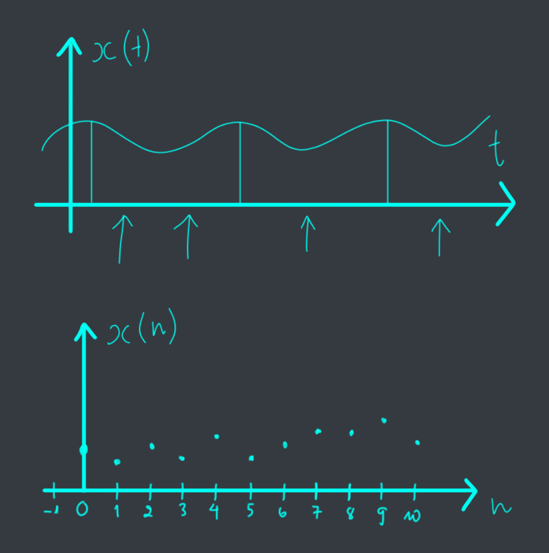

## 2. Analog vs digital signals
Continuous-valued vs discrete-valued signals.

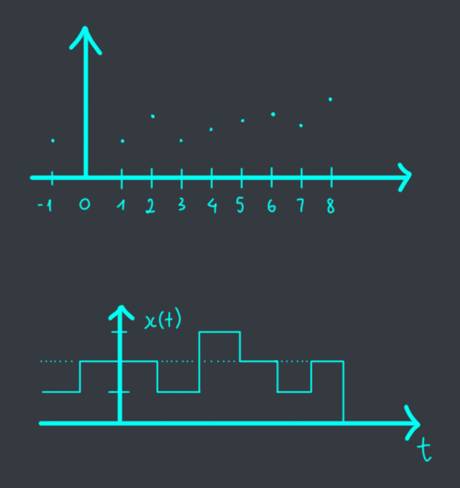

$ is said to be *periodic* if for a positive constant $T_0$:
$$x(t) = x(t + T_0) \forall t$$

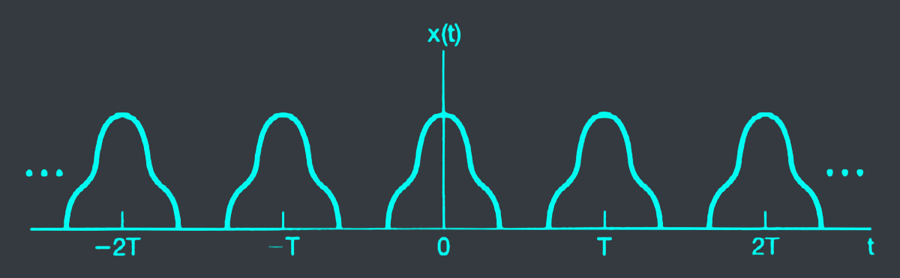

## 4. Even and odd signals
A signal $x(t)$ is said to be *even* if:
$$x(t) = x(-t) \forall t$$
and *odd* if:
$$x(t) = -x(-t) \forall t$$

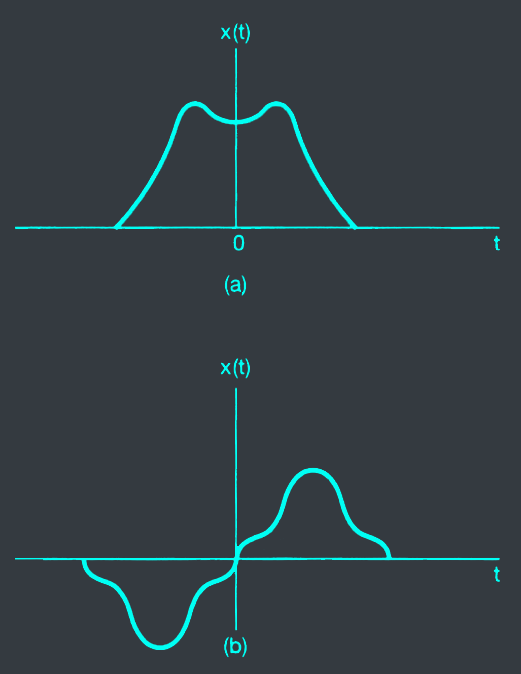

## 5. Energy and power signals
- Energy of a continuous-time signal $x(t)$ is defined as:

$$E_x = \int_{-\infty}^{\infty} |x(t)|^2 dt$$

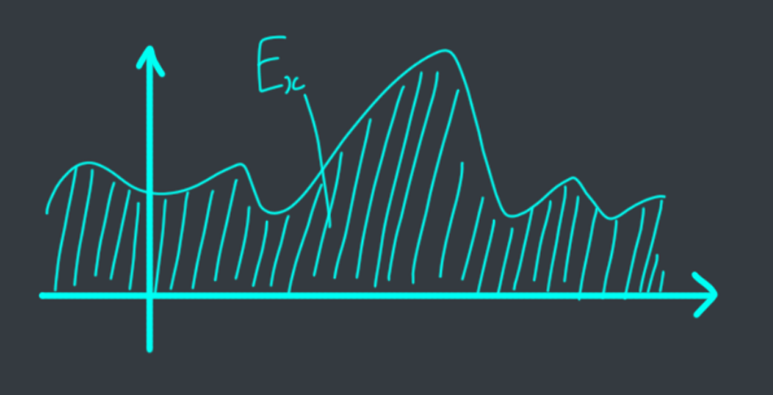

- Energy of a discrete-time signal $x[n]$ is defined as:

$$E_x = \sum_{n=-\infty}^{\infty} |x[n]|^2$$

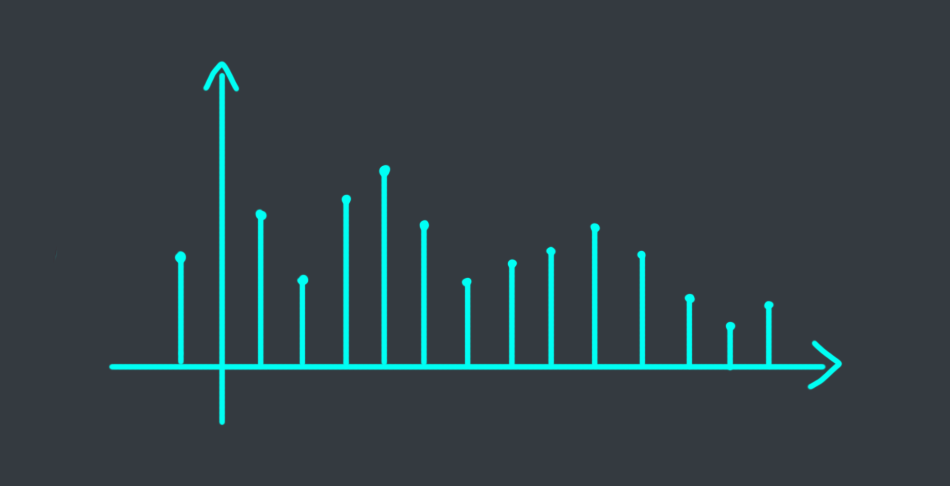

- A signal having finite energy is called *energy signal*.
- Power of a signal is defined as the average energy of that signal over time.
- Power of a continuous-time signal $x(t)$ is defined as:

$$P_x = \lim_{T \to \infty} \frac{1}{T} \int_{-T/2}^{T/2} |x(t)|^2 dt$$

- Power of a discrete-time signal $x[n]$ is defined as:

$$P_x = \lim_{N \to \infty} \frac{1}{2N+1} \sum_{n=-N}^{N} |x[n]|^2$$

# III. Signals' transformation
## 1. Time shift
### Time shift transformation
Given a discrete signal $x(n)$, the time-shifted signal $x(n - \tau)$ is defined as:

$$y(n) = x(n - n_0)$$


Given $x(n) = \[1, 3_{\uparrow}, 2, 5\]$, determine:
- $x(n - 2)$: shift the origin of the signal to the left by 2 samples.\
  $\to \[0_{\uparrow}, 1, 3, 2, 5\]$
- $x(n + 3)$: shift the origin of the signal to the right by 3 samples.\
  $\to \[1, 3, 2, 5, 0_{\uparrow}\]$


### Time shift summary

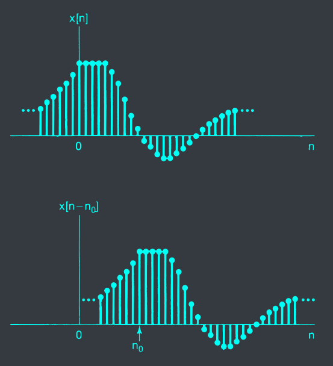

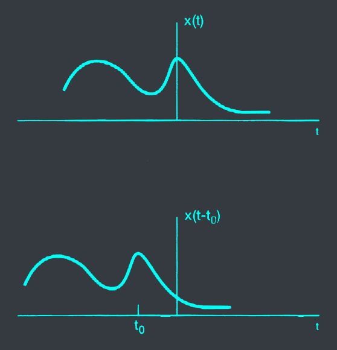

## 2. Time reversal
### Time reversal transformation
- Given a discrete signal $x(n)$, the time-reversed signal is defined as:

$$y(n) = x(-n)$$


Given $x(n) = \[1, 3_{\uparrow}, 2, 5\]$, determine:
- $x(-n)$: flip the signal around the origin. $\to \[5, 2, 3_{\uparrow}, 1\]$
- $x(3-n)$:
  - $x(-n)$: flip the signal around the origin.\
    $\to \[5, 2, 3_{\uparrow}, 1\]$
  - $x(-n+3)$: shift the origin of the signal to the right by 3 samples.\
    $\to \[5, 2, 3, 1, 0, 0_{\uparrow}\]$
- $x(-1-n)$
  - $x(-n)$: flip the signal around the origin.\
    $\to \[5, 2, 3_{\uparrow}, 1\]$
  - $x(-n-1)$: shift the origin of the signal to the left by 1 sample.\
    $\to \[5, 2_{\uparrow}, 3, 1\]$


### Time reversal summary

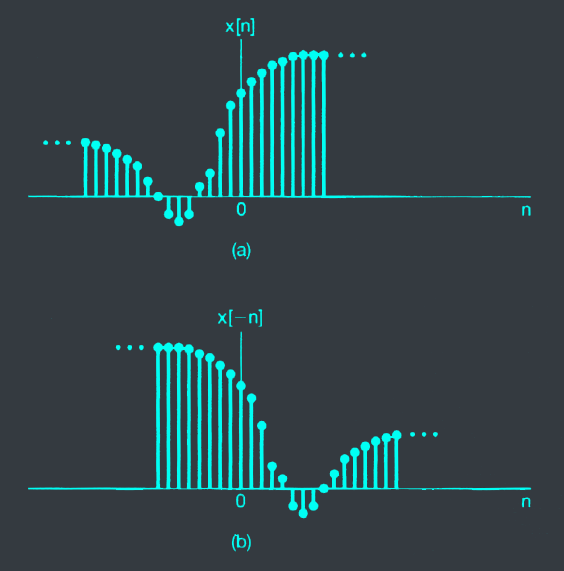

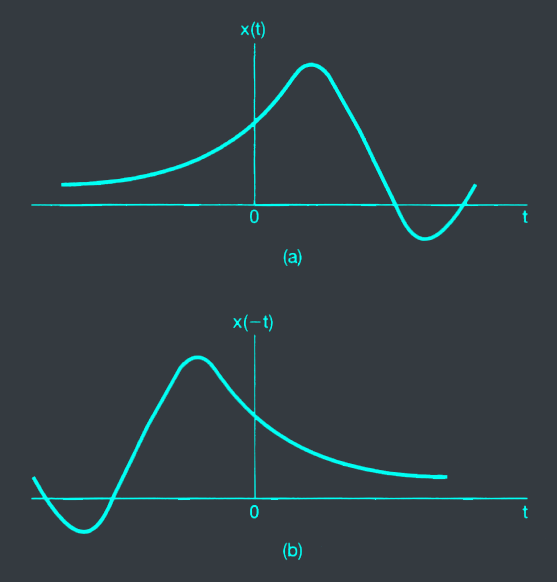

## 3. Time scaling
### Time scaling transformation
- Given a signal x(t), the time scaling signal is defined as:

$$y(t) = x(kt)$$


Given $x(t)$

Determine $x(\frac{3}{2}t)$



### Time scaling summary

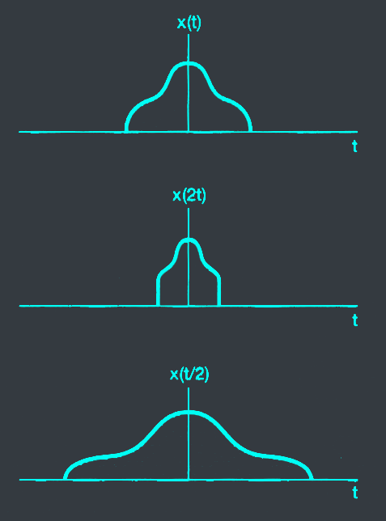

# IV. Elementary signals
## 1. Delta signal
- Other names: dirac delta, impulse
$$\delta[n] = \begin{cases} 1 & n = 0 \\\ 0 & n \neq 0 \end{cases}$$

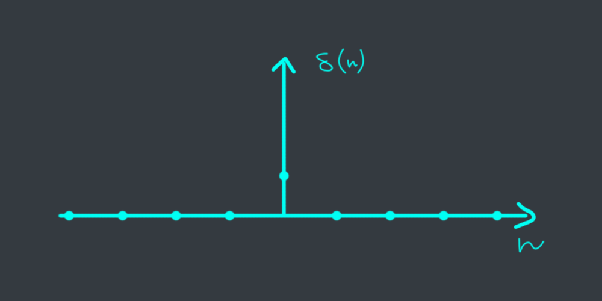

## 2. Unit signal
- Other names: step signal, unit step
$$u[n] = \begin{cases} 1 & n \geq 0 \\\ 0 & n < 0 \end{cases}$$

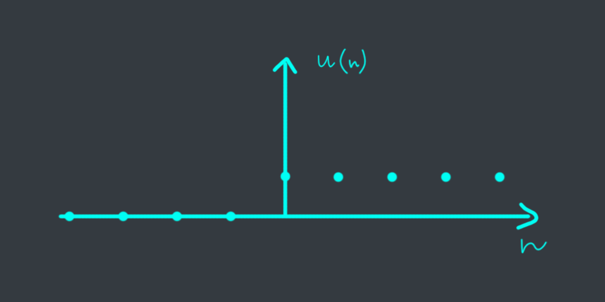

## 3. Real exponential signal
- Definition: the continuous-time real exponential signal is of the form:

$$x(t) = Ce^{at}$$

where $C$ and $a$ are real numbers.

