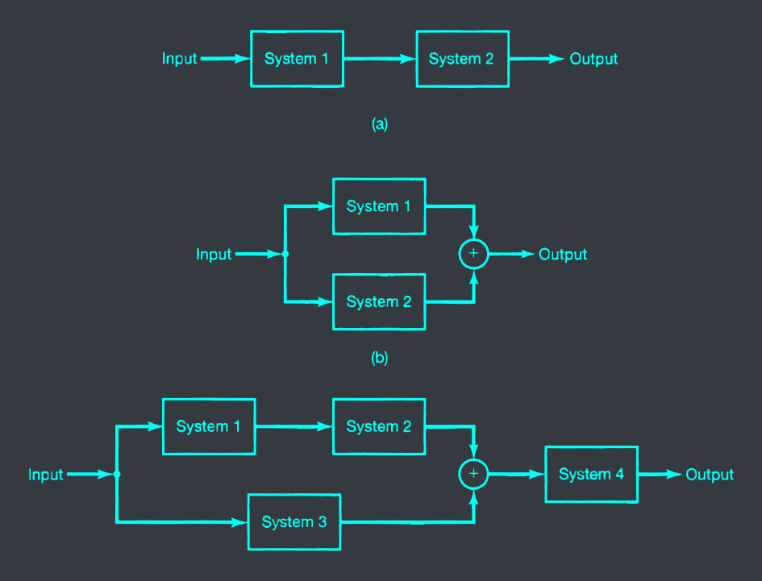
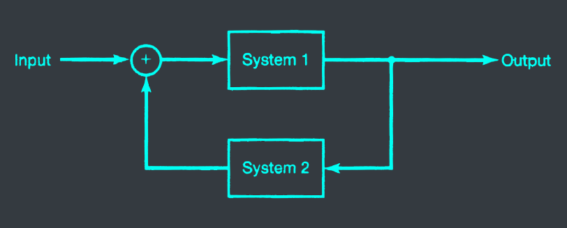
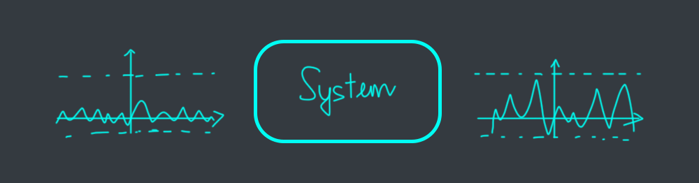



# I. Objectives
At the end of this lesson, you should be able to
- Recognize basic system types and system interconnections
- Deermine (and justify) properties of a system
  - Causality
  - Stability
  - Time-invariance
  - Linearity
- Have some feeling about LTI systems

# II. An introduction to systems
## 1. System types
- Continuous-time vs discrete-time systems
- Single-variable vs multi-variable systems
  - Single-input, single-output (SISO) systems
  - Single-input, multiple-output (SIMO) systems
  - Multiple-input, single-output (MISO) systems
  - Multiple-input, multiple-output (MIMO) systems

## 2. System interconnections
### Series and parallel

### Feedback

# III. Systems' properties
## 1. Causality
- Causal systems: output signal depends only on the present and/or the past values of the input signal


- $y(t) = x(t)sin(t)$ is causal because $y(t)$ depends only on the present and past values of $x(t)$
- $y[n] = x[-n]$ is not causal because $y[n]$ depends on the future values of $x[n]$ (i.e. $y[-3] = x[3]$)
- $y[n] = x[n] - x[n+1]$ is not causal because $y[n]$ depends on the future values of $x[n]$ (i.e. $y[5] = x[5] - x[6]$)


## 2. Stability
- Stable systems: the output signal is bounded whenever the input signal is bounded


- $y(t) = tx(t)$ is stable because $y(t)$ is bounded whenever $x(t)$ is bounded
- $y[n] = n[-n]$ is not stable because $y[n]$ is not bounded whenever $x[n]$ is bounded
- $y[n] = \sum_{k= - \infty}^{n} u[k]$ where $u[n]$ is the unit step: $u[n] = \begin{cases} 0 & n < 0 \\\ 1 & n \geq 0 \end{cases}$ is stable because $y[n]$ is bounded whenever $x[n]$ is bounded


## 3. Time-invariance
- Time-invariant systems: the input-output relation doe not depend on the time origin, i.e. the systems are fixed over time.


- $y(t) = sin[x(t)]$
  - $y_1(t) = sin[x_1(t)]$
  - $x_2 = x_1(t-T)$
  - $y_2(t) = sin[x_2(t)] = sin[x_1(t-T)]$
  - $y_3(t) = y_1(t-T) = sin[x_1(t-T)]$

$\to y_2(t) = y_3(t)$ for all $t$ $\to$ system is time-invariant.

- $y[n] = nx[n]$
  - $y_1[n] = n_1x_1[n]$
  - $x_2[n] = x_1[n-n_0]$
  - $y_2[n] = n_1x_2[n] = n_1x_1[n-n_0]$
  - $y_3[n] = y_1[n-n_0] = n_1x_1[n-n_0]$

$\to y_2[n] = y_3[n]$ for all $n$ $\to$ system is time-invariant.

- $y[n] = x[-n]$
  - Shifted of $x_1$: $x_2[n] = x_1[n-T]$
  - Respect of $x_1$: $y_1[n] = x_1[-n]$
  - Respect of $x_2$: $y_2[n] = x_2[-n] = x_1[n-T]$
  - Respect of $y_2$: $y_3[n] = y_2[-n] = x_1[n-T]$
  - If system is time-invariant, we expect $y_1[n] = y_3[n]$
    - $y_3[n] = y_1[n-T] = x_1[-(-n-T)] = x_1[-n+T]$
    - $y_2[n] = x_2[-n] = x_1[+(-n)-T] = x_1[n+T]$
  - Because $y_2[n] \neq y_3[n]$, the system is not time-invariant.



## 4. Linearity
- Linear systems: if an input consists of the weighted sum of several signals, then the output is the weighted sum of the responses of the system to each of those signals.


- Given a system in which:
  - $y_1(t)$ is the response of the system to $x_1(t)$
  - $y_2(t)$ is the response of the system to $x_2(t)$
- Then the system in linear if:
  - The response to $x_1(t) + x_2(t)$ is $y_1(t) + y_2(t)$\
    Additivity
  - The response to $a_1x_1(t)$ is $a_1y_1(t)$, where $a$ is a constant\
    Scaling



- $y(t) = tx(t)$
  - Additivity: $x(t) = x_1(t) + x_2(t)$
    - $y(t) = tx(t) = t(x_1(t) + x_2(t)) = y_1(t) + y_2(t)$
  - Scaling: $x(t) = 7x_1(t)$
    - $y(t) = t7x_1(t) = 7tx_1(t) = 7y_1(t)$

$\to$ system is linear.

- $y[n] = x[-n]$
  - Additivity: $x[n] = x_1[n] + x_2[n]$
    - $y[n] = x[-n] = x_1[-n] + x_2[-n] = y_1[n] + y_2[n]$
  - Scaling: $x[n] = 5x_1[n]$
    - $y[n] = x[-n] = 5x_1[-n] = 5y_1[n]$

$\to$ system is linear.

- $y[n] = 2x[n] + 5$
  - Additivity: $x[n] = x_1[n] + x_2[n]$
    - $y[n] = 2x[n] + 5 = 2(x_1[n] + x_2[n]) + 5 = 2y_1[n] + 2y_2[n] + 5$
  - Scaling: $x[n] = 5x_1[n]$
    - $y[n] = 2x[n] + 5 = 2(5x_1[n]) + 5 = 10y_1[n] + 5$

$\to$ system is not linear.



# IV. LTI systems
## 1. Delta signal
- Other names: Dirac Delta, unit impulse

$$\delta[n] = \begin{cases} 1 & n = 0 \\\ 0 & n \neq 0 \end{cases}$$


- Delta is the building block of all signals.
- It helps to define a Linear Time-Invariant (LTI) system.


## 2. A simple system
Consider a discrete-time system with input x(n) and output y(n) given by:

$$y(n) = x(n+1)-2x(n)$$

Determine whether the system is:
- Causal:
  - $y(2) = x(3) - 2x(2) \to$ system is not causal because $x(3)$ is not defined.
- Stable
  - $y(n) = x(n+1) - 2x(n) = x(n+1) - 2x(n) + 2x(n) - 2x(n-1) = x(n+1) - x(n-1) \to$ system is stable because $x(n-1)$ is defined for all $n$.
- Time-invariant
  - $y(n) = x(n+1) - 2x(n) = x(n+1-T) - 2x(n-T) = y(n-T)$
  - $y(n) = y(n-T)$ for all $n$ $\to$ system is time-invariant.
- Linear
  - Additivity: $x(n) = x_1(n) + x_2(n)$
    - $y(n) = x(n+1) - 2x(n) = (x_1(n) + x_2(n)) + 1 - 2(x_1(n) + x_2(n)) = y_1(n) + y_2(n)$
  - Scaling: $x(n) = 5x_1(n)$
    - $y(n) = x(n+1) - 2x(n) = 5x_1(n+1) - 2(5x_1(n)) = 5y_1(n)$
  - $\to$ system is linear.


$$y(n) = x(n+1) - 2x(n)$$

Determine $y(n)$ given

- $x(n) = \delta(n)$
  - $y(n) = x(n+1) - 2x(n) \\\ = \delta(n+1) - 2\delta(n) \\\ = \delta(n+1) - 2\delta(n) + 2\delta(n) - 2\delta(n-1) \\\ = \delta(n+1) - \delta(n-1)$
- $x(n) = \delta(n-2)$
  - $y(n) = x(n+1) - 2x(n) \\\ = \delta(n+1-2) - 2\delta(n-2) \\\ = \delta(n-1) - 2\delta(n-2) \\\ = \delta(n-1) - 2\delta(n-2) + 2\delta(n-2) - 2\delta(n-2-1) \\\ = \delta(n-1) - \delta(n-3)$
- $x(n) = [1_{\uparrow}, 1, 3]$
  - $y(0) = x(0+1) - 2x(0) \\\ = 1 - 2\cdot 1 \\\ = -1$
  - $y(1) = x(1+1) - 2x(1) \\\ = 3 - 2\cdot 1 \\\ = 1$
  - $y(2) = x(2+1) - 2x(2) \\\ = 0 - 2\cdot 3 \\\ = -6$
  - $\to y[n] = [-1_{\uparrow}, 1, -6]$

