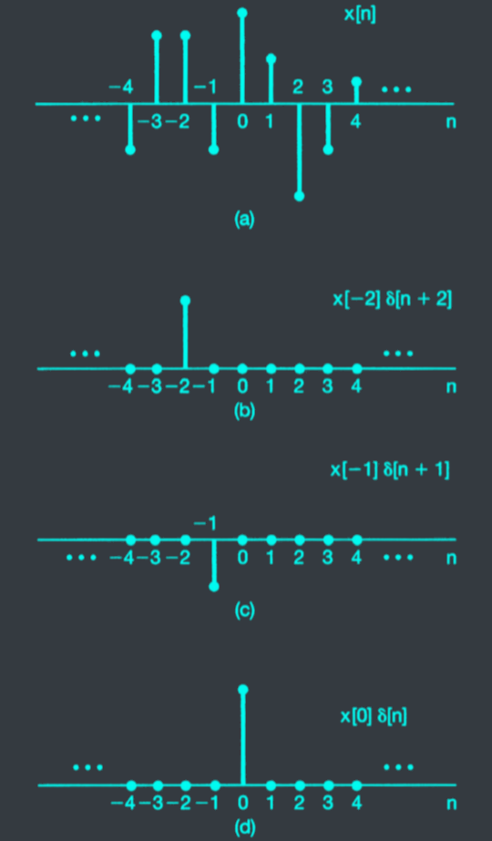
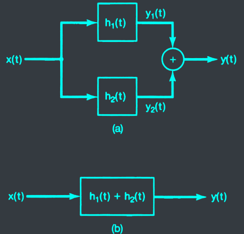
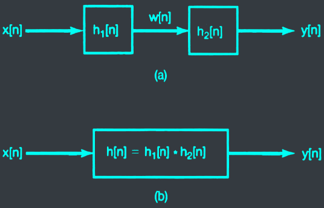
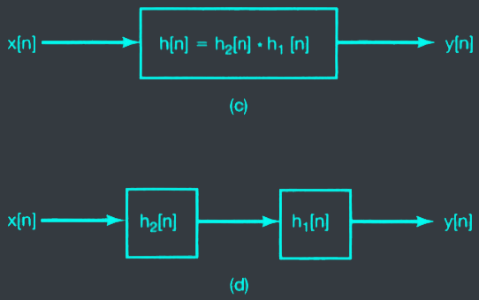



# I. Lesson objectives
At the end of this chapter, you should be able to:
- Understand the input-output relationship of a LTI system.
- Calculate the convolution sum using different approaches.
- Determine (and justify) properties of a LTI system:
  - Causality
  - Stability
  - ...

# II. Convolution sum
## Signal representation using impulses
### Remind: delta impulse

$$\delta[n] = \begin{cases} 1 & \text{if } n = 0 \\\ 0 & \text{otherwise} \end{cases}$$



- Delta is the building block of all signals.
- It helps to define a&nbsp;<c-red>Linear Time-Invariant</c-red>&nbsp;(LTI) system.


### Weighted Sum of Shifted Impulses


$$x[n] = \sum_{k=-\infty}^{\infty} x[k]\delta[n-k]$$


## Convolution



# III. Properties
### Commutative

$$x[n] * h[n] = h[n] * x[n]$$


### Distributive

$$x[n] * (h[n] + g[n]) = x[n] * h[n] + x[n] * g[n]$$


### Associative

$$x[n] * (h[n] * g[n]) = (x[n] * h[n]) * g[n]$$


### Invertibility
Identity system $h[n] = \delta[n]$, an example of telecommunication.


Given a system with impulse response
$$h_1[n] = u[n]$$

Verify that its inverse system has $h_2[n] = \delta[n] - \delta[n-1]$


### Causality
A LTI system is causal if its impulse response satisfy the condition:
$$h[n] = 0 \text{ for } n < 0$$

### Stability
A LTI system is stable if its impulse response is absolutely summable:
$$\sum |h[n]| < \infty$$

# IV. Exercises

In an $n^{th}$ semester, $x[n]$ students enroll in a course requiring a certain textbook. The publisher sells $y[n]$ new copies of the book in the $n^{th}$ semester. On the average, one-quarter of students with books in salable condition resell the texts at the end of the semester, and the book life is three semesters. Write the equation relating $y[n]$ to $x[n]$, assuming that every student buys a book.


$$y[n] = x[n] + \frac{1}{4}y[n-3]$$
