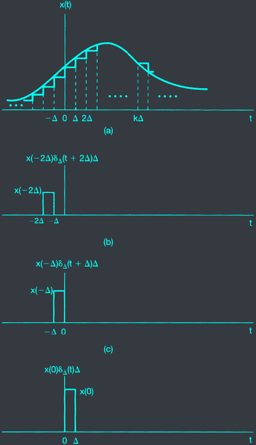



# I. Lesson objectives
At the end of this chapter, you should be able to:
- Understand the&nbsp;<c-red>origin</c-red>&nbsp;of the Delta signal in continuous-time domain.
- Calculate convolution&nbsp;<c-red>integral</c-red>.

# II. Continuous-time Delta
## 1. Weighted Sum of Shifted Impulses
### Delta in Continuous-time Domain
- Question: how should we define the continuous Delta signal?
- Let's start with
$$\delta_{\Delta} (t) = \begin{cases}
1 & \text{if } t = 0 \\\
0 & \text{otherwise}
\end{cases}$$

### Weighted Sum of Shifted Impulses


<!-- x with a hat = sum with k from -inf to +inf: x(k Delta) delta_Delta (t-k Delta) Delta -->
$$\hat{x}(t) = \sum_{k=-\infty}^{\infty} x(k \Delta) \delta_{\Delta} (t-k \Delta) \Delta$$


The smaller the $\Delta$, the more accurate the approximation.


<!-- x(t) = integral from -inf to inf: x(tau)delta(t - tau) dtau -->
$$x(t) = \int_{-\infty}^{\infty} x(\tau) \delta(t - \tau) d\tau$$


## 2. Definition
### Summary: Continuous-time Delta Impulse

$$\delta(t) = \begin{cases}
\infty & \text{if } t = 0 \\\
0 & \text{otherwise}
\end{cases}$$


Properties:
<!-- Integral from -inf to inf: delta(t)dt = 1 -->
- $\int_{-\infty}^{\infty} \delta(t) dt = 1$
<!-- Integral from -inf to inf: x(t)delta(t- tau)dt = x(tau) -->
- $\int_{-\infty}^{\infty} x(t) \delta(t - \tau) dt = x(\tau)$

## 3. Discrete vs Continuous

| Discrete Delta | Continuous Delta |
| :---: | :---: |
| $\delta[n] = \begin{cases} 1 & \text{if } n = 0 \\\ 0 & \text{otherwise} \end{cases}$ | $\delta(t) = \begin{cases} \infty & \text{if } t = 0 \\\ 0 & \text{otherwise} \end{cases}$ |
| $\sum_{n=-\infty}^{\infty} \delta[n] = 1$ | $\int_{-\infty}^{\infty} \delta(t) dt = 1$ |
| $\sum_{n=-\infty}^{\infty} x[n] \delta[n - n_0] = x[n_0]$ | $\int_{-\infty}^{\infty} x(t) \delta(t - \tau) dt = x(\tau)$ |
| $x[n] = \sum_{k=-\infty}^{\infty} x[k] \delta[n - k]$ | $x(t) = \int_{-\infty}^{\infty} x(\tau) \delta(t - \tau) d\tau$ |

### $\delta(t)$ and $u(t)$

$$u(t) = \inf_{-\infty}^{t} \delta(t - \tau) d\tau$$

# III. Convolution Integral
## Definition
### Convolution Integral of a LTI system
Impulse response $h(t)$



{}
[Convolution integral example - graphical method](https://www.youtube.com/watch?v=ShPguecXaaU)
{}

## Example

# IV. Properties