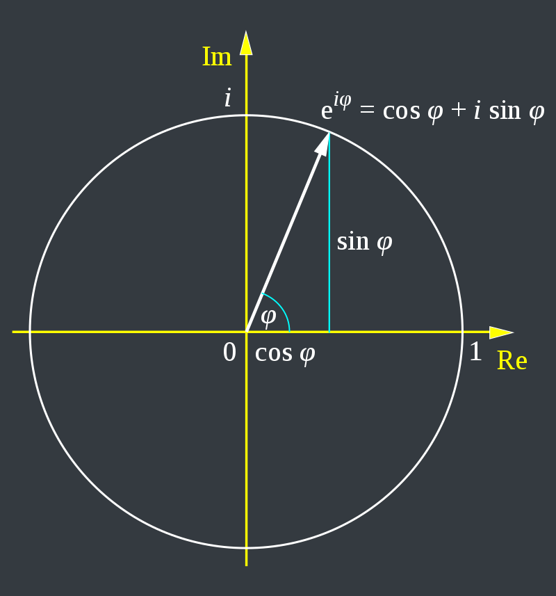
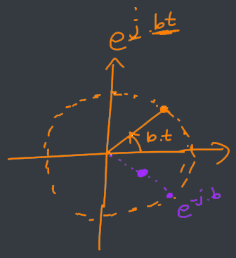
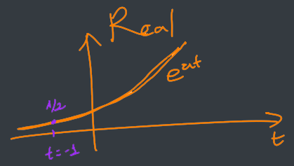
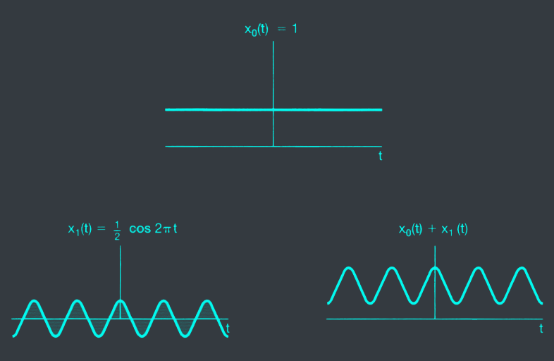
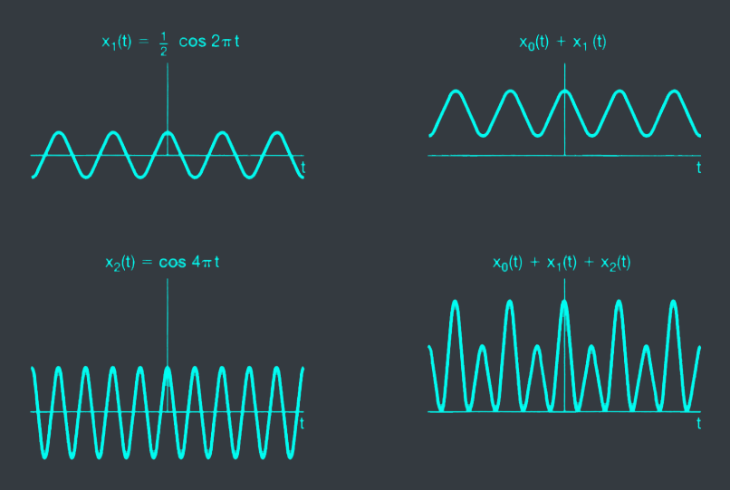
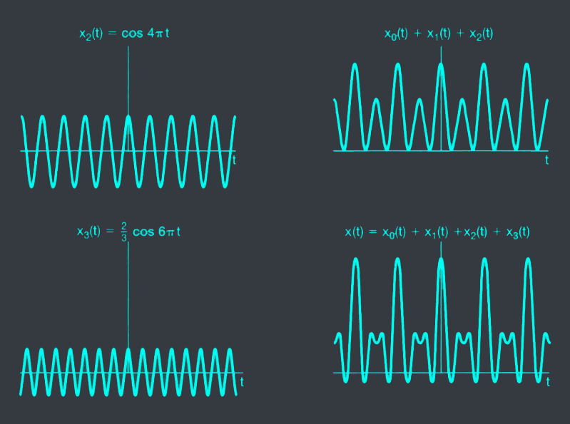
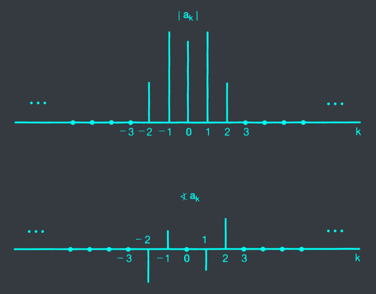
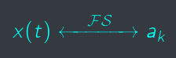



# I. Lesson Objectives
At the end of this chapter, you should be able to:
- Be familiar with complex number.
- Find Fourier coefficients of any continuous periodic signal.
- Understand various properties of Fourier series.
# II. Review of Complex Numbers
## 1. Complex number, Conjugation

 and polar (R) representation of complex number")

## 2. Euler formula&nbsp;$e^{j\psi} = \cos\psi + j\sin\psi$

$e^{j\varphi} = \cos\varphi + j\sin\varphi$

$cos(\varphi) = \dfrac{e^{j\varphi} + e^{-j\varphi}}{2}$

$sin(\varphi) = \dfrac{e^{j\varphi} - e^{-j\varphi}}{2i}$

## 3. Complex exponential signal&nbsp;$e^{st}$

$e^{st} = e^{(a + jb)t} = e^{at}e^{jbt}$

- $e^{jbt}$: complex exponential signal

## 4. LTI response to complex exponential


$$y(t) = \int_{-\infty}^{\infty} h(\tau)x(t-\tau)d\tau$$


The response of an LTI system to a complex exponential input is the&nbsp;<c-red>same</c-red>&nbsp;complex exponential with only&nbsp;<c-red>a change in amplitude</c-red>.

# III. Fourier Series Representation
## 1. Periodic signal
### Fundamental period
- The minimum positive, non-zero value of T so that
$$x(t) = x(t + T)$$

- Fundamental frequency: $\omega_0 = \dfrac{2\pi}{T}$

### 2 basic periodic signals
- The sinusoidal signal: $x(t) = cos(\omega_0t)$
- The periodic complex exponential: $x(t) = e^{j\omega_0t}$

### An example
- Consider a peridic signal $x(t)$ with fundamental frequency $2\pi$
$$x(t) = \sum_{k = -3}^{3} a_ke^{jk2\pi t}$$

where $a_0 = 1, a_1 = a_{-1} = \frac{1}{4}, a_2 = a_{-2} = \frac{1}{2}, a_3 = a_{-3} = \frac{1}{3}$

- $e^{j\varphi} = \cos\varphi + j\sin\varphi$
- $e^{-j\varphi = \cos\varphi - j\sin\varphi}$
- $\to cos(\varphi) = \dfrac{e^{j\varphi} + e^{-j\varphi}}{2}$
- $\to sin(\varphi) = \dfrac{e^{j\varphi} - e^{-j\varphi}}{2j}$

### Review: integral of&nbsp;$e^{j\omega_0t}$
Given $\omega_0 = \frac{2\pi}{T}$, calculate:

1. $$\int_{0}^{T} e^{j\omega_0t}dt$$

$$ = \frac{e^{j\omega_0T} -1}{j\omega_0T} = \frac{e^{j2\pi}}{j2\pi}$$

2. $$\int_{0}^{T} e^{jk\omega_0t}dt$$

$$ = \frac{e^{jk2\pi}}{jk2\pi} $$

## 2. Definition

Assume that

$$ x(t) = \sum_{k = -\infty}^{\infty} a_ke^{jk\omega_0t}$$

then

$$a_k = ?$$

Hint: calculate $x(t)e^{-jk\omega_0t}$, and its integral from $0$ to $T$.


The&nbsp;<c-red>synthesis</c-red>&nbsp;equation

$$ x(t) = \sum_{k = -\infty}^{\infty} a_ke^{jk\omega_0t} = \sum_{k = -\infty}^{\infty} a_ke^{jk\frac{2\pi}{T}t}$$

The&nbsp;<c-red>analysis</c-red>&nbsp;equation

$$ a_k = \frac{1}{T}\int_{T} x(t)e^{-jk\omega_0t}dt = \frac{1}{T}\int_{T} x(t)e^{-jk\frac{2\pi}{T}t}dt$$



Determine Fourier series coefficients of

$$x(t) = sin(\omega_0t)$$


$= \frac{e^{j\omega_0t} - e^{-\omega_0t}}{2j}$

$sin(\omega_0t) = \frac{1}{2j}e^{j\omega_0t} + (\frac{-1}{2j}e^{-j\omega_0t})$


Determine Fourier series coefficients of

$$x(t) = 1 + sin(\omega_0t) + 2cos(\omega_0t) + cos(2\omega_0t + \frac{\pi}{4})$$


- We have:

  $cos(\varphi) = \dfrac{e^{j\varphi} + e^{-j\varphi}}{2}$

  $sin(\varphi) = \dfrac{e^{j\varphi} - e^{-j\varphi}}{2j}$

- So:

  $sin(\omega_0t) = \frac{e^{j\omega_0t} - e^{-j\omega_0t}}{2j}$

  $cos(\omega_0t) = \frac{e^{j\omega_0t} + e^{-j\omega_0t}}{2}$

  $cos(2\omega_0t + \frac{\pi}{4}) = \frac{e^{j2\omega_0t + \frac{\pi}{4}} + e^{-j2\omega_0t - \frac{\pi}{4}}}{2}$

  $x(t) = 1 + \frac{e^{j\omega_0t} - e^{-j\omega_0t}}{2j} + \frac{e^{j\omega_0t} + e^{-j\omega_0t}}{2} + \frac{e^{j2\omega_0t + \frac{\pi}{4}} + e^{-j2\omega_0t - \frac{\pi}{4}}}{2}$

# IV. Properties
## Notations
$x(t)$ is a periodic signal with period $T$ and fundamental frequency $\omega_0 = \frac{2\pi}{T}$. Its Fourier coefficients are denoted by $a_k$.


The&nbsp;<c-red>synthesis</c-red>&nbsp;equation

$$x(t) = \sum_{x = -\infty}^{\infty} a_ke^{jk\omega_0t} = \sum_{k = -\infty}^{\infty} a_ke^{jk\frac{2\pi}{T}t}$$

The&nbsp;<c-red>analysis</c-red>&nbsp;equation

$$a_k = \frac{1}{T}\int_{T} x(t)e^{-jk\omega_0t}dt = \frac{1}{T}\int_{T} x(t)e^{-jk\frac{2\pi}{T}t}dt$$



## 1. Linearity


Given
$$x(t) \leftarrow\text{FS}\to a_k$$

$$y(t) \leftarrow\text{FS}\to b_k$$

Then
$$z(t) = Ax(t) + By(t) \leftarrow\text{FS}\to c_k = Aa_k + Bb_k$$


## 2. Time shifting


Given
$$x(t) \leftarrow\text{FS}\to a_k$$

Then

$$x(t - t_0) \leftarrow\text{FS}\to e^{-j\omega_0t_0}a_k$$


## 3. Time reversal


Given
$$x(t) \leftarrow\text{FS}\to a_k$$

Then
$$x(-t) \leftarrow\text{FS}\to a_{-k}$$


## 4. Time scaling


Given
$$x(t) \leftarrow\text{FS}\to a_k$$

Then
$$x(\alpha t) \leftarrow\text{FS}\to ???$$


Attention:
- the Fourier coefficients have not changed
- the Fourier series representation&nbsp;<c-red>has changed</c-red>.

## 5. Multiplication


Given
$$x(t) \leftarrow\text{FS}\to a_k$$
$$y(t) \leftarrow\text{FS}\to b_k$$

Then

$$z(t) = x(t)y(t) \leftarrow\text{FS}\to c_k = \sum_{l = -\infty}^{\infty} a_lb_{k-l}$$


## 6. Conjugation


Given
$$x(t) \leftarrow\text{FS}\to a_k$$

Then
$$x^{\*}(t) \leftarrow\text{FS}\to a^{\*}_{-k}$$


## 7. Parseval's relation


$$\frac{1}{T} \int_{T} |x(t)|^2dt = \sum_{k = -\infty}^{\infty} |a_k|^2$$


