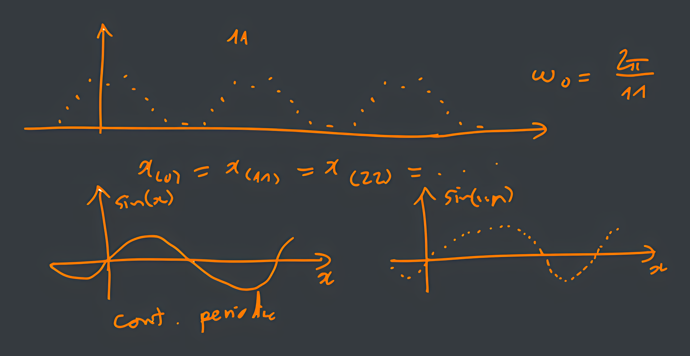
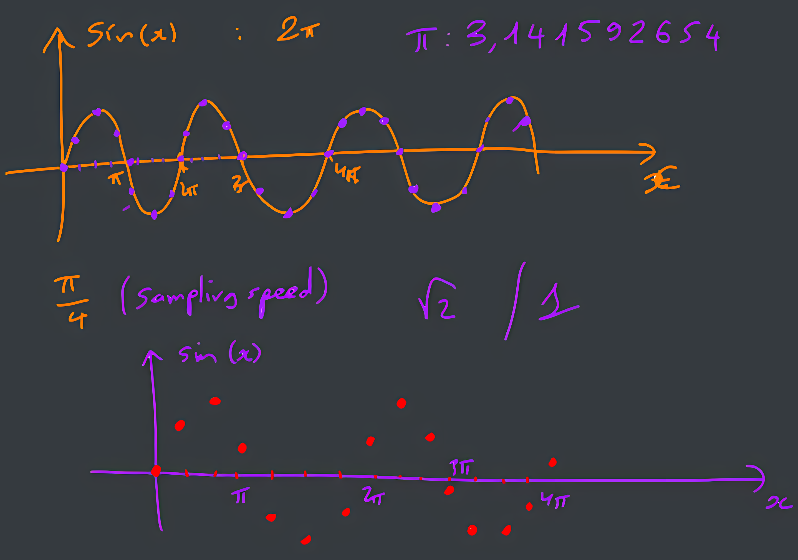
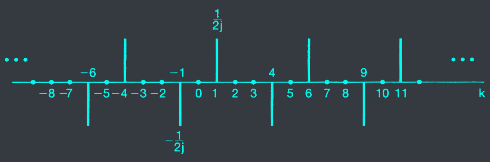
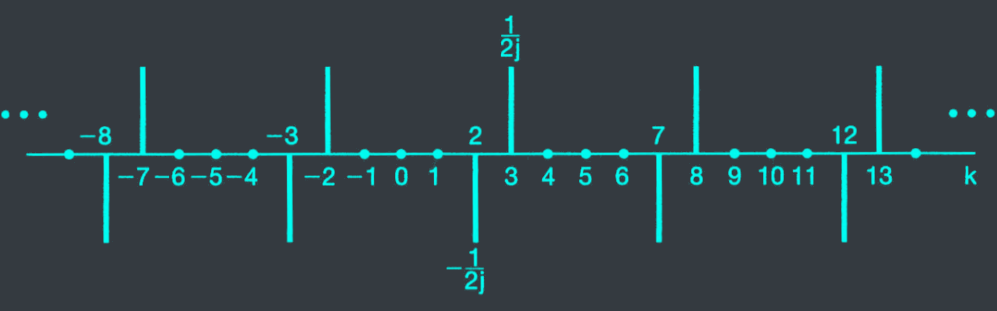



# I. Lesson Objectives
At the end of this chapter, you should be able to:
- Be familiar with discrete complex signal.
- Find Fourier coefficients of any discrete periodic signal.
- Understand various properties of Fourier series.

# II. Fourier Representation
## 1. Periodic signal
### Fundamental period
- The minimum positive, non-zero value of N so that
$$x[n] = x[n + N]$$
- Fundamental frequency: $\omega_0 = \dfrac{2\pi}{N}$

### 2 basic periodic signals
- The sinusoidal signal: $x[n] = cos(\omega_0n)$
- The periodic complex exponential: $x[n] = e^{j\omega_0n}$

### Exercies: sum of&nbsp;$e^{j\omega_0n}$
- Given $\omega_0 = \frac{2\pi}{N}$, proof that

$$\sum_{n=\<N\>}e^{j\omega_0n} = \sum_{n=\<N\>}e^{jk(2\pi/N)n} = \begin{cases} N & \text{if } k = 0, \pm N, \pm 2N, \dots \\\ 0 & \text{otherwise} \end{cases}$$

## 2. Definition
### Fourier series


Assume that
$$x[n] = \sum_{k=\<N\>}a_ke^{jk\omega_0n}$$

Then
$$a_k = ???$$

Hint: calculate $x[n]e^{-jk\omega_0n}$, and its sum over $N$ terms.

### Fourier series equation pair


The&nbsp;<c-red>synthesis</c-red>&nbsp;equation

$$x[n] = \sum_{k=\<N\>}a_ke^{jk\omega_0n} = \frac{1}{N} \sum_{k=\<N\>}x[n]e^{-jk\frac{2\pi}{N}n}$$

The&nbsp;<c-red>analysis</c-red>&nbsp;equation

$$a_k = \dfrac{1}{N}\sum_{n=\<N\>}x[n]e^{-jk\omega_0n} = \frac{1}{N} \sum_{n=\<N\>}x[n]e^{-jk\frac{2\pi}{N}n}$$


### Examples


Consider the signal $x[n] = sin(\frac{2\pi}{5}n)$, determine and plot its Fourier series coefficients.


- Step 1: verify the signal is periodic $\to N = ?$

  Lets set $N = 5$

  $\begin{aligned}
  x[n+5]
  &= sin(\frac{2\pi}{5}(n+5)) \\\
  &= sin(\frac{2\pi}{5}n + 2\pi) \\\
  &= sin(\frac{2\pi}{5}n) = x[n]
  \end{aligned}$

  $x_{(n)} = x_{(n+5)} \to N = 5 \to \omega_0 = \frac{2\pi}{5}$

- Step 2: $e^{j\omega} = cos\varphi + jsin\varphi$

  $\begin{aligned}
  sin(\frac{2\pi}{5}n)
  &= \frac{1}{2j}e^{j\frac{2\pi}{5}n} - \frac{1}{2j}e^{-j\frac{2\pi}{5}n} \\\
  &= \frac{1}{2j}(e^{j\frac{2\pi}{5}n} - e^{-j\frac{2\pi}{5}n}) \\\
  &= \frac{1}{2j}(e^{j\omega_0n} - e^{-j\omega_0n})
  \end{aligned}$


Consider the signal $x[n] = sin3(\frac{2\pi}{5}n)$, determine and plot its Fourier series coefficients.


$$x_{(n)} = sin(\frac{6\pi}{5}n) \to \text{ verify period signal}$$

- Step 1: discrete time domain

  $sin(\frac{6\pi}{5}n) = sin(\frac{6\pi}{5}n + \frac{6\pi}{5}N)$ ($\frac{6\pi}{5}N = k^*2\pi, k \in N$)

  $\to \frac{6\pi}{5}N = k^*2\pi$

  $\to 6N = k^* 10$

  $\to 3N = k^* 5$

  $\Leftrightarrow N = k^* \frac{5}{3} = 5$

---
$\begin{aligned}
sin(\frac{6\pi}{5}n)
&=\frac{e^{j\frac{6\pi}{5}n}-e^{-j\frac{6\pi}{5}n}}{2j} \\\
&=\frac{1}{2j} e^{j\frac{6\pi}{5}n} - \frac{1}{2j} e^{-j\frac{6\pi}{5}n} \\\
\end{aligned}$

---
- $k\frac{2\pi}{5} = \frac{6\pi}{5} \Leftrightarrow k = 3$
- $a_3 = \frac{1}{2j} - a_{-2}$
- $a_{-3} = \frac{-1}{2j}$

---
$\begin{aligned}
a{-3} &: a_{1} \\\
a_{-2} &: a_{2} \\\
a_{-1} &: a_{j} = a{-2}
\end{aligned}$

---
$\begin{aligned}
a{-3} &= \frac{-1}{2j} \\\
a_{-2} &= \frac{1}{2j} \\\
a_{-1} &= 0 \\\
a_0 &= 0 \\\
a_1 &= 0 \\\
\end{aligned}$

# III. Properties
## 1. Multiplication


Given
$$x[n] = \leftarrow\text{FS}\to a_k$$
$$y[n] = \leftarrow\text{FS}\to b_k$$

Then
$$x[n]y[n] = \leftarrow\text{FS}\to c_k = \sum_{l=\<N\>}a_lb_{k-l}$$


The right-hand side is a&nbsp;<c-red>periodic convolution</c-red>&nbsp;between the two periodic sequences of Fourier coefficients.

## 2. Parseval's Relation


$$\frac{1}{N} \sum_{n=\<N\>}|x[n]|^2dt = \sum_{k=\<N\>}|a_k|^2$$


The average power in a periodic signal&nbsp;<c-red>equals</c-red>&nbsp;the sum of the average powers in all of its harmonic components.