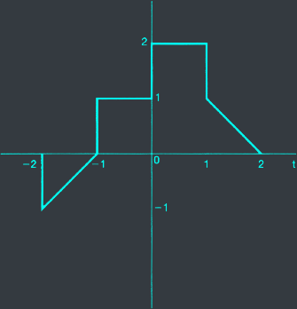
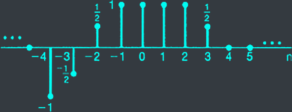



# 1.4 P.79
Let $x[n]$ be a signal with $x[n] = 0$ for $n<2$ and $n>4$. For each signal given below, detemine the values of $n$ for which it is guaranteed to be zero.

a. $x[n-3]$


- $x[n] = 0 \forall n<2$ and $n>4$
- $\to x[n-3] = 0 \forall n-3<2$ and $n-3>4 \\\ \Leftrightarrow n<5$ and $n>7$


b. $x[n+4]$


- $x[n] = 0 \forall n<2$ and $n>4$
- $\to x[n+4] = 0 \forall n+4<2$ and $n+4>4 \\\ \Leftrightarrow n<-2$ and $n>0$


c. $x[-n]$


- $x[n] = 0 \forall n<2$ and $n>4$
- $\to x[-n] = 0 \forall -n<2$ and $-n>4 \\\ \Leftrightarrow n>2$ and $n<4$


d. $x[-n+2]$


- $x[n] = 0 \forall n<2$ and $n>4$
- $\to x[-n+2] = 0 \forall -n+2<2$ and $-n+2>4$\
$\Leftrightarrow -n<0$ and $-n>2$\
$\Leftrightarrow n>0$ and $n<2$


e. $x[-n-2]$


- $x[n] = 0 \forall n<2$ and $n>4$
- $\to x[-n-2] = 0 \forall -n-2<2$ and $-n-2>4$\
$\Leftrightarrow -n<4$ and $-n>6$\
$\Leftrightarrow n>4$ and $n<6$


# 1.5 P.79
Let $x(t)$ be a signal with $x(t) = 0$ for $t<3$. For each signal given below, determine the value of $t$ for which it is guaranteed to be zero.

a. $x(1-t)$


- $x(t) = 0 \forall t<3$
- $\to x(1-t) = 0 \forall 1-t<3$\
$\Leftrightarrow -t<2$\
$\Leftrightarrow t>2$


b. $x(1-t)+x(2-t)$


- $\text{For } x(1-t)+x(2-t) = 0 \text{ then } x(1-t) = 0$ and $x(2-t) = 0$
  - $x(1-t) = 0 \forall 1-t<3$\
    $\Leftrightarrow -t<2$\
    $\Leftrightarrow t>2$
  - $x(2-t) = 0 \forall 2-t<3$\
    $\Leftrightarrow -t<1$\
    $\Leftrightarrow t>1$
- $\to x(1-t)+x(2-t) = 0 \forall t>2$


c. $x(1-t)x(2-t)$


- $\text{For } x(1-t)x(2-t) = 0 \text{ then } x(1-t) = 0$ or $x(2-t) = 0$
  - $x(1-t) = 0 \forall 1-t<3$\
    $\Leftrightarrow -t<2$\
    $\Leftrightarrow t>2$
  - $x(2-t) = 0 \forall 2-t<3$\
    $\Leftrightarrow -t<1$\
    $\Leftrightarrow t>1$
- $\to x(1-t)x(2-t) = 0 \forall t>1$


d. $x(3t)$


- $x(t) = 0 \forall t<3$
- $\to x(3t) = 0 \forall 3t<3$\
$\Leftrightarrow t<1$


e. $x(\frac{t}{3})$


- $x(t) = 0 \forall t<3$
- $\to x(\frac{t}{3}) = 0 \forall \frac{t}{3}<3$\
$\Leftrightarrow t<9$


# 1.6 P.79
Determine whether or not each of the following signals in periodic:

a. $x_1(t) = 2e^{j(t+\frac{\pi}{4})}u(t)$

b. $x_2[n] = u[n] + u[-n]$

c. $x_3[n] = \sum^{\infty}_{k = -\infty} \delta[n-4k] - \delta[n-1-4k]$

# 1.21 P.81

A continuous-time signal $x(t)$ is shown in fig. P1.21. Sketch and label carefully each of the following signals:

a. $x(t-1)$

b. $x(2-t)$

c. $x(2t+1)$

d. $x(4 - \frac{t}{2})$

e. $[x(t)+x(-t)]u(t)$

f. $x(t)[\delta(t+\frac{3}{2})-\delta(t-\frac{3}{2})]$

# 1.22 P.81
A discrete-time signal is shown in fig. P1.22. Sketch and label carefully each of the following signals:

a. $x[n-4]$

b. $x[3-n]$

c. $x[3n]$

d. $x[3n+1]$

e. $x[n]u[3-n]$

f. $x[n-2]\delta[n-2]$

g. $\frac{1}{2}x[n] + \frac{1}{2}(-1)^n x[n]$

h. $x[(n-1)^2]$