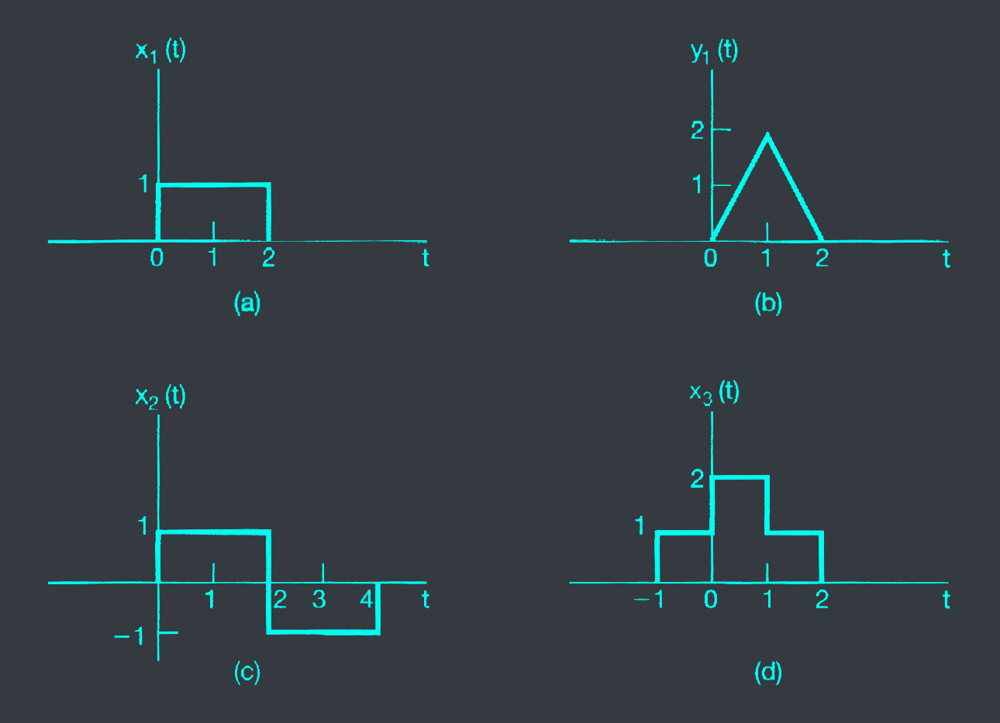
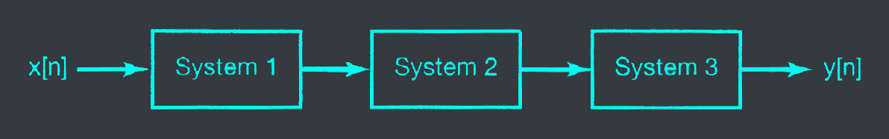



# 1.15 P.80
Consider a system $S$ with input $x[n]$ and output $y[n]$. This system is obtained through a series interconnection of a system $S_1$ followed by a system $S_2$. The input-output relationship of the system $S$ is given by

$$S_1: y_1[n] = 2x_1[n] + 4x_1[n-1]$$
$$S_2: y_2[n] = x_2[n-2] + \frac{1}{2}x_2[n-3]$$

where $x_1[n]$ and $x_2[n]$ denote input signals.

a. Determine the input-output relationship of the system $S$.

b. Does the input-output relationship of system S change if the order in which $S_1$ and $S_2$ are connected in series is reversed?

# 1.17 P.81
Consider a continuous-time system with input $x(t)$ and output $y(t)$ related by

$$y(t)=x(sin(t))$$

a. Is this system causal?
b. Is this system linear?

# 1.18 P.81
Consider a discrete-time system with input $x[n]$ and output $y[n]$ related by

$$y[n] = \sum^{n+n_0}_{k=n-n_0}x[k]$$

where $n_0$ is a positive integer.

a. Is this system linear?

b. Is this system time-invariant?

c. If x[n] is known to be bounded by a finite integer $B$ (i.e., $|x[n]| < B \forall n$), it can be shown that $|y[n]|$ is bounded by a finite number $C$. We conclude that the given system is stable. Express $C$ in terms of $B$ and $n_0$.

# 1.27 P.83
In this chapter, we introduced a number of general properties of systems. In particular, a system may or may not be:
1. Memoryless
2. Time invariant
3. Linear
4. Causal
5. Stable

Determine which of these properties hold and which do not hold for each of the following continuous-time systems. Justify your answer. In each example, $y(t)$ denotes the output of the system and $x(t)$ is the system input.

a. $y(t) = x(t-2) + x(2-t)$

b. $y(t) = [cos(3t)]x(t)$

c. $y(t) = \integral_{-\infty}^{2t}x(\tau)d\tau$

d. $y(t) = \begin{cases} 0 & t < 0 \\\ x(t) + x(t-2) & t \geq 0 \end{cases}$

e. $y(t) = \begin{cases} 0 & x(t) < 0 \\\ x(t) + x(t-2) & x(t) \geq 0 \end{cases}$

f. $y(t) = x(t/3)$

g. $y(t) = \frac{dx(t)}{dt}$

# 1.28 P.84
Determine which of the properties listed in problem 1.27 hold and which do not hold for each of the following discrete-time systems. Justify your answers. In each example, y[n] denotes the system output and x[n] is the system input.

a. $y[n] = x[-n]$

b. $y[n] = x[n-2]-2x[n-8]$

c. $y[n] = nx[n]$

d. $y[n] = \Epsilon v\text{\\{} x[n-1] \text{\\}}$

e. $y[n] = \begin{cases} x[n] & n \geq 1 \\\ 0 & n = 0 \\\ x[n+1] & n \leq -1 \end{cases}$

f. $y[n] = \begin{cases} x[n] & n \geq 1 \\\ 0 & n = 0 \\\ x[n] & n \leq -1 \end{cases}$

g. $y[n] = x[4n+1]$

# 1.31 P.85
In this problem, we illustrate one of the most important consequences of the properties of linearity and time invariance. Specifically, once we know the response of a linear system or a LTI system to a single input or the responses to several inputs, we can directly compute the responses to many other input signals. Much of the remainder of this book deals with a thorough exploitation of this fact in order to develop results and techniques for analyzing and synthesizing LTI systems.

a. Consider an LTI system whose response to the signal $x_1(t)$ in fig. P1.31(a) is the signal $y_1(t)$ illustrated in fig. P1.31 (b) Determine and sketch carefully the response of the system to the input $x_2(t)$ depicted in fig. P1.31

b. Determine and sketch the response of the system considered in part (a) to the input $x_3(t)$ shown in fig. P1.31(d).

# 1.42 P.90

a. Is the following statement true or false?

The series interconnection of two LTI systems is itself a linear, time-invariant system.

Justify your answer.

b. Is the following statement true or false?

The series inter-connection of two nonlinear systems is itself nonlinear

Justify your answer.

c. Consider three systems with the following input-output relationships:

System 1: $\begin{cases} x[n/2] & \text{n is even} \\\ 0 & \text{n is odd} \end{cases}$

System 2: $y[n]=x[n]+\frac{1}{2}x[n-1]+\frac{1}{4}x[n-2]$

System 3: $y[n] = x[2n]$

Suppose that these systems are connected in series as depicted in fig. P1.42. Find the input-output relationship for the overall interconnected systems. Is this system linear? Is it time-invariant?

