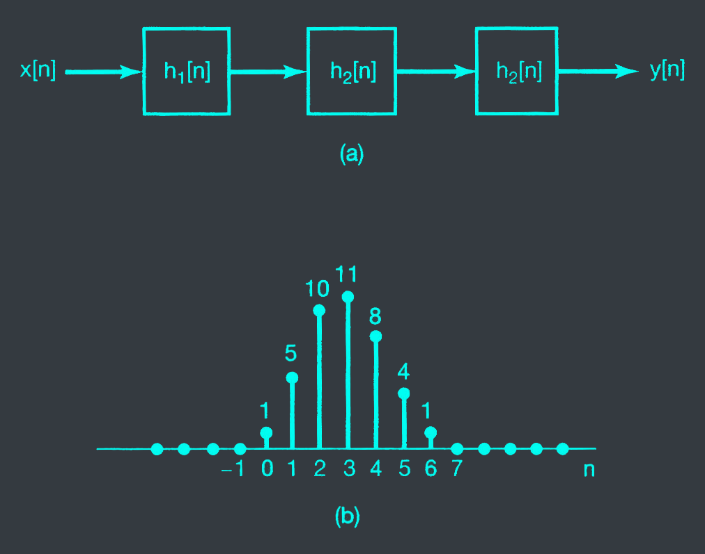



# 2.3
Consider an input $x[n]$ and unit impulse response $h[n]$ given by

$$x[n] = (\frac{1}{2})^{n-2}u[n-2]$$

$$h[n] = u[n+2]$$

Determine and plot the output $y[n] = x[n] * h[n]$.

{{
}}Solution{{
}}

- We have $y[n] = x[n] * h[n] = \sum_{k = -\infty}^{\infty} x[k]h[n-k]$

- $x[n] = (\frac{1}{2})^{n-2}u[n-2]$

- $h[n] = u[n+2] \implies h[n-k] = u[n-k+2]$

- $y[n] = \sum_{k = -\infty}^{\infty} (\frac{1}{2})^{k-2}u[k-2]u[n-k+2]$

- Set $m = k-2$

- $y[n] = \sum_{m = -\infty}^{\infty} (\frac{1}{2})^{m}u[m]u[n-m-2]$

- Then $y[n] = \sum_{m = -\infty}^{\infty} (\frac{1}{2})^{m}u[m]u[n-m-2]$

# 2.4
Compute and plot the output $y[n] = x[n] * h[n]$, where

$$x[n] = \begin{cases} 1 & \text{if } 3 \leq n \leq 8 \\\ 0 & \text{otherwise} \end{cases}$$

$$h[n] = \begin{cases} 1 & \text{if } 4 \leq n \leq 15 \\\ 0 & \text{otherwise} \end{cases}$$

# 2.7
A linear system $S$ has the relation ship

$$y[n] = \sum_{k = -\infty}^{\infty} x[k]g[n-2k]$$

between its input $x[n]$ and its output $y[n]$, where $g[n] = u[n] - u[n-4]$

a. Determine $y[n]$ when $x[n] = \delta[n-1]$

b. Determine $y[n]$ when $x[n] = \delta[n-2]$

c. Is $S$ LTl? If not, why not?

d. Determine $y[n]$ when $x[n] = u[n]$

# 2.24
Consider the cascade interconnection of 3 causal LTI systems, illustrated in fig 2.24(a). The impulse response $h_2[n]$ is

$$h_2[n] = u[n] - u[n-2]$$

and the overall impulse response is as shown in fig 2.24(b).

a. Find the impulse response $h_1[n]$.

b. Find the respond of the overall system to the input
$$x[n] = \delta[n] - \delta[n-1]$$