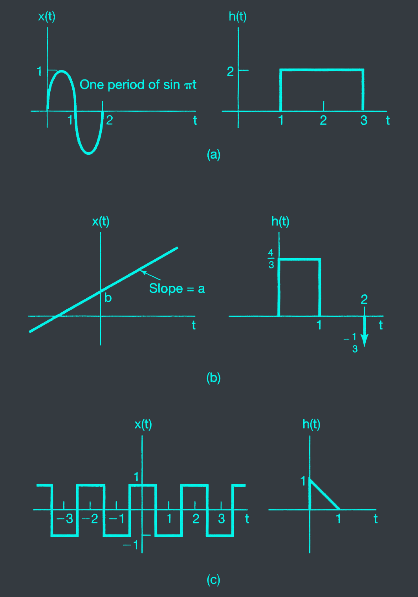
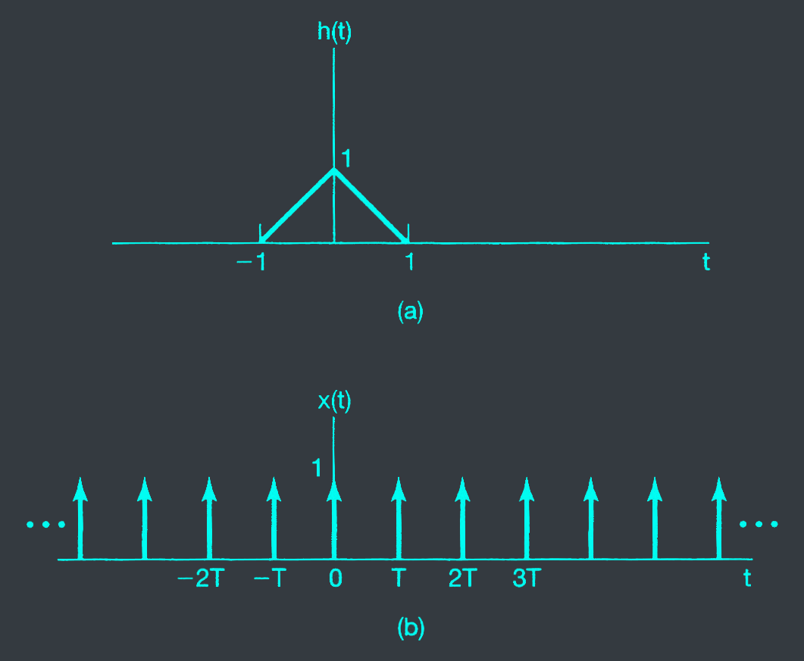



# 2.8
Determine and sketch the convolution of the following 2 signals:

$$x(t) = \begin{cases} t + 1 & \text{if } 0 \leq n \leq 1 \\\ 2-t & \text{if } 1 < t \leq 2 \\\ 0 & \text{otherwise} \end{cases}$$

$$h(t) = \delta(t+2) + 2\delta(t+1)$$

# 2.9
Let $h(t) = e^{2t}u(-t+4)+e^{-2t}u(t-5)$

Determine A and B such that

$$h(t - \tau) = \begin{cases} e^{-2(t-\tau)} & \text{if } \tau < A \\\ 0 & \text{if } A < \tau < B \\\ e^{2(t-\tau)} & \text{if } B < \tau \end{cases}$$

# 2.10
Suppose that

$$x(t) = \begin{cases} 1 & \text{if } 0 \leq t \leq 1 \\\ 0 & \text{otherwise} \end{cases}$$

and $h(t) = x(t/\alpha)$, where $0 < \alpha < 1$.

a. Determine and sketch $y(t) = x(t) * h(t)$

b. If $dy(t)/dt$ contains only 3 discontinuities, what is the value of $\alpha$?

# 2.22
For each of the following pairs of waveforms, use the convolution integral to find the response $y(t)$ of the LTI system with impulse response $h(t)$ to the input $x(t)$. Sketch your results.

a. $x(t) = e^{\delta t}u(t), h(t) = e^{\beta t}u(t)$. Do this both when $\alpha \neq \beta$ and when $\alpha = \beta$.

b. $x(t) = u(t) - 2u(t-2) + u(t-5)$ and $h(t) = e^{2t}u(1-t)$

c. $x(t)$ and $h(t)$ as in fig. P22.2(a).

d. $x(t)$ and $h(t)$ as in fig. P22.2(b).

e. $x(t)$ and $h(t)$ as in fig. P22.2(c).

# 2.23
Let $h(t)$ be the triangular pulse shown in fig P.2.23(a), and let $x(t)$ be the impulse train depicted in fig P2.23(b). That is,

$$x(t) = \sum_{k = -\infty}^{\infty} \delta(t - kT)$$

Determine and sketch $y(t) = x(t) * h(t)$ for the following values of $T$.

a. $T = 4$

b. $T = 2$

c. $T = 3/2$

d. $T = 1$