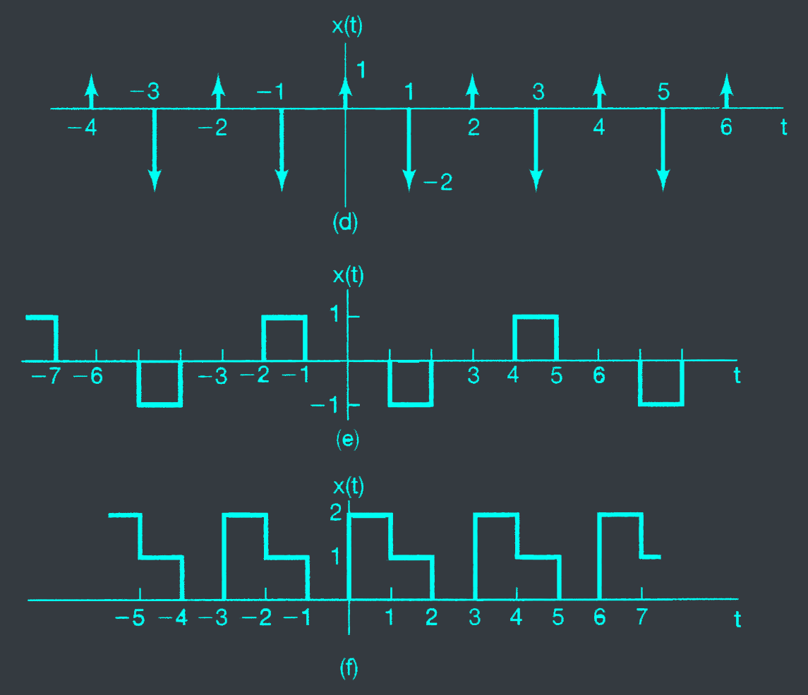



# 3.1
A continuous-time periodic signal $x(t)$ is real valued and has a fundamental period $T = 8$. The nonzero Fourier series coefficients for $x(t)$ are
$$a_1 = a_{-1} = 2, a^{*}_{-3} = 4j$$

Express $x(t)$ in the form
$$x(t) = \sum_{k=0}^{\infty} A_k cos(\omega_k t + \phi_k)$$

# 3.4
Use the Fourier series analysis equation (3.39) to calculate the coefficients ak for the continuous-time periodic signal
$$x(t) = \begin{cases} 1.5 & 0 \leq t < 1 \\\ -1.5 & 1 \leq t < 2 \end{cases}$$
with fundamental frequency $\omega_0 = \pi$.

# 3.5
Let $x_1(t)$ be a continuous-time periodic signal with fundamental frequency $\omega_1$ and Fourier coefficients $a_k$. Given that
$$x_2(t) = x_1(1-t) + x_1(t-1)$$
how is the fundamental frequency $\omega_2$ of $x_2(t)$ related to $\omega_1$? Also, find a relationship between the Fourier series coefficients $b_k$ of $x_2(t)$ and the coefficients $a_k$. You may use the properties listed in Table 3.1.

# 3.17
Consider three continuous-time systems $S_1, S_2$. and $S_3$ whose responses to a complex exponential input $e^{j5t}$ are specified as

$$S_1: e^{j5t} \to te^{j5t}$$
$$S_2: e^{j5t} \to e^{j5(t-1)}$$
$$S_3: e^{j5t} \to cos(5t)$$

For each system, determine whether the given information is sufficient to conclude that the system is definitely *not* LTI.

# 3.22
Determine the Fourier series representations for the following signals

a. Each $t(x)$ illustrate in fig P3.22(a)-(f)

b. $x(t)$ periodic with period 2 and
$$x(t) = e^{-t} \text{ for } -1 < t < 1$$

# 3.46
In this problem, we derive two important properties of the continuous-time Fourier series: the multiplication property and Parseval's relation. Let $x(t)$ and $y(t)$ both be continuous-time periodic signals having period To and with Fourier series representations given by
$$x(t) = \sum_{k=-\infty}^{\infty} a_ke^{j\omega_0t}, y(t) = \sum_{k=-\infty}^{\infty} b_ke^{j\omega_0t}$$

a. Show that the Fourier series coefficients of the signal
$$z(t) = x(t)y(t) = \sum_{k=-\infty}^{\infty} c_ke^{j\omega_0t}$$

are given by the discrete convolution
$$c_k = \sum_{m=-\infty}^{\infty} a_nb_{k-n}$$

b. Use the result of part (a) to compute the Fourier series coefficients of the signals
$x_1(t)$, $x_2(t)$, and $x_3(t)$ depicted in fig P3.46.

c. Suppose that $y(t)$ in eq. (P3.46-1) equals $x*(t)$. Express the $b_k$ in the equation in terms of $a_k$ and use the result of part (a) to prove Parseval's relation for periodic signals-that is,

$$ \frac{1}{T_0} \int_{0}^{T_0} |x(t)|^2 dt = \frac{1}{T_0} \sum_{k=-\infty}^{\infty} |a_k|^2$$