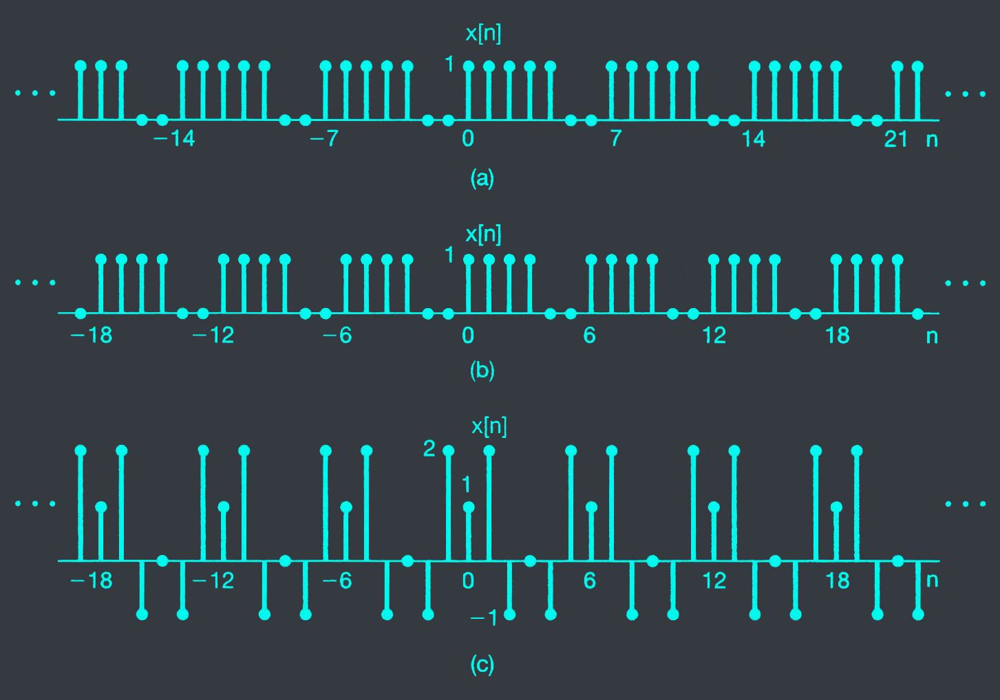



# 3.2
A discrete-time periodic signal $x[n]$ is real value and has a fundamental period $N = 5$. The nonzero Fourier series coefficients for $x[n]$ are

$$a_0 = 1, a_2 = a^{\*}_{-2} = e^{j\pi/4}$$

$$a_4 = a^{\*}_{-4} = 2e^{-j\pi/3}$$

Express $x[n]$ in the form

$$x[n] = \sum_{k=1}^{\infty} A_k sin(\omega_k n + \phi_k)$$

# 3.9
Use the analysis equation (3.95) to evaluate the numerical values of one period of the Fourier series coefficients of the periodic signal

$$x[n] = \sum_{m=-\infty}^\infty \text{\\{} 4\delta[n-4m] + 8\delta[n-1-4m] \text{\\}}$$

# 3.11
Suppose we are given the following information about a signal $x[n]$:
1. $x[n]$ is a real and even signal.
2. $x[n]$ has period $N = 10$ and Fourier coefficients $a_k$.
3. $a_{11} = 5$
4. $\frac{1}{10} \sum_{n=0}{9} |x[n]|^2 = 50$

Show that $x[n] = A cos(Bn + C)$, and specify numerical value for the constant A, B, and C.

# 3.28
Determine the Fourier series coefficients of the following discrete-time periodic signals. Plot the magnitude and phase of each set of coefficients $a_k$.

a. Each $x[n]$ depicted in fig 3.28(a)-(c)

b. $x[n] = sin(2\pi n/3) cos(\pi n/2)$

c. $x[n]$ periodic with period 4 and

$$x[n] = 1 - sin\frac{\pi n}{4} \text{for } 0 \leq n \leq 3$$

d. $x[n]$ periodic with period 12 and

$$x[n] = 1 - sin\frac{\pi n}{4} \text{for } 0 \leq n \leq 11$$