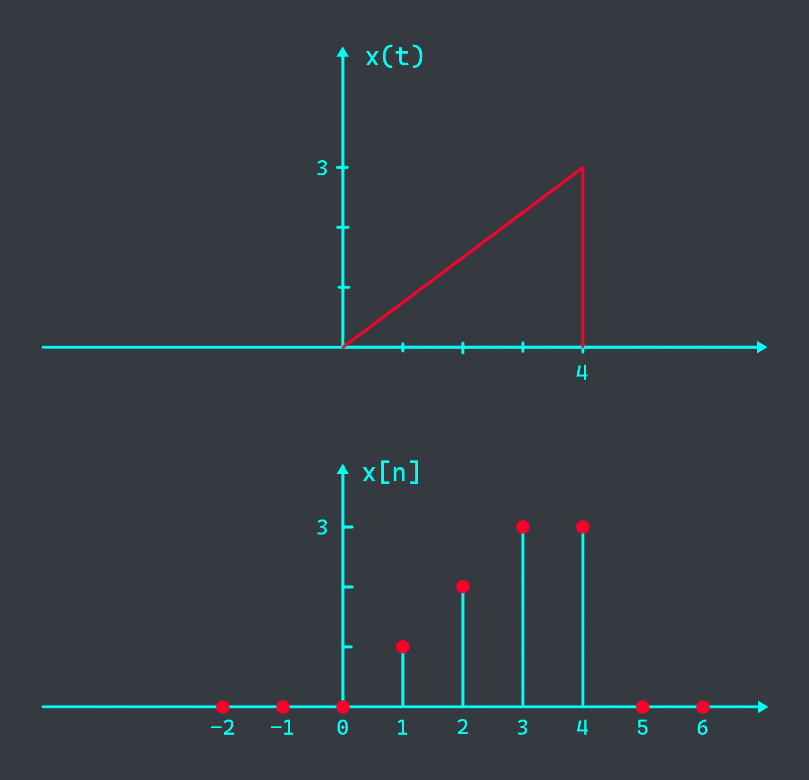
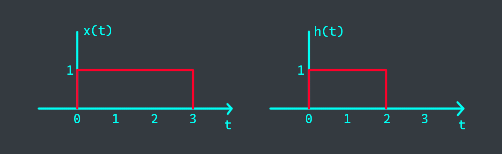
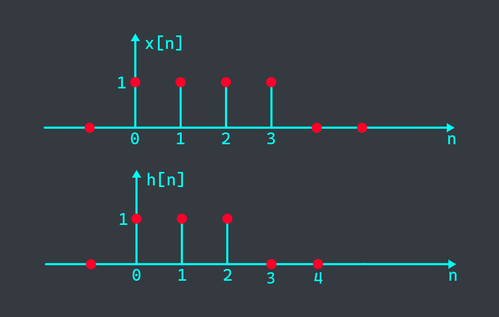
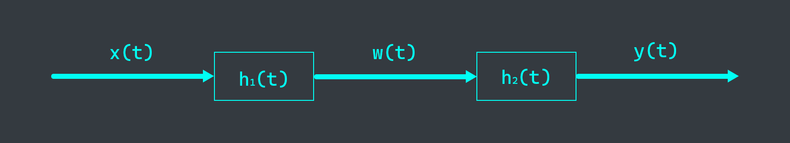
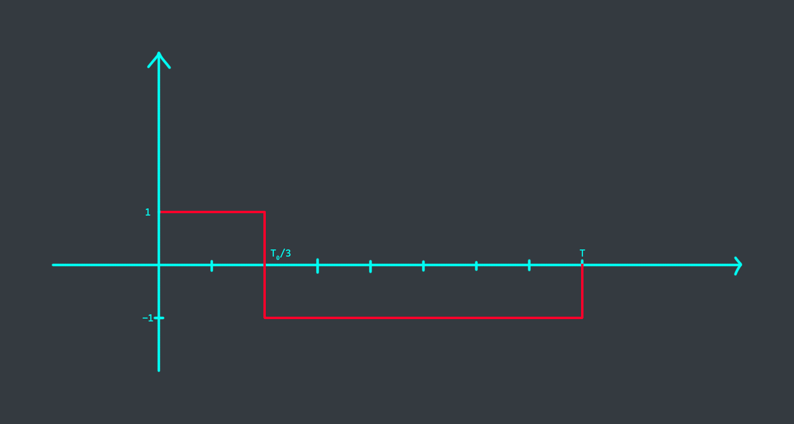
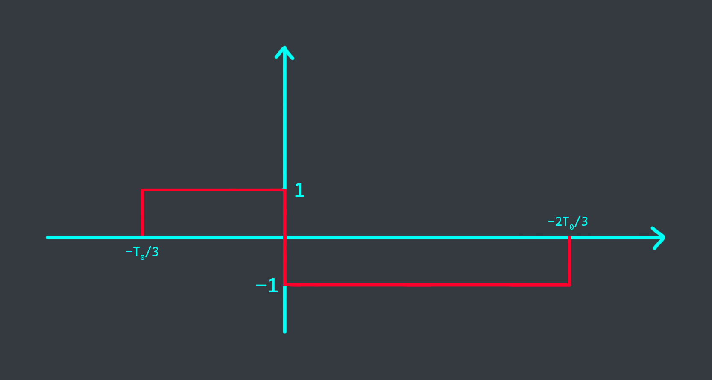

# 1
Strictly follow this question to find out which exercises you have to do

a. Dividend = your student ID (for example, BI11-179 means Dividend = 179). Plus 2 with the remainder after dividing by 3, this is your 1st question (179/3=59, R2), your first question is 2+2=4.

b. Dividend = the above quotient (i.e 59). Plus 5 with the remainder after dividing by 3, this is your second question (59 / 3 = 19 (remainder 2), your second equation is number 2 + 5 = 7)

c. Dividend = the above quotient (i.e 19). Plus 8 with the remainder after dividing by 3, this is your third question (19 / 3 = 6 (remainder 1), your third equation is number 1 + 8 = 9)

These signals are for question 2, 3, 4:

{}

{}

# 2
Represent each of the following signals by a graph
$$y_1(t) = x(t-2), y_2(t) = x(2t) + x(t/2)$$

# 3
Represent each of the following signals by a graph
$$z_1[n] = x[-n+2], z_3[n] = x[2n-1]$$

- We have:
  - $x[0] = 0$
  - $x[1] = 1$
  - $x[2] = 2$
  - $x[3] = 3$
  - $x[4] = 3$
- $y[n] = x[-n+2]$

  $\begin{aligned}
  z_1[-2] &= x[-(-2)+2] &= x[4] = 3  \\\
  z_1[-1] &= x[-(-1)+2] &= x[3] = 3  \\\
  z_1[0] &= x[-0+2] &= x[2] = 2  \\\
  z_1[1] &= x[-1+2] &= x[1] = 1  \\\
  z_1[2] &= x[-2+2] &= x[0] = 0
  \end{aligned}$
- $z[n] = x[2n-1]$
  - $z_3[0] = x[2*0-1] = x[-1] = 0$
  - $z_3[1] = x[2*1-1] = x[1] = 1$
  - $z_3[2] = x[2*2-1] = x[3] = 3$
  - $z_3[3] = x[2*3-1] = x[5] = 0$
  - $z_3[4] = x[2*4-1] = x[7] = 0$

# 4
Represent each of the following signals by a graph

$$y_3(t) = x(3t-1) \text{ and } z_2[n] = x[2n] + x[n/2]$$

- We have: $x(t)$ is a line running from $x(0) = 0$ to $x(4) = 3$
- $y_3(t) = x(3t-1)$
  - Shrink the signal 3 times: $x(0) = 0/3 = 0$, $x(4) = 4/3 = 1.33$
  - Shift the signal 1 unit to the right: $x(0) = 0 + 1 = 1$, $x(4) = 1.33 + 1 = 2.33$
---
- $z_2[n] = x[2n] + x[n/2]$
  - $z_2[0] = x[2*0] + x[0/2] = x[0] + x[0] = 0$
  - $z_2[1] = x[2*1] + x[1/2] = x[2] = 2$
  - $z_2[2] = x[2*2] + x[2/2] = x[4] + x[1] = 4$
  - $z_2[3] = x[2*3] + x[3/2] = x[6] = 0$
  - $z_2[4] = x[2*4] + x[4/2] = x[8] + x[2] = 2$
  - $z_2[5] = x[2*5] + x[5/2] = x[10] = 0$
  - $z_2[6] = x[2*6] + x[6/2] = x[12] + x[3] = 3$
  - $z_2[7] = x[2*7] + x[7/2] = x[14] = 0$
  - $z_2[8] = x[2*8] + x[8/2] = x[16] + x[4] = 3$

# 5
Evaluate $y(t) = x(t) * h(t)$, where $x(t)$ and $h(t)$ are shown below.


- First, we flip the signal $h(t)$.
- From the convolution sum formula, we have 3 cases:
  - $0 < \tau < 2$: $y(\tau) = \tau$
  - $2 < \tau < 3$: $y(\tau) = 2$
  - $3 < \tau < 5$: $y(\tau) = 5 - \tau$



# 6
Evaluate $y[n] = x[n] * h[n]$, where $x[n]$ and $h[n]$ are shown below.

{}

{}


$y[n] = [1_\uparrow, 2, 3, 3, 2, 1]$



# 7
Given a system formed by connecting 2 systems. The impulse of the systems are given by $h_1(t) = e^{-2t}u(t)$ and $h_2(t) = e^{-t}u(t)$, find the impulse response of the response $h(t)$ of the overall system.

# 8
A square wave $x_1(t)$ is a periodic signal defined in one period as

$$x_1(t) = \begin{cases} 1 & -\frac{T_0}{4} < t < \frac{T_0}{4} \\\ 0 & \frac{T_0}{4} < t < \frac{3T_0}{4} \end{cases}$$

Find its Fourier series coefficients $a_k$.

# 9
A square wave $x_2(t)$ is a periodic signal defined in one period as:

$$x_2(t) = \begin{cases} 1 & 0 < t < \frac{T_0}{3} \\\ -1 & \frac{T_0}{3} < t < T_0 \end{cases}$$

Find its Fourier series coefficients $a_k$.

$\begin{aligned}
a_k &= \frac{1}{T_0} (\int_{0}^{T_0/3} e^{-jk\omega_0t} dt - \int_{0}{T_0/3} e^{-jk\omega_0t} dt) \\\
&= \frac{1}{T_0} (\int_{0}^{T_0/3} e^{-jk\omega_0t} dt - \int_{T_0/3}^{T_0} e^{-jk\omega_0t} dt) \\\
&= \frac{1}{T_0} (\int_{0}^{T_0/3} e^{-jk\omega_0t} dt + \int_{T_0/3}^{T_0} e^{jk\omega_0t} dt)
\end{aligned}$

# 10
A square wave $x_3(t)$ is a periodic signal defined in one period as:

$$x_3(t) = \begin{cases} 1 & -\frac{T_0}{3} < t < 0 \\\ -1 & 0 < t < \frac{2T_0}{3} \end{cases}$$

Find its Fourier series coefficients $a_k$.



$\begin{aligned}
a_k &= \frac{1}{T} \int_{-T_0/3}^{2T_0/3} x_3(t) e^{-jk\omega_0t} dt \\\
&= \frac{1}{T} (\int_{-T_0/3}^{0} 1 e^{-jk\omega_0t} dt - \int_{0}^{2T_0/3} e^{-jk\omega_0t} dt) \\\
&= \frac{2 - e^{-jk\omega_0T_0/3} - e^{-jk\omega_02T_0/3}}{jk\omega_0T}
\end{aligned}$

