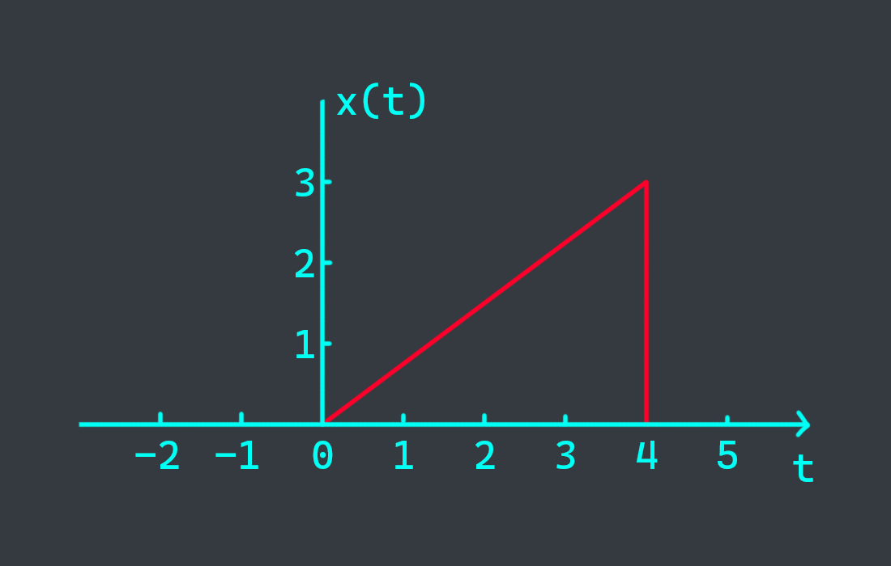
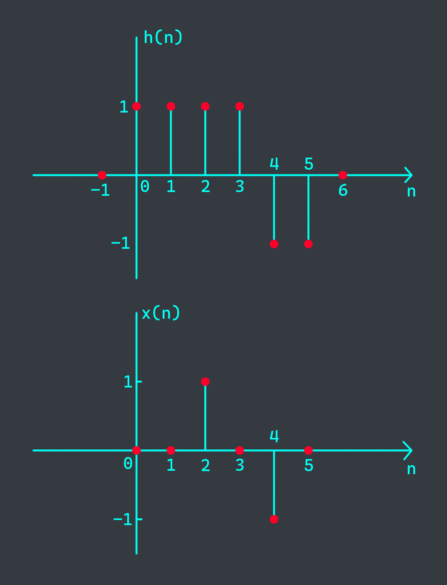
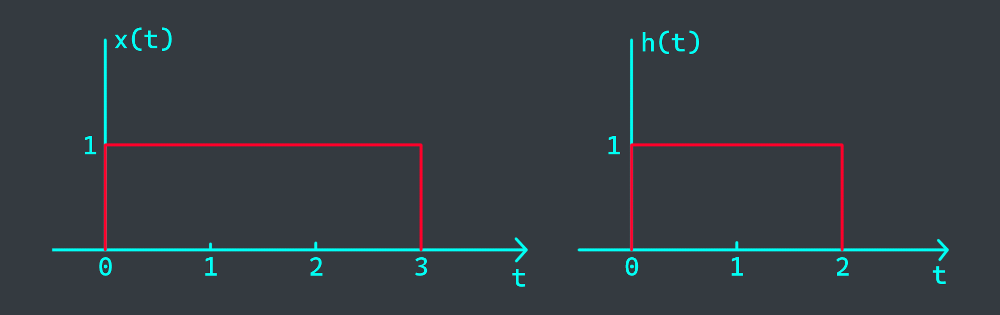
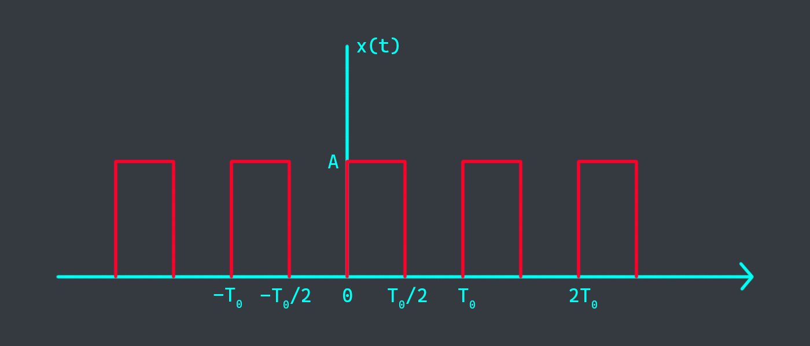



# 0. Requisites
Remove the following 2 questions from the exam and do the rest, if $q_1 = q_2$ then remove any other question you want.
- $q_1 = ((ID+17)\\%6) + 1$
- $q_2 = ((ID+17)\\%5) + 2$

# 1. Signals
Given the signal $x(t)$

{}

{}

make a sketch of
- $y_1(t) = x(2-t)$
- $y_2(t) = x(2t + 3)$
- $y_3(t) = x(t)u(2-t)$

# 2. Systems
Consider a discrete-time system with the input-output relation

$$y[n] = T\text{\\{} x[n] \text{\\}} = x^2[n]$$

Determine whether this system is
- Linear


- Let
  - $y_1[u] = x_1^2[u]$
  - $y_2[u] = x_2^2[u]$
- $x_1[u] + x_2[u] = \sqrt{y_1[u]} + \sqrt{y_2[u]} \neq y_1[u] + y_2[u]$
- $\to$ Not linear


- Time-invariant


- $y[u] = x^2[u]$
  - Shifted $x_1$: $x_2[u] = x_1[u-T]$
  - Response of $x_1$: $y_1[u] = x_1^2[u]$
  - Response of $x_2$: $y_2[u] = x_2^2[u] = x_1^2[u-T]$
  - Shifted $y_1$: $y_3[u] = y_1[u-T] = x_1^2[u-T]$
- $y_2[u] = y_3[u]$
- $\to$ Time-invariant


# 3. LTI Systems
The impulse response $h[n]$ of a discrete-time LTI system is shown below. Determine and sketch the output $y[n]$ of this system to the input $x[n]$

{}

{}

# 4. Convolution integral
Evaluate $y(t) = x(t) \ast h(t)$ where $x(t)$ and $h(t)$ are shown below

# 5. Fourier Series
Determine the Fourier series coefficients of $x(t)$



- $T = \frac{T_0}{2} \to \omega_0 = \frac{2\pi}{T} = \frac{2\pi}{T_0/2} = \frac{4\pi}{T_0}$

$\begin{aligned}
a_k &= \frac{1}{T} \int x(t) e^{-jk\omega_0 t} dt \\\
&= \frac{2}{T_0} \int_{0}^{T_0/2} A e^{-jk\omega_0 t} dt \\\
&= \frac{2A}{T_0} \frac{e^{-jk\omega_0 t}}{-jk\omega_0} \Big|_{0}^{T_0/2} \\\
&= \frac{-2A}{T_0} \frac{e^{-jk\frac{4\pi}{T_0} \frac{T_0}{2}} - 1}{jk\frac{4\pi}{T_0}} \\\
&= \frac{-2A}{T_0} \frac{e^{-jk2\pi} - 1}{jk\frac{4\pi}{T_0}} \\\
\end{aligned}$



# 6. Fourier Transform
Find the Fourier transform of $x(t) = u(-t)$


- $x(t) = u(-t)$

$\begin{aligned}
\to X(\omega) &= \int_{-\infty}^{\infty} x(t) e^{-j\omega t} dt \\\
&= \int_{-\infty}^{0} 1 e^{-j\omega t} dt \\\
&= \frac{e^{-j\omega t}}{-j\omega} \Big|_{-\infty}^{0} \\\
&= \frac{1}{-j\omega}
\end{aligned}$

