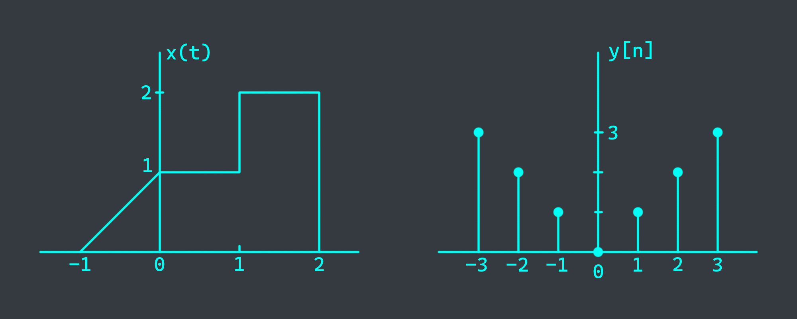
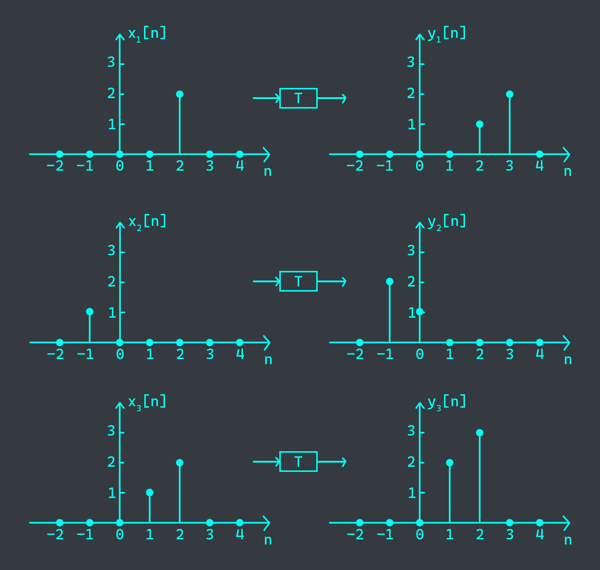

# 0
There are 8 question, but you have to do only 3 based on your student ID:
- $q_1 = (3 + (ID \\% 4)) \\% 7 + 1$
- $q_2 = (4 + (ID \\% 4)) \\% 7 + 1$
- $q_3 = ID \\% 7 + 1$
If duplicate, choose any question.

# 1. Signals
Given a continuous signal $x(t)$, and a discrete signal $x[n]$

Sketch each of the following signals:
- $y_1(t) = x(t)u(1-t)$
- $y_2(t) = x(t)[u(t)-u(t-1)]$
- $y_3[n] = x[n]u[1-n]$
- $y_4[n] = x[n]\delta[n]$

# 2. Continuous system
Consider a continuous-time system with input $x(t)$ and output $y(t)$ related by
$$y(t) = x(sin(t))$$
- Is this system causal?
- Is this system linear?

# 3. Discrete system
The system represented by T is known to be time-invariant. Determine whether the system is linear.

# 4. Convolution sum
Compute the convolution sum $y[n] = x[n] * h[n]$ for the following signals:
- $x[n] = u[n]$
- $h[n] = 2^n u[n]$

# 5. Convolution integral
Evaluate $y(t) = x(t) * h(t)$ where $x(t) = \begin{cases}
1 & 0 < t \leq T \\\
0 & \text{otherwise}
\end{cases}$ and $h(t) = \begin{cases}
1 & 0 < t \leq 2T \\\
0 & \text{otherwise}
\end{cases}$

# 6. Fourier series
Determine the Fourier series coefficients of $x(t) = cos(4t) + sin(6t)$

# 7. Fourier transform
Find the Fourier transform $X(\omega)$ of the signal: $x(t) = \frac{sin(\omega t)}{\pi t}$, knowing that $X(\omega)$ has rectangular shape.