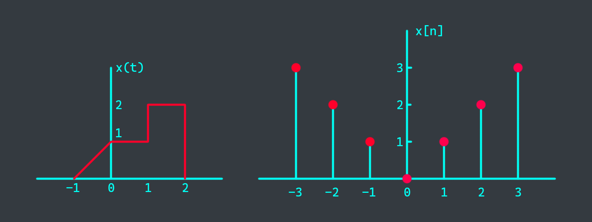



- Question 0: 2 points. Others: 3 points each.

# 0. Requisites
Remove the following 3 questions from the exam and do the rest, remove any other question you want if duplication occurs.
- $q_1 = (ID\\%4) + 1$
- $q_2 = (ID\\%3) + 5$
- $q_3 = (ID\\%2) + 8$

# 1. Signals
Given the signal $x(t)$ and $x[n]$

make a sketch of
- $y_1(t) = [x(t-1)+x(3-t)]u(2-t)$
- $y_2[n] = x[n-1] + x[1-2n]$

# 2. Continuous-time Systems
Given a continuous-time system with the input-output relation

$$y(t) = T\text{\\{} x(t) \text{\\}} = x^2(t)$$

Determine whether this system is
- Linear
- Time-invariant

# 3. Discrete-time Systems
Given a discrete-time system with the input-output relation

$$y[n] = T\text{\\{} x[n] \text{\\}} = x^2[n]$$

Determine whether this system is
- Linear
- Time-invariant

# 4. Convolution sum
Let $y[n] = x[n] \ast h[n]$, show that $x[n-n_1] \ast h[n-n_2] = y[n-n_1-n_2]$

# 5. Convolution integral
Evaluate $y(t) = x(t) \ast h(t)$ where $x(t) = u(t-1)$ and $h(t) = e^{-3t}u(t)$

# 6. Continuous-time Fourier Series
Determine the Fourier series coefficients of the periodic square wave

$$x(t) = \begin{cases}
1 & 0 < t \leq \frac{T_0}{2} \\\
0 & \frac{T_0}{2} < t \leq T_0
\end{cases}$$

# 7. Discrete-time Fourier Series
Determine the Fourier series coefficients of the signal

$$x[n] = \sum_{k=0}^{\infty} \delta[n-4k]$$

# 8. Fourier Transform
Find the Fourier transform $X(\omega)$ of the signal $x(t) = e^{-a|t|}$ with $a > 0$

# 9. Inverse Fourier Transform
Calculate the Inv. Fourier transform of the following signals

$$X(\omega) = \frac{1}{j}[\delta(\omega -2) - \delta(\omega + 2)] + 3[\delta(\omega - 2\pi) + \delta(\omega + 2\pi)]$$