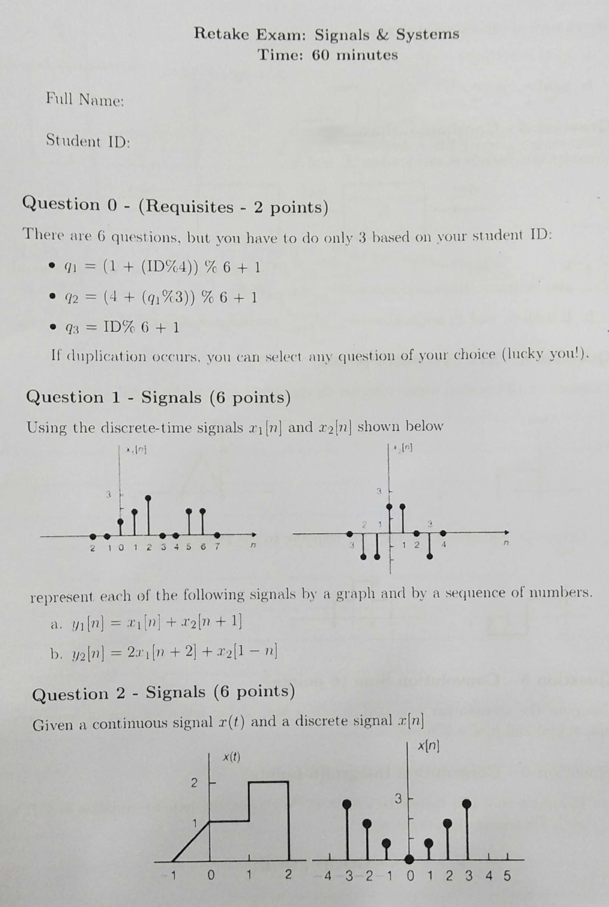
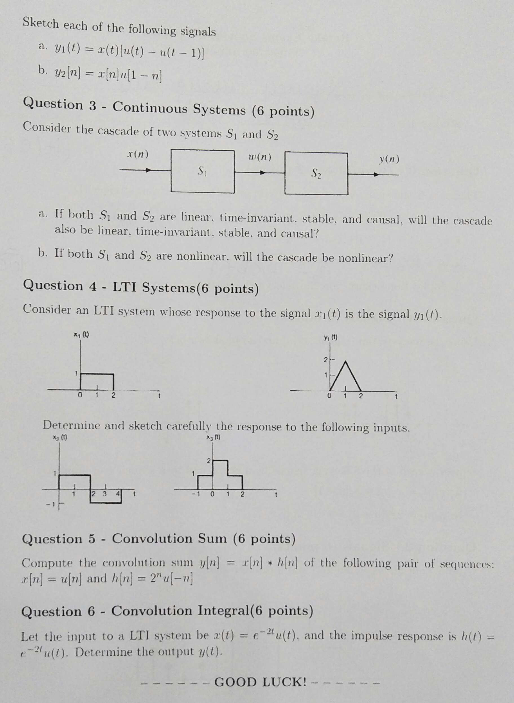
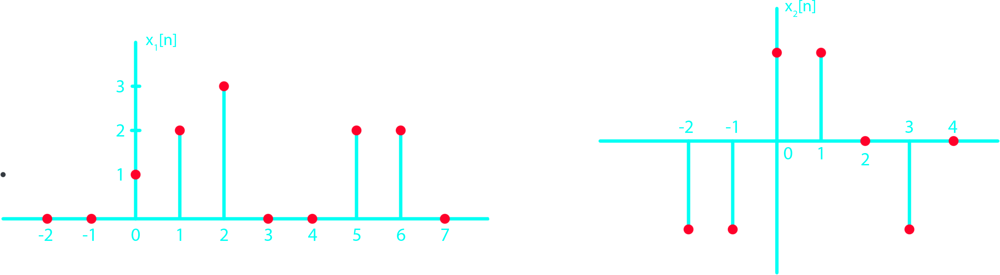
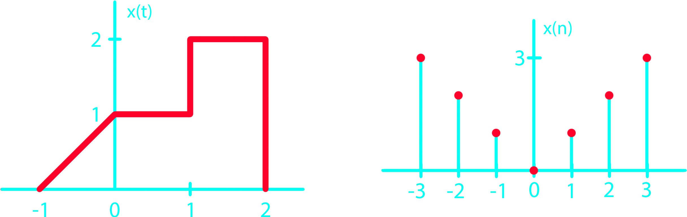
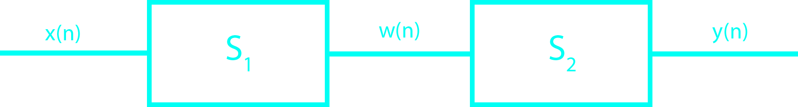
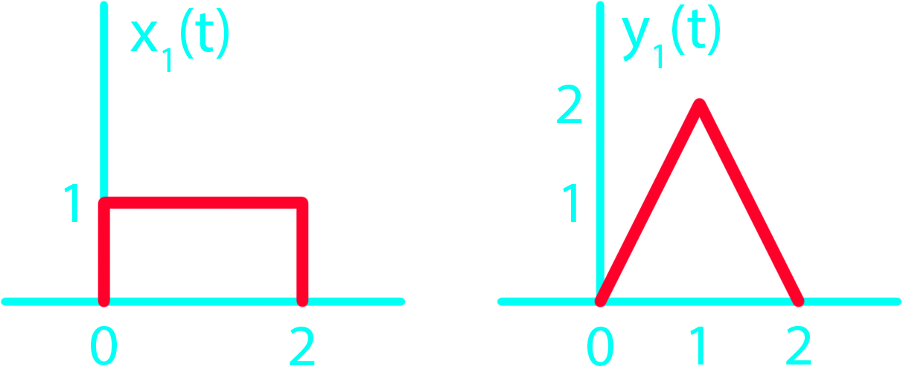
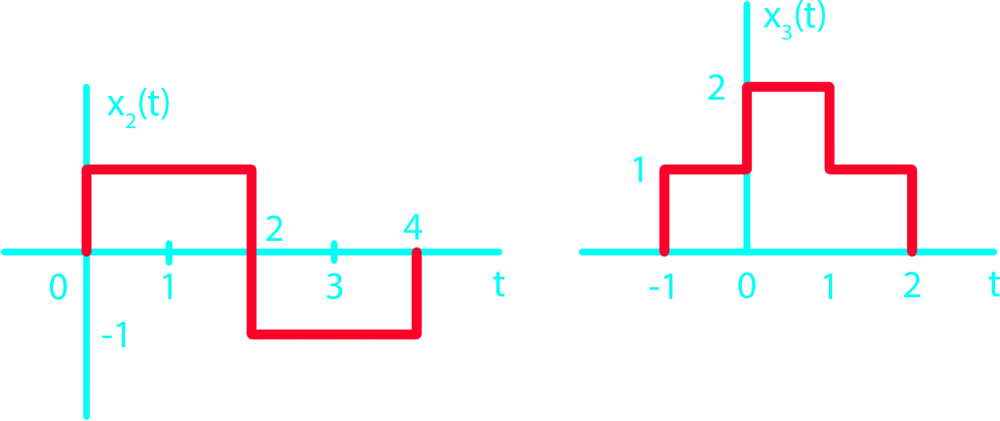



{}

{}

# Question 1 - Signal
Using the discrete-time signals $x_1[n]$ and $x_2[n]$ shown below

represent each of the following signals by a graph and by a sequance of numbers.
- $y_1[n] = x_1[n] + x_2[n+1]$
- $y_2[n] = 2x_1[n+2] + x_2[1-n]$

# Question 2 - Signal
Given a continuous signal $x(t)$ and a discrete signal $x[n]$

{}

{}

Sketch each of the following signals
- $y_1(t) = x(t)[u(t) - u(t-1)]$
- $y_2[n] = x[n]u[1-n]$

# Question 3 - Continuous System
Consider the cascade of two system $S_1$ and $S_2$

{}

{}

- If both $S_1$ and $S_2$ are linear, time-invariant, stable, and causal, will the cascade also be linear, time-invariant, stable and causal?
- If both $S_1$ and $S_2$ are nonlinear, will the cascade also be nonlinear?

# Question 4 - LTI Systems
Consider an LTI system whose response to the signal $x_1(t)$ is the signal $y_1(t)$

{}

{}

Determine and sketch carefully the response of the following inputs.

{}

{}

# Question 5 - Convolution Sum
Compute the convolution sum $y[n] = x[n] * h[n]$ of the following pair of sequences:
- $x[n] = u[n]$
- $h[n] = 2^n u[-n-1]$

# Question 6 - Convolution Integral
Let the input to a LTI system be $x(t) = e^{-2t}u(t)$ and the impulse response be $h(t) = e^{-2t}u(t)$. Determine the output $y(t)$.